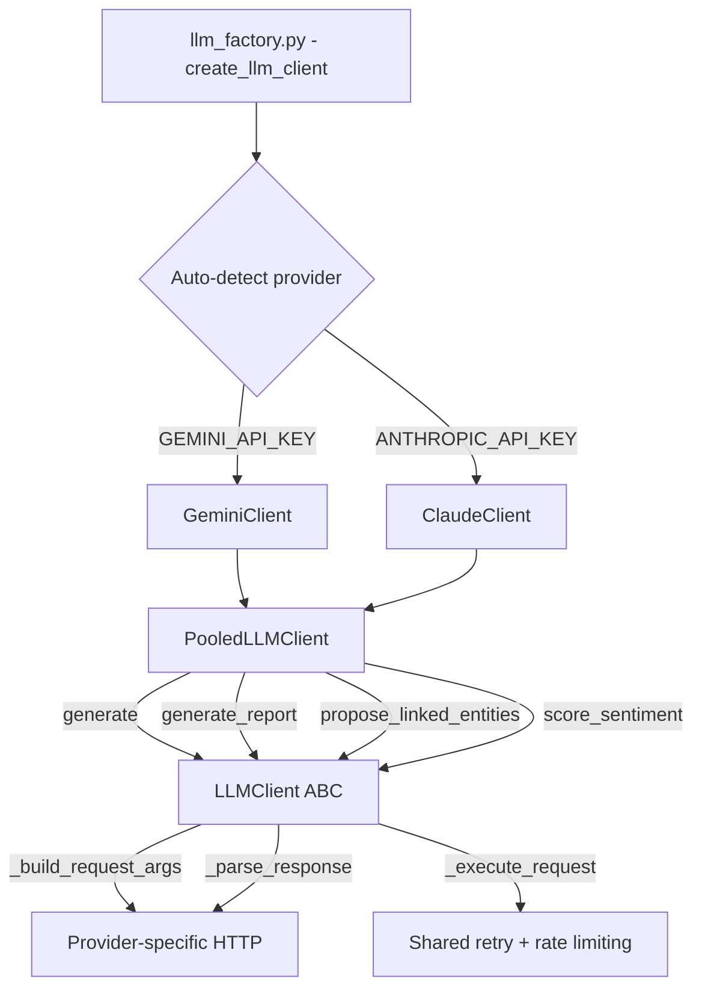
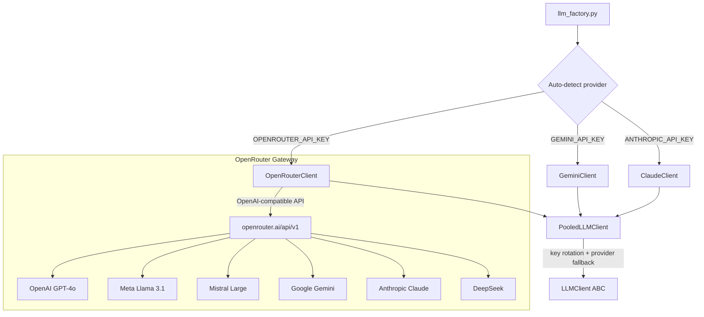

# Plan: Add OpenRouter as LLM Provider

## Overview

Add OpenRouter as a third LLM provider alongside Gemini and Claude. OpenRouter acts as a unified gateway to 200+ models (OpenAI, Meta, Mistral, Google, Anthropic, etc.) through a single API key and OpenAI-compatible endpoint.

This is high-value because it gives the pipeline access to every major model through one key, and serves as a universal fallback when Gemini/Claude keys are exhausted or models are deprecated (as happened with `gemini-1.5-flash` in the DART pipeline run).

## Current LLM Architecture



**Key files:**
- [`operator1/clients/llm_base.py`](operator1/clients/llm_base.py) -- ABC with shared retry logic, model registries, rate limiting
- [`operator1/clients/gemini.py`](operator1/clients/gemini.py) -- Gemini implementation (139 lines)
- [`operator1/clients/claude.py`](operator1/clients/claude.py) -- Claude implementation (159 lines)
- [`operator1/clients/llm_factory.py`](operator1/clients/llm_factory.py) -- Factory + PooledLLMClient with key rotation (330 lines)
- [`operator1/constants.py`](operator1/constants.py) -- Base URLs
- [`operator1/secrets_loader.py`](operator1/secrets_loader.py) -- API key loading
- [`config/global_config.yml`](config/global_config.yml) -- Provider/model config

## OpenRouter API Details

- **Endpoint**: `https://openrouter.ai/api/v1/chat/completions`
- **Auth**: `Authorization: Bearer <key>` header (same as OpenAI)
- **Format**: OpenAI-compatible chat completions API
- **Key env var**: `OPENROUTER_API_KEY`
- **Rate limits**: Varies by model; free tier available for some models
- **Model naming**: `provider/model-name` (e.g. `google/gemini-2.0-flash-exp:free`, `anthropic/claude-sonnet-4`, `meta-llama/llama-3.1-405b-instruct`)

## Implementation Plan

### Step 1: Add OpenRouter constant and secret

**File: [`operator1/constants.py`](operator1/constants.py)**
- Add `OPENROUTER_BASE_URL: str = "https://openrouter.ai/api/v1"`

**File: [`operator1/secrets_loader.py`](operator1/secrets_loader.py)**
- Add `"OPENROUTER_API_KEY"` to `_REQUIRED_KEYS` dict (with description and registration URL)
- Note: Make it optional -- the pipeline should work without it. Add it to a new `_OPTIONAL_KEYS` dict or handle gracefully in validation.

### Step 2: Add OpenRouter model registry to llm_base.py

**File: [`operator1/clients/llm_base.py`](operator1/clients/llm_base.py)**

Add `OPENROUTER_MODELS` dict alongside `GEMINI_MODELS` and `CLAUDE_MODELS`:

```python
OPENROUTER_MODELS: dict[str, dict[str, Any]] = {
    "google/gemini-2.0-flash-exp:free": {
        "max_output_tokens": 8192,
        "context_window": 1048576,
        "report_capable": True,
        "tier": "free",
    },
    "google/gemini-2.5-flash-preview": {
        "max_output_tokens": 65536,
        "context_window": 1048576,
        "report_capable": True,
        "tier": "preview",
    },
    "anthropic/claude-sonnet-4": {
        "max_output_tokens": 64000,
        "context_window": 200000,
        "report_capable": True,
        "tier": "balanced",
    },
    "meta-llama/llama-3.1-405b-instruct": {
        "max_output_tokens": 32768,
        "context_window": 131072,
        "report_capable": True,
        "tier": "stable",
    },
    "mistralai/mistral-large-latest": {
        "max_output_tokens": 32768,
        "context_window": 131072,
        "report_capable": True,
        "tier": "stable",
    },
    "deepseek/deepseek-chat": {
        "max_output_tokens": 8192,
        "context_window": 65536,
        "report_capable": True,
        "tier": "fast",
    },
}
```

Add rate limit entry in `_LLM_HOST_RATE_LIMITS`:
```python
"openrouter.ai": 1.0,  # Conservative default; varies by model
```

### Step 3: Create OpenRouter client

**New file: `operator1/clients/openrouter.py`** (~120 lines)

Create `OpenRouterClient` extending `LLMClient`:

- **`__init__`**: Accept `api_key`, `base_url=OPENROUTER_BASE_URL`, `model` (default: `"google/gemini-2.0-flash-exp:free"`)
- **`_build_request_args`**: Build OpenAI-compatible chat completion request:
  - URL: `{base_url}/chat/completions`
  - Headers: `Authorization: Bearer {key}`, `HTTP-Referer: https://github.com/oso2424/githubu-isu-meanu` (required by OpenRouter), `X-Title: Operator1`
  - Payload: `{"model": model, "messages": [{"role": "user", "content": prompt}], "max_tokens": max_output_tokens, "temperature": temperature}`
- **`_parse_response`**: Extract `choices[0].message.content` from OpenAI-format response
- **Properties**: `provider_name="OpenRouter"`, `model_name`, `max_output_tokens`

### Step 4: Wire into factory

**File: [`operator1/clients/llm_factory.py`](operator1/clients/llm_factory.py)**

- Add `"openrouter"` to `_SUPPORTED_PROVIDERS` tuple
- Update `_auto_detect_provider()` to check `OPENROUTER_API_KEY` as third option
- Update `create_llm_client()`:
  - Add OpenRouter key pool handling (`OPENROUTER_API_KEY`)
  - OpenRouter can serve as both primary and fallback provider
- Update `_build_single_client()` to handle `provider == "openrouter"`
- Update `get_available_models()` to include `OPENROUTER_MODELS`

### Step 5: Update config and documentation

**File: [`config/global_config.yml`](config/global_config.yml)**
- Update `llm_provider` comment to include `"openrouter"` as supported value
- Update `llm_model` comment to show OpenRouter model format (`provider/model-name`)

**File: [`operator1/secrets_loader.py`](operator1/secrets_loader.py)**
- Add `OPENROUTER_API_KEY` as optional key (not in `_REQUIRED_KEYS` -- keep it in a separate optional section or add with graceful handling)

### Step 6: Add tests

**New file: `tests/test_llm_openrouter_new.py`**

- Test `OpenRouterClient` instantiation with model validation
- Test `_build_request_args` produces correct OpenAI-compatible format
- Test `_parse_response` extracts text from OpenAI response structure
- Test model auto-selection picks free tier first
- Test factory integration: `create_llm_client(secrets, provider="openrouter")`
- Test pooled rotation: OpenRouter as fallback when Gemini/Claude exhausted

### Step 7: Update run.py interactive menu

**File: [`run.py`](run.py)**
- Add OpenRouter as option 3 in LLM provider selection menu
- Show available OpenRouter models when selected

## Architecture After Change



## Fallback Chain After Change

1. **Primary**: User-selected provider (Gemini/Claude/OpenRouter)
2. **Secondary**: First alternate provider with available key
3. **Tertiary**: Second alternate provider with available key
4. **Final**: Template-based fallback (no LLM needed)

## Risk Assessment

| Risk | Mitigation |
|------|------------|
| OpenRouter API changes | OpenAI-compatible format is stable; unlikely to change |
| Model availability varies | Registry has multiple models; `get_best_model()` handles missing |
| Rate limits vary by model | Conservative default rate limit; configurable per model |
| No API key available | Graceful fallback to Gemini/Claude/template -- never a hard dependency |
| Cost surprises | Default to `:free` suffixed models; document pricing in config comments |
