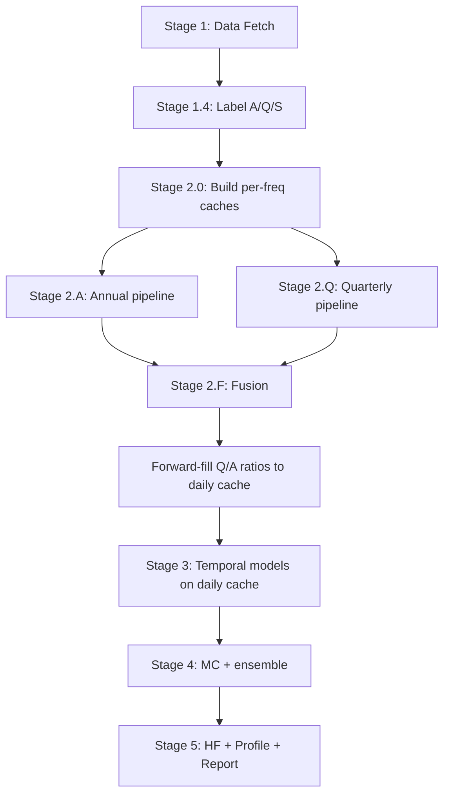

# Complete Fix Plan: Frequency-First Pipeline

## Existing Infrastructure We Reuse (ALREADY WRITTEN)

| Function | File:Line | What It Does |
|----------|-----------|--------------|
| `build_cache_from_raw_filings()` | `frequency_resampler.py:391` | Builds Q/A cache from raw statement DFs without interpolation |
| `detect_native_filing_frequency()` | `frequency_resampler.py:623` | Labels filings as quarterly/semiannual/annual |
| `detect_all_filing_frequencies()` | `frequency_resampler.py:663` | Labels all 3 statements |
| `run_single_frequency_pipeline()` | `multi_frequency_runner.py:157` | Runs full pipeline at one frequency |
| `run_multi_frequency_pipeline()` | `multi_frequency_runner.py:409` | Orchestrates A->Q->M->W->D pipeline runs |
| `_run_7_4_single_freq()` | `stage7_integration.py:346` | Staged version of single-freq pipeline |
| `run_7_4_0_resample_prep()` | `stage7_integration.py:172` | Builds ResampledCache objects for all freqs |
| `save_mf_cache/load_mf_cache` | `pipeline_state.py:363,380` | Per-freq cache serialization |
| 13-method fusion | `frequency_fusion.py` | Full fusion architecture |

These total ~3,000 lines of existing code we don't need to rewrite.

## Changes Required (15 files, ~200 lines of changes)

### Change 1: Move MF pipeline from Stage 7.4 to Stage 2
**File:** `operator1/stages/runner.py:30` (`_build_registry`)

Currently Stage 7.4 runs AFTER all temporal models on the broken daily cache. Move it to run BEFORE temporal models:

```python
# NEW order in _build_registry():
# Stage 2: Per-frequency preprocessing (was 7.4.0)
("2.0", run_2_0_resample_prep),
("2.A", run_2_A_annual),
("2.Q", run_2_Q_quarterly), 
("2.M", run_2_M_monthly),
("2.W", run_2_W_weekly),
("2.D", run_2_D_daily),
("2.F", run_2_F_fusion),
# Stage 3: Temporal models (on D cache with correct Q/A ratios fused in)
("3.1", run_3_1_regime),
...
```

**Lines changed:** ~30 in runner.py registry

### Change 2: New Stage 2 module (reuses existing functions)
**File:** NEW `operator1/stages/stage2_freq_pipeline.py` (~100 lines)

Thin wrappers around existing `_run_7_4_single_freq()` and `run_7_4_0_resample_prep()`:

```python
def run_2_0_resample_prep(state):
    """Build per-freq caches using build_cache_from_raw_filings."""
    # Call existing run_7_4_0_resample_prep(state) logic
    
def run_2_A_annual(state):
    """Run full pipeline at Annual frequency."""
    _run_7_4_single_freq(state, "A")

def run_2_F_fusion(state):
    """Fuse all frequency results and forward-fill Q/A ratios to daily."""
    # Call existing fusion + NEW: merge Q/A ratios into daily cache
```

### Change 3: Forward-fill Q/A ratios into daily cache after fusion
**File:** `operator1/stages/stage2_freq_pipeline.py` (in `run_2_F_fusion`)

After fusion, take the Q pipeline's correct ratios (PE=~40, gross_margin=0.469, etc.) and forward-fill them into the daily cache:

```python
# After fusion, inject correct Q/A ratios into daily cache
q_result = state.load_mf_result("Q")
if q_result and hasattr(q_result, 'cache'):
    q_cache = q_result.cache  # has correct PE, ROA, gross_margin at quarterly values
    for ratio_col in RATIOS_FROM_NATIVE_FREQ:
        if ratio_col in q_cache.columns:
            # Forward-fill quarterly values onto daily index
            state.cache[ratio_col] = q_cache[ratio_col].reindex(
                state.cache.index, method='ffill'
            )
```

`RATIOS_FROM_NATIVE_FREQ` = the 18 broken ratios identified in the debug scan.

### Change 4: Add `freq` parameter to derived_variables
**File:** `operator1/features/derived_variables.py:1480` (`compute_derived_variables`)

```python
def compute_derived_variables(df, freq="D"):
    """
    freq: "D", "W", "M", "Q", "A"
    When freq="D": skip all 18 cross-type ratios (they'll come from Q/A pipeline)
    When freq="Q" or "A": compute all ratios normally (values at native scale)
    """
    df = _compute_returns_and_risk(df)
    df = _compute_solvency(df)          # stock/stock, always OK
    df = _compute_liquidity(df)          # stock/stock, always OK
    if freq in ("Q", "A", "S"):
        df = _compute_cash_reality(df)   # flow/market ratios -- only at native freq
        df = _compute_profitability(df)  # flow/flow but diff sources -- only at native freq
        df = _compute_valuation(df)      # market/flow -- only at native freq
        df = _compute_roa(df)            # flow/stock -- only at native freq
        df = _compute_ttm_and_growth(df) # TTM sums -- only at native freq
    df = _compute_interest_coverage(df)  # flow/flow same source, OK
    df = _compute_volume_avg(df)
    if freq == "D":
        df = _compute_technical_indicators(df)  # only meaningful on daily
    ...
```

**Lines changed:** ~15 (add conditionals around 6 function calls)

### Change 5: Pass freq to survival_mode
**File:** `operator1/analysis/survival_mode.py:71` (`compute_company_survival_flag`)

```python
def compute_company_survival_flag(df, thresholds=None, freq="D"):
    ...
    if freq == "D":
        # On daily cache: only use D-safe triggers (current_ratio, d2e, drawdown)
        # Skip fcf_yield trigger (broken on daily)
        pass
    else:
        # On Q/A cache: use ALL triggers including fcf_yield
        pass
```

**Lines changed:** ~5

### Change 6: Pass freq to financial_health 
**File:** `operator1/models/financial_health.py:881` (`compute_financial_health`)

```python
def compute_financial_health(cache, hierarchy_weights=None, freq="D"):
    ...
    if freq == "D":
        # Skip T5 (growth/valuation) -- PE, EV/EBITDA are broken on daily
        # Skip Altman Z x3/x5 (flow/stock broken)
        pass
```

**Lines changed:** ~10

### Change 7: Source frequency labeling
**File:** `backtest_runner.py:250` (after statement fetch, before cache build)

```python
from operator1.features.frequency_resampler import detect_all_filing_frequencies

state.source_frequencies = detect_all_filing_frequencies(
    income_df=income_df, balance_df=balance_df, cashflow_df=cashflow_df
)
logger.info("Source frequencies: %s", state.source_frequencies)
```

**Lines changed:** ~5

### Change 8: Same labeling in main.py
**File:** `main.py:790` (after statement fetch)

Same 5 lines as Change 7.

### Change 9: Add fields to PipelineState
**File:** `operator1/pipeline_state.py:50` (class fields)

```python
source_frequencies: dict = field(default_factory=dict)  # {"income": "quarterly", ...}
```

**Lines changed:** 1

### Change 10: Keep Stage 7.4 as pass-through (backward compat)
**File:** `operator1/stages/stage7_integration.py:380` (7.4.1-7.4.6)

If Stage 2 already ran, Stage 7.4 sub-stages skip with log message:
```python
def run_7_4_1_annual(state):
    if state.load_mf_result("A") is not None:
        logger.info("Annual pipeline already ran in Stage 2, skipping")
        return
    _run_7_4_single_freq(state, "A")
```

**Lines changed:** ~20 (add guards to 7 functions)

### Change 11: HF engine reads from Q pipeline
**File:** `operator1/hedge_fund/engine.py:921` 

```python
# Instead of cache PE (broken), use Q pipeline PE
pe = get_cache_latest(cache, "pe_ratio_calc")  # now correct after fusion forward-fill
```

No code change needed if Change 3 correctly forward-fills Q ratios into daily cache.

## Dependency Graph



## Files Changed Summary

| File | Lines Changed | What |
|------|--------------|------|
| `stages/runner.py` | ~30 | Reorder: 2.0-2.F before 3.x |
| NEW `stages/stage2_freq_pipeline.py` | ~100 | Thin wrappers + ratio forward-fill |
| `features/derived_variables.py` | ~15 | Add `freq` param, conditional skips |
| `analysis/survival_mode.py` | ~5 | Add `freq` param for D-safe triggers |
| `models/financial_health.py` | ~10 | Add `freq` param, skip T5 on daily |
| `backtest_runner.py` | ~5 | Source frequency labeling |
| `main.py` | ~5 | Source frequency labeling |
| `pipeline_state.py` | ~1 | Add `source_frequencies` field |
| `stages/stage7_integration.py` | ~20 | Skip guards if Stage 2 already ran |
| **TOTAL** | **~191 lines** | |

## What Does NOT Change

- `frequency_resampler.py` -- already correct
- `multi_frequency_runner.py` -- already correct  
- `frequency_fusion.py` -- already correct
- All temporal model files -- they work on whatever cache they get
- HF engine internal calculations -- already uses raw statement DFs
- Report generator -- reads from profile which reads from cache
