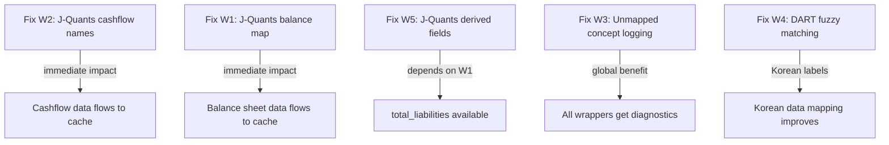

# Cross-Wrapper Pipeline Bug Fixes

Fixes for bugs found during the cross-wrapper audit of all 8 PIT client wrappers.
Organized by priority and dependency chain.

---

## Data Flow Context

Every PIT wrapper feeds into the same pipeline:


The cache builder expects columns matching `STATEMENT_FIELDS` exactly:
`revenue`, `gross_profit`, `operating_income`, `ebit`, `ebitda`, `net_income`, `interest_expense`, `taxes`, `total_assets`, `total_liabilities`, `total_equity`, `current_assets`, `current_liabilities`, `cash_and_equivalents`, `short_term_debt`, `long_term_debt`, `total_debt`, `receivables`, `operating_cash_flow`, `capex`, `free_cash_flow`, `investing_cf`, `financing_cf`, `dividends_paid`, `stock_buybacks`, `sga_expenses`, `rd_expenses`, `eps`, `eps_diluted`

Any field name that doesn't exactly match this list is silently dropped.

---

## Fix W1: JP J-Quants Balance Sheet Missing 11 Fields -- CRITICAL

**File:** `operator1/clients/jp_jquants_wrapper.py` lines 43-48
**Problem:** `_V2_BALANCE_MAP` only maps 4 fields: `TA`, `Eq`, `CashEq`, `BPS`. The J-Quants V2 financial summary API provides these additional fields that aren't mapped:

From the J-Quants V2 `get_fin_summary_range()` response columns:
- `CL` -- Current Liabilities
- `CA` -- Current Assets (if available)
- `TL` -- Total Liabilities (derivable from TA - Eq)

The J-Quants free plan financial summary is a CONDENSED summary -- it may not expose all balance sheet line items. The V2 API docs show the following columns are available per the research log.

**Fix approach:**
1. Expand `_V2_BALANCE_MAP` with all available J-Quants V2 columns
2. For fields not directly available from J-Quants, compute derived values:
   - `total_liabilities` = `total_assets` - `total_equity` (accounting identity)
3. Add a post-processing step after building the balance DataFrame that computes derivable fields from the ones we have
4. Log which fields J-Quants can and cannot provide so the estimation engine knows they are legitimately missing (not mapping failures)

```python
_V2_BALANCE_MAP = {
    "TA": "total_assets",
    "Eq": "total_equity",
    "CashEq": "cash_and_equivalents",
    "BPS": "book_value_per_share",
    # Additional fields (check J-Quants docs for availability)
    "CL": "current_liabilities",
    "CA": "current_assets",
    "TL": "total_liabilities",
}
```

After building the balance DataFrame, add derived fields:
```python
# Derive total_liabilities from accounting identity
if "total_assets" in rec and "total_equity" in rec and "total_liabilities" not in rec:
    rec["total_liabilities"] = rec["total_assets"] - rec["total_equity"]
```

---

## Fix W2: JP J-Quants Cashflow Canonical Names Wrong -- CRITICAL

**File:** `operator1/clients/jp_jquants_wrapper.py` lines 50-54
**Problem:** Cashflow field names don't match `STATEMENT_FIELDS`:

| Current name | Expected name |
|---|---|
| `operating_cashflow` | `operating_cash_flow` |
| `investing_cashflow` | `investing_cf` |
| `financing_cashflow` | `financing_cf` |

**Fix:** Simple rename in `_V2_CASHFLOW_MAP`:

```python
_V2_CASHFLOW_MAP = {
    "CFO": "operating_cash_flow",   # was "operating_cashflow"
    "CFI": "investing_cf",           # was "investing_cashflow"
    "CFF": "financing_cf",           # was "financing_cashflow"
}
```

---

## Fix W3: Add Unmapped Concept Logging to canonical_translator -- HIGH

**File:** `operator1/clients/canonical_translator.py` line 733-735
**Problem:** Line 735 silently drops rows where `canonical_name` is empty. No logging of what was dropped, making it impossible to diagnose mapping gaps without adding debug logging to every individual wrapper.

**Fix:** Add logging before the drop at line 735:

```python
# 5. Log and drop rows where canonical_name is empty (unmapped concepts)
if "canonical_name" in result.columns:
    unmapped = result[result["canonical_name"].astype(str).str.len() == 0]
    if len(unmapped) > 0 and "concept" in unmapped.columns:
        unmapped_concepts = unmapped["concept"].unique().tolist()
        logger.debug(
            "Unmapped concepts dropped (%s, %s): %s",
            market_id, statement_type,
            unmapped_concepts[:20],
        )
    result = result[result["canonical_name"].astype(str).str.len() > 0]
```

This is a global fix that benefits all wrappers simultaneously.

---

## Fix W4: DART Fuzzy Matching for Korean Labels -- MEDIUM

**File:** `operator1/clients/kr_dart_wrapper.py` lines 479-486
**Problem:** `_map_dart_concept()` does exact match only with `combined.get(concept)`. Korean financial labels can have:
- Whitespace variations: `유동자산` vs `유 동 자 산`
- Parenthetical additions: `자본총계(지배)` vs `자본총계`
- Encoding differences

**Fix:** Add normalized matching after exact match fails:

```python
def _map_dart_concept(self, concept: str, statement_type: str) -> str | None:
    from operator1.clients.canonical_translator import _DART_MAP, _IFRS_MAP
    combined = {**_DART_MAP, **_IFRS_MAP}

    # Exact match first
    if concept in combined:
        return combined[concept]

    # Normalized match: strip whitespace and parenthetical content
    import re
    normalized = re.sub(r'\s+', '', concept)
    normalized = re.sub(r'\(.*?\)', '', normalized)
    for key, canonical in combined.items():
        key_normalized = re.sub(r'\s+', '', key)
        key_normalized = re.sub(r'\(.*?\)', '', key_normalized)
        if normalized == key_normalized:
            return canonical

    return None
```

---

## Fix W5: J-Quants Derived Fields Post-Processing -- HIGH

**File:** `operator1/clients/jp_jquants_wrapper.py` after line 297
**Problem:** Even after expanding `_V2_BALANCE_MAP`, J-Quants condensed summary may not expose all fields. Need to compute derivable fields from accounting identities.

**Fix:** Add a post-processing step after building balance rows:

```python
# After building balance_rows, derive missing fields from identities
for rec in balance_rows:
    ta = rec.get("total_assets")
    eq = rec.get("total_equity")
    # total_liabilities = total_assets - total_equity
    if ta is not None and eq is not None and "total_liabilities" not in rec:
        rec["total_liabilities"] = ta - eq
```

This ensures `total_liabilities` is always available when `total_assets` and `total_equity` are, which is the case for J-Quants.

---

## Execution Order



**Priority order:**
1. **Fix W2** -- one-line rename, unblocks all J-Quants cashflow data
2. **Fix W1** -- expand balance map, unblocks J-Quants balance sheet
3. **Fix W5** -- derive total_liabilities from identity, ensures liquidity ratios work
4. **Fix W3** -- global unmapped concept logging, helps diagnose ALL wrappers
5. **Fix W4** -- DART fuzzy matching, improves Korean data quality
