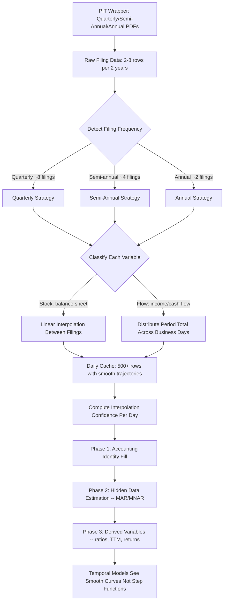

# Estimator Redesign -- Frequency-Aware Daily Cache Creation from Periodic Filings

## The Core Problem

The estimator was designed assuming PIT wrappers give day-by-day data. In reality, they give **periodic filings** -- quarterly PDFs, semi-annual reports, annual statements. The current pipeline does a naive flat forward-fill in main.py Step 4:

```
Q1 filing (March 31): revenue = $100M
April 1 - June 29: revenue = $100M  (flat, no change for 90 days)
Q2 filing (June 30): revenue = $110M  (sudden jump)
```

This creates artificial step functions where:
- 90% of daily values are copies of the same number
- Transitions are discontinuous spikes
- Annual filers have 365 days of identical values
- Derived ratios show fake stability between filings
- Temporal models see a flat line with occasional jumps, not a real trajectory

The estimator then only handles job #2 -- filling fields the company didn't report at all. It never addresses the fundamental problem that **quarterly data needs intelligent daily interpolation, not flat copy**.

## What the Estimator Should Do

The estimator should have **three sequential phases**:

### Phase 0: Frequency-Aware Daily Interpolation (NEW)
Take the periodic filing data and create intelligent day-by-day values that respect:
- The filing frequency (quarterly = 4 points/year, semi-annual = 2, annual = 1)
- Business cycle patterns (revenue doesn't jump on filing day -- it accumulates gradually)
- Different interpolation strategies for different variable types (stock vs flow)

### Phase 1: Accounting Identity Fill (EXISTING, unchanged)
Fill deterministic relationships between variables.

### Phase 2: Hidden Data Estimation (EXISTING, unchanged)
Fill variables the company never reported using classification + model-based imputation.

## Phase 0 Design: Frequency-Aware Interpolation

### Variable Classification: Stock vs Flow

Financial variables fall into two categories that need different interpolation:

**Stock variables** (point-in-time balance sheet items):
- `total_assets`, `total_liabilities`, `total_equity`
- `current_assets`, `current_liabilities`
- `cash_and_equivalents`, `short_term_debt`, `long_term_debt`
- `total_debt`, `receivables`, `inventory`, `payables`
- `retained_earnings`, `goodwill`, `intangible_assets`
- `shares_outstanding`

Stock variables represent a snapshot at a moment. Between Q1 ($100M total_assets) and Q2 ($110M total_assets), the true daily value moves gradually. **Linear interpolation** between filing values is appropriate.

**Flow variables** (period-cumulative income/cashflow items):
- `revenue`, `cost_of_revenue`, `gross_profit`
- `operating_income`, `ebit`, `ebitda`, `net_income`
- `interest_expense`, `taxes`
- `operating_cash_flow`, `capex`, `free_cash_flow`
- `investing_cf`, `financing_cf`, `dividends_paid`
- `stock_buybacks`, `sga_expenses`, `rd_expenses`

Flow variables represent activity over the period. Q1 revenue of $100M means $100M was earned across 90 days. The daily value should be **distributed across the period** (roughly $1.1M/day), not $100M repeated for 90 days.

**Ratio variables** (derived, not interpolated directly):
- `eps`, `eps_diluted`
- These are computed after interpolation from their components

### Interpolation Strategies by Frequency

| Frequency | Filing Count / 2yr | Stock Variables | Flow Variables |
|-----------|-------------------|-----------------|----------------|
| Quarterly | ~8 | Linear interp between filings | Distribute evenly across period (~90 days) |
| Semi-annual | ~4 | Linear interp between filings | Distribute evenly across period (~180 days) |
| Annual | ~2 | Linear interp between filings | Distribute evenly across period (~365 days) |
| Unknown | varies | Detect frequency, apply matching strategy | Same |

### Interpolation Details

**Stock variable interpolation** (balance sheet):
```
Q1 total_assets = $100M (report_date: 2024-03-31)
Q2 total_assets = $110M (report_date: 2024-06-30)

Daily interpolation:
2024-04-01: $100.11M  (100 + 10 * 1/91)
2024-04-02: $100.22M  (100 + 10 * 2/91)
...
2024-06-29: $109.89M  (100 + 10 * 90/91)
2024-06-30: $110.00M  (filing date)
```

Edge cases:
- Before the first filing: ffill from the first value (no interpolation possible)
- After the last filing: ffill from the last value (conservative, no extrapolation)
- Single filing only: flat ffill (can't interpolate with 1 point)

**Flow variable distribution** (income/cash flow):
```
Q1 revenue = $100M (period: Jan 1 - Mar 31, ~63 business days)
Q2 revenue = $110M (period: Apr 1 - Jun 30, ~64 business days)

Daily distribution:
2024-01-02: $1.587M  (100M / 63 bdays)
2024-01-03: $1.587M
...
2024-03-29: $1.587M
2024-04-01: $1.719M  (110M / 64 bdays)
...
```

But this is a simplification. A better approach for flow variables is **proportional distribution using business day count**:

```
daily_value = period_total / n_business_days_in_period
```

For TTM computation downstream, the daily values should sum back to the quarterly total when aggregated over the period.

### Filing Frequency Detection

The [`filing_calendar.py`](operator1/features/filing_calendar.py:72) module already has [`detect_filing_frequency()`](operator1/features/filing_calendar.py:72) which returns "quarterly", "semiannual", "annual", or "unknown" from filing dates. The estimator should use this.

Additionally, [`_MARKET_FILING_FREQUENCY`](operator1/features/filing_calendar.py:26) maps each market to its expected frequency. This gives a prior even before looking at the actual data.

### Confidence Scoring for Interpolated Values

Each interpolated daily value gets a confidence score based on:
- **Distance from nearest filing**: values closer to a filing date are more certain
- **Filing frequency**: quarterly data is inherently more reliable than annual (4x the data points)
- **Variable type**: stock variables interpolate more reliably than flow variables
- **Interpolation vs extrapolation**: interpolated between two filings = higher confidence; extrapolated past the last filing = lower

```python
def compute_interpolation_confidence(
    days_to_nearest_filing: int,
    filing_frequency: str,  
    variable_type: str,  # "stock" or "flow"
) -> float:
    # Base confidence from frequency
    freq_base = {"quarterly": 0.85, "semiannual": 0.70, "annual": 0.50}
    base = freq_base.get(filing_frequency, 0.40)
    
    # Decay with distance from nearest filing
    max_gap = {"quarterly": 45, "semiannual": 90, "annual": 182}
    gap = max_gap.get(filing_frequency, 90)
    distance_decay = max(0.3, 1.0 - (days_to_nearest_filing / gap) * 0.5)
    
    # Stock vs flow adjustment
    type_mult = 1.0 if variable_type == "stock" else 0.85
    
    return min(0.95, base * distance_decay * type_mult)
```

## Implementation Plan

### Step 1: Add Variable Type Classification

Add to [`estimator.py`](operator1/estimation/estimator.py) or a new file `operator1/estimation/frequency_interpolator.py`:

```python
STOCK_VARIABLES = {
    "total_assets", "total_liabilities", "total_equity",
    "current_assets", "current_liabilities",
    "cash_and_equivalents", "short_term_debt", "long_term_debt",
    "total_debt", "receivables", "inventory", "payables",
    "retained_earnings", "goodwill", "intangible_assets",
    "shares_outstanding",
}

FLOW_VARIABLES = {
    "revenue", "cost_of_revenue", "gross_profit",
    "operating_income", "ebit", "ebitda", "net_income",
    "interest_expense", "taxes",
    "operating_cash_flow", "capex", "free_cash_flow",
    "investing_cf", "financing_cf", "dividends_paid",
    "stock_buybacks", "sga_expenses", "rd_expenses",
}
```

### Step 2: Create Frequency-Aware Interpolation Function

New function `interpolate_periodic_to_daily()`:

- [ ] Detect filing frequency from filing dates (or use market default)
- [ ] For each variable in the statement:
  - Classify as stock or flow
  - If stock: linear interpolation between filing values
  - If flow: distribute period total across business days in the period
- [ ] Compute interpolation confidence per day per variable
- [ ] Store `{var}_interp_confidence` columns
- [ ] Handle edge cases: single filing, gaps between filings, pre-first-filing extrapolation

### Step 3: Replace Flat FFill in main.py Step 4

Replace the current ffill merge in [`main.py`](main.py:830) lines 830-845 with a call to the new interpolation function:

```python
# OLD: flat forward-fill
stmt_aligned = stmt_indexed.reindex(combined_idx).ffill()

# NEW: frequency-aware interpolation
from operator1.estimation.frequency_interpolator import interpolate_periodic_to_daily
stmt_aligned = interpolate_periodic_to_daily(
    stmt_indexed, 
    daily_index=cache.index,
    market_id=market_id,
    filing_frequency=detected_frequency,
)
```

### Step 4: Update TTM Computation

The [`_rolling_4q_ttm()`](operator1/features/derived_variables.py:31) function currently detects "transitions" (where the flat-ffill value changes) to find quarterly boundaries. With interpolated values, every day has a slightly different value, so the transition detection needs to use the original filing dates instead.

- [ ] Pass filing dates to the TTM function
- [ ] Use filing dates as quarter boundaries instead of detecting value changes
- [ ] For flow variables: the daily distributed values should sum to the quarterly total when aggregated, so TTM = sum of last 4 quarterly totals (from the filing data, not the interpolated daily values)

### Step 5: Update Estimator Phase 1 + 2

The estimator's accounting identity fill and hidden data estimation now operate on interpolated daily values instead of flat-ffill values. The identities still work (total_assets = total_liabilities + total_equity holds at every interpolated point if each component is linearly interpolated between the same filing dates).

- [ ] Ensure identity fill uses interpolated values correctly
- [ ] Update confidence scoring to account for interpolation confidence (multiply model confidence by interpolation confidence)

### Step 6: Add Filing Metadata to Cache

Store metadata about each filing period so downstream modules know:
- `_filing_frequency`: "quarterly", "semiannual", "annual"
- `_days_since_filing`: integer, how many days since the nearest filing
- `_next_filing_expected`: date of next expected filing
- `_filing_period_start` / `_filing_period_end`: the period boundaries

These columns enable downstream models to weight recent data more heavily and discount stale interpolated values.

## Flow Diagram



## What Changes vs What Stays

| Component | Current | After | Changes? |
|-----------|---------|-------|----------|
| PIT wrappers | Fetch periodic filings | Same | No |
| Canonical translator | Map to standard names | Same | No |
| main.py Step 4 merge | Flat ffill | Call frequency-aware interpolator | Yes |
| Estimator Phase 1 | Accounting identities | Same, operates on interpolated data | Minor |
| Estimator Phase 2/3 | Missing data imputation | Same, operates on interpolated data | Minor |
| Missingness classifier | MAR/MNAR classification | Same | No |
| Filing calendar | Detect frequency | Also feeds frequency to interpolator | Minor |
| derived_variables TTM | Detect transitions from value changes | Use filing dates for boundaries | Yes |
| private_company_proxies | Interpolate equity for smooth change rate | Leverages the new interpolator | Simplified |

## Summary

The estimator's job #1 -- creating day-by-day cache from periodic data -- needs a new Phase 0 that:
1. Detects filing frequency (quarterly/semi-annual/annual)
2. Classifies each variable as stock or flow
3. Applies the right interpolation strategy (linear for stock, distribute for flow)
4. Computes per-day interpolation confidence
5. Replaces the naive flat ffill that currently lives in main.py Step 4

This is the missing piece between "we got 8 quarterly filings" and "we need 500 daily data points for temporal models."
