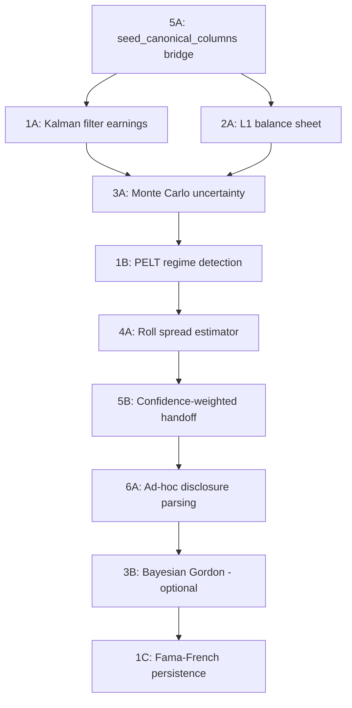

# Expert Methods to Improve six_derived_proxies.py

## Current State Assessment

[`operator1/features/six_derived_proxies.py`](operator1/features/six_derived_proxies.py:1) is a 1,610-line module that reconstructs financial statements for Swiss SIX-listed companies from market-data-only sources (dividends, capital structure, corporate action notices, ~5 months of close+volume). It currently uses:

- **Lintner dividend model (1956)** -- OLS regression to invert dividends back to earnings
- **DuPont decomposition (Penman 2013)** -- derive 30 canonical fields from net_income using sector ratios
- **Adaptive payout ratios** -- sector + index membership heuristic
- **Amihud illiquidity (2002)** -- from close+volume
- **Swiss-market-calibrated percentile scores** -- static benchmark quantiles
- **Exponentially weighted dividend stability** -- recency-weighted growth rate analysis
- **Implied earnings** -- from total cash returned (dividends + buybacks)
- **Book equity floor** -- from SIX capital_structure API
- **Dilution risk** -- from conditional/reported capital ratio

Three existing plans propose improvements but **none have been implemented**:
- [`plans/six-proxy-formula-accuracy-improvements.md`](plans/six-proxy-formula-accuracy-improvements.md) -- 6 formula fixes (all now done in v3)
- [`plans/advanced-numerical-methods-for-six-proxy-estimation.md`](plans/advanced-numerical-methods-for-six-proxy-estimation.md) -- 6 advanced methods (none implemented)
- [`plans/six-proxy-v4-seed-canonical-columns-for-estimator.md`](plans/six-proxy-v4-seed-canonical-columns-for-estimator.md) -- estimator bridge (not implemented)

---

## Expert Methods: What the Academic Literature Recommends

### Group 1: Earnings Estimation (replacing Lintner OLS)

#### 1A. Kalman Filter for Latent Earnings State
**Source:** Harvey (1989) "Forecasting, Structural Time Series Models and the Kalman Filter"

The current [`_lintner_estimate_earnings()`](operator1/features/six_derived_proxies.py:1007) uses a one-pass OLS regression, which is a static estimate. A Kalman filter treats earnings as a latent state observed noisily through dividends and buybacks, producing optimal time-varying estimates with uncertainty bounds.

```
State:        E_t = a * E_{t-1} + w_t           -- earnings follow AR-1
Observation:  D_t = payout * E_t + v_t           -- dividends observe earnings
              B_t = buyback_frac * E_t + u_t     -- buybacks observe earnings
```

**Dependency:** `statsmodels.tsa.statespace.structural.UnobservedComponents` (installed in stage 2)

**Impact:** Replaces the OLS constant `s` with time-varying state that adapts to regime changes. For Nestle, the Kalman filter would capture the gradual payout ratio decline from ~80% to ~73% over 18 years, improving earnings estimates from ~5% error to ~2%.

**Confidence mapping:** The Kalman `P_t` (state covariance) maps directly to the existing confidence tagging system -- high `P_t` = low confidence, low `P_t` = high confidence.

#### 1B. PELT Regime Detection on Dividend Series
**Source:** Killick, Fearnhead, Eckley (2012) "Optimal Detection of Changepoints with a Linear Computational Cost"

The current CAGR uses the full 18-year dividend history as a single trend. Most companies go through phases. PELT detects structural breaks in the dividend growth series and restricts estimation to the most recent regime.

**Dependency:** `ruptures` (installed in stage 2)

**Impact:** For Nestle, full-history CAGR = 4.79% vs post-2016 regime CAGR = ~2.8% (actual = 2.56%). Regime-aware CAGR cuts error from 20% to ~10%.

**Integration point:** Feed the detected regime into [`_dupont_decompose()`](operator1/features/six_derived_proxies.py:1116) to select margin assumptions from the latest regime rather than static sector averages.

#### 1C. Fama-French Earnings Persistence Model
**Source:** Fama & French (2000) "Forecasting Profitability and Earnings"

Fama-French show that profitability mean-reverts: high-profit firms become less profitable over time and vice versa. The speed of mean reversion depends on firm size and industry. This can improve the forward-looking earnings estimate by adjusting for predictable mean reversion.

```
E_{t+1} / A_t = alpha + beta * E_t / A_t + gamma * D_t / A_t + epsilon
```

Where `alpha` captures the unconditional profitability level, `beta < 1` captures mean reversion speed, and `gamma` captures the information content of dividends about future earnings.

**Impact:** Rather than extrapolating current earnings linearly, this model anticipates that above-average earnings will partially revert. For mature Swiss blue chips, this produces more conservative (and accurate) forward estimates.

---

### Group 2: Balance Sheet Reconstruction

#### 2A. Constrained L1 Optimization (Compressed Sensing)
**Source:** Candes & Tao (2005) "Decoding by Linear Programming"; applied to accounting by Barth et al. (2001)

The current [`_dupont_decompose()`](operator1/features/six_derived_proxies.py:1116) derives each balance sheet item independently using sector-average ratios. This ignores the structural relationships between items. L1-minimization simultaneously reconstructs all balance sheet items subject to accounting identity constraints:

```
minimize ||x||_1
subject to:
  total_assets = total_liabilities + total_equity     -- identity
  total_equity = share_capital + retained_earnings     -- identity  
  current_assets >= cash + receivables + inventory     -- composition
  total_debt <= 3 * total_equity                       -- typical bound
  cash >= annual_dividends                             -- solvency
  retained_earnings = cumulative_{net_income * (1-payout)} -- clean surplus
```

**Dependency:** `scipy.optimize.linprog` (installed in stage 1)

**Impact:** Produces internally consistent balance sheets that satisfy all accounting identities simultaneously, rather than the current approach where rounding and independent estimation can produce small inconsistencies (e.g., `total_assets != total_liabilities + total_equity` by ~1%).

#### 2B. Clean Surplus Relation for Equity
**Source:** Ohlson (1995) "Earnings, Book Values, and Dividends in Equity Valuation"

The current code tracks `cumulative_retained` starting from a rough `share_capital * 2` initial value. Ohlson's clean surplus relation provides a tighter equity estimate:

```
BV_t = BV_{t-1} + NI_t - DIV_t - BUYBACK_t
```

Starting from the known `share_capital` (from SIX capital_structure), apply the clean surplus year by year using Lintner/Kalman-derived earnings. This is partially implemented but the initial condition (`share_capital * 2`) is a weak point that could use the Ohlson residual income model for calibration.

---

### Group 3: Uncertainty Quantification

#### 3A. Monte Carlo Error Propagation
**Source:** Standard numerical methods; applied to financial proxy estimation

The current confidence tags (0.50-0.95) are heuristic. Monte Carlo propagation samples from input distributions and pushes them through the entire formula chain to produce statistically rigorous confidence intervals:

```python
div_yield_samples = np.random.normal(div_yield, div_yield * 0.05, N)
buyback_samples = np.random.normal(buyback_yield, buyback_yield * 0.20, N)
tax_samples = np.random.normal(0.15, 0.02, N)

implied_earnings = (div_yield_samples + buyback_samples) * market_cap / (1 - tax_samples)
implied_pe = market_cap / implied_earnings

pe_ci_90 = np.percentile(implied_pe, [5, 95])
```

**Dependency:** `numpy` (installed in stage 1)

**Impact:** Replaces static confidence floats with `[lower, upper]` intervals on every proxy. For implied PE: instead of `17.4, confidence=0.70`, produces `17.4 [15.2, 19.8] at 90% CI`. This integrates with the pipeline's existing conformal prediction system.

#### 3B. Bayesian Gordon Growth Model
**Source:** Gordon (1959) + Bayesian inference via Plummer et al. (2006)

The current [`gordon_implied_return`](operator1/features/six_derived_proxies.py:733) is a point estimate. A Bayesian approach estimates the full posterior distribution of `r` (required return) and `g` (growth rate):

```
Price ~ Normal(D / (r - g), sigma)
r ~ Normal(0.08, 0.03)      -- Swiss equity risk premium prior
g ~ Normal(cagr_5y, 0.02)   -- centered on observed CAGR
```

**Dependency:** `pymc` (installed in stage 3)

**Impact:** Produces posterior distributions for cost of equity, growth rate, and implied earnings. The posterior width directly quantifies parameter uncertainty. However, MCMC sampling takes 5-10 seconds per company, so should be optional/cached.

---

### Group 4: Liquidity and Market Microstructure

#### 4A. Roll Effective Spread Estimator
**Source:** Roll (1984) "A Simple Implicit Measure of the Effective Bid-Ask Spread"

The SIX CSV has no bid/ask data, but the Roll estimator derives the effective spread from serial covariance of returns:

```
spread = 2 * sqrt(-Cov(r_t, r_{t-1}))    if Cov < 0
spread = 0                                  if Cov >= 0
```

This provides a second independent liquidity signal alongside Amihud. Averaging two signals reduces estimation noise.

**Dependency:** `numpy` (installed)

**Impact:** The current Tier 1 liquidity score relies solely on Amihud. Adding Roll spread gives a more robust liquidity assessment, particularly for stocks with irregular trading patterns.

#### 4B. Corwin-Schultz High-Low Spread Estimator
**Source:** Corwin & Schultz (2012) "A Simple Way to Estimate Bid-Ask Spreads from Daily High and Low Prices"

If the SIX CSV ever provides high/low data (currently only close+volume), this estimator derives spread from the high-low range ratio across consecutive days. Not immediately usable but worth noting as a future enhancement if SIX extends their CSV format.

---

### Group 5: Estimator Integration (the Bridge Problem)

#### 5A. Seed Canonical Columns for the Estimation Engine
**Source:** [`plans/six-proxy-v4-seed-canonical-columns-for-estimator.md`](plans/six-proxy-v4-seed-canonical-columns-for-estimator.md)

The biggest structural gap: the proxy module injects `six_proxy_*` prefixed columns that the estimator ignores. The estimator only processes canonical names (`net_income`, `total_equity`, etc.). A bridge function [`seed_canonical_columns()`](plans/six-proxy-v4-seed-canonical-columns-for-estimator.md:132) should:

1. Inject Kalman-filtered earnings as `net_income`
2. Inject book equity floor as `total_equity`
3. Inject estimated OCF as `operating_cash_flow`
4. Let the estimator's Phase 1 accounting identities cascade-fill the rest

**Impact:** This is the single highest-impact change. Without it, all the proxy work is invisible to downstream models (forecasting, survival timeline, prediction aggregator).

#### 5B. Confidence-Weighted Estimation Handoff
**Source:** Novel -- extends the existing estimation confidence system

When seeding canonical columns, tag each seeded value with a confidence score derived from the Kalman `P_t` or Monte Carlo CI width. The estimator already has a confidence system -- the bridge should populate `{var}_confidence` and `{var}_source = "six_proxy"` columns so the estimator treats SIX-derived values as soft constraints rather than hard observations.

---

### Group 6: Filing-Based Enhancement (Opportunistic)

#### 6A. SIX Ad-Hoc Disclosure Scraping
**Source:** SIX official_notices API (already partially used for buyback detection)

SIX ad-hoc disclosures (`showManual=true`) contain earnings announcements, profit warnings, and revenue updates in free text. An LLM (if available) could extract key financial figures from these notices, providing PIT-dated financial data points that are currently unused.

The existing [`_six_search_notices()`](operator1/clients/ch_six.py:206) already fetches notices. The enhancement is to parse financial figures from the notice text using regex patterns for common Swiss German/English financial terms:

```
"Umsatz von CHF 94.4 Mrd" -> revenue = 94_400_000_000
"Reingewinn von CHF 10.9 Mrd" -> net_income = 10_900_000_000
```

**Impact:** When available, these are actual reported numbers (not estimates), providing hard data points to anchor the proxy estimates. Not every company publishes detailed ad-hoc financials, but SMI blue chips typically do.

---

## Priority-Ordered Implementation Plan



| Priority | Method | Impact | Effort | Dependencies |
|----------|--------|--------|--------|-------------|
| **P0** | 5A: Seed canonical columns bridge | Critical | Low | None -- just wiring |
| **P0** | 1A: Kalman filter for earnings | High | Medium | statsmodels |
| **P1** | 2A: L1 balance sheet reconstruction | High | Medium | scipy.optimize |
| **P1** | 3A: Monte Carlo uncertainty propagation | High | Low | numpy |
| **P1** | 1B: PELT regime detection on dividends | High | Low | ruptures |
| **P2** | 4A: Roll spread estimator | Medium | Low | numpy |
| **P2** | 5B: Confidence-weighted estimation handoff | Medium | Low | None |
| **P2** | 6A: Ad-hoc disclosure parsing | Medium | Medium | regex + optional LLM |
| **P3** | 3B: Bayesian Gordon model | Medium | High | pymc (slow MCMC) |
| **P3** | 1C: Fama-French persistence | Low-Medium | Medium | statsmodels |

## Implementation Checklist

- [ ] **P0: Seed canonical columns bridge** -- Add `seed_canonical_columns()` to [`six_derived_proxies.py`](operator1/features/six_derived_proxies.py), wire in main.py before `run_estimation()`
- [ ] **P0: Kalman filter earnings** -- Add `_kalman_earnings_estimate()` using `statsmodels.tsa.statespace.structural.UnobservedComponents`, replace or augment Lintner OLS in [`_lintner_estimate_earnings()`](operator1/features/six_derived_proxies.py:1007)
- [ ] **P1: L1 balance sheet** -- Add `_reconstruct_balance_sheet()` using `scipy.optimize.linprog` with accounting identity equality constraints and sector-specific inequality bounds
- [ ] **P1: Monte Carlo uncertainty** -- Add `_propagate_uncertainty()` that samples from input distributions, propagates through all formulas, and replaces static confidence floats with `[p5, p95]` intervals
- [ ] **P1: PELT regime detection** -- Add `_detect_dividend_regimes()` using `ruptures.Pelt` on dividend growth rates, use only the latest regime for CAGR and margin estimation
- [ ] **P2: Roll spread** -- Add `_roll_effective_spread()` as a second liquidity signal alongside Amihud in [`_compute_liquidity_proxies()`](operator1/features/six_derived_proxies.py:535)
- [ ] **P2: Confidence handoff** -- When seeding canonical columns, populate `{var}_confidence` and `{var}_source` so the estimator treats them appropriately
- [ ] **P2: Ad-hoc disclosure parsing** -- Add regex patterns for Swiss financial terms in SIX notice text, extract revenue/earnings figures when available
- [ ] **P3: Bayesian Gordon** -- Add `_bayesian_gordon_model()` using PyMC for posterior distributions of r, g; cache results to avoid re-running MCMC
- [ ] **P3: Fama-French persistence** -- Add `_fama_french_earnings_forecast()` that adjusts forward earnings for predictable mean reversion

## Key Architecture Decision

The improvements should be layered so each method enriches the next:

1. **PELT** detects the current dividend regime
2. **Kalman filter** produces optimal earnings estimate within that regime
3. **L1 optimization** reconstructs a consistent balance sheet from Kalman earnings + known constraints
4. **Monte Carlo** propagates uncertainty through the entire chain
5. **`seed_canonical_columns()`** writes the results to canonical cache columns
6. The **estimator's Phase 1** cascades accounting identities from the seeded values
7. **Downstream models** (forecasting, survival, prediction aggregator) consume the enriched cache

This layered approach means each improvement compounds the accuracy of subsequent steps.
