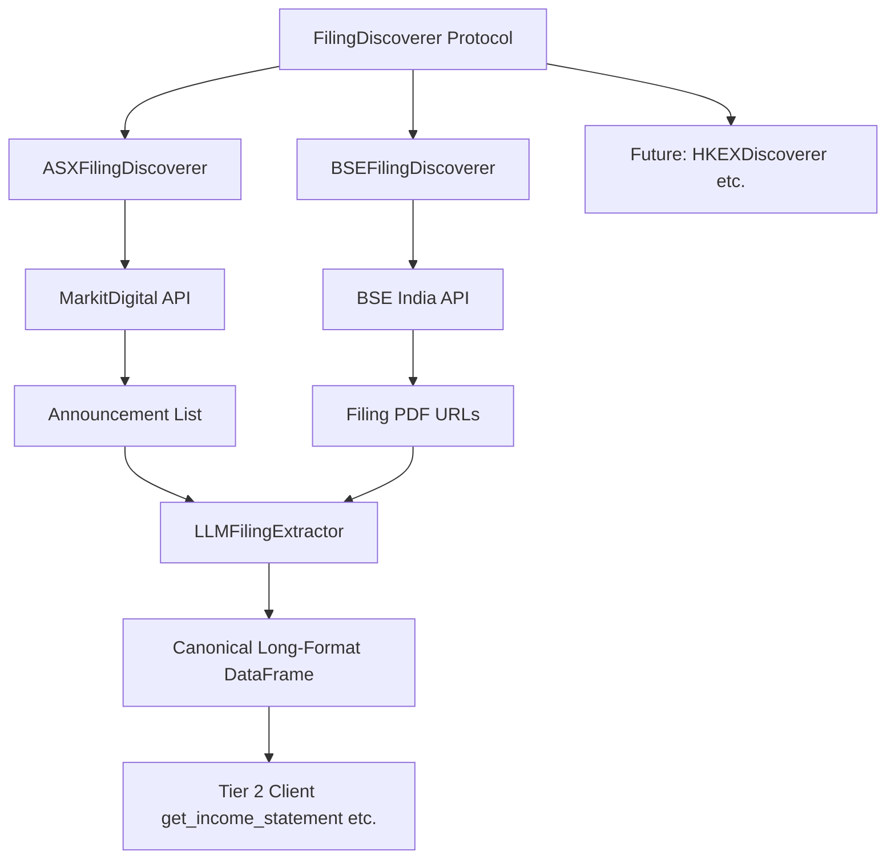
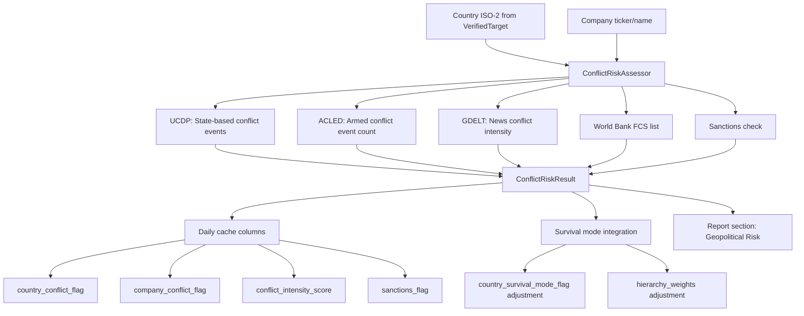

# Plan: Filing Discoverers + War/Conflict Risk Flagging

Two new pipeline features for Operator 1.

---

## Part 1: Filing Discoverer Framework for Tier 2 Markets

### Context

Tier 2 market clients currently use yfinance as a fallback for financial statements. yfinance data is not truly Point-in-Time (it sets `filing_date = report_date`) and provides limited historical depth. The [`LLMFilingExtractor`](operator1/clients/llm_filing_extractor.py) already exists and can extract structured financial data from PDF, HTML, and iXBRL filings, but it needs filing URLs to work.

### API Endpoint Testing Results (from code mode)

| Market | API | Status | Notes |
|--------|-----|--------|-------|
| **AU ASX** | MarkitDigital `asx-research/1.0/companies/{ticker}/announcements` | **WORKS** | Returns announcements with documentKey, headline, date, announcementType. Document download URL returns 404 -- needs alternate URL pattern |
| **IN BSE** | BSE India `AnnSubCategoryGetData` | **WORKS** | Full pipeline: search by scrip code + category, returns PDF attachment IDs. PDFs download successfully from `bseindia.com/xml-data/corpfiling/AttachLive/{uuid}.pdf` |
| **CN SSE** | baostock library | **Already implemented** | `cn_sse.py` uses baostock for financial ratios |
| CA SEDAR+ | SEDAR+ API | Captcha-protected | Returns HTML, not JSON. No programmatic access |
| HK HKEX | hkexnews.hk | 404/405 on search endpoints | JavaScript-heavy frontend, no structured API found |
| SG SGX | sgx.com | 404 | No public API |
| SA Tadawul | saudiexchange.sa | 403 Forbidden | Blocked |
| MX BMV, ZA JSE, CH SIX, AE DFM | Various | Web-only | No structured APIs |

### Architecture



### Filing Discoverer Protocol

New file: `operator1/clients/filing_discoverer.py`

```python
class FilingDiscovery:
    """Result of filing discovery for a single company."""
    ticker: str
    filings: list  # FilingMetadata objects
    errors: list[str]

class FilingMetadata:
    """Metadata for a single discovered filing."""
    title: str
    filing_date: str      # ISO date when published
    report_date: str      # fiscal period end date
    document_url: str     # URL to download the document
    document_format: str  # pdf, html, ixbrl
    filing_type: str      # annual, interim, quarterly
    market_id: str

class FilingDiscoverer(Protocol):
    """Protocol for per-market filing discovery."""
    def discover_filings(self, ticker: str, years: int = 2) -> FilingDiscovery: ...
    def download_filing(self, filing: FilingMetadata) -> bytes: ...
```

### Implementation Steps

#### Step 1: Base framework
- [ ] Create `FilingDiscoverer` protocol and data classes in `operator1/clients/filing_discoverer.py`
- [ ] Add `DISCOVERER_REGISTRY` mapping `market_id` -> discoverer class

#### Step 2: BSE India discoverer (highest value -- full pipeline works)
- [ ] Create `BSEFilingDiscoverer` class
- [ ] Endpoint: `api.bseindia.com/BseIndiaAPI/api/AnnSubCategoryGetData/w` with `strCat=Result`
- [ ] PDF download from: `bseindia.com/xml-data/corpfiling/AttachLive/{uuid}.pdf`
- [ ] Classify filing_type from subject line: quarterly/annual
- [ ] Extract report_date from subject line text

#### Step 3: ASX Australia discoverer (announcement discovery works, PDF download TBD)
- [ ] Create `ASXFilingDiscoverer` class
- [ ] Endpoint: `asx.api.markitdigital.com/asx-research/1.0/companies/{ticker}/announcements`
- [ ] Filter for `announcementType` in: PERIODIC REPORTS, ANNUAL REPORT
- [ ] Document download: investigate alternate URL patterns for the `documentKey`

#### Step 4: Wire into Tier 2 clients
- [ ] Add `try_filing_extraction()` helper that: discovers filings -> downloads -> LLM extracts -> returns canonical DataFrame
- [ ] Modify `in_bse.py` to try BSE filing discovery before falling back to yfinance
- [ ] Modify `au_asx.py` to try ASX filing discovery before falling back to yfinance
- [ ] Graceful fallback: if discovery or extraction fails, use yfinance as before

#### Step 5: Tests
- [ ] Unit tests with mocked API responses
- [ ] Integration test that verifies the discovery -> download -> extract pipeline

---

## Part 2: War/Conflict Risk Flagging Pipeline Branch

### Concept

A new pipeline module that flags companies and/or their countries when affected by armed conflict, war, sanctions, or geopolitical instability. This integrates into the existing survival analysis framework -- a company in a war-affected country faces existential risk that the current financial-only survival model does not capture.

### Free Data Sources for Conflict Detection

| Source | API | Coverage | Key Features | Auth |
|--------|-----|----------|-------------|------|
| **ACLED** | `api.acleddata.com/acled/read` | Global, daily events since 1997 | Event type, fatalities, location, country, actors | Free API key |
| **UCDP** | `ucdpapi.pcr.uu.se/api/gedevents/{version}` | Global, academic-grade | State-based, non-state, one-sided violence classification | Free, no key |
| **GDELT** | `api.gdeltproject.org/api/v2/doc/doc` | Global, real-time | News-based conflict monitoring, sentiment, tone | Free, no key |
| **World Bank FCS** | Fragile and Conflict-affected Situations list | Annual classification | Official IDA/World Bank list of fragile states | Free via wbgapi |
| **OFAC/EU Sanctions** | Various | Sanctions lists | Country and entity-level sanctions | Free |

### Architecture



### Data Model

New file: `operator1/features/conflict_risk.py`

```python
@dataclass
class ConflictRiskResult:
    """Container for war/conflict risk assessment."""
    country_iso2: str
    country_conflict_flag: bool          # True if active conflict
    company_conflict_flag: bool          # True if company directly affected
    conflict_intensity_score: float      # 0.0 = peace, 1.0 = active war
    conflict_type: str                   # none, low_intensity, civil_war, interstate_war, sanctions
    sanctions_flag: bool                 # True if country under major sanctions
    fragile_state_flag: bool             # True if World Bank FCS listed
    
    # Event-level detail
    recent_events_30d: int               # UCDP/ACLED events in last 30 days
    recent_fatalities_30d: int           # fatalities in last 30 days
    conflict_trend: str                  # escalating, stable, de-escalating
    
    # News-based
    news_conflict_mentions_7d: int       # GDELT conflict article count
    news_conflict_tone: float            # average tone of conflict articles
    
    # Metadata
    data_sources_used: list[str]
    assessment_date: str
    confidence: float                    # 0-1, based on data availability
```

### Pipeline Integration Points

#### Point 1: After macro mapping (Step 0.2), before feature engineering
- Fetch conflict data for the target country
- Set `country_conflict_flag` and `conflict_intensity_score`
- These become daily cache columns used by downstream models

#### Point 2: Survival mode enhancement
- Current survival triggers are purely financial: `current_ratio < 1.0`, `debt_to_equity > 3.0`, `fcf_yield < 0`, `drawdown > -40%`
- Add geopolitical trigger: `conflict_intensity_score > 0.7` OR `sanctions_flag == True`
- When active, shift hierarchy weights further toward liquidity/solvency (Tier 1-2)

#### Point 3: Country protection rules enhancement
- [`config/country_protection_rules.yml`](config/country_protection_rules.yml) already has per-country rules
- Add `conflict_override` field: if a country is in active conflict, government protection score drops regardless of sector strategicness

#### Point 4: Report section
- New section in the report: "Geopolitical Risk Assessment"
- Included in Pro and Premium tiers
- Shows conflict status, sanctions, recent events, trend

### Implementation Steps

#### Step 1: Core conflict risk module
- [ ] Create `operator1/features/conflict_risk.py` with `ConflictRiskResult` dataclass
- [ ] Implement `assess_conflict_risk(country_iso2, company_name=None)` function
- [ ] UCDP client: fetch recent events by country from UCDP GED API (free, no key)
- [ ] World Bank FCS check: hardcoded list updated from WB annual classification
- [ ] Sanctions check: hardcoded list of major sanctioned countries (US OFAC + EU)

#### Step 2: ACLED integration (optional, requires free API key)
- [ ] Create `operator1/clients/acled_client.py`
- [ ] Add `ACLED_API_KEY` and `ACLED_EMAIL` to secrets_loader as optional keys
- [ ] Fetch event counts and fatalities for country in last 30/90/365 days

#### Step 3: GDELT news-based conflict monitoring (no key needed)
- [ ] Add GDELT query to `news_sentiment.py` or create standalone `gdelt_conflict.py`
- [ ] Query: country name + conflict keywords
- [ ] Extract article count and average tone as proxy for conflict intensity

#### Step 4: Cache integration
- [ ] Add columns to `PROTECTION_SCORE_FIELDS` in [`cache_builder.py`](operator1/steps/cache_builder.py:99): `country_conflict_flag`, `company_conflict_flag`, `conflict_intensity_score`, `sanctions_flag`
- [ ] Inject values into daily cache during macro mapping phase

#### Step 5: Survival mode integration
- [ ] Modify survival threshold config to include conflict trigger
- [ ] Adjust `compute_company_survival_flag()` to OR with conflict flag
- [ ] Adjust `compute_hierarchy_weights()` to shift toward Tier 1-2 when conflict active

#### Step 6: Report integration
- [ ] Add geopolitical risk section to [`profile_builder.py`](operator1/report/profile_builder.py)
- [ ] Add section to report template in [`report_generator.py`](operator1/report/report_generator.py)
- [ ] Include in `TIER_SECTIONS` for Pro and Premium tiers

#### Step 7: Tests
- [ ] Unit tests with mocked UCDP/GDELT responses
- [ ] Test survival mode trigger with conflict flag
- [ ] Test report section rendering

### Priority Data Sources (ordered by reliability and ease of integration)

1. **UCDP GED API** (primary) -- academic-grade, free, no key, structured JSON, covers state-based conflicts since 1989
2. **World Bank FCS list** (static) -- official fragile/conflict state classification, can be hardcoded and updated annually
3. **Sanctions list** (static) -- OFAC SDN + EU consolidated sanctions, can be hardcoded
4. **GDELT** (supplementary) -- real-time news monitoring, free, no key, good for trend detection
5. **ACLED** (optional enrichment) -- requires free API key registration, most granular event data

---

## Combined Todo List

### Filing Discoverers
- [ ] Create filing discoverer protocol and base classes
- [ ] Implement BSE India filing discoverer
- [ ] Implement ASX Australia filing discoverer
- [ ] Wire discoverers into Tier 2 clients with yfinance fallback
- [ ] Add filing discoverer tests

### War/Conflict Risk Flagging
- [ ] Create conflict risk assessment module with UCDP client
- [ ] Add World Bank FCS and sanctions static lists
- [ ] Add GDELT news-based conflict monitoring
- [ ] Integrate conflict flags into daily cache and survival mode
- [ ] Add geopolitical risk section to report
- [ ] Add conflict risk tests
