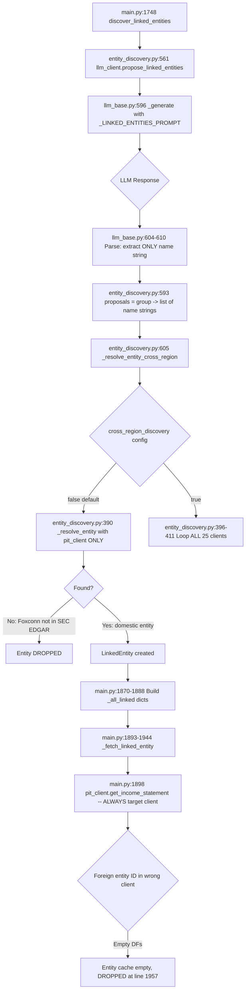
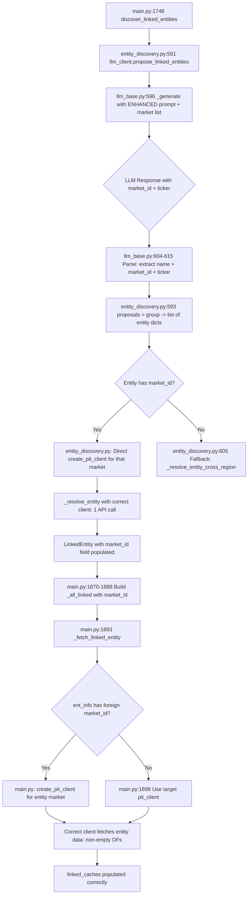

# Fix Entity Discovery 3-Point Failure Chain -- Full Implementation Plan

*Deep scan complete. Every input, output, and connection mapped across 7 files.*

## Problem Summary

Cross-region entity discovery silently fails. Analyzing AAPL with supplier Foxconn: LLM returns "Foxconn" with no market info, resolution searches only SEC EDGAR (finds nothing), and even if found, data fetch hardcodes the wrong PIT client. All cross-region entities are silently dropped.

**Critical constraint:** Free OpenRouter keys = 1 LLM call then burned. Fix must use ZERO additional LLM calls.

---

## Data Flow Map (Current -- Broken)



## Data Flow Map (Fixed)



---

## Affected Files -- Complete Connection Map

### File 1: `operator1/clients/pit_registry.py` (773 lines)

**What we add:** `get_market_summary_for_llm()` function

**Consumers of MARKETS dict (will NOT break -- we only read, not modify):**
- [`equity_provider.py:28-32`](operator1/clients/equity_provider.py:28) -- imports MARKETS, MarketInfo, get_market
- [`entity_discovery.py:426`](operator1/steps/entity_discovery.py:426) -- imports MARKETS for `_build_all_pit_clients()`
- [`health_check.py:160,642`](operator1/monitoring/health_check.py:160) -- imports MARKETS for probe iteration
- [`main.py:566`](main.py:566) -- imports get_market for market validation
- [`backtest_runner.py`](backtest_runner.py) -- imports get_market indirectly via equity_provider

**New function signature:**
```python
def get_market_summary_for_llm() -> str:
    """Build compact market list for LLM prompt injection."""
```

**No existing consumers affected** -- this is a pure addition.

---

### File 2: `operator1/clients/llm_base.py` (1,266 lines)

**What we modify:**
1. [`_LINKED_ENTITIES_PROMPT`](operator1/clients/llm_base.py:544) (line 544-579) -- add `{available_markets}` placeholder + schema for market_id/ticker
2. [`propose_linked_entities()`](operator1/clients/llm_base.py:581) (line 581-622) -- add `available_markets` param, enhance response parsing

**Callers of `propose_linked_entities()` (must handle new param):**
- [`entity_discovery.py:561`](operator1/steps/entity_discovery.py:561) -- `proposals = llm_client.propose_linked_entities(target_profile, sector_hints=sector_hints)` -- must pass `available_markets`
- [`llm_factory.py:192`](operator1/clients/llm_factory.py:192) -- `PooledLLMClient.propose_linked_entities(self, profile, **kwargs)` -- passes through via `**kwargs`, no change needed
- [`llm_base.py:858`](operator1/clients/llm_base.py:858) -- `self.propose_linked_entities(target_profile, sector_hints=sector_hints)` (fallback from 3-call) -- must pass `available_markets`

**Return type change:** `dict[str, list[str]]` -> `dict[str, list[str | dict]]`
- Each group's value can contain either strings (backward compat) or dicts with `name`, `market_id`, `ticker`

**Consumers of the return value:**
- [`entity_discovery.py:593`](operator1/steps/entity_discovery.py:593) -- `names = proposals.get(group, [])` then iterates as strings -- must handle dicts too

**`_last_entity_proposals_raw`** (line 617) -- stores raw parsed response, used by temporal context extraction in `_extract_temporal_context()`. Not affected since we preserve the full raw dict.

**System prompt overlay:** [`config/llm_system_prompts.yml:91-107`](config/llm_system_prompts.yml:91) entity_discovery overlay already says "Return ONLY a JSON object" and "Use the company's most common English trading name". We add market_id/ticker guidance here too.

---

### File 3: `operator1/steps/entity_discovery.py` (698 lines)

**What we modify:**
1. [`LinkedEntity`](operator1/steps/entity_discovery.py:38) dataclass (line 38-53) -- add `market_id: str = ""`
2. [`discover_linked_entities()`](operator1/steps/entity_discovery.py:438) (line 438-685) -- pass `available_markets` to LLM, handle dict proposals
3. Resolution loop at [line 593-627](operator1/steps/entity_discovery.py:593) -- direct-route when market_id provided

**LinkedEntity consumers (must handle new `market_id` field):**
- [`main.py:1818`](main.py:1818) -- `_asdict(e)` converts to dict, new field auto-included
- [`main.py:1870-1888`](main.py:1870) -- iterates `.isin`, `.ticker`, `.name` -- must also extract `.market_id`
- [`backtest_runner.py:896-898`](backtest_runner.py:896) -- `asdict(e)` for graph risk -- auto-includes new field
- [`entity_discovery.py:496`](operator1/steps/entity_discovery.py:496) -- `LinkedEntity(**e)` from checkpoint -- will get `market_id` from saved dict (default "" for old checkpoints)
- [`entity_discovery.py:632-641`](operator1/steps/entity_discovery.py:632) -- checkpoint save dict -- must include `market_id`
- [`tests/test_phase2_ingestion.py:124-129`](tests/test_phase2_ingestion.py:124) -- `LinkedEntity("ISIN1", "T1", "N1", "US", "Tech", "competitors", 80)` -- positional args, not affected (new field has default)

**`_resolve_entity()`** at [line 134-192](operator1/steps/entity_discovery.py:134) -- returns `LinkedEntity` with populated fields from PIT search result. Must set `market_id` from the client that found it.

**`_resolve_entity_cross_region()`** at [line 359-413](operator1/steps/entity_discovery.py:359) -- orchestrates primary + fallback search. When entity has LLM-provided market_id, skip this entirely and go direct.

**`_build_all_pit_clients()`** at [line 416-435](operator1/steps/entity_discovery.py:416) -- becomes optional (only needed when LLM doesn't provide market_id). No change needed.

**Checkpoint format** at [line 632-641](operator1/steps/entity_discovery.py:632) -- save dict currently has: isin, ticker, name, country, sector, relationship_group, match_score, market_cap. Must add `market_id`.

---

### File 4: `main.py` (3,679 lines)

**What we modify:**
1. [Line 1748-1752](main.py:1748) -- `discover_linked_entities()` call -- no change needed (params unchanged at call site)
2. [Line 1870-1888](main.py:1870) -- `_all_linked` construction -- extract `market_id` from LinkedEntity
3. [Line 1893-1944](main.py:1893) -- `_fetch_linked_entity()` -- create correct PIT client per entity
4. [Line 1898-1901](main.py:1898) -- the 4 data fetch calls -- use entity-specific client

**Downstream consumers of `linked_caches` (NOT affected -- dict[str, DataFrame] stays same):**
- [`linked_aggregates.py`](operator1/features/linked_aggregates.py) -- compute_linked_aggregates
- [`peer_ranking.py`](operator1/features/peer_ranking.py) -- compute_peer_ranking
- [`graph_risk.py`](operator1/models/graph_risk.py) -- compute_graph_risk_metrics
- [`game_theory.py`](operator1/models/game_theory.py) -- analyze_competitive_dynamics
- [`ownership_contagion.py`](operator1/models/ownership_contagion.py) -- compute_ownership_contagion
- [`adaptive_thresholds.py`](operator1/analysis/adaptive_thresholds.py) -- compute_adaptive_thresholds
- [`conflict_risk.py`](operator1/features/conflict_risk.py) -- compute_supply_chain_stress
- [`dtw_analogs.py`](operator1/models/dtw_analogs.py) -- find_historical_analogs
- [`model_synergies.py`](operator1/models/model_synergies.py) -- compute_peer_adjusted_thresholds
- [`retroactive_calibration.py`](operator1/analysis/retroactive_calibration.py) -- run_retroactive_calibration
- [`pipeline_state.py`](operator1/pipeline_state.py) -- serialization to parquet
- [`stage3_temporal.py`](operator1/stages/stage3_temporal.py) -- passed to synergies
- [`stage6_ensemble.py`](operator1/stages/stage6_ensemble.py) -- passed to DTW
- [`stage7_integration.py`](operator1/stages/stage7_integration.py) -- passed to retro-cal, HF

**None of these break** because `linked_caches` remains `dict[str, pd.DataFrame]` -- the key is still `entity_id` (isin or ticker), the value is still a daily cache DataFrame.

---

### File 5: `backtest_runner.py` (2,332 lines)

**What we modify:**
- [Line 856-868](backtest_runner.py:856) -- `discover_linked_entities()` call -- same interface, no change needed
- Backtest_runner does NOT have `_fetch_linked_entity()` -- it delegates to the PIT client directly. **It has the SAME bug at a different location** but less critical since backtests typically analyze domestic companies. For completeness, we should fix it there too if entity fetching exists.

**Checking:** backtest_runner does NOT fetch linked entity financial data -- it only runs graph_risk and game_theory with empty `linked_caches`. The entity data fetch is main.py-only. No change needed here.

---

### File 6: `config/llm_system_prompts.yml` (175 lines)

**What we modify:**
- [`entity_discovery`](config/llm_system_prompts.yml:91) overlay (line 91-107) -- add guidance about market_id and ticker fields

---

### File 7: `operator1/clients/llm_factory.py` (426 lines)

**No change needed.** The `PooledLLMClient.propose_linked_entities()` at [line 192](operator1/clients/llm_factory.py:192) uses `**kwargs` passthrough, so the new `available_markets` parameter flows through automatically.

---

## Exact Changes (with line numbers)

### Change 1: `operator1/clients/pit_registry.py`

**Add after line 741** (after `get_all_markets()`):

```python
def get_market_summary_for_llm() -> str:
    """Build compact market list for LLM entity discovery prompt.

    Returns a string like:
      us_sec_edgar: United States, NYSE/NASDAQ
      tw_mops: Taiwan, TWSE/TPEX
      ...

    Used by llm_base._LINKED_ENTITIES_PROMPT to tell the LLM which
    markets are available so it can route entities correctly.
    """
    lines = []
    for m in sorted(MARKETS.values(), key=lambda x: (x.tier, x.market_id)):
        lines.append(f"  {m.market_id}: {m.country} ({m.exchange})")
    return "\n".join(lines)
```

### Change 2: `operator1/clients/llm_base.py`

**2a. Modify `_LINKED_ENTITIES_PROMPT`** (line 544-579):

Replace the current entity schema section with:

```python
_LINKED_ENTITIES_PROMPT = """\
You are a financial analyst. Given the following company profile, suggest
related entities grouped by relationship type.

Company profile:
{profile_json}

Sector hints: {sector_hints}

Return a JSON object with these keys. Each value is a list of objects:

- competitors: direct competitors in the same industry
- suppliers: known major suppliers
- customers: known major customers
- financial_institutions: primary banks or lenders
- logistics: key logistics or distribution partners
- regulators: relevant regulatory bodies (if publicly listed)

Each entity should be an object with:
  "name": "Company Name" (publicly traded, not a ticker),
  "market_id": "the market_id from the available markets list below where this company is listed",
  "ticker": "the company's ticker symbol in that market",
  "relationship_start": "YYYY" or "ongoing" or "unknown",
  "relationship_end": "current" or "YYYY" or "unknown",
  "stability": "stable" or "volatile" or "new"

AVAILABLE MARKETS (use these exact market_id values):
{available_markets}

Example format:
{{"competitors": [{{"name": "Taiwan Semiconductor", "market_id": "tw_mops", "ticker": "2330", "relationship_start": "2020", "relationship_end": "current", "stability": "stable"}}]}}

IMPORTANT: Relationships change over time. Only include entities with
CURRENT or RECENT relationships (within the last 2 years).
Use the market_id that matches where the company is primarily listed.
If you are unsure of the market_id, omit it and the pipeline will search.

Only include companies you are reasonably confident about.
Return valid JSON only, no markdown.
"""
```

**2b. Modify `propose_linked_entities()`** (line 581-622):

```python
def propose_linked_entities(
    self,
    target_profile: dict[str, Any],
    sector_hints: str = "",
    available_markets: str = "",
) -> dict[str, list[str | dict]]:
    """Ask LLM to propose linked entities for a target company.

    Returns dict mapping relationship_group -> list of entity names (str)
    or entity dicts (with name, market_id, ticker).
    Returns empty dict on any failure.
    """
    try:
        prompt = self._LINKED_ENTITIES_PROMPT.format(
            profile_json=json.dumps(target_profile, indent=2),
            sector_hints=sector_hints or "none",
            available_markets=available_markets or "Not available",
        )
        text = self._generate(prompt, task_type="entity_discovery")
        parsed = self._parse_json_response(text)
        if isinstance(parsed, dict):
            result: dict[str, list[str | dict]] = {}
            for k, vs in parsed.items():
                if not isinstance(vs, list):
                    continue
                entities: list[str | dict] = []
                for v in vs:
                    if isinstance(v, dict):
                        name = v.get("name", "")
                        if name:
                            # Preserve full dict with market routing info
                            entities.append({
                                "name": str(name),
                                "market_id": str(v.get("market_id", "")),
                                "ticker": str(v.get("ticker", "")),
                            })
                    elif isinstance(v, str):
                        entities.append(v)
                if entities:
                    result[k] = entities
            self._last_entity_proposals_raw = parsed
            return result
        return {}
    except Exception as exc:
        logger.warning("%s linked-entity proposal failed: %s", self.provider_name, exc)
        return {}
```

**2c. Modify `propose_linked_entities_3call()` fallback** (line 858):

```python
# In the fallback at line 858:
return self.propose_linked_entities(
    target_profile, sector_hints=sector_hints,
    available_markets=available_markets,
)
```

### Change 3: `operator1/steps/entity_discovery.py`

**3a. Add `market_id` to `LinkedEntity`** (line 38-53):

```python
@dataclass
class LinkedEntity:
    """A resolved linked entity with match metadata and temporal context."""
    isin: str
    ticker: str
    name: str
    country: str
    sector: str
    relationship_group: str
    match_score: int
    market_cap: float | None = None
    market_id: str = ""  # NEW: which PIT wrapper resolved this entity
    relationship_start: str = "unknown"
    relationship_end: str = "current"
    relationship_stability: str = "stable"
```

**3b. Add market_id to checkpoint save** (line 632-641):

```python
progress["resolved"][group] = [
    {
        "isin": e.isin, "ticker": e.ticker, "name": e.name,
        "country": e.country, "sector": e.sector,
        "relationship_group": e.relationship_group,
        "match_score": e.match_score, "market_cap": e.market_cap,
        "market_id": e.market_id,  # NEW
    }
    for e in resolved
]
```

**3c. Add `_resolve_entity_direct()`** (new function, after line 413):

```python
def _resolve_entity_direct(
    entity_dict: dict,
    group: str,
    secrets: dict[str, str] | None,
    target_country: str,
    target_sector: str,
) -> LinkedEntity | None:
    """Resolve entity using LLM-provided market_id + ticker (direct routing).

    Skips brute-force search. Creates the exact PIT client needed and
    searches by ticker. Falls back to None if the market_id is invalid
    or the ticker is not found.
    """
    market_id = entity_dict.get("market_id", "")
    ticker = entity_dict.get("ticker", "")
    name = entity_dict.get("name", "")

    if not market_id or not name:
        return None

    # Validate market_id against registry
    from operator1.clients.pit_registry import MARKETS
    if market_id not in MARKETS:
        logger.debug("LLM returned unknown market_id '%s' for '%s'", market_id, name)
        return None

    try:
        from operator1.clients.equity_provider import create_pit_client
        client = create_pit_client(market_id, secrets or {})

        # Search by ticker first (more precise), then by name
        query = ticker if ticker else name
        entity = _resolve_entity(query, group, client, target_country, target_sector)

        if entity is not None:
            entity.market_id = market_id
            logger.info(
                "  Direct-routed: '%s' -> %s via %s (1 API call)",
                name, entity.ticker or entity.isin, market_id,
            )
            return entity

        # Ticker failed, try name
        if ticker and ticker != name:
            entity = _resolve_entity(name, group, client, target_country, target_sector)
            if entity is not None:
                entity.market_id = market_id
                return entity

    except Exception as exc:
        logger.debug("Direct resolution failed for '%s' via %s: %s", name, market_id, exc)

    return None
```

**3d. Modify `discover_linked_entities()` resolution loop** (line 538-627):

Add available_markets to LLM call (around line 544-563):

```python
# Build market summary for LLM prompt
_available_markets = ""
try:
    from operator1.clients.pit_registry import get_market_summary_for_llm
    _available_markets = get_market_summary_for_llm()
except Exception:
    pass

# ... then in the single-call path (line 561):
proposals = llm_client.propose_linked_entities(
    target_profile, sector_hints=sector_hints,
    available_markets=_available_markets,
)
```

Modify the resolution loop (line 593-627):

```python
for group in RELATIONSHIP_GROUPS:
    if group in result.linked:
        continue

    items = proposals.get(group, [])
    resolved: list[LinkedEntity] = []
    group_calls = 0

    for item in items:
        if group_calls >= budget_per_group or global_calls >= budget_global:
            break

        # Extract name and optional routing info
        if isinstance(item, dict):
            name = item.get("name", "")
            entity_market_id = item.get("market_id", "")
            entity_ticker = item.get("ticker", "")
        else:
            name = str(item)
            entity_market_id = ""
            entity_ticker = ""

        if not name:
            continue

        entity = None

        # Path A: Direct routing (LLM provided market_id)
        if entity_market_id:
            entity = _resolve_entity_direct(
                {"name": name, "market_id": entity_market_id, "ticker": entity_ticker},
                group, secrets, target_country, target_sector,
            )

        # Path B: Fallback to cross-region search
        if entity is None:
            entity = _resolve_entity_cross_region(
                name, group, pit_client, all_clients,
                target_country, target_sector,
            )

        group_calls += 1
        global_calls += 1

        # ... rest of dedup/append logic unchanged ...
```

### Change 4: `main.py`

**4a. Extract market_id when building `_all_linked`** (line 1870-1888):

Add market_id extraction inside the entity iteration:

```python
# After line 1881:
_ent_market_id = ""
if hasattr(ent, "market_id"):
    _ent_market_id = ent.market_id
elif isinstance(ent, dict):
    _ent_market_id = ent.get("market_id", "")

_all_linked.append({
    "id": ent_id,
    "name": getattr(ent, "name", "") if hasattr(ent, "name") else ent.get("name", ""),
    "group": group_name,
    "market_id": _ent_market_id,  # NEW
})
```

**4b. Modify `_fetch_linked_entity()`** (line 1893-1944):

Add correct PIT client creation at the top of the function:

```python
def _fetch_linked_entity(ent_info: dict) -> tuple[str, pd.DataFrame]:
    """Fetch and build daily cache for one linked entity."""
    ent_id = ent_info["id"]
    try:
        # Use correct PIT client for the entity's market
        _ent_client = pit_client  # default: target's market
        _ent_market_id = ent_info.get("market_id", "")
        if _ent_market_id and _ent_market_id != market_id:
            try:
                _ent_client = _create_pit_client(_ent_market_id, secrets)
                logger.info("  Using %s client for entity %s", _ent_market_id, ent_id)
            except Exception as _exc:
                logger.debug("  Failed to create %s client, using target's: %s", _ent_market_id, _exc)

        # Fetch financial statements using the correct client
        _inc = _ent_client.get_income_statement(ent_id)
        _bal = _ent_client.get_balance_sheet(ent_id)
        _cf = _ent_client.get_cashflow_statement(ent_id)
        _qt = _ent_client.get_quotes(ent_id)
        # ... rest unchanged ...
```

### Change 5: `config/llm_system_prompts.yml`

**Modify entity_discovery overlay** (line 91-107):

Add after line 107:

```yaml
  - When the prompt provides an "AVAILABLE MARKETS" list, you MUST
    set the "market_id" field to one of those exact values for each
    entity. Use the market where the company is primarily listed.
    Example: Foxconn is listed on TWSE, so market_id = "tw_mops".
  - Set the "ticker" field to the company's ticker in that market.
    Example: Foxconn's ticker on TWSE is "2317".
  - If you genuinely don't know which market a company trades on,
    omit market_id and ticker -- the pipeline will search for it.
```

---

## Test Impact Analysis

| Test File | What Tests | Impact |
|-----------|-----------|--------|
| [`tests/test_phase2_ingestion.py:118-138`](tests/test_phase2_ingestion.py:118) | `LinkedEntity` positional args, `get_all_linked_isins()` | **No break** -- new `market_id` field has default `""`, positional construction at line 124 works (7 positional args = isin, ticker, name, country, sector, group, score) |
| [`tests/test_phase2_ingestion.py:90-113`](tests/test_phase2_ingestion.py:90) | `_score_match()` tests | **No break** -- unchanged function |
| [`tests/test_conflict_risk.py:364`](tests/test_conflict_risk.py:364) | `TestLinkedEntityConflict` | **No break** -- tests linked conflict propagation, not entity resolution |
| [`tests/test_llm_base_new.py`](tests/test_llm_base_new.py) | LLM base class tests | **May need update** if tests mock `propose_linked_entities()` return value -- check if they expect `list[str]` vs `list[dict]` |

---

## Execution Checklist

```
[ ] 1. pit_registry.py: Add get_market_summary_for_llm()
[ ] 2. llm_base.py: Modify _LINKED_ENTITIES_PROMPT + propose_linked_entities()
[ ] 3. config/llm_system_prompts.yml: Update entity_discovery overlay
[ ] 4. entity_discovery.py: Add market_id to LinkedEntity + _resolve_entity_direct() + modify resolution loop
[ ] 5. main.py: Extract market_id in _all_linked + use correct PIT client in _fetch_linked_entity()
[ ] 6. Run tests: pytest tests/test_phase2_ingestion.py tests/test_llm_base_new.py -v
[ ] 7. Push branch + create PR
```

Each change is independently deployable. Changes 1-3 are the LLM prompt enhancement (no behavior change without Change 4-5). Changes 4-5 are the routing fix (falls back gracefully to current behavior when market_id is empty).
