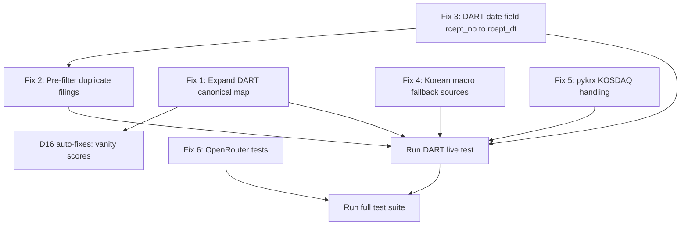

# Fix Remaining DART Pipeline Bugs

6 bugs remain from the DART pipeline run analysis (LF Corp, 093050). All are DART/Korea-specific data quality issues.

Reference: [`plans/complete-data-flow-and-model-contract-map.md`](plans/complete-data-flow-and-model-contract-map.md) for full pipeline architecture.

---

## Bug Summary

| Bug | Severity | Issue | File | Pipeline Phase |
|-----|----------|-------|------|----------------|
| D12 | HIGH | 19 all-NaN variables -- DART canonical map too narrow | `canonical_translator.py` | Phase A: Cache Construction |
| D10 | MEDIUM | 179 duplicate filings per statement (96% waste) | `kr_dart_wrapper.py` | Phase A: Cache Construction |
| D9 | MEDIUM | 80 filings with filing_date < report_date | `kr_dart_wrapper.py` | Phase A: Cache Construction |
| D11 | MEDIUM | Korea macro: 3/5 indicators missing | `macro_kosis.py` | Phase B: Macro Data |
| D8 | MEDIUM | pykrx empty for KOSDAQ ticker 093050 | `ohlcv_pykrx.py` | Phase C14: OHLCV Provider |
| D16 | LOW | Vanity scores all zero (cascade from D12) | N/A -- auto-fixes | Phase C: Features |

---

## Fix 1: Expand DART Canonical Translator Map (D12)

**Problem:** `_DART_MAP` in [`canonical_translator.py`](operator1/clients/canonical_translator.py) only maps ~6 DART Korean account names to canonical fields. The pipeline pivots to wide format and only gets 4 columns (revenue, operating_income, net_income, total_assets). Key ratios like `current_ratio`, `gross_margin`, `operating_margin`, `net_margin`, `debt_to_equity` are all NaN because their input fields are unmapped.

**Impact:** 19 variables become all-NaN. Downstream: financial health scores degraded, vanity scores zero, forecasting falls back to `baseline_zero` for those variables.

**Fix:**
- Add ~20 K-IFRS Korean account names to `_DART_MAP`:
  - Balance sheet: 유동자산 -> current_assets, 유동부채 -> current_liabilities, 현금및현금성자산 -> cash_and_equivalents, 단기차입금 -> short_term_debt, 장기차입금 -> long_term_debt, 자본총계 -> total_equity, 부채총계 -> total_liabilities, 이익잉여금 -> retained_earnings, 재고자산 -> inventory, 매출채권 -> receivables
  - Income: 매출원가 -> cost_of_goods_sold, 매출총이익 -> gross_profit, 판매비와관리비 -> selling_general_admin, 이자비용 -> interest_expense, 법인세비용 -> income_tax_expense
  - Cash flow: 영업활동현금흐름 -> operating_cash_flow, 투자활동현금흐름 -> investing_cash_flow, 재무활동현금흐름 -> financing_cash_flow, 감가상각비 -> depreciation_amortization
- Also add English IFRS variants that DART sometimes returns (CurrentAssets, CurrentLiabilities, etc.)
- The existing `_IFRS_MAP` already handles some English names; verify no overlap/conflict

**Files to modify:**
- [`operator1/clients/canonical_translator.py`](operator1/clients/canonical_translator.py) -- add entries to `_DART_MAP`

**Test:** Run `tests/test_canonical_translator_new.py` + verify DART live test returns >4 columns

---

## Fix 2: Pre-filter DART Duplicate Filings (D10)

**Problem:** DART API returns 186 rows per statement for 2 years of data. After dedup (keep latest amendment per report_date), only 7 remain. 96% of fetched data is thrown away.

**Impact:** Wasted API calls, slower pipeline, noisy logs.

**Fix:**
- In [`kr_dart_wrapper.py`](operator1/clients/kr_dart_wrapper.py) `_fetch_via_direct_api_financials()`:
  - After collecting all rows, sort by (report_date, filing_date) descending
  - Keep only the first row per (canonical_name, report_date) -- this is the latest amendment
  - Do this BEFORE passing to `translate_financials()`
- In `_fetch_via_dart_fss()`:
  - dart-fss `extract_fs()` returns period columns -- dedup at column level (already implicit)
  - Add logging of rows before/after dedup

**Files to modify:**
- [`operator1/clients/kr_dart_wrapper.py`](operator1/clients/kr_dart_wrapper.py) -- lines ~462-521, add dedup logic

**Test:** Run `tests/test_pit_kr_dart.py`

---

## Fix 3: Investigate DART Date Field Semantics (D9)

**Problem:** 80 filings have filing_date < report_date (impossible -- you cannot file before the reporting period ends). The reconciliation layer corrects these by setting filing_date = report_date + 1 day, but the root cause is in the DART wrapper.

**Root cause analysis:**
- In `_fetch_via_direct_api_financials()` line 501: `"filing_date": item.get("rcept_no", "")` -- this assigns `rcept_no` (receipt NUMBER, not date) as the filing_date. `rcept_no` is a DART document ID like "20240315000123", not a date.
- The actual filing date field in DART API is `rcept_dt` (receipt date)
- When `rcept_no` fails to parse as a date, it becomes NaT, and the reconciliation interprets NaT < report_date as "time travel"

**Fix:**
- In `_fetch_via_direct_api_financials()`: change `item.get("rcept_no", "")` to `item.get("rcept_dt", "")`
- If `rcept_dt` is not in the response, fetch it from the filing list API (`/list.json` with rcept_no filter)
- Add a validation: if filing_date is still NaT after parsing, set it to report_date + 90 days as a conservative estimate

**Files to modify:**
- [`operator1/clients/kr_dart_wrapper.py`](operator1/clients/kr_dart_wrapper.py) -- line ~501

**Test:** Run `tests/test_pit_kr_dart.py`, verify 0 time-travel warnings

---

## Fix 4: Add Korean Macro Fallback Sources (D11)

**Problem:** KOSIS macro fetcher via FRED returns only 3/5 indicators (inflation: 1 obs, interest_rate: 23 obs, exchange_rate: 517 obs). Missing: GDP growth, unemployment rate, currency (the exchange_rate series maps to a different canonical name than expected).

**Reference:** Per the flow map Phase B1, macro should return 5 indicators: gdp, inflation, interest_rate, unemployment, currency.

**Fix:**
- In [`macro_kosis.py`](operator1/clients/macro_kosis.py):
  - Verify the FRED series IDs for Korea: `FPCPITOTLZGKOR` (inflation), `LRHUTTTTKOR` (unemployment), `IRSTCI01KRM156N` (interest rate), `MKTGNIKORKA646NWDB` (GDP)
  - Add World Bank fallback for missing indicators via `wbgapi`:
    - GDP growth: `NY.GDP.MKTP.KD.ZG`
    - Unemployment: `SL.UEM.TOTL.ZS`
  - Map FRED `DEXKOUS` (USD/KRW) to the canonical `currency` field

**Files to modify:**
- [`operator1/clients/macro_kosis.py`](operator1/clients/macro_kosis.py) -- add/fix FRED series IDs, add wbgapi fallback

**Test:** Run `tests/test_macro_kosis.py`

---

## Fix 5: Debug pykrx for KOSDAQ Tickers (D8)

**Problem:** pykrx returns empty for ticker 093050 (LF Corp, listed on KOSDAQ). Falls back to yfinance which works with suffix `.KS`.

**Root cause hypothesis:** pykrx may need the ticker without leading zeros, or KOSDAQ tickers may need different handling than KOSPI tickers. Some pykrx functions use market parameter (KOSPI vs KOSDAQ).

**Fix:**
- In [`ohlcv_pykrx.py`](operator1/clients/ohlcv_pykrx.py):
  - Add KOSDAQ ticker handling: try both with and without leading zeros
  - If `pykrx.stock.get_market_ohlcv_by_date()` returns empty, try with `market="KOSDAQ"` parameter
  - Add logging of the exact ticker format being passed to pykrx
  - Ensure date range format matches pykrx expectations (YYYYMMDD vs YYYY-MM-DD)

**Files to modify:**
- [`operator1/clients/ohlcv_pykrx.py`](operator1/clients/ohlcv_pykrx.py) -- add KOSDAQ handling

**Test:** Run `tests/test_ohlcv_pykrx.py`

---

## Fix 6: OpenRouter Tests (from last merged PR)

**Problem:** The OpenRouter integration was merged but the test file was never created.

**Fix:**
- Create [`tests/test_llm_openrouter_new.py`](tests/test_llm_openrouter_new.py) following the pattern of `test_llm_gemini_new.py` and `test_llm_claude_new.py`:
  - Test import and instantiation
  - Test provider_name and model_name properties
  - Test max_output_tokens from registry
  - Test _build_request_args produces OpenAI-compatible format
  - Test _parse_response extracts text from OpenAI response
  - Test model auto-selection picks free tier first
  - Test factory integration: `create_llm_client(secrets, provider="openrouter")`

**Files to create:**
- [`tests/test_llm_openrouter_new.py`](tests/test_llm_openrouter_new.py)

**Test:** Run the new test file

---

## Execution Order

**Recommended order:**
1. Fix 3 (D9) -- one-line date field fix, highest confidence
2. Fix 2 (D10) -- dedup before translate, reduces noise
3. Fix 1 (D12) -- expand canonical map, biggest impact
4. Fix 4 (D11) -- add macro fallbacks
5. Fix 5 (D8) -- pykrx KOSDAQ handling
6. Fix 6 (OpenRouter tests) -- independent, can be done anytime

---

## Verification

After all fixes:
1. Run `python3 -m pytest tests/test_pit_kr_dart.py tests/test_canonical_translator_new.py tests/test_macro_kosis.py tests/test_ohlcv_pykrx.py tests/test_llm_openrouter_new.py -v`
2. Run `python3 -m pytest tests/ -v --tb=short` (full suite)
3. If possible, run a live DART pipeline: `python main.py --market kr_dart --company 093050 --skip-models` to verify improved data coverage
