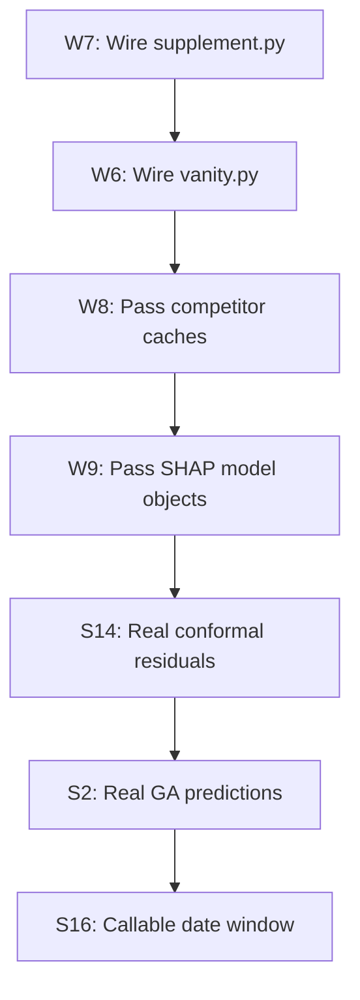

# Fix Plan: W6-W9 Wiring Bugs and S2/S14/S16 Design Limitations

## Priority Order

Fixes are ordered by impact: wiring bugs first (dead features), then design limitations (degraded accuracy).

---

## Group 1: Wiring Bugs (W6-W9) -- All in `main.py`

These are single-line or few-line fixes in `main.py` that wire existing, tested modules into the pipeline.

### W6: Wire `vanity.py` into pipeline

**Problem:** [`profile_builder.py:333`](operator1/report/profile_builder.py:333) reads `vanity_score`, `vanity_label`, `vanity_trend`, and 5 component columns, but [`compute_vanity_score()`](operator1/analysis/vanity.py:533) is never called in `main.py`.

**Fix:** Add call in `main.py` Step 5 (feature engineering), after financial health and before entity discovery:

```python
# After financial_health and before entity_discovery
from operator1.analysis.vanity import compute_vanity_score
cache = compute_vanity_score(cache)
```

**Dependencies:** cache must have derived variables, `fh_*` scores. Sentiment and peer ranking are optional inputs.

**Risk:** Low -- `compute_vanity_score` is tested in `test_phase4_analysis.py`.

---

### W7: Wire `supplement.py` for non-US profile enrichment

**Problem:** [`enrich_profile()`](operator1/clients/supplement.py:487) fills sector/industry/identifier gaps for non-US markets via OpenFIGI, but is never called.

**Fix:** Add call in `main.py` after Step 2 (profile fetch):

```python
from operator1.clients.supplement import enrich_profile
target_profile = enrich_profile(
    market_id=market_id,
    ticker=ticker,
    existing_profile=target_profile,
)
```

**Dependencies:** None beyond the profile dict and market_id.

**Risk:** Low -- `enrich_profile` never overwrites existing data, only fills gaps. Tested in `test_supplement_and_translator.py`.

---

### W8: Pass competitor caches to game theory

**Problem:** [`analyze_competitive_dynamics()`](operator1/models/game_theory.py:388) accepts `competitor_caches` but `main.py` never passes `linked_caches`. Always returns monopoly with 0 competitors.

**Fix:** In `main.py` at the game theory call site (~line 1109), change:

```python
# Before:
game_theory_result = analyze_competitive_dynamics(cache, target_name)

# After:
game_theory_result = analyze_competitive_dynamics(
    cache, target_name, competitor_caches=linked_caches,
)
```

**Dependencies:** `linked_caches` must be populated from entity discovery step.

**Risk:** Low -- game theory handles empty/None competitor_caches gracefully.

---

### W9: Pass fitted model objects to SHAP

**Problem:** [`compute_shap_explanations()`](operator1/models/explainability.py) needs `tree_models` or `predict_fns` but receives neither. Always returns `available=False`.

**Fix:** In `main.py` at the SHAP call site (~line 1758), extract fitted tree models from the forward pass or forecasting result:

```python
# Extract tree models from forward pass model states
tree_models = {}
predict_fns = {}
if hasattr(forward_pass_result, 'model_states'):
    for var, states in forward_pass_result.model_states.items():
        for state in states:
            model_obj = state.get('model')
            model_name = state.get('name', '')
            if model_obj and 'tree' in model_name.lower():
                tree_models[var] = model_obj
                break
            elif model_obj and hasattr(model_obj, 'predict'):
                predict_fns[var] = model_obj.predict
                break

shap_result = compute_shap_explanations(
    cache, predictions=pred_result.predictions,
    tree_models=tree_models,
    predict_fns=predict_fns,
)
```

**Dependencies:** `forward_pass_result.model_states` must contain fitted model objects. Need to verify the structure.

**Risk:** Medium -- need to inspect what `model_states` actually stores. If models aren't persisted, a deeper change to `forecasting.py` is needed to store fitted model objects.

---

## Group 2: Design Limitations (S2, S14, S16)

These require deeper changes to improve accuracy but are not blocking features.

### S14: Store actual validation residuals for conformal calibration

**Problem:** [`forecasting.py:1682`](operator1/models/forecasting.py:1682) synthesizes `+/-RMSE` pairs instead of passing actual test residuals to the conformal calibrator.

**Fix (2 parts):**

1. **Add `test_residuals` field to `ModelMetrics`:**

```python
@dataclass
class ModelMetrics:
    model_name: str = ""
    variable: str = ""
    mae: float = float("nan")
    rmse: float = float("nan")
    n_train: int = 0
    n_test: int = 0
    fitted: bool = False
    error: str | None = None
    test_residuals: list[float] | None = None  # NEW
```

2. **Store actual residuals in each model wrapper:** In each `_fit_*` function (Kalman, GARCH, VAR, LSTM, tree), after computing `preds_test`, store:

```python
metrics.test_residuals = (y_test - preds_test).tolist()
```

3. **Collect real residuals in `run_forecasting()`:** Replace the synthetic `+/-RMSE` logic at line 1682 with:

```python
_residuals = []
for met in result.metrics:
    if met.fitted and met.test_residuals:
        _residuals.extend(met.test_residuals)
if _residuals:
    result.residuals = _residuals
```

**Risk:** Low -- additive change, backward compatible.

---

### S2: Pass real per-model forecast arrays to Genetic Optimizer

**Problem:** [`genetic_optimizer.py:182`](operator1/models/genetic_optimizer.py:182) builds proxy predictions from EWM/shifted returns instead of actual per-model forecast arrays.

**Fix (2 parts):**

1. **Store per-model prediction arrays in `ForecastResult`:**

```python
@dataclass
class ForecastResult:
    ...
    per_model_predictions: dict[str, dict[str, np.ndarray]] | None = None
    # {model_name: {variable: prediction_array}}
```

2. **In `run_forecasting()`, collect predictions from each fitted wrapper** and store in the new field.

3. **In `run_genetic_optimization()`, prefer real predictions** over proxies:

```python
if forecast_result and forecast_result.per_model_predictions:
    for model_name in MODEL_NAMES:
        if model_name in forecast_result.per_model_predictions:
            preds = forecast_result.per_model_predictions[model_name].get(target_col)
            if preds is not None:
                model_predictions[model_name] = preds[-validation_window:]
```

**Risk:** Medium -- requires changes across forecasting wrapper functions.

---

### S16: Make date window callable instead of import-time constant

**Problem:** [`constants.py:8-9`](operator1/constants.py:8) computes `DATE_END`/`DATE_START` at import time.

**Fix:** Add a function alongside the constants:

```python
def get_date_window(years: int = 2) -> tuple[date, date]:
    end = date.today()
    start = end - timedelta(days=365 * years)
    return start, end

# Keep module-level constants for backward compatibility
DATE_END: date = date.today()
DATE_START: date = DATE_END - timedelta(days=730)
```

**Risk:** Very low -- additive, backward compatible.

---

## Implementation Order



| Step | Issue | Files Modified | Tests to Run |
|------|-------|----------------|--------------|
| 1 | W7 | `main.py` | `test_supplement_and_translator.py` |
| 2 | W6 | `main.py` | `test_phase4_analysis.py` |
| 3 | W8 | `main.py` | `test_phase_c_modules.py` |
| 4 | W9 | `main.py` | `test_advanced_modules.py` |
| 5 | S14 | `forecasting.py` | `test_phase6_forecasting.py` |
| 6 | S2 | `forecasting.py`, `genetic_optimizer.py` | `test_phase6_forecasting.py` |
| 7 | S16 | `constants.py` | `test_phase1_smoke.py` |

---

## Notes

- W6-W8 are straightforward 1-5 line changes in `main.py`
- W9 depends on verifying what `forward_pass_result.model_states` actually contains
- S14 and S2 are the most impactful accuracy improvements but require touching 5+ model wrapper functions each
- All changes are backward compatible -- no existing tests should break
