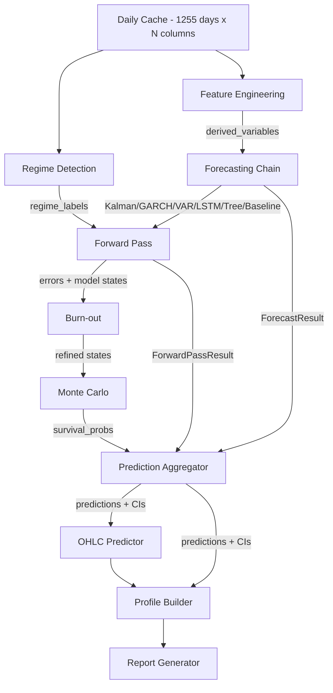
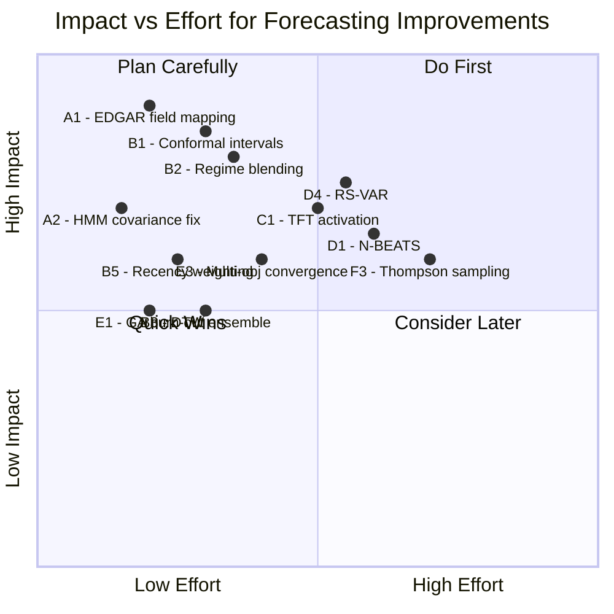

# Forecasting Models Full-Potential Architecture Plan

## Current State: What the App Has

The forecasting engine in Operator 1 is surprisingly deep -- 25+ mathematical models across 15 Python modules. Here is what currently exists and how it performs:

### Model Inventory (existing)

| Module | Model | Status | Used in AAPL Run? | Notes |
|--------|-------|--------|-------------------|-------|
| [`forecasting.py`](operator1/models/forecasting.py) | Kalman filter | Working | Yes (1 var) | Local-level state-space; online updates |
| [`forecasting.py`](operator1/models/forecasting.py) | GARCH(1,1) | Working | Yes | Volatility forecasting; online recursive update |
| [`forecasting.py`](operator1/models/forecasting.py) | VAR | Working | Partial | Multivariate; rolling refit every 50 steps |
| [`forecasting.py`](operator1/models/forecasting.py) | LSTM | Working | Yes (6 vars) | Mini-LSTM with MC Dropout uncertainty |
| [`forecasting.py`](operator1/models/forecasting.py) | Tree ensemble | Working | Yes (1 var) | GBM/XGB with periodic refit |
| [`forecasting.py`](operator1/models/forecasting.py) | Baseline EMA | Working | Always | Exponential moving average fallback |
| [`forecasting.py`](operator1/models/forecasting.py) | TFT wrapper | Built | Not connected | Temporal Fusion Transformer -- GRN blocks, multi-head attention |
| [`transformer_forecaster.py`](operator1/models/transformer_forecaster.py) | Transformer | Working | Yes (15 vars) | Encoder-only with attention weights |
| [`regime_detector.py`](operator1/models/regime_detector.py) | HMM | Broken | Failed | Covariance not positive-definite for AAPL |
| [`regime_detector.py`](operator1/models/regime_detector.py) | GMM | Working | Yes | Gaussian mixture for return clustering |
| [`regime_detector.py`](operator1/models/regime_detector.py) | PELT | Working | Yes | Pruned exact linear time breakpoints |
| [`regime_detector.py`](operator1/models/regime_detector.py) | BCP | Working | Yes | Bayesian change point detection |
| [`monte_carlo.py`](operator1/models/monte_carlo.py) | Regime-aware MC | Working | Yes (10K paths) | Importance sampling for tail events |
| [`particle_filter.py`](operator1/models/particle_filter.py) | Particle Filter | Working | Yes | Sequential Monte Carlo state estimation |
| [`conformal.py`](operator1/models/conformal.py) | Conformal PI | Built | Calibrating | Distribution-free prediction intervals |
| [`prediction_aggregator.py`](operator1/models/prediction_aggregator.py) | Ensemble aggregator | Working | Yes | Inverse-RMSE weighting + Technical Alpha |
| [`genetic_optimizer.py`](operator1/models/genetic_optimizer.py) | GA optimizer | Working | Yes | Ensemble weight meta-optimization |
| [`model_synergies.py`](operator1/models/model_synergies.py) | 8 synergies | Partially used | Some | Kalman-PF fusion, cycle injection, etc. |
| [`walk_forward.py`](operator1/models/walk_forward.py) | Walk-forward | Working | Yes | Per-day prediction with retrain at regime switches |
| [`dtw_analogs.py`](operator1/models/dtw_analogs.py) | DTW analogs | Working | Yes | Historical pattern matching |
| [`copula.py`](operator1/models/copula.py) | Copula | Failed | Insufficient data | Joint tail dependency modeling |
| [`explainability.py`](operator1/models/explainability.py) | SHAP | Failed | Insufficient data | Feature importance explanations |
| [`sensitivity.py`](operator1/models/sensitivity.py) | Sobol sensitivity | Failed | Insufficient data | Variance-based sensitivity analysis |
| [`ohlc_predictor.py`](operator1/models/ohlc_predictor.py) | OHLC predictor | Working | Yes | Iterative candlestick generation |
| [`cycle_decomposition.py`](operator1/models/cycle_decomposition.py) | Cycle decomp | Working | Yes | Fourier + wavelet cycles |
| [`granger_causality.py`](operator1/models/granger_causality.py) | Granger causality | Working | Yes (35 pairs) | Causal variable discovery |
| [`pid_controller.py`](operator1/models/pid_controller.py) | PID controller | Working | Yes | Adaptive learning rate per variable |
| [`pattern_detector.py`](operator1/models/pattern_detector.py) | Candlestick patterns | Working | Yes | Three White Soldiers, Doji, etc. |
| [`graph_risk.py`](operator1/models/graph_risk.py) | Graph risk | Failed | No linked entities | Supply chain contagion modeling |
| [`game_theory.py`](operator1/models/game_theory.py) | Game theory | Working | Yes | Cournot/Stackelberg competitive analysis |

### Current Data Flow

---

## Diagnosis: Where Models Underperform

### Problem 1: Tier 1-2 Financial Ratios Get Zero Data (4 variables)

The `cash_ratio`, `current_ratio`, `interest_coverage`, and `net_debt_to_ebitda` columns are all-NaN because SEC EDGAR does not return the raw fields needed to compute them. These are Tier 1-2 survival variables -- the most important ones for the survival analysis.

**Root cause**: The EDGAR wrapper's `get_balance_sheet()` returns data, but `current_liabilities` and `interest_expense` are not in the mapped columns. The [`canonical_translator.py`](operator1/clients/canonical_translator.py) doesn't map the EDGAR XBRL concepts for these fields.

**Impact**: Kalman filter, the preferred model for Tier 1-2 variables, never gets to run on the most critical variables. The forecasting chain falls through to `baseline_zero` for these.

### Problem 2: HMM Regime Detection Fails

The HMM fitting fails with `covars must be symmetric, positive-definite` on AAPL data. This means the pipeline misses the primary regime classification method and falls back to GMM only.

**Root cause**: The HMM input features (returns + volatility) likely have near-zero variance in some regime, causing the covariance matrix to become singular.

### Problem 3: 8 Sibling Module Results Are Computed But Not Consumed

As documented in the existing [`prediction-aggregator-full-potential-upgrade-plan.md`](plans/prediction-aggregator-full-potential-upgrade-plan.md), the prediction aggregator ignores results from: Conformal, DualRegime, Copula, DTW, Granger, SHAP, WalkForward diagnostics, and Particle Filter. These are all computed during the pipeline run but thrown away at aggregation time.

### Problem 4: TFT Wrapper Built But Not Connected

The [`TFTWrapper`](operator1/models/forecasting.py:2237) class exists in `forecasting.py` with a complete implementation (GRN blocks, self-attention) but it is never instantiated in the forward pass or forecasting chain. This is the most sophisticated model for mixed-frequency financial data.

### Problem 5: Models Fail on Sparse Financial Data

SHAP, Sobol, and Copula all fail with "insufficient data" because they require dense numerical feature matrices. Financial statement data is quarterly (4-8 rows per year) while the cache is daily (1255 rows). After forward-filling, most financial columns have the same value for 60+ consecutive days, giving near-zero variance.

### Problem 6: Burn-out Loop Doesn't Use GA-Optimized Weights

The burn-out loop runs forward passes with default settings, but the GA optimizer has already computed per-tier optimal weights. These optimized weights should be fed into the burn-out iterations.

---

## Architecture Plan: Full-Potential Forecasting

### Phase A: Fix the Data Foundation (Critical)

These fixes address the root cause of model failures.

**A1. Expand EDGAR canonical field mapping**
- Add mappings for `current_liabilities`, `interest_expense`, `current_assets` in the EDGAR XBRL concept translator
- Verify these fields exist in the EDGAR filings for AAPL (they do -- `us-gaap:LiabilitiesCurrent`, `us-gaap:InterestExpense`)
- This single fix enables Kalman filter to run on all 4 missing Tier 1-2 variables

**A2. Fix HMM covariance stability**
- Add diagonal regularization to the HMM covariance matrix: `covars += epsilon * np.eye(n)`
- Use `covariance_type="diag"` as fallback when `"full"` fails
- This restores the primary regime classification method

**A3. Improve data density for sparse modules**
- For SHAP/Sobol/Copula: compute features on a weekly-resampled version of the cache (252 weekly rows instead of 1255 daily rows with repeated values)
- This gives these modules enough variance to fit while maintaining the daily resolution for price-based models

### Phase B: Connect Unused Model Results (High Impact)

Wire the 8 orphaned module results into the prediction aggregator. This follows the existing plan in [`prediction-aggregator-full-potential-upgrade-plan.md`](plans/prediction-aggregator-full-potential-upgrade-plan.md) but with prioritization:

**B1. Conformal prediction intervals** (replace Gaussian assumption)
- When `ConformalResult` is available, use calibrated quantiles instead of `RMSE * z * sqrt(h)`
- Already calibrating during forward pass; just needs the aggregator to consume it

**B2. Dual regime probability blending** (soft ensemble weights)
- Replace hard regime label switching with continuous probability-weighted blending
- Models get upweighted/downweighted based on regime mixture

**B3. DTW analog ensemble channel** (independent empirical forecast)
- Add DTW empirical return distribution as a Bayesian prior blended with model forecasts
- Weight by number and quality of historical matches

**B4. Granger causal propagation** (forecast adjustment)
- After initial forecasts, do a second pass adjusting dependent variables based on causal drivers' deviations

**B5. Walk-forward recency weighting** (adaptive RMSE)
- Replace static training-time RMSE with exponentially-decayed recent-window RMSE from walk-forward errors

**B6. Kalman-Particle fusion via model synergies**
- Call `fuse_kalman_particle_estimates()` with regime probabilities before ensemble weighting

### Phase C: Activate the TFT Wrapper (Medium Impact)

**C1. Register TFT in the model wrapper bank**
- Add TFT to [`_init_model_wrappers()`](operator1/models/forecasting.py) alongside LSTM
- TFT handles mixed-frequency data natively (daily prices + quarterly statements)
- Configure with static features from profile (sector, country, industry)

**C2. TFT-specific forward pass integration**
- TFT needs both historical observed inputs AND known future inputs (calendar features)
- Add day-of-week, month, earnings-quarter flags as known future inputs
- Add macro indicators as observed past inputs

### Phase D: New Models to Add (Medium-High Impact)

These are models that would fill genuine gaps in the current architecture:

**D1. N-BEATS (Neural Basis Expansion Analysis)**
- Pure time series model that decomposes into trend and seasonality
- Works well with the cycle decomposition output as auxiliary input
- Simpler than Transformer but often competitive on financial data
- Implementation: ~200 lines, uses PyTorch (already installed)

**D2. Temporal Convolutional Network (TCN)**
- Dilated causal convolutions for long-range dependencies
- Faster than LSTM/Transformer for inference
- Good complement to attention-based models
- Implementation: ~150 lines, PyTorch only

**D3. Bayesian Neural Network (BNN) via MC Dropout**
- The LSTM already has MC Dropout uncertainty estimation
- Extend this to a dedicated BNN wrapper that provides calibrated epistemic uncertainty
- Use the uncertainty to dynamically adjust ensemble weights (models that are more uncertain get less weight)

**D4. Regime-Switching VAR (RS-VAR)**
- The current VAR is a single-regime model
- A regime-switching VAR uses the HMM/GMM regime labels to fit separate VAR models per regime
- During prediction, regime probabilities weight the per-regime forecasts
- This bridges the gap between the regime detector and the VAR model

### Phase E: Burn-out and Convergence Improvements

**E1. GA-weighted burn-out iterations**
- Feed the GA optimizer's per-tier weights into each burn-out iteration
- Currently burn-out uses equal-weighted ensemble; using GA weights makes the refinement more targeted

**E2. Regime-conditional burn-out**
- Separate the burn-out window by regime
- Run focused burn-out iterations on the most recent regime's data
- This helps when the current regime is different from the dominant historical regime

**E3. Multi-objective convergence**
- Current burn-out converges on overall RMSE
- Add per-tier convergence tracking: don't stop until Tier 1-2 (liquidity/solvency) variables have converged, even if overall RMSE has plateaued
- Tier 1-2 variables are the most important for survival analysis

### Phase F: Model Selection Intelligence

**F1. Per-variable model affinity scoring**
- After the walk-forward pass, compute which model type works best for each variable
- Store this in a model affinity matrix: `{variable: {model: score}}`
- Use this for future runs to skip models that historically perform poorly on certain variables

**F2. Ensemble pruning**
- Remove models from the ensemble that consistently underperform the baseline
- This reduces compute time and can improve accuracy (fewer weak signals in the average)

**F3. Online model selection via Thompson sampling**
- Instead of fixed ensemble weights, use Thompson sampling (Bayesian bandit) to dynamically explore/exploit model selection during the forward pass
- Models that are performing well get selected more often; poorly performing models still get occasional trials

---

## Implementation Priority Matrix

## Recommended Execution Order

1. **Phase A** (data foundation) -- without this, models fail on the most important variables
2. **Phase B1-B2** (conformal + regime blending) -- highest ROI integration work
3. **Phase C** (TFT activation) -- already built, just needs wiring
4. **Phase E1** (GA-weighted burn-out) -- small change, measurable improvement
5. **Phase B3-B6** (remaining aggregator integrations)
6. **Phase D** (new models) -- only after the existing models are fully utilized
7. **Phase F** (model selection intelligence) -- optimization layer on top

## What This Achieves

When fully implemented, the forecasting engine would:

- **Predict all 5 tiers of survival variables** (currently missing Tier 1-2 ratios)
- **Use 10+ model types per variable** (currently 3-5 depending on the variable)
- **Produce calibrated confidence intervals** (currently Gaussian approximation)
- **Adapt ensemble weights in real-time** (currently static after GA optimization)
- **Propagate causal relationships** between variables (currently independent forecasts)
- **Explain every prediction** via SHAP feature importance
- **Self-select the best model per variable per regime** via Thompson sampling
