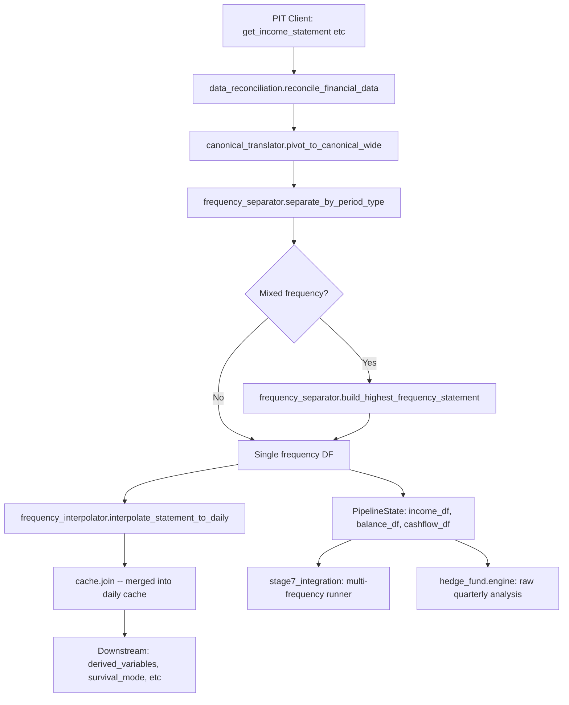

# Frequency Separator: Full Implementation Plan

*2026-05-02 -- Combining upgrade methods, GitHub research, and data flow scan*

## Data Flow Map (from debug scan)



### Pipeline position of frequency_separator

```
main.py execution order:
  Step 3a: PIT client fetches raw statements
  Step 3b: data_reconciliation (field aliases, filing_date validation, dedup)
  Step 3c: canonical_translator.pivot_to_canonical_wide
  Step 3d: >>> frequency_separator <<< (our edit point)
  Step 4:  frequency_interpolator -> daily cache build
  Step 5:  derived_variables, survival_mode, hierarchy_weights
  Step 5j-k: adaptive thresholds/params
  Step 6:  temporal models (stages 3-7)
  Step 7:  profile builder + report
```

### What flows IN to frequency_separator

| Input | Source | Type | Format |
|-------|--------|------|--------|
| `income_df` | PIT client -> reconciliation -> wide pivot | pd.DataFrame | Wide format: columns = canonical field names, rows indexed by report_date. May have `period_type` column from PIT client. |
| `balance_df` | Same pipeline | pd.DataFrame | Same format |
| `cashflow_df` | Same pipeline | pd.DataFrame | Same format |

### What flows OUT from frequency_separator

| Output | Consumer | Type | What it contains |
|--------|----------|------|-----------------|
| Reconciled `income_df` | frequency_interpolator -> daily cache, PipelineState, HF engine, MF runner | pd.DataFrame | Highest-frequency rows with missing columns backfilled from lower frequencies |
| Reconciled `balance_df` | Same consumers | pd.DataFrame | Same |
| Reconciled `cashflow_df` | Same consumers | pd.DataFrame | Same |

### Downstream consumers of the reconciled DFs

1. **`frequency_interpolator.interpolate_statement_to_daily()`** (main.py:966) -- converts periodic rows to daily using stock/flow logic
2. **`PipelineState.income_df/balance_df/cashflow_df`** (main.py:2633) -- stored for stage7 use
3. **`hedge_fund.engine.run_hedge_fund_analysis()`** (stage7:348) -- HF analysis reads raw quarterly DFs directly
4. **`stage7_integration.run_7_4_0_resample_prep()`** (stage7:173) -- multi-frequency resampler builds Q/A/M/W/D caches from raw DFs
5. **`build_cache_from_raw_filings()`** (frequency_resampler.py) -- constructs per-frequency caches directly from raw filings

---

## Implementation Steps

### Step 1: Create config/frequency_separator.yml

```yaml
# Fiscal calendar registry -- market-specific filing patterns
fiscal_calendars:
  us_sec_edgar:
    exchange: XNYS
    common_fy_ends: ["12-31", "09-30", "06-30", "03-31"]
    default_freq: quarterly
    freq_prior: {quarterly: 0.80, semiannual: 0.05, annual: 0.15}
    typical_filing_lag_days: 40
  uk_companies_house:
    exchange: XLON
    common_fy_ends: ["12-31", "03-31", "06-30"]
    default_freq: semiannual
    freq_prior: {quarterly: 0.10, semiannual: 0.50, annual: 0.40}
    typical_filing_lag_days: 120
  jp_jquants:
    exchange: XTKS
    common_fy_ends: ["03-31"]
    default_freq: quarterly
    freq_prior: {quarterly: 0.90, semiannual: 0.05, annual: 0.05}
    typical_filing_lag_days: 45
  kr_dart:
    exchange: XKRX
    common_fy_ends: ["12-31"]
    default_freq: quarterly
    freq_prior: {quarterly: 0.85, semiannual: 0.05, annual: 0.10}
    typical_filing_lag_days: 45
  tw_mops:
    exchange: XTAI
    common_fy_ends: ["12-31"]
    default_freq: quarterly
    freq_prior: {quarterly: 0.85, semiannual: 0.05, annual: 0.10}
    typical_filing_lag_days: 30
  br_cvm:
    exchange: BVMF
    common_fy_ends: ["12-31"]
    default_freq: quarterly
    freq_prior: {quarterly: 0.80, semiannual: 0.05, annual: 0.15}
    typical_filing_lag_days: 60
  eu_esef:
    exchange: XAMS
    common_fy_ends: ["12-31", "06-30"]
    default_freq: annual
    freq_prior: {quarterly: 0.20, semiannual: 0.30, annual: 0.50}
    typical_filing_lag_days: 90
  # ... remaining 18 markets

# Bayesian detection parameters
bayesian_detection:
  gap_std_quarterly: 15       # std dev of quarterly gap in calendar days
  gap_std_semiannual: 25
  gap_std_annual: 40
  gap_mean_quarterly: 90
  gap_mean_semiannual: 180
  gap_mean_annual: 365

# Disaggregation method selection
disaggregation:
  flow_method: chow-lin-opt   # tempdisagg method for flow variables
  stock_method: denton-cholette  # tempdisagg method for stock variables
  fallback_method: fast       # when primary fails

# Reconciliation tolerances
reconciliation:
  sum_tolerance: 0.05         # 5% max deviation Q1+Q2+Q3+Q4 vs annual
  identity_tolerance: 0.01    # 1% for accounting identity checks
  restatement_threshold: 0.10 # 10% change = material restatement flag
```

**Files:** `config/frequency_separator.yml` (NEW)

### Step 2: Amendment deduplication (before separation)

Add to `separate_by_period_type()`:

```python
# Before any frequency detection, deduplicate amendments
if "filing_date" in stmt_df.columns and "report_date" in stmt_df.columns:
    stmt_df = stmt_df.sort_values("filing_date").drop_duplicates(
        subset=["report_date"], keep="last"
    )
```

**Files:** `operator1/clients/frequency_separator.py` (modify `separate_by_period_type`)

### Step 3: Bayesian frequency detection

Replace `_classify_gap()` with Bayesian posterior:

```python
def _bayesian_classify_gaps(
    gaps: list[int],
    market_id: str = "",
) -> list[str]:
    """Classify filing date gaps using Bayesian posterior with market priors."""
    config = _load_freq_config()
    priors = config.get("fiscal_calendars", {}).get(market_id, {}).get(
        "freq_prior", {"quarterly": 0.5, "semiannual": 0.2, "annual": 0.3}
    )
    params = config.get("bayesian_detection", {})
    
    freq_params = {
        "quarterly": (params.get("gap_mean_quarterly", 90), params.get("gap_std_quarterly", 15)),
        "semiannual": (params.get("gap_mean_semiannual", 180), params.get("gap_std_semiannual", 25)),
        "annual": (params.get("gap_mean_annual", 365), params.get("gap_std_annual", 40)),
    }
    
    labels = []
    for gap in gaps:
        posteriors = {}
        for freq, (mu, sigma) in freq_params.items():
            likelihood = np.exp(-0.5 * ((gap - mu) / sigma) ** 2) / (sigma * np.sqrt(2 * np.pi))
            posteriors[freq] = likelihood * priors.get(freq, 0.33)
        total = sum(posteriors.values())
        if total > 0:
            posteriors = {k: v / total for k, v in posteriors.items()}
        labels.append(max(posteriors, key=posteriors.get))
    return labels
```

Add `market_id` parameter to `separate_by_period_type()`.

**Files:** `operator1/clients/frequency_separator.py` (modify `_classify_gap` -> `_bayesian_classify_gaps`, modify `separate_by_period_type` signature)

### Step 4: Chow-Lin temporal disaggregation for flow variables

Replace `_scale_flow_by_revenue_ratio()` with tempdisagg:

```python
def _disaggregate_flow_chow_lin(
    annual_df: pd.DataFrame,
    quarterly_df: pd.DataFrame,
    col: str,
    date_col: str,
) -> pd.DataFrame | None:
    """Disaggregate annual flow variable to quarterly using Chow-Lin."""
    try:
        from tempdisagg import TempDisaggModel
        # ... prepare data in tempdisagg format
        model = TempDisaggModel(
            method=_get_disagg_config("flow_method", "chow-lin-opt"),
            conversion="sum",
        )
        model.fit(prepared_df)
        return model.predict()
    except Exception:
        # Fallback to revenue-ratio scaling
        return _scale_flow_by_revenue_ratio(...)
```

**Files:** `operator1/clients/frequency_separator.py` (replace `_scale_flow_by_revenue_ratio` with Chow-Lin, keep old function as fallback)

### Step 5: Denton-Cholette for stock variables

Replace direct copy with Denton-Cholette benchmarking:

```python
def _benchmark_stock_denton(
    annual_df: pd.DataFrame,
    quarterly_df: pd.DataFrame,
    col: str,
    date_col: str,
) -> pd.DataFrame | None:
    """Benchmark quarterly stock variable against annual using Denton-Cholette."""
    try:
        from tempdisagg import TempDisaggModel
        model = TempDisaggModel(
            method=_get_disagg_config("stock_method", "denton-cholette"),
            conversion="last",  # stock = last value in period
        )
        model.fit(prepared_df)
        return model.predict()
    except Exception:
        return None  # fallback: direct copy (existing behavior)
```

**Files:** `operator1/clients/frequency_separator.py` (add `_benchmark_stock_denton`, wire into `backfill_from_lower_frequency`)

### Step 6: Post-disaggregation reconciliation

Add after `build_highest_frequency_statement()`:

```python
def reconcile_disaggregated(
    result_df: pd.DataFrame,
    freq_groups: dict[str, pd.DataFrame],
    date_col: str = "report_date",
) -> pd.DataFrame:
    """Validate and adjust disaggregated flow variables."""
    config = _load_freq_config().get("reconciliation", {})
    tolerance = config.get("sum_tolerance", 0.05)
    
    annual = freq_groups.get("annual")
    if annual is None or annual.empty:
        return result_df
    
    for col in result_df.columns:
        if classify_variable(col) != "flow":
            continue
        # Sum quarterly values per fiscal year
        # Compare to annual total
        # Pro-rata adjust if deviation > tolerance
    return result_df
```

**Files:** `operator1/clients/frequency_separator.py` (add `reconcile_disaggregated`, call after `build_highest_frequency_statement`)

### Step 7: Vectorize _merge_column

Replace row-by-row iteration with pd.merge_asof:

```python
def _merge_column(target, source, col, date_col):
    """Merge using merge_asof instead of row-by-row iteration."""
    src = source[[date_col, col]].dropna(subset=[col]).copy()
    src[date_col] = pd.to_datetime(src[date_col])
    target = target.copy()
    target[date_col] = pd.to_datetime(target[date_col])
    
    if col not in target.columns:
        target[col] = np.nan
    
    # Only fill where target has NaN
    mask = target[col].isna()
    if not mask.any():
        return target
    
    merged = pd.merge_asof(
        target[mask][[date_col]].sort_values(date_col),
        src.sort_values(date_col),
        on=date_col,
        direction="backward",
    )
    target.loc[mask, col] = merged[col].values
    return target
```

**Files:** `operator1/clients/frequency_separator.py` (replace `_merge_column`)

### Step 8: Wire market_id through the call chain

The Bayesian detection needs `market_id`. Currently `separate_by_period_type` doesn't receive it.

```python
# main.py Step 3d (line 849):
freq_groups = separate_by_period_type(stmt, market_id=market_id)

# backtest_runner.py (line 239):
freq_groups = separate_by_period_type(stmt, market_id=state.market_id)
```

**Files:** `main.py` (line 849), `backtest_runner.py` (line 239), `operator1/clients/frequency_separator.py` (add `market_id` parameter)

### Step 9: Add tempdisagg to requirements

```
# requirements/stage2-ml.txt
tempdisagg>=0.2.13            # Chow-Lin/Denton temporal disaggregation
```

**Files:** `requirements/stage2-ml.txt`, `requirements.txt`

---

## Files to Modify (Summary)

| # | File | Changes |
|---|------|---------|
| 1 | `config/frequency_separator.yml` | NEW -- fiscal calendars, Bayesian params, disagg config, reconciliation tolerances |
| 2 | `operator1/clients/frequency_separator.py` | M1: Bayesian gap classifier. M2: Chow-Lin for flows. M3: Denton-Cholette for stocks. M5: Reconciliation. M7: Amendment dedup. Performance: vectorized merge. Add `market_id` param. |
| 3 | `operator1/estimation/frequency_interpolator.py` | Add `SEMI_FLOW_VARIABLES` for EPS/per-share metrics |
| 4 | `main.py` | Pass `market_id` to `separate_by_period_type()` (line 849) |
| 5 | `backtest_runner.py` | Pass `market_id` to `separate_by_period_type()` (line 239) |
| 6 | `requirements/stage2-ml.txt` | Add `tempdisagg>=0.2.13` |
| 7 | `requirements.txt` | Add `tempdisagg>=0.2.13` |

## Execution Order

```
[ ] Step 1: Create config/frequency_separator.yml
[ ] Step 2: Amendment deduplication
[ ] Step 3: Bayesian frequency detection + market_id wiring
[ ] Step 4: Chow-Lin flow disaggregation
[ ] Step 5: Denton-Cholette stock benchmarking
[ ] Step 6: Post-disaggregation reconciliation
[ ] Step 7: Vectorize _merge_column
[ ] Step 8: Wire market_id in main.py and backtest_runner.py
[ ] Step 9: Add tempdisagg to requirements
[ ] Verify syntax across all modified files
[ ] Push and create PR
```

## Risk Assessment

| Risk | Mitigation |
|------|------------|
| tempdisagg fails on edge cases | Every method has fallback to current behavior (revenue-ratio for flows, direct copy for stocks) |
| Bayesian detection disagrees with period_type column | period_type column (Path 1) always takes priority; Bayesian only used when period_type absent |
| Chow-Lin produces negative values for flow variables | tempdisagg adjuster enforces non-negativity. Also capped by reconciliation step. |
| exchange_calendars missing a market | Fallback to calendar days (current behavior). Config has `gap_std` to handle market-specific variance. |
