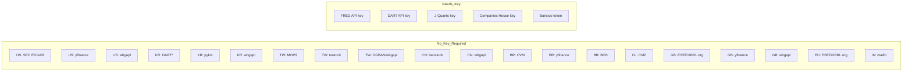
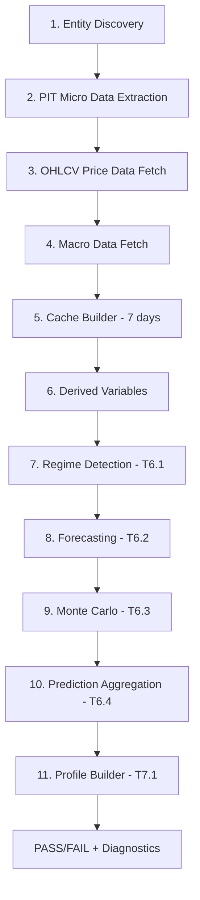

# Full Pipeline Integration Test -- Free-Key Wrappers by Region

## Concept

Run the complete pipeline (data extraction through prediction aggregation) for **one company per region**, using only wrappers that require **no API key**. Each test runs 3 data layers simultaneously:

- **Micro** (PIT filings): financial statements from the region's government API
- **Macro** (economic indicators): from the region's central bank or wbgapi fallback
- **OHLCV** (price data): from the region's primary OHLCV source or yfinance fallback

One week of cache data is sufficient to exercise all pipeline stages without timeouts.

---

## Free-Key Wrapper Audit

*Note: DART works without a key for basic search but needs a key for full filings. We use yfinance as OHLCV fallback where needed.*

---

## Test Groups (3 wrappers each, no API keys needed)

### Group 1: US -- Apple Inc (AAPL)
| Layer | Wrapper | Key Needed | Notes |
|-------|---------|-----------|-------|
| Micro | [`us_edgar.py`](operator1/clients/us_edgar.py) via `us_sec_edgar` market | No | SEC EDGAR XBRL filings |
| Macro | [`macro_wbgapi.py`](operator1/clients/macro_wbgapi.py) via wbgapi fallback | No | World Bank US indicators |
| OHLCV | [`ohlcv_yfinance.py`](operator1/clients/ohlcv_yfinance.py) | No | Yahoo Finance |

### Group 2: South Korea -- Samsung Electronics (005930)
| Layer | Wrapper | Key Needed | Notes |
|-------|---------|-----------|-------|
| Micro | yfinance profile fallback | No | DART needs key for filings |
| Macro | [`macro_wbgapi.py`](operator1/clients/macro_wbgapi.py) via wbgapi fallback | No | World Bank KR indicators |
| OHLCV | [`ohlcv_pykrx.py`](operator1/clients/ohlcv_pykrx.py) | No | KRX direct, no key |

### Group 3: Taiwan -- TSMC (2330)
| Layer | Wrapper | Key Needed | Notes |
|-------|---------|-----------|-------|
| Micro | [`tw_mops_wrapper.py`](operator1/clients/tw_mops_wrapper.py) via `tw_mops` market | No | TWSE MOPS filings |
| Macro | [`macro_dgbas.py`](operator1/clients/macro_dgbas.py) via IMF SDMX fallback | No | DGBAS/IMF, no key path |
| OHLCV | [`ohlcv_twstock.py`](operator1/clients/ohlcv_twstock.py) | No | twstock library, no key |

### Group 4: Brazil -- Petrobras (PETR4)
| Layer | Wrapper | Key Needed | Notes |
|-------|---------|-----------|-------|
| Micro | [`br_cvm_wrapper.py`](operator1/clients/br_cvm_wrapper.py) via `br_cvm` market | No | CVM open data |
| Macro | [`macro_sdmx.py`](operator1/clients/macro_sdmx.py) + BCB fallback | No | BCB SGS API, no key |
| OHLCV | [`ohlcv_yfinance.py`](operator1/clients/ohlcv_yfinance.py) | No | yfinance for PETR4.SA |

### Group 5: UK/EU -- Unilever (ULVR.L)
| Layer | Wrapper | Key Needed | Notes |
|-------|---------|-----------|-------|
| Micro | [`eu_esef_wrapper.py`](operator1/clients/eu_esef_wrapper.py) via XBRL.org | No | ESEF filings via filings.xbrl.org |
| Macro | [`macro_sdmx.py`](operator1/clients/macro_sdmx.py) via ECB SDMX | No | ECB SDMX, no key |
| OHLCV | [`ohlcv_yfinance.py`](operator1/clients/ohlcv_yfinance.py) | No | yfinance for ULVR.L |

### Group 6: China -- Kweichow Moutai (600519)
| Layer | Wrapper | Key Needed | Notes |
|-------|---------|-----------|-------|
| Micro | yfinance profile fallback | No | SSE scraping is fragile; yfinance as fallback |
| Macro | [`macro_wbgapi.py`](operator1/clients/macro_wbgapi.py) | No | World Bank CN indicators |
| OHLCV | [`ohlcv_baostock.py`](operator1/clients/ohlcv_baostock.py) | No | baostock, no key, works globally |

### Group 7: India -- Reliance Industries (RELIANCE)
| Layer | Wrapper | Key Needed | Notes |
|-------|---------|-----------|-------|
| Micro | yfinance profile fallback | No | BSE scraping needs no key but is fragile |
| Macro | [`macro_wbgapi.py`](operator1/clients/macro_wbgapi.py) | No | World Bank IN indicators |
| OHLCV | [`ohlcv_nselib.py`](operator1/clients/ohlcv_nselib.py) | No | nselib, no key |

### Group 8: Chile -- SQM (SQM-B)
| Layer | Wrapper | Key Needed | Notes |
|-------|---------|-----------|-------|
| Micro | [`cl_cmf_wrapper.py`](operator1/clients/cl_cmf_wrapper.py) via `cl_cmf` market | No | CMF open data |
| Macro | [`macro_wbgapi.py`](operator1/clients/macro_wbgapi.py) | No | World Bank CL indicators |
| OHLCV | [`ohlcv_yfinance.py`](operator1/clients/ohlcv_yfinance.py) | No | yfinance for SQM |

---

## Pipeline Stages Exercised Per Test

Each group test runs these stages in order:

## Test Structure

A single test file `tests/test_full_pipeline_live.py` with:

- One test class per group: `TestUSPipeline`, `TestKRPipeline`, etc.
- Each class has a `setUp` that limits data to 7 calendar days
- Each test method validates one pipeline stage
- A final `test_end_to_end` method runs all stages sequentially and asserts:
  - Cache has >0 rows
  - Predictions are non-empty
  - No unhandled exceptions
  - Profile JSON is valid

### Timeouts and Skip Logic

- Each test has a 60-second timeout per API call
- If a wrapper is unreachable (network/geo-blocking), the test is **skipped** (not failed)
- Tests are marked `@unittest.skipIf(not NETWORK_AVAILABLE)` for CI without internet

### Expected Outcomes

| Group | Micro | Macro | OHLCV | Aggregator |
|-------|-------|-------|-------|------------|
| US AAPL | EDGAR filings | wbgapi GDP/CPI | yfinance OHLCV | Full predictions |
| KR Samsung | yfinance fallback | wbgapi KR | pykrx OHLCV | Full predictions |
| TW TSMC | MOPS filings | DGBAS/IMF | twstock OHLCV | Full predictions |
| BR Petrobras | CVM filings | BCB macro | yfinance OHLCV | Full predictions |
| UK Unilever | ESEF/XBRL | ECB SDMX | yfinance OHLCV | Full predictions |
| CN Moutai | yfinance fallback | wbgapi CN | baostock OHLCV | Full predictions |
| IN Reliance | yfinance fallback | wbgapi IN | nselib OHLCV | Full predictions |
| CL SQM | CMF filings | wbgapi CL | yfinance OHLCV | Full predictions |

---

## Implementation Plan

1. Create `tests/test_full_pipeline_live.py` with shared helpers for 7-day cache building
2. Implement Group 1 (US) first as the template -- this is the most stable wrapper
3. Add Groups 2-8 following the same pattern
4. Each test calls the real wrapper APIs (live network calls)
5. Mark all tests with `@pytest.mark.live` so they can be excluded from CI
6. Add a `conftest.py` fixture for network availability detection
7. Run all groups, collect results, report which wrappers worked/failed
