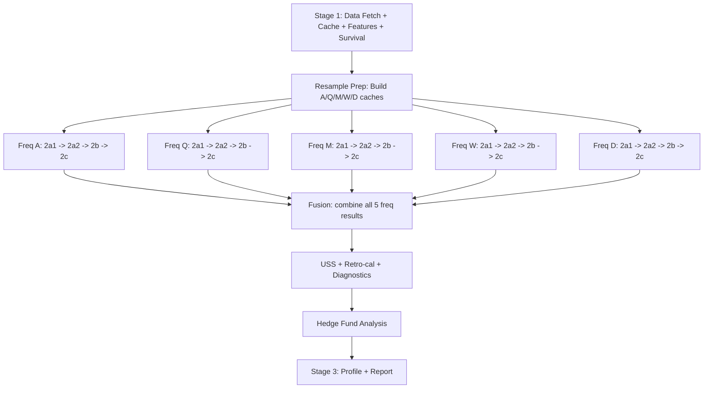

# Full-Pipeline Per-Frequency Architecture

## Current Flow (sequential, single frequency)

```
Stage 1:     Data fetch + cache build + features + survival + linked entities
Stage 2a1:   Regime + causality + patterns
Stage 2a2:   Forecasting (Kalman + GARCH + VAR + LSTM + Tree + ETS)
Stage 2b:    Forward pass + walk-forward + Monte Carlo
Stage 2c:    Ensemble + aggregation + SHAP + Sobol + OHLC
Stage 2d:    USS + retro-cal + diagnostics + multi-freq + HF
Stage 3:     Profile + report
```

## New Flow (per-frequency fan-out with shared prefix)



### Key Principles

1. **Stage 1 runs ONCE** -- data fetch, cache build, features, survival, linked entities are the same regardless of frequency. Save checkpoint after Stage 1. All frequencies load from this shared checkpoint.

2. **Resample Prep runs ONCE** -- builds 5 ResampledCache objects from the shared Stage 1 cache. Each saved as parquet. Already implemented.

3. **Stages 2a-2c fan out per frequency** -- each frequency independently runs:
   - 2a1: Regime detection + causality + patterns
   - 2a2: Forecasting (full model cascade)
   - 2b: Forward pass + walk-forward + Monte Carlo
   - 2c: Ensemble + aggregation + SHAP + Sobol + OHLC predictor
   
   Each frequency saves its own `BacktestState` to `{run_dir}/mf/{freq}/` so results persist between calls.

4. **Fusion runs ONCE** after all 5 frequencies complete -- loads results from all `{run_dir}/mf/{freq}/` directories, combines forecasts, regimes, survival probabilities, MC results.

5. **USS + Retro-cal + Diagnostics run ONCE** after fusion (they need the fused view).

6. **HF runs ONCE** after fusion + USS -- it needs the fused multi-freq result for DCF bounds and the daily cache for statement data.

7. **Stage 3 runs ONCE** -- builds profile from all results.

### CLI Commands

```bash
# Stage 1 (shared, run once)
python backtest_runner.py --stage 1 --market us_sec_edgar --company AAPL --end-date 2024-12-31

# Resample prep (run once)
python backtest_runner.py --stage mf.prep --run-dir cache/backtest_AAPL_2024-12-31

# Per-frequency full temporal pipeline (each can be a separate call)
python backtest_runner.py --stage mf.A --run-dir cache/backtest_AAPL_2024-12-31
python backtest_runner.py --stage mf.Q --run-dir cache/backtest_AAPL_2024-12-31
python backtest_runner.py --stage mf.M --run-dir cache/backtest_AAPL_2024-12-31
python backtest_runner.py --stage mf.W --run-dir cache/backtest_AAPL_2024-12-31
python backtest_runner.py --stage mf.D --run-dir cache/backtest_AAPL_2024-12-31

# Fusion + USS + HF + Profile (run once after all freqs complete)
python backtest_runner.py --stage mf.fuse --run-dir cache/backtest_AAPL_2024-12-31
python backtest_runner.py --stage 3 --run-dir cache/backtest_AAPL_2024-12-31

# Or run everything:
python backtest_runner.py --stage all --market us_sec_edgar --company AAPL --end-date 2024-12-31
```

### Per-Frequency Temporal Pipeline Detail

When `--stage mf.A` runs, it:
1. Loads Stage 1 checkpoint (`state_1.pkl`, `cache.parquet`)
2. Loads `A_cache.parquet` from `mf/` (resampled Annual cache)
3. Replaces `state.cache` with the Annual resampled cache
4. Runs `run_stage2a1(state)` -- regime + causality + patterns
5. Runs `run_stage2a2(state)` -- forecasting with ETS
6. Runs `run_stage2b(state)` -- forward pass + walk-forward + MC
7. Runs `run_stage2c(state)` -- ensemble + aggregation
8. Saves full state to `{run_dir}/mf/A/state_2c.pkl`

The existing stage functions (`run_stage2a1`, `run_stage2a2`, `run_stage2b`, `run_stage2c`) work unchanged -- they operate on whatever `state.cache` contains. The only change is that `state.cache` is the resampled cache instead of the daily cache.

### What Changes vs Current Implementation

The current per-frequency sub-stage implementation (7.4.x) runs a lightweight mini-pipeline per frequency. The new architecture runs the FULL temporal pipeline (2a-2c) per frequency. Differences:

| Aspect | Current 7.4.x | New mf.X |
|--------|---------------|----------|
| Models per freq | derived vars + survival + regime + forecast + MC | ALL: regime + causality + patterns + forecasting + forward pass + walk-forward + MC + ensemble + SHAP + Sobol + GA + OHLC |
| HF per freq | No | No -- HF runs once after fusion |
| State per freq | FrequencyResult pickle | Full BacktestState with all model results |
| Fusion input | 5 FrequencyResult summaries | 5 full BacktestState objects with all model outputs |
| Duration per freq | 0.2s to 90s | 30s to 180s |

### Disk Layout

```
{run_dir}/
  cache.parquet              # Stage 1 daily cache (shared)
  state_1.pkl                # Stage 1 state (shared)
  mf/
    frequencies.json         # Ordered list of frequencies
    A_cache.parquet          # Resampled annual cache
    Q_cache.parquet          # Resampled quarterly cache
    ...
    A/                       # Full per-frequency state
      cache.parquet          # Annual cache (after temporal models modified it)
      state_2a1.pkl
      state_2a2.pkl
      state_2b.pkl
      state_2c.pkl           # Final temporal state for this frequency
    Q/
      cache.parquet
      state_2c.pkl
    M/
      ...
    W/
      ...
    D/
      ...
    fused_result.pkl         # FusedMultiFreqResult
  state_fused.pkl            # State after fusion + USS + HF
  company_profile.json       # Stage 3 output
```

### Implementation Steps

- [ ] Create `_run_mf_full_freq(state, freq)` that loads the freq cache, runs 2a1->2a2->2b->2c, saves to `mf/{freq}/`
- [ ] Create `_run_mf_full_fuse(state)` that loads all freq states, extracts results, fuses, then runs USS + diagnostics + HF
- [ ] Add dispatch entries: `mf.prep`, `mf.A`, `mf.Q`, `mf.M`, `mf.W`, `mf.D`, `mf.fuse`
- [ ] Update `--stage all` to use the new flow: `1 -> mf.prep -> mf.A -> mf.Q -> mf.M -> mf.W -> mf.D -> mf.fuse -> 3`
- [ ] Keep backward compat: `--stage 2d` still works using the old monolithic path
- [ ] Test each frequency independently
