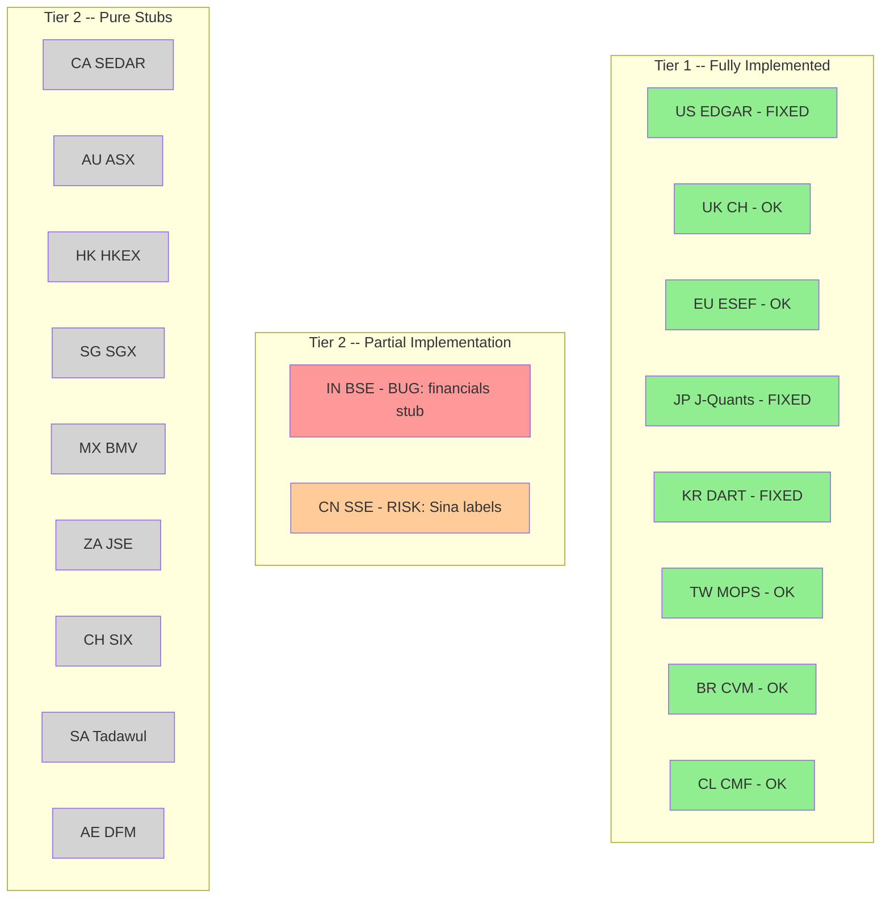
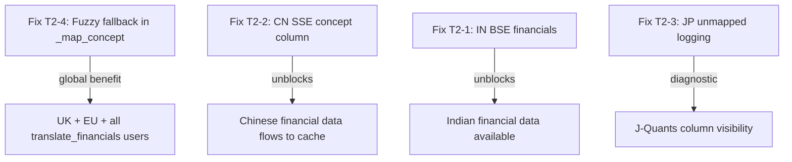

# Full Wrapper Audit Fix Plan -- All Tiers

Comprehensive fix plan for all 19 PIT wrapper clients covering Tier 1 and Tier 2 markets.
Based on SEC EDGAR problem pattern analysis applied systematically to every wrapper.

---

## Current State Summary



---

## Already Fixed in PR #2

| Fix | File | Description |
|-----|------|-------------|
| US EDGAR fuzzy fallback | `us_edgar.py` | Expanded balance sheet label mappings + substring fallback + LLM concept resolver + unmapped concept logging |
| US EDGAR deprecated endpoint | `us_edgar.py` | Replaced CGI browse-edgar with EFTS search API |
| JP J-Quants cashflow names | `jp_jquants_wrapper.py` | `operating_cashflow` -> `operating_cash_flow`, `investing_cashflow` -> `investing_cf`, `financing_cashflow` -> `financing_cf` |
| JP J-Quants balance map | `jp_jquants_wrapper.py` | Expanded from 4 to 7 fields, added `total_liabilities`, `current_assets`, `current_liabilities` |
| JP J-Quants derived fields | `jp_jquants_wrapper.py` | Derive `total_liabilities` from `total_assets - total_equity` |
| KR DART fuzzy matching | `kr_dart_wrapper.py` | Normalized matching for Korean label variations |
| Global unmapped logging | `canonical_translator.py` | Logs dropped concepts for all wrappers using `translate_financials` |

---

## Remaining Fixes Needed

### Fix T2-1: India BSE Financial Statement Implementation -- CRITICAL

**File:** `operator1/clients/in_bse.py` lines 168-178
**Problem:** All three financial statement methods are stubs returning empty DataFrames. The BSE India API has financial data endpoints (`/BseIndiaAPI/api/StockReach/FinancialResult/CompanyResults`) and the wrapper docstring acknowledges BSE API as a data source, but the implementation was never added.
**Impact:** ALL Indian companies analyzed get zero financial data -- only OHLCV prices.

**Fix approach:**
1. Implement `_fetch_financials()` method using the BSE India API endpoint:
   - URL: `https://api.bseindia.com/BseIndiaAPI/api/StockReach/FinancialResult/CompanyResults`
   - Parameters: `Ession_Flag` for statement type, `ScrpCode` for company
   - Returns JSON with financial line items
2. Map BSE India financial field names to canonical format
3. Pass through `translate_financials()` with market_id `in_bse` -- the canonical_translator already has `_IFRS_MAP` registered for India (Ind AS is IFRS-converged)
4. Add `filing_date` and `report_date` columns from the BSE response dates
5. Wire `get_income_statement`, `get_balance_sheet`, `get_cashflow_statement` to call `_fetch_financials` with the appropriate statement type

**Alternative approach:** If BSE API financial data is unreliable or blocked, use the LLM Filing Extractor with BSE announcement PDFs (the filing discoverer pattern from the feature branch).

### Fix T2-2: China SSE Concept Column Mapping Verification -- HIGH

**File:** `operator1/clients/cn_sse.py` lines 190-231
**Problem:** The wrapper uses `ak.stock_financial_report_sina()` which returns a DataFrame with Chinese column names from Sina Finance. These go through `translate_financials()` using `_CAS_MAP`. But:
1. The Sina Finance API returns data in a transposed format where row labels are concept names
2. The code at line 220-228 normalizes `report_date` but does NOT create a `concept` column -- it passes the DataFrame directly to `translate_financials()` which expects a `concept` column for mapping
3. Without a `concept` column, line 694-696 in `translate_financials` skips the mapping entirely, and the Chinese column names pass through unmapped

**Fix approach:**
1. After fetching from akshare, melt/unpivot the wide-format DataFrame into long format with a `concept` column containing the Chinese field names
2. The `_CAS_MAP` in canonical_translator already has the correct Chinese mappings (`营业收入` -> `revenue`, `流动资产合计` -> `current_assets`, etc.)
3. Add the concept column creation step before calling `translate_financials`

### Fix T2-3: JP J-Quants Unmapped Column Logging -- MEDIUM

**File:** `operator1/clients/jp_jquants_wrapper.py`
**Problem:** J-Quants uses inline `_V2_*_MAP` dicts and does NOT call `translate_financials()`. So the global unmapped concept logging fix doesn't benefit this wrapper. J-Quants V2 API columns not in the inline maps are silently ignored.

**Fix approach:**
Add logging after the mapping loop to report which J-Quants columns were not mapped:
```python
# After the balance mapping loop, log unmapped columns
_mapped_cols = set(_V2_BALANCE_MAP.keys())
_available_cols = set(df_annual.columns) - {"Code", "LocalCode", "Date", ...}
_unmapped = _available_cols - _mapped_cols
if _unmapped:
    logger.debug("J-Quants unmapped balance columns: %s", list(_unmapped)[:20])
```

### Fix T2-4: UK CH / EU ESEF Fuzzy Fallback -- MEDIUM

**Files:** `operator1/clients/uk_ch_wrapper.py`, `operator1/clients/eu_esef_wrapper.py`
**Problem:** Both rely on exact-match concept maps. UK iXBRL tags can vary between FRS102 and full UK-GAAP; EU IFRS tags can have namespace prefix variations.

**Fix approach:**
Both wrappers pass data through `translate_financials()` which uses `_map_concept()`. The fix should be in `_map_concept()` itself (in canonical_translator.py) to add a fuzzy fallback:

```python
def _map_concept(concept: str, concept_map: dict) -> str:
    # Exact match
    if concept in concept_map:
        return concept_map[concept]
    # Strip namespace prefix for IFRS/GAAP tags
    # e.g., "ifrs-full:Revenue" -> "Revenue"
    if ":" in concept:
        bare = concept.split(":", 1)[1]
        if bare in concept_map:
            return concept_map[bare]
    # Lowercase match
    concept_lower = concept.lower()
    for key, val in concept_map.items():
        if key.lower() == concept_lower:
            return val
    return ""
```

This is a single fix in `canonical_translator.py` that benefits UK CH, EU ESEF, and all other wrappers that use `translate_financials()`.

### Fix T2-5: 9 Tier 2 Stub Wrappers -- LOW PRIORITY

**Files:** ca_sedar.py, au_asx.py, hk_hkex.py, sg_sgx.py, mx_bmv.py, za_jse.py, ch_six.py, sa_tadawul.py, ae_dfm.py

**Problem:** All financial statement methods return empty DataFrames. These are placeholder implementations.

**Assessment:** These are Tier 2 / Phase 2 markets that were planned but not yet implemented. Each would need:
1. Research into the local filing API or data source
2. Implementation of financial statement fetching
3. Concept mapping to canonical format
4. Testing with real company data

**Recommended prioritization by market cap:**
1. HK HKEX (~$4.5T) -- could use HKEX IXBRL filings + IFRS map
2. CA SEDAR (~$3T) -- SEDAR+ has XBRL filings
3. AU ASX (~$1.8T) -- ASX announcements with filing discoverer
4. SG SGX (~$600B), MX BMV (~$600B), ZA JSE (~$400B), CH SIX (~$2T), SA Tadawul (~$2.5T), AE DFM (~$200B)

**For now:** These are known limitations, not bugs. The pipeline handles empty financial statements gracefully -- it just means these markets only get OHLCV-based analysis.

---

## Execution Priority



**Priority order:**
1. **Fix T2-4** -- global fuzzy fallback in `_map_concept()` (single function, benefits all wrappers)
2. **Fix T2-2** -- China SSE concept column creation (unblocks $10T market)
3. **Fix T2-1** -- India BSE financial statements (unblocks $4T market)
4. **Fix T2-3** -- J-Quants unmapped column logging (diagnostic improvement)
5. **Fix T2-5** -- Stub wrapper implementations (future work, not urgent)
