# Hedge Fund Normal Analysis Pipeline

*Parallel analytical track running alongside the existing 50-module pipeline*
*Version 3 -- Added data window specifications and raw-vs-cache source distinction*

## Design Principle

The current pipeline answers: **"What state is this company in, and will it survive?"**
The HF pipeline answers: **"Can I make money on this, when, and how much?"**

Both share the same PIT data, cache, linked entities, and multi-frequency results. They run in parallel.

---

## Critical Data Source Distinction

The HF modules consume data from **three different granularities**, and it matters which one each module uses:

| Source | Granularity | Rows | What it is | Best for |
|--------|------------|------|------------|----------|
| **Raw statement DFs** | Per-filing period | 8-24 rows | `income_df`, `balance_df`, `cashflow_df` from Step 3. One row per quarterly/semi-annual/annual filing with real `report_date` and `filing_date`. | Q/Q changes, 8Q rolling, payout ratios, Modified Jones regression -- anything that needs actual filing-period values |
| **Daily cache** | Daily business days | 504+ rows | Forward-filled OHLCV + statements + derived variables + survival flags. | Price-based signals, PEAD decay, technical indicators, daily volatility |
| **Multi-freq caches** | Per-frequency period | Varies | Resampled caches from `multi_frequency_runner` (A=8pts, Q=24pts, M=60pts, W=156pts, D=504pts) with per-frequency regime/survival/forecast results. | Cross-frequency validation, horizon-matched forecasts |

**The key design decision:** Most HF Tier 1-3 modules should read from **raw statement DFs** (actual filing values, not forward-filled) for their core computations, and only touch the daily cache for price-related signals. This avoids the false precision of computing "Q/Q revenue change" from 63 identical daily values that are just forward-fills of the same quarterly number.

---

## Per-Module Data Window and Source Specification

### HF Tier 1: Earnings Forensics

#### HF-1.1 FCF Quality Scoring (`fcf_quality.py`, ~200 lines)

| Data Need | Source | Window | Why this source |
|-----------|--------|--------|-----------------|
| OCF per quarter | **Raw** `cashflow_df["operating_cash_flow"]` | Last 8 filings (~2yr) | Need actual quarterly OCF, not daily forward-fill |
| NI per quarter | **Raw** `income_df["net_income"]` | Last 8 filings | Need actual quarterly NI |
| CapEx per quarter | **Raw** `cashflow_df["capex"]` | Last 8 filings | Need actual quarterly capex for volatility |
| Accruals (daily) | **Cache** `accruals` | Latest value only | Already computed in derived_variables |
| Multi-freq Q context | **MF** `results["Q"]` | Summary only | Regime at quarterly timescale |
| Multi-freq A context | **MF** `results["A"]` | Summary only | Secular FCF trend direction |

**Data window:** 8 quarterly filings (from raw DFs). No need for 504 daily rows.

---

#### HF-1.2 Accruals Forensics (`accruals_forensics.py`, ~350 lines)

| Data Need | Source | Window | Why this source |
|-----------|--------|--------|-----------------|
| Sloan accruals | **Cache** `accruals` | Latest value | Already computed |
| Receivables per period | **Raw** `balance_df["receivables"]` | Last 8 filings | For Modified Jones regression |
| Total assets per period | **Raw** `balance_df["total_assets"]` | Last 8 filings + 1 lag | For Modified Jones normalization |
| Revenue per period | **Raw** `income_df["revenue"]` | Last 8 filings | For CCE computation |
| COGS per period | **Raw** `income_df["cost_of_revenue"]` | Last 8 filings | For CCE denominator |
| NI per period | **Raw** `income_df["net_income"]` | Last 8 filings | For NI-OCF divergence |
| OCF per period | **Raw** `cashflow_df["operating_cash_flow"]` | Last 8 filings | For NI-OCF divergence |
| Multi-freq A | **MF** `results["A"]` | 5+ annual points | Modified Jones regression needs annual data |

**Data window:** 8 quarterly filings + 5 annual data points (from raw DFs and MF annual cache).
**Modified Jones fallback:** If <5 annual points, skip Jones model, redistribute weight to Sloan.

---

#### HF-1.3 Earnings Smoothing (`earnings_smoothing.py`, ~300 lines)

| Data Need | Source | Window | Why this source |
|-----------|--------|--------|-----------------|
| Beneish M-Score | **fh_result** `.beneish_m_score` | Latest | Already computed |
| Revenue (raw quarterly) | **Raw** `income_df["revenue"]` | All available (for Benford) | Need actual reported figures, not forward-fill |
| NI volatility | **Raw** `income_df["net_income"]` | Last 8 filings | Q/Q variance of actual filings |
| OCF volatility | **Raw** `cashflow_df["operating_cash_flow"]` | Last 8 filings | Q/Q variance |
| EPS sequential | **Raw** `income_df["eps"]` | Last 8 filings | For surprise pattern |
| Abnormal return | **Cache** `return_1d` | 3 days around each filing_date | Price reaction to earnings |
| Filing dates | **Raw** `income_df["filing_date"]` | All | To identify earnings dates |

**Data window:** All available raw filings for Benford (need 30+ data points); last 8 filings for volatility/patterns.
**Benford fallback:** If <30 annual revenue values, skip Benford, redistribute weight.

---

### HF Tier 2: Cash Flow Stress Test

#### HF-2.1 Dividend Burn Risk (`dividend_burn.py`, ~200 lines)

| Data Need | Source | Window | Why this source |
|-----------|--------|--------|-----------------|
| Dividends paid | **Raw** `cashflow_df["dividends_paid"]` | Last 8 filings | Actual quarterly dividend payments |
| FCF per period | **Raw** computed: `OCF - abs(capex)` | Last 8 filings | Actual quarterly FCF, not TTM |
| Interest expense | **Raw** `income_df["interest_expense"]` | Last 8 filings | Actual quarterly debt service |
| Working capital | **Raw** `balance_df["current_assets"] - balance_df["current_liabilities"]` | Last 8 filings | WC trend at filing frequency |
| Buybacks | **Raw** `cashflow_df["stock_buybacks"]` | Last 8 filings | Optional -- total shareholder return |
| NI volatility | **Raw** `income_df["net_income"]` | Last 8 filings | Earnings vol penalty |

**Data window:** 8 quarterly filings from raw DFs.

---

#### HF-2.2 CROA vs ROIC Spread (`return_spread.py`, ~180 lines)

| Data Need | Source | Window | Why this source |
|-----------|--------|--------|-----------------|
| OCF, total_assets | **Raw** `cashflow_df`, `balance_df` | Last 8 filings | CROA per filing period |
| EBIT | **Raw** `income_df["ebit"]` | Last 8 filings | For NOPAT |
| Equity, debt, cash | **Raw** `balance_df` | Last 8 filings | For invested capital |
| Tax rate | **Raw** `income_df["taxes"] / income_df["ebit"]` | Last 4 filings | Implied tax rate |

**Data window:** 8 quarterly filings from raw DFs.

---

#### HF-2.3 Operating Leverage (`operating_leverage.py`, ~250 lines)

| Data Need | Source | Window | Why this source |
|-----------|--------|--------|-----------------|
| Revenue per period | **Raw** `income_df["revenue"]` | Last 8 filings | Q/Q change for DOL |
| EBIT per period | **Raw** `income_df["ebit"]` | Last 8 filings | Q/Q change for DOL |
| EPS per period | **Raw** `income_df["eps"]` | Last 8 filings | Q/Q change for DFL |
| Interest expense | **Raw** `income_df["interest_expense"]` | Last 8 filings | For DFL denominator |

**Data window:** 8 quarterly filings from raw DFs. DOL = (%delta EBIT) / (%delta Revenue) requires filing-period values.

---

### HF Tier 3: Balance Sheet Risk

#### HF-3.1 Off-Balance-Sheet Risk (`obs_risk.py`, ~300 lines)

| Data Need | Source | Window | Why this source |
|-----------|--------|--------|-----------------|
| Total assets, equity | **Raw** `balance_df` | Last 4 filings | For ratio normalization |
| Revenue | **Raw** `income_df["revenue"]` | Last 4 filings | For related-party normalization |
| Goodwill, intangibles | **Raw** `balance_df` | Last 8 filings | For impairment risk + delta tracking |
| Filing text | LLM extractor cache (if available) | Latest annual | Keyword scanning for OBS terms |

**Data window:** 4-8 filings from raw DFs + optional filing text.

---

#### HF-3.2 Asset Quality (`asset_quality.py`, ~250 lines)

| Data Need | Source | Window | Why this source |
|-----------|--------|--------|-----------------|
| Receivables | **Raw** `balance_df["receivables"]` | Last 8 filings | For DSO Q/Q delta |
| Revenue | **Raw** `income_df["revenue"]` | Last 8 filings | DSO denominator |
| Inventory | **Raw** `balance_df["inventory"]` | Last 8 filings | For inventory days |
| COGS | **Raw** `income_df["cost_of_revenue"]` | Last 8 filings | Inventory days denominator |
| CapEx | **Raw** `cashflow_df["capex"]` | Last 8 filings | Capitalization ratio |

**Data window:** 8 quarterly filings from raw DFs. All computations are Q/Q deltas.

---

#### HF-3.3 Leverage Stress (`leverage_stress.py`, ~400 lines)

| Data Need | Source | Window | Why this source |
|-----------|--------|--------|-----------------|
| Total debt, EBITDA | **Raw** `balance_df`, `income_df` | Latest filing | Current leverage for base case |
| EBIT, interest_expense | **Raw** `income_df` | Latest filing | Current coverage |
| Revenue, margins | **Raw** `income_df` | Last 4 filings | For stress scenario construction |
| MC regime distributions | **mc_result** | N/A | Probability-weighted scenarios |
| USS scenario result | **scenario_result** | N/A | Cross-validation with existing scenarios |
| Interest rate | **macro_data** | Latest | Refinancing cost estimation |
| Multi-freq A context | **MF** `results["A"]` | Summary | 5Y EBITDA trend for recovery |

**Data window:** Latest filing + last 4 filings for trend. MC and scenario results from Step 6.

---

### HF Tier 4: Inflection Detection

#### HF-4.1 Momentum Composite (`momentum_composite.py`, ~250 lines)

| Data Need | Source | Window | Why this source |
|-----------|--------|--------|-----------------|
| Revenue per period | **Raw** `income_df["revenue"]` | Last 8 filings | 4Q rolling acceleration (2nd derivative) |
| Net margin per period | **Raw** `income_df["net_margin"]` or computed | Last 8 filings | 8Q slope |
| OCF per period | **Raw** `cashflow_df["operating_cash_flow"]` | Last 8 filings | FCF conversion trend |
| ROIC components | **Raw** `income_df`, `balance_df` | Last 4 filings | ROIC trajectory |
| Daily returns | **Cache** `return_5d`, `return_21d` | Last 63 days | Daily momentum for divergence check |
| Multi-freq W context | **MF** `results["W"]` | Summary | Weekly trend direction |

**Data window:** 8 quarterly filings + 63 daily cache rows for price momentum.

---

#### HF-4.2 Growth Quality (`growth_quality.py`, ~300 lines)

| Data Need | Source | Window | Why this source |
|-----------|--------|--------|-----------------|
| Revenue per period | **Raw** `income_df["revenue"]` | Last 8 filings | Total growth rate |
| Goodwill per period | **Raw** `balance_df["goodwill"]` | Last 8 filings | M&A detection (goodwill jump = acquisition) |
| Intangibles per period | **Raw** `balance_df["intangible_assets"]` | Last 8 filings | M&A supplement |
| Margins per period | **Raw** `income_df` | Last 8 filings | Margin-adjusted growth |
| ROIC components | **Raw** `income_df`, `balance_df` | Last 4 filings | Incremental ROIC on new capital |

**Data window:** 8 quarterly filings from raw DFs.

---

#### HF-4.3 Earnings Surprise Probability (`earnings_surprise.py`, ~350 lines)

| Data Need | Source | Window | Why this source |
|-----------|--------|--------|-----------------|
| SUE score | **Cache** `sue_score` | Latest value | Already computed in derived_variables |
| PEAD signal | **Cache** `pead_signal` | Latest value | Already computed |
| EPS per period | **Raw** `income_df["eps"]` | Last 8 filings | Historical surprise distribution |
| Filing calendar | **filing_calendar_result** | N/A | Next expected filing date, days until |
| Sentiment | **sentiment_result** | N/A | Pre-earnings sentiment direction |
| DOL | **HF-2.3 result** | N/A | Earnings sensitivity to revenue |
| Daily returns near filings | **Cache** `return_1d` | 10 days around each filing_date | Pre-earnings drift pattern |
| Multi-freq W context | **MF** `results["W"]` | Summary | Weekly sentiment drift |

**Data window:** 8 quarterly filings + 10-day daily windows around filing dates.

---

### HF Tier 5: Valuation Engine

#### HF-5.1 DCF Monte Carlo (`dcf_valuation.py`, ~400 lines)

| Data Need | Source | Window | Why this source |
|-----------|--------|--------|-----------------|
| FCF (latest annual) | **Raw** or cache TTM | Latest | Base FCF for projection |
| Total debt, cash | **Raw** `balance_df` | Latest filing | Net debt for equity bridge |
| Shares outstanding | **Cache** or **target_profile** | Latest | Per-share intrinsic value |
| Close price | **Cache** `close` | Latest | For comparison to intrinsic |
| MC regime distributions | **mc_result** | N/A | Growth distribution per regime |
| FCF growth forecast | **forecast_result** | N/A | Near-term growth rate |
| Interest rate | **macro_data** | Latest | WACC estimation |
| Multi-freq A context | **MF** `results["A"]` | Forecast bounds | Terminal growth rate constraint |
| Multi-freq Q context | **MF** `results["Q"]` | Forecast summary | Near-term FCF trajectory |

**Data window:** Latest filing values + upstream model results. No need for historical daily cache.

---

#### HF-5.2 Valuation-Quality Matrix (`valuation_quality.py`, ~250 lines)

| Data Need | Source | Window | Why this source |
|-----------|--------|--------|-----------------|
| All HF T1-T3 scores | **HF module results** | N/A | Quality composite |
| PE ratio | **Cache** `pe_ratio_calc` | Latest | Current valuation |
| EV/EBITDA | **Cache** `ev_to_ebitda` | Latest | Current valuation |
| Peer PE ranking | **peer_ranking_result** | N/A | Relative valuation vs sector |

**Data window:** Latest values only. Pure synthesis of upstream scores.

---

#### HF-5.3 PEG Composite (`peg_composite.py`, ~150 lines)

| Data Need | Source | Window | Why this source |
|-----------|--------|--------|-----------------|
| PE ratio | **Cache** `pe_ratio_calc` | Latest | |
| Revenue growth | **Raw** `income_df["revenue"]` | Last 4 filings | Y/Y growth rate |
| FCF yield | **Cache** `fcf_yield` | Latest | |
| Debt cost | **Raw** `interest_expense / total_debt` | Latest filing | Implied cost of debt |
| Quality score | **HF-5.2 result** | N/A | Quality multiplier |

**Data window:** Latest values + 4 filings for growth rate.

---

### HF Integration Layer

#### HF-6.1 Multi-Frequency Fusion (`hf_frequency_fusion.py`, ~300 lines)

| Data Need | Source | Window |
|-----------|--------|--------|
| All 15 HF metric results | HF-1.x through HF-5.x | N/A |
| multi_frequency_result | Step 6.7 | All 5 frequency results |
| signal_ic_result | Step 5j.5 | IC per signal for weighting |
| filing_calendar_result | Step 4c | Filing frequency for anchoring |

**Per-metric natural frequency assignment:**
```
Metric                   Primary Freq    Data Points Needed
----                     -----------     ------------------
FCF Quality              Q               8 quarterly filings
Accruals Forensics       Q + A           8 quarterly + 5 annual
Earnings Smoothing       A               5+ annual for Benford
Dividend Burn            Q               8 quarterly filings
CROA vs ROIC             Q               8 quarterly filings
Operating Leverage       Q               8 quarterly filings
OBS Risk                 A               Latest annual + 4Q delta
Asset Quality            Q               8 quarterly filings
Leverage Stress          Q + W           Latest filing + weekly rates
Momentum                 Q + M           8 quarterly + 60 monthly
Growth Quality           Q + A           8 quarterly + annual M&A
Earnings Surprise        Q + W           8Q historical + weekly drift
DCF Valuation            A + Q           Annual terminal + quarterly FCF
Quality-Value Matrix     Q + W           Quarterly quality + weekly IC
PEG Composite            Q               Latest quarterly
```

---

#### HF-6.2 Thesis Scorecard (`thesis_scorecard.py`, ~400 lines)

No data access -- pure synthesis of all HF metric results.

---

#### HF-6.3 Position Signal (`position_signal.py`, ~300 lines)

| Data Need | Source | Window |
|-----------|--------|--------|
| Thesis scorecard | HF-6.2 | N/A |
| signal_ic_result | Step 5j.5 | IC-weighted alpha |
| survival_controller | Step 5-USS | Survival multiplier + recovery |
| filing_calendar_result | Step 4c | Filing freshness decay |
| forecast_result | Step 6h | return_5d forecast |
| Close price | **Cache** `close` | Latest + recent 63d for levels |

**Data window from cache:** 63 daily rows for support/resistance levels (entry/stop/target).

---

## Summary: Data Window Requirements

| Module Category | Primary Data Source | Window Needed | Cache Rows Needed |
|----------------|-------------------|---------------|-------------------|
| **Tier 1 (Earnings)** | Raw statement DFs | 8 quarterly filings | ~0 (only latest accruals from cache) |
| **Tier 2 (Cash Flow)** | Raw statement DFs | 8 quarterly filings | ~0 |
| **Tier 3 (Balance Sheet)** | Raw statement DFs | 4-8 quarterly filings | ~0 |
| **Tier 4 (Inflection)** | Raw statement DFs + cache | 8Q filings + 63d cache | ~63 daily rows |
| **Tier 5 (Valuation)** | Mix: latest filings + model results | Latest filing + Step 6 results | ~1 row (latest) |
| **Integration** | HF results + MF results | N/A | ~63 daily rows for position signal |

**The HF pipeline is lightweight on cache reads.** Most modules read 8-24 rows from raw statement DataFrames rather than 504+ rows from the daily cache. The daily cache is only needed for price-based signals (PEAD, daily returns, support/resistance).

---

## Architecture

```mermaid
flowchart TD
    subgraph SharedInfra[Shared Infrastructure]
        PIT[PIT Data Fetch]
        Cache[Daily Cache - 504+ rows]
        RawDFs[Raw Statement DFs - 8-24 rows each]
        Features[Feature Engineering]
        Estimation[Estimator]
        Survival[Survival Mode]
        Linked[Linked Entities]
        Macro[Macro Data]
    end

    subgraph CurrentPipeline[Current Pipeline - Step 6]
        Regime[Regime Detection]
        Forecast[Forecasting]
        MC[Monte Carlo]
        WalkFwd[Walk-Forward]
        Aggregator[Prediction Aggregator]
        USS[USS]
        MF[Multi-Freq Runner]
    end

    subgraph HedgeFund[HF Analysis - Step 6-HF]
        HF_T1[Tier 1: Earnings Forensics]
        HF_T2[Tier 2: Cash Flow Stress]
        HF_T3[Tier 3: Balance Sheet Risk]
        HF_T4[Tier 4: Inflection Detection]
        HF_T5[Tier 5: Valuation Engine]
        HF_Fusion[HF Multi-Freq Fusion]
        HF_Score[Thesis Scorecard]
        HF_Pos[Position Signal]
    end

    RawDFs -->|8-24 rows per DF| HF_T1
    RawDFs --> HF_T2
    RawDFs --> HF_T3
    RawDFs -->|+ 63d cache| HF_T4
    Cache -->|latest values| HF_T5
    MC --> HF_T5
    Forecast --> HF_T5
    MF --> HF_Fusion
    HF_T1 --> HF_Score
    HF_T2 --> HF_Score
    HF_T3 --> HF_Score
    HF_T4 --> HF_Score
    HF_T5 --> HF_Score
    HF_Fusion --> HF_Score
    HF_Score --> HF_Pos
```



---

## Pipeline Wiring in main.py

```python
# Step 6-HF: Hedge Fund Analysis
# Runs after Step 6.7 (multi-frequency), before Step 7 (profile builder)
if not args.skip_models:
    logger.info("Step 6-HF: Hedge Fund Analysis...")
    
    from operator1.hedge_fund.engine import run_hedge_fund_analysis
    
    hf_result = run_hedge_fund_analysis(
        # Raw statement DFs (primary data source for HF Tiers 1-3)
        income_df=income_df,
        balance_df=balance_df,
        cashflow_df=cashflow_df,
        # Daily cache (for price signals + derived variables)
        cache=cache,
        # Company context
        target_profile=target_profile,
        # Step 6 model results (consumed by HF Tiers 4-5)
        forecast_result=forecast_result,
        mc_result=mc_result,
        scenario_result=scenario_result,
        # Multi-frequency results (consumed by HF fusion layer)
        multi_frequency_result=multi_frequency_result,
        # Upstream analysis results
        signal_ic_result=signal_ic_result,
        filing_calendar_result=filing_calendar_result,
        fh_result=fh_result,
        peer_ranking_result=peer_ranking_result,
        sentiment_result=sentiment_result,
        survival_controller=survival_controller,
        # Optional context
        linked_caches=linked_caches,
        macro_data=macro_data,
    )
```

---

## Module Map: 20 Files in `operator1/hedge_fund/`

| # | Module | Tier | Lines | Primary Data Source | Cache Rows |
|---|--------|------|-------|-------------------|------------|
| 1 | `fcf_quality.py` | T1 | ~200 | Raw DFs (8Q) | 0 |
| 2 | `accruals_forensics.py` | T1 | ~350 | Raw DFs (8Q + 5A) | 0 |
| 3 | `earnings_smoothing.py` | T1 | ~300 | Raw DFs (all) + fh_result | ~30 (filing days) |
| 4 | `dividend_burn.py` | T2 | ~200 | Raw DFs (8Q) | 0 |
| 5 | `return_spread.py` | T2 | ~180 | Raw DFs (8Q) | 0 |
| 6 | `operating_leverage.py` | T2 | ~250 | Raw DFs (8Q) | 0 |
| 7 | `obs_risk.py` | T3 | ~300 | Raw DFs (4-8Q) | 0 |
| 8 | `asset_quality.py` | T3 | ~250 | Raw DFs (8Q) | 0 |
| 9 | `leverage_stress.py` | T3 | ~400 | Raw DFs (latest) + mc_result | 0 |
| 10 | `momentum_composite.py` | T4 | ~250 | Raw DFs (8Q) + cache (63d) | 63 |
| 11 | `growth_quality.py` | T4 | ~300 | Raw DFs (8Q) | 0 |
| 12 | `earnings_surprise.py` | T4 | ~350 | Raw DFs (8Q) + cache (filing days) | ~80 |
| 13 | `dcf_valuation.py` | T5 | ~400 | Raw DFs (latest) + model results | 1 |
| 14 | `valuation_quality.py` | T5 | ~250 | HF results + peer_ranking | 1 |
| 15 | `peg_composite.py` | T5 | ~150 | Raw DFs (4Q) + cache (latest) | 1 |
| 16 | `hf_frequency_fusion.py` | Integ | ~300 | MF results + HF results | 0 |
| 17 | `thesis_scorecard.py` | Integ | ~400 | HF results only | 0 |
| 18 | `position_signal.py` | Integ | ~300 | HF scorecard + cache (63d) | 63 |
| 19 | `engine.py` | Orch | ~200 | Routes data to modules | 0 |
| 20 | `__init__.py` | Pkg | ~50 | -- | 0 |
| | **Total** | | **~4,880** | | |

---

## Implementation Phases

```
[ ] Phase 1: Package scaffolding + config/hedge_fund_weights.yml + types/dataclasses
[ ] Phase 2: HF Tier 1 (fcf_quality, accruals_forensics, earnings_smoothing)
[ ] Phase 3: HF Tier 2 (dividend_burn, return_spread, operating_leverage)
[ ] Phase 4: HF Tier 3 (obs_risk, asset_quality, leverage_stress)
[ ] Phase 5: HF Tier 4 (momentum_composite, growth_quality, earnings_surprise)
[ ] Phase 6: HF Tier 5 (dcf_valuation, valuation_quality, peg_composite)
[ ] Phase 7: Integration (hf_frequency_fusion, thesis_scorecard, position_signal)
[ ] Phase 8: Orchestrator engine.py
[ ] Phase 9: Wire into main.py Step 6-HF
[ ] Phase 10: Extend profile_builder + report_generator
[ ] Phase 11: Charts (quality-valuation matrix, DCF histogram, scorecard radar)
[ ] Phase 12: Dashboard scoring weights panel extension
[ ] Phase 13: Tests
[ ] Phase 14: Documentation update
```

---

## What Stays Unchanged

- All existing 50 modules untouched
- Multi-frequency runner untouched (HF reads its output only)
- Report tiers backward-compatible (HF sections additive to Premium)
- Profile schema backward-compatible (new `hedge_fund` key optional)
- Survival mode, hierarchy weights, adaptive calibration all stay as-is
