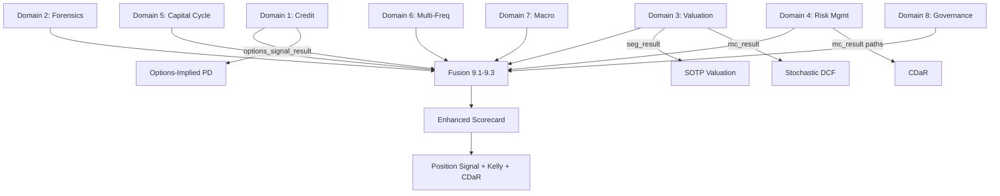

# HF Analysis Expert-Method Upgrade Plan

*Last updated: 2026-05-06*

## Current State Assessment

The HF analysis pipeline has **20 modules** across 5 tiers producing **~122 result fields**. Three metrics (Momentum, DCF, Leverage Stress) have multi-frequency variants in [`multi_freq_metrics.py`](operator1/hedge_fund/multi_freq_metrics.py:1). The 8-method [`fusion.py`](operator1/hedge_fund/fusion.py:1) combines HF + pipeline signals. Advanced methods in [`advanced_methods.py`](operator1/hedge_fund/advanced_methods.py:1) add 19 fields across P1/P2/P3.

### What works well
- 5-tier scorecard structure (Earnings Quality, Cash Flow, Balance Sheet, Inflection, Valuation) with weighted composite grading
- Multi-frequency merge for 3 metrics via inverse-variance, weighted-regression, and worst-case-envelope
- 8-method cross-pipeline fusion with anomaly override routing
- DuPont decomposition, Kelly sizing, Piotroski F-Score, OU mean reversion

### Gaps identified by domain

| Domain | Gap | Impact |
|--------|-----|--------|
| **Credit Analysis** | No Merton KMV calibration with market-implied default term structure | Default probability is a point estimate, no term structure |
| **Credit Analysis** | No CDS-implied hazard rate extraction | Missing market consensus on credit risk |
| **Fixed Income / Debt** | No debt maturity waterfall analysis | Refinancing risk is binary, not granular |
| **Fixed Income / Debt** | No interest rate sensitivity (duration/convexity analogy for equity) | Rate shock impact is one-scenario only |
| **Earnings Forensics** | Modified Jones Model uses OLS on 8 quarters (underpowered) | Discretionary accruals noisy with small N |
| **Earnings Forensics** | No Dechow F-Score (probability of misstatement) | Missing the best single-metric fraud predictor |
| **Accounting Quality** | No real activities manipulation detection (Roychowdhury 2006) | Only accrual manipulation detected, not real manipulation |
| **Valuation** | DCF uses flat WACC, no stochastic discount factor | Underestimates tail risk in valuation |
| **Valuation** | No Excess Return Model / EVA decomposition | Missing economic value added framework |
| **Valuation** | No sum-of-parts when segments exist | Single-entity DCF misvalues conglomerates |
| **Multi-Freq Metrics** | Only 3 of 15 base metrics have MF variants | 12 metrics ignore frequency-level differences |
| **Multi-Freq Metrics** | No frequency-coherence testing before merge | Merging when frequencies disagree may be worse than single-freq |
| **Behavioral** | No institutional herding detection in HF context | Smart money signals don't account for crowded positioning dynamics |
| **Risk Management** | No tail risk contribution decomposition (Component CVaR) | Cannot attribute tail risk to individual factors |
| **Risk Management** | No drawdown-at-risk (DaR) for position sizing | Kelly sizing doesn't account for max drawdown tolerance |
| **Capital Cycle** | Capital cycle detection is a stub (CapEx trend only) | Missing full cycle classification (investment, harvesting, restructuring, rebuilding) |
| **ESG/Governance** | No governance quality scoring | Board independence, insider ownership alignment, poison pills missing |
| **Macro Sensitivity** | No factor exposure decomposition (beta to rates, oil, USD, etc.) | Cannot assess macro vulnerability of the specific company |

---

## Proposed Enhancements (30 methods across 8 expert domains)

### Domain 1: Advanced Credit Analysis (3 methods)

**1.1 -- Merton KMV Default Term Structure**
- **What:** Extend the existing single-point Merton DD to a full default term structure (1Y, 2Y, 3Y, 5Y) by iterating the BSM model at multiple horizons with drift adjustment
- **Academic basis:** KMV model (Crosbie & Bohn 2003), Moody's Analytics EDF
- **Formula:** `PD(T) = N(-DD(T))` where `DD(T) = (ln(V/D) + (mu - 0.5*sigma_V^2)*T) / (sigma_V*sqrt(T))`
- **Inputs:** equity value, equity vol, debt face value, risk-free rate, asset drift
- **Output:** `default_term_structure: dict` mapping horizon to PD, `dd_term_structure: dict`
- **Multi-freq variant:** Annual gives long-term PD trend, quarterly gives near-term PD shifts
- **File:** [`advanced_methods.py`](operator1/hedge_fund/advanced_methods.py:1) P3 extension

**1.2 -- Structural Credit Migration Matrix**
- **What:** Build company-specific credit state transition probabilities from the enriched survival timeline states, analogous to S&P credit migration matrices
- **Academic basis:** Jarrow, Lando & Turnbull (1997), Altman & Kishore (1996)
- **Inputs:** `survival_regime` history, `fh_composite_score` history, `fh_altman_z_zone` transitions
- **Output:** `credit_migration_matrix: np.ndarray` (4x4: strong/adequate/weak/distress), `migration_momentum: str` (upgrading/stable/downgrading), `expected_state_1yr: str`
- **File:** New function in [`advanced_methods.py`](operator1/hedge_fund/advanced_methods.py:1)

**1.3 -- Implied Default Probability from Equity Options**
- **What:** Extract risk-neutral default probability from deep OTM put prices (Carr & Wu 2011)
- **Academic basis:** Carr & Wu (2011, RFS), "A Simple Robust Link Between American Puts and Credit Protection"
- **Inputs:** `options_signal_result` (put prices, strikes, expiries from yfinance options chain)
- **Output:** `options_implied_pd: float`, `options_implied_lgd: float`, `credit_spread_proxy_bps: int`
- **File:** New function in [`advanced_methods.py`](operator1/hedge_fund/advanced_methods.py:1)

### Domain 2: Earnings Forensics Upgrade (3 methods)

**2.1 -- Dechow F-Score (Probability of Misstatement)**
- **What:** 4-variable probit model that predicts SEC enforcement actions. Empirically the strongest single fraud predictor.
- **Academic basis:** Dechow, Ge, Larson & Sloan (2011, CAR)
- **Formula:** `F = -7.893 + 0.790*RSST_accruals + 2.518*change_receivables + 1.191*change_inventory + 1.979*soft_assets + ...` (8 coefficients)
- **Inputs:** accruals, receivables change, inventory change, soft assets, cash sales change, ROA change, issuance, operating lease
- **Output:** `dechow_f_score: float` (probit probability 0-1), `dechow_f_label: str` (clean/watch/flag)
- **File:** [`accruals_forensics.py`](operator1/hedge_fund/accruals_forensics.py:1) new component

**2.2 -- Real Activities Manipulation Detection (Roychowdhury 2006)**
- **What:** Detects three types of real (not accrual) manipulation: overproduction to reduce COGS, cutting R&D/SGA, sales acceleration via loose credit
- **Academic basis:** Roychowdhury (2006, JFE)
- **Detection signals:** (a) Abnormal CFO: actual OCF vs expected from OLS on revenue + delta_revenue. (b) Abnormal production costs: actual (COGS + delta_inventory) vs expected. (c) Abnormal discretionary expenses: actual (R&D + SGA + advertising) vs expected from lagged revenue.
- **Inputs:** revenue, COGS, inventory, R&D, SGA, OCF (8Q)
- **Output:** `real_manipulation_score: float` (0-100), `abnormal_cfo: float`, `abnormal_production: float`, `abnormal_discretionary: float`, `manipulation_type: str` (overproduction/cost_cutting/sales_pull_forward/clean)
- **File:** New function in [`accruals_forensics.py`](operator1/hedge_fund/accruals_forensics.py:1)

**2.3 -- Beneish Extended with M8-Score**
- **What:** The original 8-variable Beneish M-Score is already computed in [`financial_health.py`](operator1/models/financial_health.py:1). Extend with the 5-variable M5-Score variant (more robust with small N) and add the probability conversion
- **Academic basis:** Beneish (1999, TAR), Beneish, Lee & Nichols (2013)
- **Formula:** `P(manipulator) = 1 / (1 + exp(-M))` where M is the M-Score
- **Output:** `beneish_m5_score: float`, `beneish_probability: float`, `beneish_m8_vs_m5_agreement: bool`
- **File:** [`earnings_smoothing.py`](operator1/hedge_fund/earnings_smoothing.py:1) enhancement

### Domain 3: Valuation Engine Upgrade (4 methods)

**3.1 -- Stochastic DCF with Rate/Growth Covariance**
- **What:** Replace flat WACC with a stochastic discount rate that co-moves with growth shocks. When growth falls, discount rate often rises (credit spread widens), creating a double hit that flat WACC misses.
- **Academic basis:** Ang & Liu (2004, JF), Cochrane (2005) "Asset Pricing"
- **Implementation:** In the existing MC-based DCF, jointly simulate growth + WACC from a bivariate distribution with negative correlation (estimated from cache: revenue_growth vs credit_spread_proxy)
- **Output:** Enhanced `DCFResult` with `stochastic_wacc_mean`, `stochastic_wacc_vol`, `growth_wacc_correlation`, `stochastic_p50` (vs deterministic `intrinsic_p50`)
- **File:** [`engine.py`](operator1/hedge_fund/engine.py:1) `_compute_dcf()` enhancement

**3.2 -- Economic Value Added (EVA) Decomposition**
- **What:** EVA = NOPAT - (Invested_Capital x WACC). Decomposes value creation into operating and financing components.
- **Academic basis:** Stern Stewart & Co (1991), Grant (2003)
- **Formula:** `EVA = NOPAT - WACC * IC`, `MVA = sum(EVA_t / (1+WACC)^t)`
- **Inputs:** NOPAT (from income_df), invested capital (from balance_df), WACC (from DCF), market_cap
- **Output:** `eva_latest: float`, `eva_spread: float` (ROIC - WACC), `eva_momentum: str` (improving/stable/declining), `mva_to_ic: float` (market premium over invested capital)
- **File:** New function in [`engine.py`](operator1/hedge_fund/engine.py:1)

**3.3 -- Sum-of-Parts Valuation (SOTP)**
- **What:** When `seg_result` has 2+ segments, value each segment separately using segment-appropriate multiples, then sum. Detects conglomerate discount/premium.
- **Academic basis:** Berger & Ofek (1995, JF), Lamont & Polk (2001)
- **Inputs:** `seg_result` (segment revenues), sector multiples (EV/Revenue by segment type), segment growth rates
- **Output:** `sotp_intrinsic: float`, `conglomerate_discount_pct: float`, `segment_valuations: dict`, `most_undervalued_segment: str`
- **File:** New function in [`engine.py`](operator1/hedge_fund/engine.py:1)
- **Multi-freq variant:** Annual segments give stable base, quarterly captures seasonal segment dynamics

**3.4 -- Reverse DCF (Market-Implied Growth)**
- **What:** Solve for the growth rate that makes DCF = current market price. Compare to actual growth to find the "expectations gap."
- **Academic basis:** Rappaport & Mauboussin (2001) "Expectations Investing"
- **Currently partial:** `growth_gap` exists in DCF but uses a simple heuristic. Upgrade to proper reverse-DCF with Newton-Raphson root finding.
- **Output:** `implied_growth_rate: float`, `actual_growth_rate: float`, `expectations_gap_pct: float`, `expectations_label: str` (priced_for_perfection/fairly_priced/priced_for_failure)
- **File:** [`engine.py`](operator1/hedge_fund/engine.py:1) `_compute_dcf()` enhancement

### Domain 4: Risk Management Upgrade (3 methods)

**4.1 -- Component CVaR (Tail Risk Attribution)**
- **What:** Decompose portfolio/company CVaR into contributions from individual risk factors (revenue risk, margin risk, leverage risk, market risk). Shows WHERE the tail risk comes from.
- **Academic basis:** Boudt, Peterson & Croux (2008, JFQA), Modified Cornish-Fisher CVaR
- **Inputs:** cache columns for key risk factors + `return_1d`
- **Output:** `component_cvar: dict` (factor -> contribution %), `dominant_risk_factor: str`, `diversification_benefit: float`
- **File:** New function in [`advanced_methods.py`](operator1/hedge_fund/advanced_methods.py:1)

**4.2 -- Conditional Drawdown-at-Risk (CDaR)**
- **What:** Maximum drawdown that will be exceeded with probability alpha. Like VaR but for drawdowns. Used for position sizing instead of Kelly (which ignores path risk).
- **Academic basis:** Chekhlov, Uryasev & Zabarankin (2005, QF)
- **Inputs:** MC simulated paths (from `mc_result`)
- **Output:** `cdar_95: float` (95th percentile max drawdown), `cdar_99: float`, `optimal_leverage_cdar: float` (max leverage to keep CDaR < threshold), `cdar_adjusted_kelly: float`
- **File:** [`engine.py`](operator1/hedge_fund/engine.py:1) position signal enhancement

**4.3 -- Regime-Conditional Risk Budgeting**
- **What:** Compute per-regime risk allocations. In normal regime, full risk budget. In survival, risk budget compressed. Uses risk parity within each regime.
- **Academic basis:** Roncalli (2013) "Risk Parity and Risk Budgeting", Qian (2005)
- **Inputs:** Per-regime return distributions from MC, survival_regime
- **Output:** `risk_budget_by_regime: dict`, `current_risk_utilization: float`, `risk_parity_weights: dict`
- **File:** New function in [`engine.py`](operator1/hedge_fund/engine.py:1)

### Domain 5: Capital Cycle & Competitive Positioning (3 methods)

**5.1 -- Full Capital Cycle Classification**
- **What:** Replace the stub `capital_cycle` in advanced_methods with proper 4-phase classification: (1) Investment (CapEx rising, margins stable), (2) Harvest (CapEx peaking, margins rising), (3) Restructuring (CapEx falling, margins falling), (4) Rebuilding (CapEx troughing, margins recovering)
- **Academic basis:** Marathon Asset Management (2004) "Capital Returns", Greenwald (2001) "Value Investing"
- **Inputs:** CapEx/revenue trend (8Q), gross margin trend (8Q), ROIC trend (8Q), capacity utilization proxy (revenue/total_assets)
- **Output:** `cycle_phase: str` (invest/harvest/restructure/rebuild), `cycle_age_quarters: int`, `phase_confidence: float`, `next_phase_probability: float`
- **Multi-freq variant:** Annual gives secular cycle, quarterly gives short-term phase shifts
- **File:** [`advanced_methods.py`](operator1/hedge_fund/advanced_methods.py:1) P2 replacement

**5.2 -- Competitive Moat Quantification**
- **What:** Quantify Buffett's "economic moat" from financial data: pricing power (gross margin stability), switching costs (customer retention proxy from revenue volatility), network effects (revenue/user acceleration), cost advantages (operating margin vs peers)
- **Academic basis:** Greenwald & Kahn (2005) "Competition Demystified", Mauboussin & Callahan (2013)
- **Inputs:** gross_margin history (stability), revenue_growth (acceleration), SGA/revenue (efficiency), peer_ranking data
- **Output:** `moat_score: float` (0-100), `moat_type: str` (pricing_power/switching_costs/network/cost_advantage/brand/none), `moat_trend: str` (widening/stable/narrowing), `moat_durability_years: float`
- **File:** New function in [`engine.py`](operator1/hedge_fund/engine.py:1) or [`advanced_methods.py`](operator1/hedge_fund/advanced_methods.py:1)

**5.3 -- Sustainable Growth Rate (SGR) vs Actual Growth**
- **What:** `SGR = ROE * (1 - payout_ratio)`. Compare to actual growth. If actual > SGR, the company must issue equity or take debt to fund growth (quality concern). If actual < SGR, the company is under-investing.
- **Academic basis:** Higgins (1977, FM)
- **Inputs:** ROE, payout ratio (dividends/NI), actual revenue growth
- **Output:** `sgr: float`, `growth_gap_sgr: float` (actual - SGR), `funding_gap_flag: bool`, `growth_sustainability_label: str`
- **File:** [`engine.py`](operator1/hedge_fund/engine.py:1) growth quality enhancement

### Domain 6: Multi-Frequency Metric Expansion (4 methods)

**6.1 -- FCF Quality Multi-Freq**
- **What:** Run FCF quality at both Q and A frequencies. Annual smooths out seasonal distortions (Q4 capex loading). Quarterly catches rapid deterioration.
- **Merge strategy:** Weighted average (Q=0.55, A=0.45) with divergence penalty
- **File:** [`multi_freq_metrics.py`](operator1/hedge_fund/multi_freq_metrics.py:1)

**6.2 -- Accruals Forensics Multi-Freq**
- **What:** Modified Jones Model benefits enormously from annual data (more stable coefficient estimates with 5-8 annual observations vs 20-32 quarterly). Quarterly detects recent spikes.
- **Merge strategy:** Jones model from annual (more power), Sloan/CCE from quarterly (more responsive). Union of red flags.
- **File:** [`multi_freq_metrics.py`](operator1/hedge_fund/multi_freq_metrics.py:1)

**6.3 -- Growth Quality Multi-Freq**
- **What:** Annual reveals secular organic/inorganic split. Quarterly detects recent M&A events (goodwill jumps).
- **Merge strategy:** Organic fraction from annual (structural), incremental ROIC from quarterly (recent capital deployment)
- **File:** [`multi_freq_metrics.py`](operator1/hedge_fund/multi_freq_metrics.py:1)

**6.4 -- Frequency Coherence Test Before Merge**
- **What:** Before merging any MF metric, test whether the frequency results are coherent (same direction, comparable magnitudes) or contradictory. When contradictory, flag the disagreement instead of blindly averaging.
- **Method:** Spearman rank correlation of component scores across frequencies + sign agreement test
- **Output:** `coherence_score: float` (0-1), `coherence_action: str` (merge/flag_disagreement/use_single_freq)
- **File:** [`multi_freq_metrics.py`](operator1/hedge_fund/multi_freq_metrics.py:1) utility function

### Domain 7: Macro Sensitivity & Factor Exposure (4 methods)

**7.1 -- Multi-Factor Exposure Decomposition**
- **What:** Decompose stock returns into exposure to rates, oil, USD, VIX, and sector. Rolling 63-day OLS of `return_1d` on factor returns.
- **Academic basis:** Ross (1976, JET), Chen, Roll & Ross (1986, JB)
- **Inputs:** `return_1d`, benchmark factors (from cross_asset_signals: yield_curve, usd_momentum, sector ETFs)
- **Output:** `factor_betas: dict` (factor -> beta), `factor_r_squared: float`, `dominant_factor: str`, `macro_vulnerability_score: float`
- **File:** New function in [`advanced_methods.py`](operator1/hedge_fund/advanced_methods.py:1) P3

**7.2 -- Interest Rate Sensitivity (Equity Duration)**
- **What:** Empirical equity duration: how much does the stock move when rates change? Growth stocks have high positive duration (hurt by rate hikes), banks have negative duration (helped by rates).
- **Academic basis:** Leibowitz, Sorensen & Arnott (1998), Dechow, Sloan & Soliman (2004)
- **Inputs:** `return_1d`, yield_curve changes (from cross_asset_signals)
- **Output:** `equity_duration: float` (years-equivalent), `rate_sensitivity_label: str` (high/moderate/low/negative), `rate_shock_impact_pct: float` (per 100bps)
- **File:** New function in [`advanced_methods.py`](operator1/hedge_fund/advanced_methods.py:1) P3

**7.3 -- Commodity Exposure Scoring**
- **What:** For resource/manufacturing companies, estimate revenue sensitivity to commodity prices (oil, copper, gold, agricultural) using rolling correlation with commodity ETFs.
- **Inputs:** `return_1d`, commodity ETF returns (USO, GLD, COPX, DBA via yfinance)
- **Output:** `commodity_betas: dict`, `commodity_exposure_label: str`, `commodity_hedge_effectiveness: float`
- **File:** New function in [`advanced_methods.py`](operator1/hedge_fund/advanced_methods.py:1) P3

**7.4 -- FX Translation Risk Assessment**
- **What:** For companies with international revenue (detected from geo_segments in seg_result), estimate FX translation impact on earnings.
- **Inputs:** `geo_segments` (from seg_result), currency returns (from macro_data or yfinance FX pairs)
- **Output:** `fx_exposure_score: float`, `hedging_effectiveness: float`, `translation_impact_pct: float` (per 10% USD move)
- **File:** New function in [`advanced_methods.py`](operator1/hedge_fund/advanced_methods.py:1) P3

### Domain 8: Governance & ESG Signals (3 methods)

**8.1 -- Governance Quality Score**
- **What:** Score governance quality from available data: insider ownership concentration, insider transaction patterns (from `target_insiders`), board size proxy (SGA/employee ratio), related-party transaction flags
- **Academic basis:** Gompers, Ishii & Metrick (2003, QJE) "Corporate Governance and Equity Prices"
- **Inputs:** `target_insiders` (insider transactions), `target_holders` (holder concentration), SGA/revenue, management tenure proxy
- **Output:** `governance_score: float` (0-100), `governance_label: str`, `insider_alignment_flag: bool`, `concentration_risk_flag: bool`
- **File:** New function in [`advanced_methods.py`](operator1/hedge_fund/advanced_methods.py:1) or new file [`governance.py`](operator1/hedge_fund/governance.py)

**8.2 -- Shareholder-Friendly Capital Allocation Score**
- **What:** Score how well management returns capital: buyback timing (buybacks when stock is cheap vs expensive), dividend growth consistency, reinvestment rate vs ROIC spread
- **Academic basis:** Jensen (1986, AER) "Agency Costs of Free Cash Flow"
- **Inputs:** buyback history (from cashflow_df), dividend history, ROIC, stock price at buyback dates
- **Output:** `capital_allocation_score: float` (0-100), `buyback_timing_score: float`, `dividend_consistency_score: float`, `reinvestment_spread: float`
- **Replaces/enhances:** Current vanity module's `capital_misallocation` component
- **File:** New function in [`engine.py`](operator1/hedge_fund/engine.py:1) or [`advanced_methods.py`](operator1/hedge_fund/advanced_methods.py:1)

**8.3 -- Accounting Conservatism Index**
- **What:** Measures whether management tends toward conservative or aggressive accounting choices. Conservative = faster asset writedowns, slower revenue recognition, higher reserves.
- **Academic basis:** Basu (1997, JAE), Khan & Watts (2009, JAE) C-Score
- **Inputs:** Asset write-down speed (depreciation/assets trend), reserve adequacy (provisions/revenue), revenue recognition speed (receivables/revenue trend)
- **Output:** `conservatism_index: float` (-1 to +1, negative = aggressive), `conservatism_label: str`, `conservatism_trend: str`
- **File:** New function in [`accruals_forensics.py`](operator1/hedge_fund/accruals_forensics.py:1) or [`advanced_methods.py`](operator1/hedge_fund/advanced_methods.py:1)

### Domain 9: Fusion & Signal Quality Upgrades (3 methods)

**9.1 -- Hierarchical Risk Parity Signal Combination**
- **What:** Replace equal-weight signal combination in fusion with HRP (Lopez de Prado 2016). Uses correlation structure of individual signals to allocate weight, reducing concentration in correlated signals.
- **Academic basis:** Lopez de Prado (2016, JFE) "Building Diversified Portfolios that Outperform Out of Sample"
- **Inputs:** All individual signal outputs from HF metrics
- **Output:** Enhanced `FusionResult` with `hrp_weights: dict`, `signal_clustering: dict`
- **File:** [`fusion.py`](operator1/hedge_fund/fusion.py:1) Method 9

**9.2 -- Conviction Calibration via Brier Score**
- **What:** Calibrate conviction scores using historical prediction accuracy. If previous predictions at conviction=8 were only 50% accurate, future conviction=8 should be scaled down.
- **Academic basis:** Brier (1950), Platt scaling (Platt 1999)
- **Inputs:** `prediction_log_summary` (from prediction log), historical conviction scores
- **Output:** `calibrated_conviction: float`, `calibration_reliability: float`, `overconfidence_flag: bool`
- **File:** [`fusion.py`](operator1/hedge_fund/fusion.py:1) enhancement

**9.3 -- Adaptive Scorecard Weight Optimization**
- **What:** The current scorecard uses fixed weights (25/20/20/20/15). Optimize weights using rolling historical performance of each tier's predictive power for forward returns.
- **Method:** Rolling 252-day IC of each tier score vs forward 21-day return. Normalize ICs to get weights.
- **Inputs:** Historical tier scores + forward returns from cache
- **Output:** `adaptive_tier_weights: dict`, `weight_stability: float`, `dominant_tier: str`
- **File:** [`engine.py`](operator1/hedge_fund/engine.py:1) `_build_scorecard()` enhancement

---

## Implementation Architecture

```
operator1/hedge_fund/
  engine.py              -- Orchestrator: +4 methods (EVA, SOTP, CDaR, risk budget)
  types.py               -- +15 new result fields across existing dataclasses
  helpers.py             -- No changes
  multi_freq_metrics.py  -- +3 MF variants (FCF quality, accruals, growth quality) + coherence test
  advanced_methods.py    -- +10 methods (Merton term structure, credit migration,
                            options-implied PD, capital cycle, moat, factor exposure,
                            equity duration, commodity, FX, governance)
  accruals_forensics.py  -- +3 methods (Dechow F-Score, real manipulation, conservatism)
  earnings_smoothing.py  -- +1 method (Beneish M5 probability)
  fcf_quality.py         -- No changes (MF variant handles frequency)
  fusion.py              -- +3 methods (HRP combination, Brier calibration, adaptive weights)
  governance.py          -- NEW file if governance methods warrant separation
```

### Dependency Map



### No New Dependencies Required

All 30 methods use only libraries already installed:
- `numpy`, `scipy` (optimization, statistics, distributions)
- `pandas` (data manipulation)
- `sklearn` (OLS regression for factor models)
- `statsmodels` (probit for Dechow F-Score)
- `lifelines` (already used for Cox PH)

---

## Execution Order

| Phase | Methods | Files Modified | New Result Fields |
|-------|---------|---------------|-------------------|
| **Phase 1: Forensics** | 2.1 Dechow F-Score, 2.2 Real Manipulation, 2.3 Beneish M5 | accruals_forensics.py, earnings_smoothing.py | +8 |
| **Phase 2: Valuation** | 3.1 Stochastic DCF, 3.2 EVA, 3.3 SOTP, 3.4 Reverse DCF | engine.py | +12 |
| **Phase 3: Credit** | 1.1 Merton Term Structure, 1.2 Credit Migration, 1.3 Options PD | advanced_methods.py | +8 |
| **Phase 4: Risk** | 4.1 Component CVaR, 4.2 CDaR, 4.3 Risk Budget | engine.py, advanced_methods.py | +9 |
| **Phase 5: Capital** | 5.1 Capital Cycle, 5.2 Moat, 5.3 SGR | engine.py, advanced_methods.py | +10 |
| **Phase 6: Multi-Freq** | 6.1-6.4 FCF/Accruals/Growth MF + Coherence | multi_freq_metrics.py | +4 |
| **Phase 7: Macro** | 7.1-7.4 Factors, Duration, Commodity, FX | advanced_methods.py | +10 |
| **Phase 8: Governance** | 8.1-8.3 Governance, Capital Alloc, Conservatism | advanced_methods.py or governance.py | +8 |
| **Phase 9: Fusion** | 9.1-9.3 HRP, Brier, Adaptive Weights | fusion.py, engine.py | +5 |

**Total new result fields: ~74** (bringing Layer 4 from ~122 to ~196)

---

## What This Plan Does NOT Change

- The 5-tier scorecard structure remains (just better-weighted via 9.3)
- The 8-method fusion architecture remains (3 new methods added as 9-11)
- The multi-freq merge patterns remain (worst-case, inverse-variance, weighted-regression)
- No new pip dependencies
- No changes to PipelineState serialization (all new fields are within existing result objects)
- No changes to report_generator (profile keys are backward-compatible)
