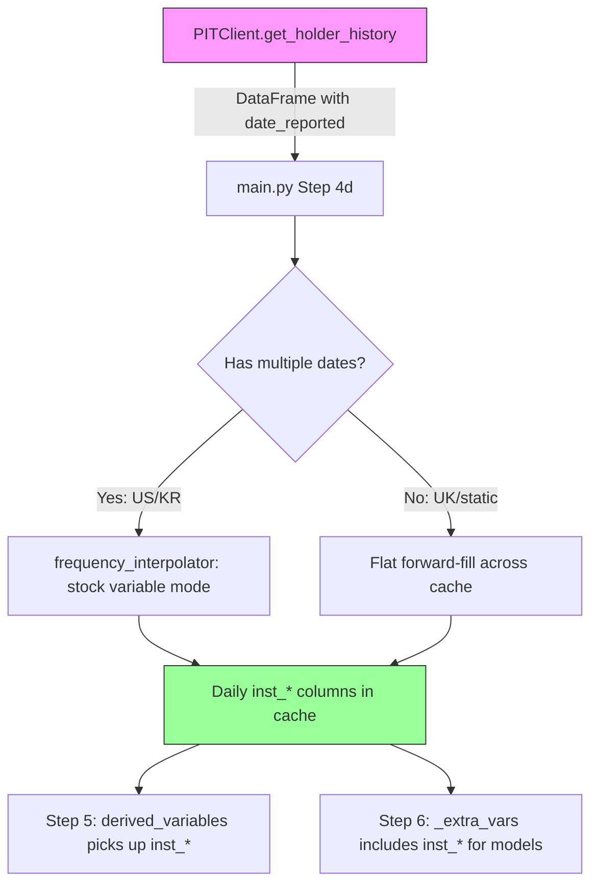

# Historical Institutional Ownership -- Cache Integration for Model Training

## Goal

Extend `get_holders()` to fetch **historical quarterly ownership data** (2 years) and inject it into the daily cache as time-varying columns so temporal models automatically learn from institutional ownership trends.

Design the pipe so new regional sources can be added without changing the merge logic.

---

## Architecture: Extensible Holder Time-Series Pipeline



### Key Design: Extensible Interface

Add `get_holder_history()` to the PITClient protocol alongside the existing `get_holders()`. Any new market wrapper just needs to implement this one method to plug into the pipeline:

```python
# In pit_base.py
def get_holder_history(self, identifier: str, years: int = 2) -> pd.DataFrame:
    """Return quarterly institutional ownership metrics over time.
    
    Must return a DataFrame with columns:
        date_reported: datetime  -- the filing/report date
        inst_ownership_pct: float  -- total institutional ownership %
        inst_top5_concentration: float  -- HHI of top 5 holders
        inst_holder_count: int  -- number of institutional holders
    
    Returns empty DataFrame if historical data not available.
    New markets: implement this method to plug into the ownership pipeline.
    """
```

The merge logic in main.py treats this DataFrame identically to a financial statement -- stock-variable interpolation to daily, forward-fill, merge into cache. Adding a new market is just implementing `get_holder_history()` on its wrapper.

---

## Per-Region Implementation

### US: SEC EDGAR 13F History via yfinance

yfinance provides `institutional_holders` (latest snapshot only) but also `quarterly_institutional_holders` which gives historical quarterly snapshots.

```python
# In us_edgar.py
def get_holder_history(self, identifier: str, years: int = 2) -> pd.DataFrame:
    import yfinance as yf
    tick = yf.Ticker(identifier)
    
    # Try quarterly history first
    qih = tick.quarterly_institutional_holders  # Returns last 4-8 quarters
    
    # Aggregate per quarter: total shares, count, top5 HHI
    # Return DataFrame with date_reported + inst_* columns
```

**Data availability:** yfinance `quarterly_institutional_holders` returns ~4 quarters of history (sometimes more). For 2-year coverage, this gives 4-8 data points -- enough for interpolation.

### KR: DART Historical Reports

DART's `hyslr_sttus` already accepts `bsns_year` and `reprt_code`. We loop over the last 8 report periods (2 years x 4 quarters):

```python
# In kr_dart_wrapper.py  
def get_holder_history(self, identifier: str, years: int = 2) -> pd.DataFrame:
    # For each year in range, for each report code (11011-11014):
    #   dart_fss.api.info.hyslr_sttus(corp_code, bsns_year, reprt_code)
    #   Aggregate: total shares held by major holders, count, HHI
    # Return DataFrame with date_reported + inst_* columns
```

**Data availability:** DART keeps historical reports going back years. 8 API calls covers 2 years of quarterly data.

### UK: Static Snapshot (Extensible)

yfinance only provides current-quarter data for UK stocks. The UK implementation returns a single-row DataFrame (latest snapshot), which gets flat forward-filled across the entire cache.

```python
# In uk_ch_wrapper.py
def get_holder_history(self, identifier: str, years: int = 2) -> pd.DataFrame:
    holders = self.get_holders(identifier)  # Current snapshot
    if not holders:
        return pd.DataFrame()
    # Build single-row DataFrame from current snapshot
    # When a historical UK source becomes available, extend here
```

### Default (Other Markets)

```python
# In pit_base.py protocol default
def get_holder_history(self, identifier: str, years: int = 2) -> pd.DataFrame:
    return pd.DataFrame()  # Not available for this market
```

---

## Cache Columns Produced

| Column | Type | Description | Interpolation |
|--------|------|-------------|---------------|
| `inst_ownership_pct` | float | Total institutional ownership % of outstanding shares | Stock (linear between quarters) |
| `inst_top5_concentration` | float | HHI of top 5 holders (0 = dispersed, 1 = single holder) | Stock (linear) |
| `inst_holder_count` | int | Number of distinct institutional holders | Stock (linear) |
| `inst_ownership_change_qoq` | float | Quarter-over-quarter change in total inst. ownership | Computed after interpolation |

---

## Pipeline Integration

### main.py Step 4d (after macro data, before estimation)

```python
# Step 4d: Fetch institutional ownership history for cache
holder_history_df = pd.DataFrame()
try:
    if hasattr(pit_client, 'get_holder_history'):
        holder_history_df = pit_client.get_holder_history(identifier, years=int(args.years))
        if not holder_history_df.empty:
            logger.info("Holder history: %d quarterly snapshots", len(holder_history_df))
except Exception as exc:
    logger.debug("Holder history fetch skipped: %s", exc)

# Merge into cache (same pattern as financial statements)
if not holder_history_df.empty and 'date_reported' in holder_history_df.columns:
    holder_history_df['date_reported'] = pd.to_datetime(holder_history_df['date_reported'])
    holder_history_df = holder_history_df.sort_values('date_reported')
    inst_cols = [c for c in holder_history_df.columns if c.startswith('inst_')]
    if inst_cols:
        stmt_indexed = holder_history_df.set_index('date_reported')[inst_cols]
        if _use_interpolator and len(stmt_indexed) >= 2:
            stmt_aligned, _ = interpolate_statement_to_daily(
                stmt_indexed, daily_index=cache.index, market_id=market_id,
            )
        else:
            combined_idx = cache.index.union(stmt_indexed.index).sort_values()
            stmt_aligned = stmt_indexed.reindex(combined_idx).ffill().reindex(cache.index)
        new_cols = [c for c in stmt_aligned.columns if c not in cache.columns]
        if new_cols:
            cache = cache.join(stmt_aligned[new_cols], how='left')
        logger.info("Institutional ownership merged: %d columns", len(new_cols))
```

### Step 5 picks up automatically

`compute_derived_variables()` doesn't need changes. The `inst_*` columns exist in the cache and are available.

### Step 6 picks up automatically

The `_extra_vars` collector already has:
```python
_extra_vars = [c for c in cache.columns if ... or c.startswith("inst_") ...]
```

We just add `"inst_"` to the prefix list (one line change).

---

## Implementation Checklist

- [ ] Add `get_holder_history()` to PITClient protocol in pit_base.py (returns empty DataFrame by default)
- [ ] Implement `get_holder_history()` in us_edgar.py (yfinance quarterly_institutional_holders)
- [ ] Implement `get_holder_history()` in kr_dart_wrapper.py (DART hyslr_sttus over 8 periods)
- [ ] Implement `get_holder_history()` in uk_ch_wrapper.py (single-row from current get_holders)
- [ ] Add Step 4d in main.py: fetch holder history and merge into cache via interpolation
- [ ] Add `"inst_"` prefix to _extra_vars collector in Step 6
- [ ] Compute `inst_ownership_change_qoq` as derived variable after merge
- [ ] Test with AAPL (US), Samsung (KR), Unilever (UK)
- [ ] Commit and push to PR
