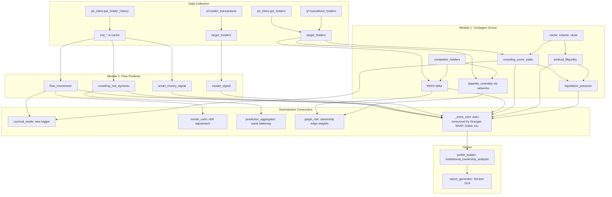

# Institutional Ownership Models: Contagion Scorer + Flow Predictor (v2)

## Overview

Two new modules that extract maximum analytical value from the existing institutional ownership data pipeline (`get_holders()` + `get_holder_history()` on US/UK/KR clients), plus enhancements to the data collection layer to capture previously unused yfinance endpoints.

---

## Package/Repo Search Results

| Source | Finding | Useful? |
|--------|---------|---------|
| `hhi` (PyPI) | GDS factory PDK -- semiconductor layout, not financial HHI | No |
| `herding` (PyPI) | Gaussian kernel herding -- math/sampling, not financial herding | No |
| `systemic-risk` (PyPI) | MIPI liquidity measure from close+volume (Brownian bridge + HHMM). Requires `pyhsmm` dependency. | Inspiration only -- we will implement Amihud illiquidity ourselves |
| `riskfolio-lib` (PyPI) | `assets_clusters()` uses hierarchical clustering on return correlations. `plot_network()` for visualization. | Pattern reference for network clustering |
| `networkx.bipartite` (installed) | `degree_centrality`, `betweenness_centrality`, `collaboration_weighted_projected_graph`, `generic_weighted_projected_graph` | **Direct use** for bipartite ownership network (Anton and Polk 2014) |
| `yfinance` (installed) | `mutualfund_holders`, `insider_transactions`, `insider_purchases`, `insider_roster_holders` -- additional ownership data not currently fetched | **Direct use** -- expand data collection |
| No MHHI package found | Azar et al 2018 formula must be implemented from the paper | Implement ourselves |
| No LSV herding package found | Lakonishok et al 1992 formula must be implemented from the paper | Implement ourselves |

---

## Enhanced Data Collection (us_edgar.py changes)

Currently `get_holders()` only fetches `institutional_holders`. We should also fetch:

```python
# In us_edgar.py get_holders():
# 1. institutional_holders (already fetched)
# 2. mutualfund_holders (new -- separate holder class, adds breadth)
# 3. insider_transactions (new -- smart money signal from management)
```

This gives us three holder categories:
- **Institutional** (13F filers: Vanguard, BlackRock, etc.)
- **Mutual funds** (Fidelity, T. Rowe Price funds, etc.)
- **Insiders** (CEO, CFO buys/sells)

The contagion scorer uses institutional + mutual fund holders for overlap analysis. The flow predictor uses insider transactions as a smart money input.

---

## Module 1: Ownership Contagion Scorer

**File:** `operator1/models/ownership_contagion.py`
**Academic basis:** Azar, Schmalz and Tecu 2018 (MHHI); Khandani and Lo 2011 (crowded trades); Anton and Polk 2014 (bipartite centrality)

### Sub-components

#### 1a. MHHI Delta (Azar et al 2018)

Simplified formula for our data (passive institutional holders where control weight = profit weight = ownership percentage):

```python
def compute_mhhi_delta(target_holders, competitor_holders_map):
    # For each competitor, compute the overlap coefficient
    for comp_id, comp_holders in competitor_holders_map.items():
        # Build institution -> percentage maps
        target_inst = {h['name']: h['percentage'] for h in target_holders}
        comp_inst = {h['name']: h['percentage'] for h in comp_holders}
        
        # Shared institutions
        shared = set(target_inst.keys()) & set(comp_inst.keys())
        
        # MHHI contribution from this competitor pair:
        # sum of (s_ki * s_kj) for each shared institution k
        # where s_ki = institution k's stake in firm i
        numerator = sum(target_inst[k] * comp_inst[k] for k in shared)
        
        # Denominator: sum of s_ki^2 (target's own HHI contribution)
        denominator = sum(v**2 for v in target_inst.values())
        
        mhhi_pair = numerator / max(denominator, 1e-9)
```

#### 1b. Bipartite Network Centrality (Anton and Polk 2014)

Uses `networkx.bipartite` to model the institution-company ownership graph:

```python
def compute_bipartite_centrality(target_holders, competitor_holders_map):
    import networkx as nx
    
    G = nx.Graph()
    
    # Add institution nodes (one partition)
    institutions = set()
    for h in target_holders:
        institutions.add(h['name'])
    for holders in competitor_holders_map.values():
        for h in holders:
            institutions.add(h['name'])
    
    for inst in institutions:
        G.add_node(inst, bipartite=0)  # institution partition
    
    # Add company nodes (other partition)
    companies = ['target'] + list(competitor_holders_map.keys())
    for comp in companies:
        G.add_node(comp, bipartite=1)  # company partition
    
    # Add weighted edges (institution -> company, weight = ownership %)
    for h in target_holders:
        G.add_edge(h['name'], 'target', weight=h['percentage'])
    for comp_id, holders in competitor_holders_map.items():
        for h in holders:
            G.add_edge(h['name'], comp_id, weight=h['percentage'])
    
    # Compute centrality metrics
    inst_nodes = {n for n, d in G.nodes(data=True) if d.get('bipartite') == 0}
    comp_nodes = {n for n, d in G.nodes(data=True) if d.get('bipartite') == 1}
    
    # Company-side degree centrality (how connected through shared holders)
    deg_centrality = nx.bipartite.degree_centrality(G, comp_nodes)
    target_centrality = deg_centrality.get('target', 0.0)
    
    # Projected graph: companies connected by shared holders
    # Edge weight = sum of shared institution percentages
    projected = nx.bipartite.weighted_projected_graph(G, comp_nodes)
    
    return target_centrality, projected
```

#### 1c. Crowded Trade Detection (Khandani and Lo 2011)

```python
def compute_crowding_score(inst_ownership_pct, inst_top5_concentration, avg_daily_volume, close_price, top5_shares):
    # Ownership crowding = concentration * total institutional %
    ownership_crowding = inst_top5_concentration * (inst_ownership_pct / 100.0)
    
    # Amihud illiquidity ratio (Amihud 2002)
    # ILLIQ = avg(|return| / dollar_volume) over trailing window
    # Higher = less liquid = more fragile
    # We compute this from cache data
    
    # Liquidation days = top5 shares / (daily volume * participation rate)
    participation_rate = 0.25  # 25% of daily volume
    dollar_volume = avg_daily_volume * close_price
    liquidation_days = top5_shares / max(avg_daily_volume * participation_rate, 1)
    
    # Combined score: ownership crowding * liquidation difficulty
    # Normalized to 0-1 via sigmoid
    raw_score = ownership_crowding * np.log1p(liquidation_days / 20.0)
    crowding_score = 1.0 / (1.0 + np.exp(-5.0 * (raw_score - 0.3)))
    
    return crowding_score, liquidation_days
```

#### 1d. Amihud Illiquidity (Amihud 2002)

A market microstructure measure that captures price impact of trading:

```python
def compute_amihud_illiquidity(cache, window=21):
    # ILLIQ_t = (1/N) * sum(|r_i| / DVOL_i) over trailing N days
    returns = cache['return_1d'].abs()
    dollar_volume = cache['close'] * cache['volume']
    
    illiq_ratio = returns / dollar_volume.clip(lower=1.0)
    amihud = illiq_ratio.rolling(window=window, min_periods=5).mean()
    
    return amihud
```

This feeds into the liquidation pressure calculation -- higher Amihud = less liquid = more days needed to exit.

### Result dataclass

```python
@dataclass
class OwnershipContagionResult:
    # MHHI delta
    mhhi_delta: float = 0.0
    mhhi_pairwise: dict[str, float] = field(default_factory=dict)
    shared_institutions: list[str] = field(default_factory=list)
    n_shared_institutions: int = 0
    
    # Bipartite network (Anton and Polk 2014)
    target_bipartite_centrality: float = 0.0
    ownership_network_density: float = 0.0
    most_connected_institution: str = ""
    institution_influence_scores: dict[str, float] = field(default_factory=dict)
    
    # Crowded trade detection
    crowding_score: float = 0.0
    crowded_trade_flag: bool = False
    amihud_illiquidity: float = 0.0
    
    # Liquidation pressure
    liquidation_days: float = 0.0
    liquidation_risk: float = 0.0
    top5_shares_total: int = 0
    avg_daily_volume: float = 0.0
    
    # Metadata
    n_target_holders: int = 0
    n_competitors_with_holders: int = 0
    available: bool = True
    error: str = ""
```

### Cache columns produced

| Column | Type | Description |
|--------|------|-------------|
| `inst_mhhi_delta` | float | Common ownership index with competitors (0-1) |
| `inst_bipartite_centrality` | float | Target's centrality in the ownership network |
| `inst_ownership_network_density` | float | How interconnected the ownership network is |
| `inst_crowding_score` | float | Crowded trade fragility score (0-1) |
| `inst_crowded_trade_flag` | int | Binary: 1 if crowding exceeds threshold |
| `inst_amihud_illiquidity` | float | Daily Amihud illiquidity ratio (time-varying) |
| `inst_liquidation_days` | float | Days to liquidate top 5 positions |
| `inst_liquidation_risk` | float | Normalized liquidation pressure (0-1) |

Note: `inst_amihud_illiquidity` is the only time-varying column (computed from daily returns and volume). All others are constant across the daily index.

---

## Module 2: Institutional Flow Predictor

**File:** `operator1/features/institutional_flow.py`
**Academic basis:** Brunnermeier and Nagel 2004 (13F flows); Lakonishok, Shleifer and Vishny 1992 (herding); Frazzini 2006 (disposition effect)

### Sub-components

#### 2a. Flow Momentum (Brunnermeier and Nagel 2004)

```python
def compute_flow_momentum(cache):
    pct = cache.get('inst_ownership_pct')
    if pct is None or pct.notna().sum() < 2:
        return pd.Series(np.nan, index=cache.index)
    
    # Quarter-over-quarter change (63 business days ~ 1 quarter)
    delta = pct.pct_change(periods=63, fill_method=None)
    # EMA smoothing to reduce noise
    momentum = delta.ewm(span=21, min_periods=5).mean()
    return momentum
```

#### 2b. LSV Herding Measure (Lakonishok et al 1992)

When we have holder-level data across companies, we can compute whether institutions are herding (all buying or all selling the same stock):

```python
def compute_lsv_herding(target_holders, previous_holders=None):
    # LSV = |p(t) - E[p(t)]| - AF(t)
    # where p(t) = proportion of institutions buying in period t
    # E[p(t)] = average proportion across all stocks
    # AF(t) = adjustment factor for random variation
    
    # With our data: if we have 2 snapshots, compute how many holders
    # increased vs decreased their positions
    if previous_holders is None:
        return 0.0  # Need at least 2 periods
    
    current_map = {h['name']: h['percentage'] for h in target_holders}
    previous_map = {h['name']: h['percentage'] for h in previous_holders}
    
    shared = set(current_map.keys()) & set(previous_map.keys())
    if not shared:
        return 0.0
    
    n_buy = sum(1 for k in shared if current_map[k] > previous_map[k])
    n_sell = sum(1 for k in shared if current_map[k] < previous_map[k])
    n_total = n_buy + n_sell
    
    if n_total == 0:
        return 0.0
    
    buy_ratio = n_buy / n_total
    expected = 0.5  # Under no herding, equal probability
    
    herding_measure = abs(buy_ratio - expected) - (1 / (2 * n_total))  # AF adjustment
    return max(0.0, herding_measure)
```

Note: LSV herding is only computable when we have two time periods of holder-level data. Currently only KR provides this implicitly (we would need to cache the previous quarter's holder list). For v1, we compute it when available and return NaN otherwise.

#### 2c. Insider Signal (new -- from yfinance insider_transactions)

```python
def compute_insider_signal(cache, insider_transactions):
    # Net insider purchasing over trailing 90 days
    # Positive = insiders buying (bullish conviction)
    # Negative = insiders selling (bearish)
    
    if not insider_transactions:
        return pd.Series(np.nan, index=cache.index)
    
    # Build daily series of net insider shares
    df = pd.DataFrame(insider_transactions)
    # Group by date, sum shares (positive = buy, negative = sell)
    daily_net = df.groupby('date')['shares'].sum()
    
    # Rolling 90-day net insider buying
    insider_signal = daily_net.reindex(cache.index, fill_value=0).rolling(90).sum()
    
    # Normalize to -1 to +1
    max_abs = insider_signal.abs().max()
    if max_abs > 0:
        insider_signal = insider_signal / max_abs
    
    return insider_signal
```

#### 2d. Smart Money Divergence

```python
def compute_smart_money_signal(cache):
    top5_hhi = cache.get('inst_top5_concentration')
    total_pct = cache.get('inst_ownership_pct')
    
    if top5_hhi is None or total_pct is None:
        return pd.Series(np.nan, index=cache.index)
    
    # Change in top-5 concentration vs change in total ownership
    top5_delta = top5_hhi.diff(periods=63)  # ~quarterly
    total_delta = total_pct.diff(periods=63)
    
    # Divergence: top5 increasing while total decreasing = smart money accumulating
    divergence = top5_delta - total_delta
    
    # Normalize to -1 to +1
    signal = divergence.clip(-1, 1)
    return signal
```

### Cache columns produced

| Column | Type | Description |
|--------|------|-------------|
| `inst_flow_momentum` | float | EMA-smoothed QoQ ownership change |
| `inst_flow_momentum_label` | str | accumulating / distributing / stable / unknown |
| `inst_crowding_risk` | float | Dynamic concentration x ownership (0-1) |
| `inst_crowding_risk_label` | str | high / moderate / low / unknown |
| `inst_smart_money_signal` | float | Top5 vs total divergence (-1 to +1) |
| `inst_smart_money_label` | str | conviction_buy / conviction_sell / neutral / unknown |
| `inst_insider_signal` | float | Net insider buying (-1 to +1) |
| `inst_insider_label` | str | insider_buying / insider_selling / neutral / unknown |
| `inst_herding_measure` | float | LSV herding coefficient (0-1) |

---

## Data Collection Enhancements (us_edgar.py)

### New: Fetch mutual fund holders

```python
def get_holders(self, identifier):
    holders = []
    
    # 1. Institutional holders (existing)
    tick = yf.Ticker(identifier)
    inst = tick.institutional_holders
    # ... existing code ...
    
    # 2. Mutual fund holders (NEW)
    mf = tick.mutualfund_holders
    if mf is not None and not mf.empty:
        for _, row in mf.iterrows():
            holders.append({
                "name": str(row.get("Holder", "")),
                "shares": int(row.get("Shares", 0)),
                "value": float(row.get("Value", 0)),
                "percentage": round(float(pct), 2),
                "holder_type": "mutualfund",  # distinguish from institutional
                "date_reported": str(row.get("Date Reported", "")),
            })
    
    return holders
```

### New: Fetch insider transactions

```python
def get_insider_transactions(self, identifier):
    try:
        tick = yf.Ticker(identifier)
        insider = tick.insider_transactions
        if insider is not None and not insider.empty:
            transactions = []
            for _, row in insider.iterrows():
                transactions.append({
                    "insider_name": str(row.get("Insider", "")),
                    "position": str(row.get("Position", "")),
                    "date": str(row.get("Start Date", "")),
                    "transaction": str(row.get("Transaction", "")),
                    "shares": int(row.get("Shares", 0)),
                    "value": float(row.get("Value", 0)),
                })
            return transactions
    except Exception:
        pass
    return []
```

---

## Pipeline Integration (main.py)

### Execution order

```
Step 2b:   [EXISTING] target_holders = pit_client.get_holders(identifier)
Step 2b.1: [NEW]      target_insiders = pit_client.get_insider_transactions(identifier) -- US only
Step 4d:   [EXISTING] get_holder_history() -> merge inst_* into cache

Step 5 (after derived_variables):
  5.inst: [NEW] compute_institutional_flow(cache)
          -- Adds inst_flow_momentum, inst_crowding_risk, inst_smart_money_signal
          -- Adds inst_insider_signal (if insider data available)
  
Step 5e.1: [NEW] During linked entity fetch, also call get_holders() for competitors
           -- Store in _competitor_holders dict

Step 5e.2: [NEW] compute_ownership_contagion(target_holders, _competitor_holders, cache)
           -- Adds inst_mhhi_delta, inst_crowding_score, inst_liquidation_days, etc.
           -- Adds inst_amihud_illiquidity (daily time-varying)
           -- Adds inst_bipartite_centrality, inst_ownership_network_density
           -- Produces ownership_edge_weights for graph_risk

Step 5e:   [EXISTING] graph_risk now receives ownership_edge_weights
```

### Survival mode integration

```python
# In survival_mode.py: two new triggers
# 1. Extreme institutional selling
if "inst_flow_momentum" in df.columns:
    conditions.append(df["inst_flow_momentum"].notna() & (df["inst_flow_momentum"] < -0.15))

# 2. Extremely crowded + illiquid position
if "inst_crowding_score" in df.columns and "inst_amihud_illiquidity" in df.columns:
    high_crowd = df["inst_crowding_score"] > 0.8
    high_illiq = df["inst_amihud_illiquidity"] > df["inst_amihud_illiquidity"].quantile(0.9)
    conditions.append(high_crowd & high_illiq)
```

### Profile builder additions

```python
profile["institutional_ownership_analysis"] = {
    "available": True,
    "contagion": {
        "mhhi_delta": result.mhhi_delta,
        "mhhi_label": "high" if result.mhhi_delta > 0.3 else "moderate" if result.mhhi_delta > 0.1 else "low",
        "shared_institutions": result.shared_institutions[:5],
        "n_shared": result.n_shared_institutions,
        "bipartite_centrality": result.target_bipartite_centrality,
        "network_density": result.ownership_network_density,
        "most_influential_institution": result.most_connected_institution,
    },
    "crowding": {
        "crowding_score": result.crowding_score,
        "crowded_trade_flag": result.crowded_trade_flag,
        "liquidation_days": result.liquidation_days,
        "liquidation_risk": result.liquidation_risk,
        "amihud_illiquidity_latest": ...,
    },
    "flow": {
        "momentum_latest": ...,
        "momentum_label": ...,
        "smart_money_signal": ...,
        "smart_money_label": ...,
        "insider_signal": ...,
        "insider_label": ...,
        "herding_measure": ...,
    },
}
```

### Report section 19.8: Institutional Ownership Deep Analysis

Three sub-sections:

**19.8a. Common Ownership Network**
- MHHI delta score with competitive impact interpretation
- Bipartite centrality visualization (text table showing target + competitors + shared institutions)
- List of shared institutional holders with overlap percentages

**19.8b. Crowding and Liquidity Risk**
- Crowding score with threshold-based risk label
- Liquidation days estimate with Amihud illiquidity context
- Crowded trade flag with explanation

**19.8c. Institutional Flow Signals**
- Flow momentum trend (direction + magnitude)
- Smart money divergence (top-5 vs total)
- Insider transaction signal (net buying/selling)
- LSV herding measure (when available)

---

## Architecture Diagram



---

## File Changes Summary

| File | Change | Lines |
|------|--------|-------|
| `operator1/models/ownership_contagion.py` | **NEW** | ~400 lines |
| `operator1/features/institutional_flow.py` | **NEW** | ~300 lines |
| `operator1/clients/us_edgar.py` | **MODIFY** | ~40 lines (add mutualfund_holders, insider_transactions) |
| `operator1/clients/pit_base.py` | **MODIFY** | ~10 lines (add get_insider_transactions protocol) |
| `main.py` | **MODIFY** | ~80 lines (wire both modules, fetch competitor holders) |
| `operator1/analysis/survival_mode.py` | **MODIFY** | ~15 lines (add 2 new triggers) |
| `operator1/report/profile_builder.py` | **MODIFY** | ~50 lines (add institutional_ownership_analysis section) |
| `operator1/report/report_generator.py` | **MODIFY** | ~100 lines (add Section 19.8) |
| `operator1/report/profile_schema.py` | **MODIFY** | ~2 lines (register new section) |
| `tests/test_institutional_ownership.py` | **NEW** | ~250 lines |

**Total:** ~700 lines (2 new modules) + ~297 lines (integration) + ~250 lines (tests) = ~1,247 lines

**No new dependencies.** Uses networkx (already installed), numpy, pandas only.

---

## Implementation Order

1. **`institutional_flow.py`** -- simplest module, operates on existing cache columns, no new data fetching
2. **`us_edgar.py` enhancements** -- add mutualfund_holders + insider_transactions to data collection
3. **`ownership_contagion.py`** -- most complex module, needs competitor holder data
4. **`main.py` wiring** -- connect both modules into the pipeline
5. **`survival_mode.py`** -- add new survival triggers
6. **`profile_builder.py` + `report_generator.py`** -- output integration
7. **`test_institutional_ownership.py`** -- unit tests
8. **Create PR**
