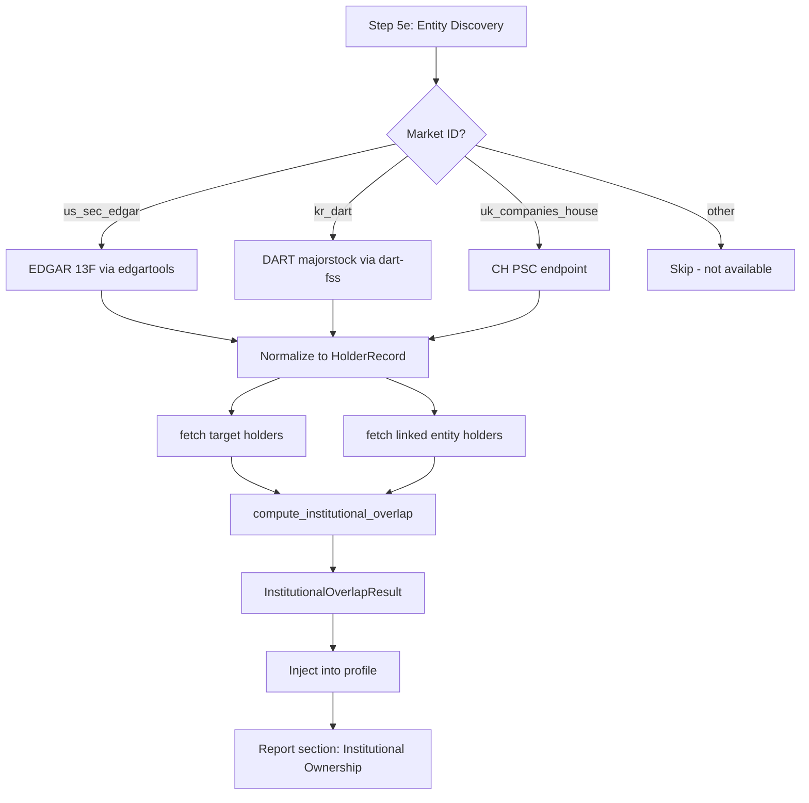

# Institutional Ownership Overlap -- Implementation Plan

## Overview

Add institutional/major shareholder data to company analysis. When a user analyzes a company, automatically fetch who owns it and check if those same holders own the linked entities (competitors, suppliers, customers). Shared ownership creates correlated selling/buying pressure -- a systemic contagion channel that pure financial analysis misses.

Supported for 3 markets where free shareholder data is available. Other markets gracefully skip.

---

## Data Sources by Region

### US -- SEC EDGAR 13F (via edgartools)

**API:** `edgar.Company(ticker).get_filings(form="13-F-HR")`

**What 13F contains:** Every institutional investment manager with $100M+ AUM must file quarterly, listing every equity holding with:
- Holder name (e.g. "Vanguard Group Inc")
- Shares held
- Market value
- Filing date

**edgartools support:** The library has `get_filings(form="13-F-HR")` on Company objects. The filing object exposes structured holdings data. Also: `edgar.get_portfolio_holding_filings()` and `edgar.get_fund_portfolio_filings()` as top-level functions.

**Coverage:** ~10,000 public companies, quarterly updates, legally mandated.

**No extra API key needed** -- same EDGAR identity already configured.

### South Korea -- DART Major Shareholders (via dart-fss)

**API:** Two endpoints available through dart-fss:

1. `dart_fss.api.shareholder.majorstock(corp_code)` -- Major shareholders (>5% holders)
2. `dart_fss.api.info.hyslr_sttus(corp_code, bsns_year, reprt_code)` -- Major shareholder status report
3. `dart_fss.api.info.hyslr_chg_sttus(corp_code, bsns_year, reprt_code)` -- Major shareholder changes

**What it contains:**
- Shareholder name
- Share count and percentage
- Change from previous period
- Relationship to company (insider vs institutional)

**Coverage:** All KOSPI/KOSDAQ listed companies. Legally mandated for >5% holdings.

**Uses existing DART_API_KEY** -- no extra key needed.

### UK -- Companies House PSC (Persons with Significant Control)

**API:** `GET /company/{company_number}/persons-with-significant-control`

**What PSC contains:** UK law requires disclosure of "persons with significant control" -- anyone with >25% shares, >25% voting rights, or significant influence. Each record includes:
- Name (individual or corporate entity)
- Nature of control (shares, voting rights, right to appoint/remove directors)
- Notified date
- Nationality and country of residence

**Coverage:** All UK registered companies. Updated within 14 days of any change.

**Uses existing COMPANIES_HOUSE_API_KEY** -- no extra key needed.

### HKEX Pattern Reference

The HKEX scraper's date-windowed GET approach (2-week windows, JSESSIONID cookie, title filtering) is relevant for the HKEX Disclosure of Interests endpoint. HKEX requires disclosure of >5% holdings via the Securities and Futures Ordinance. The same `titleSearchServlet.do` pattern could be adapted with `title="disclosure of interests"` instead of `title="results"`.

However, HKEX holder data is **not structured** -- it comes as PDF announcements. This makes it a Phase 2 candidate (requires LLM extraction).

---

## Architecture

### New Module: `operator1/features/institutional_overlap.py`

```
operator1/features/institutional_overlap.py (~300 lines)
  |
  |-- fetch_holders(market_id, identifier, pit_client, secrets) -> list of HolderRecord
  |     Routes to the correct per-region fetcher
  |
  |-- _fetch_holders_us(identifier) -> list of HolderRecord
  |     Uses edgartools 13F filing parsing
  |
  |-- _fetch_holders_kr(identifier, api_key) -> list of HolderRecord
  |     Uses dart_fss.api.shareholder.majorstock()
  |
  |-- _fetch_holders_uk(identifier, api_key) -> list of HolderRecord
  |     Uses Companies House PSC endpoint
  |
  |-- compute_institutional_overlap(
  |       target_holders, linked_holders
  |   ) -> InstitutionalOverlapResult
  |     Core overlap algorithm (restored from git history)
  |
  |-- InstitutionalOverlapResult (dataclass)
  |     available, target_top_holders, overlap_scores,
  |     portfolio_concentration_hhi, n_shared_holders
  |
  |-- HolderRecord (dataclass)
  |     name, shares, value, percentage, holder_type, date_reported
```

### Data Flow



### Pipeline Integration Point

**Location:** `main.py` Step 5e, after entity discovery and graph risk, before linked entity data fetch.

```python
# Step 5e.1: Institutional ownership overlap (US/UK/KR only)
institutional_result = None
if market_id in INSTITUTIONAL_MARKETS:
    try:
        from operator1.features.institutional_overlap import (
            fetch_holders, compute_institutional_overlap,
        )
        target_holders = fetch_holders(market_id, identifier, pit_client, secrets)
        
        linked_holders = {}
        for group_entities in relationships.values():
            for ent in group_entities:
                ent_id = ent.isin or ent.ticker
                if ent_id:
                    ent_holders = fetch_holders(market_id, ent_id, pit_client, secrets)
                    if ent_holders:
                        linked_holders[ent_id] = ent_holders
        
        institutional_result = compute_institutional_overlap(
            target_holders, linked_holders
        )
    except Exception as exc:
        logger.warning("Institutional overlap failed: %s", exc)
```

### Profile Section

```python
# In profile_builder.py
profile["institutional_overlap"] = {
    "available": institutional_result is not None and institutional_result.available,
    "target_top_holders": [...],  # Top 10 holders with name, shares, %
    "n_shared_holders": 3,
    "overlap_scores": {"MSFT": 0.45, "GOOGL": 0.38},
    "concentration_hhi": 0.0834,
    "contagion_risk": "moderate",  # low/moderate/high based on overlap + HHI
}
```

### Report Section

New section in report_generator.py (Section 19.7 for Pro + Premium tiers):

```markdown
## Institutional Ownership & Contagion Risk

### Top Institutional Holders
| Holder | Shares | % of Outstanding |
|--------|--------|-----------------|
| Vanguard Group | 1.2B | 7.8% |
| BlackRock | 982M | 6.4% |

### Ownership Overlap with Linked Entities
| Entity | Shared Holders | Overlap Score | Contagion Risk |
|--------|---------------|--------------|---------------|
| Microsoft | 8 | 0.45 | Moderate |
| Google | 6 | 0.38 | Low |

### Concentration Analysis
- **HHI**: 0.0834 (dispersed ownership)
- **Top 5 holder concentration**: 28.3%
- **Contagion assessment**: Moderate -- shared institutional holders
  with 3 competitors create correlated rebalancing risk
```

---

## Implementation Checklist

- [ ] Create `operator1/features/institutional_overlap.py` with HolderRecord dataclass, per-region fetchers, and overlap algorithm
- [ ] Implement `_fetch_holders_us()` using edgartools 13F filing parser
- [ ] Implement `_fetch_holders_kr()` using dart_fss.api.shareholder.majorstock
- [ ] Implement `_fetch_holders_uk()` using Companies House PSC REST endpoint
- [ ] Wire `fetch_holders` + `compute_institutional_overlap` into main.py Step 5e
- [ ] Add `institutional_overlap` section to profile_builder.py
- [ ] Add report section to report_generator.py (Section 19.7, Pro + Premium)
- [ ] Add `institutional_overlap` to profile_schema.py OPTIONAL_PROFILE_KEYS
- [ ] Update data-flow map with new module
- [ ] Add tests for overlap computation and per-region fetchers

---

## Market Support Matrix

| Market | Source | API | Key Needed | Holder Threshold | Update Frequency |
|--------|--------|-----|-----------|-----------------|-----------------|
| US | EDGAR 13F | edgartools | No (uses EDGAR_IDENTITY) | $100M+ AUM institutions | Quarterly |
| South Korea | DART | dart-fss | DART_API_KEY | >5% holders | On change |
| UK | Companies House | REST API | COMPANIES_HOUSE_API_KEY | >25% control | Within 14 days |
| Others | N/A | N/A | N/A | N/A | Gracefully skipped |
