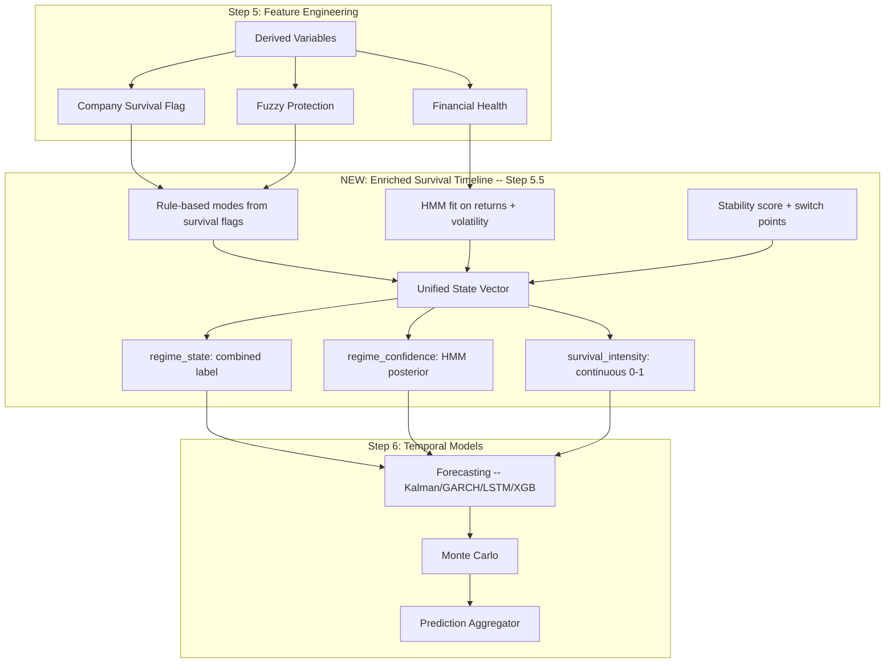

# Merge HMM and Similar Models into the Survival Timeline

## Current State

### What exists today

The pipeline has **two parallel, disconnected regime systems**:

| Layer | Module | Input Data | Output | Called in main.py? |
|-------|--------|-----------|--------|--------------------|
| **Survival mode** | [`survival_mode.py`](operator1/analysis/survival_mode.py) | Micro only: current_ratio, debt_to_equity, fcf_yield, drawdown_252d | Binary `company_survival_mode_flag` | Yes -- Step 5 |
| **Hierarchy weights** | [`hierarchy_weights.py`](operator1/analysis/hierarchy_weights.py) | Survival flags + config | Per-tier weight vectors | Yes -- Step 5 |
| **Survival timeline** | [`survival_timeline.py`](operator1/analysis/survival_timeline.py) | The 3 survival flags | 6-mode classification, switch points, stability score | **NO -- never called** |
| **HMM/GMM regime** | [`regime_detector.py`](operator1/models/regime_detector.py) | Returns + volatility (market data) | 4 regime labels: bull, bear, high_vol, low_vol + breakpoints | Yes -- Step 6 |
| **Dual regime** | [`regime_mixer.py`](operator1/models/regime_mixer.py) | HMM regimes + fundamental ratios | Market regime + fundamental regime, blended weights | Yes -- Step 6 |

Key observations:

1. **[`compute_survival_timeline()`](operator1/analysis/survival_timeline.py:275) is dead code** -- it is defined but never called anywhere in the pipeline.

2. **The survival system is purely rule-based and micro-only.** It uses hard thresholds on 4 financial ratios. No learning, no market signal, no macro input.

3. **The HMM regime system is purely market-based.** It reads returns and volatility but never looks at the survival flags, financial health, or fundamental ratios.

4. **These two systems never talk to each other** until the prediction aggregator, where regime labels are used for ensemble weighting. But survival mode info doesn't influence regime detection, and regime info doesn't influence survival classification.

---

## The Core Question

> Should HMM and similar models be merged into the survival timeline creation to simplify the run to the next learning models?

**Short answer: Yes, but as a bridge layer, not by collapsing them into one module.**

---

## Proposed Architecture: Regime-Aware Survival Timeline

The idea is to create a single **enriched survival timeline** that:
- Starts from the current rule-based survival flags (fast, always works)
- Incorporates HMM regime as a learned overlay
- Produces a unified state vector that downstream models can consume directly



### Why a bridge layer, not a merge

1. **HMM needs 60+ observations.** The survival flag can fire from day 1. If you force HMM into the survival calculation, you either delay survival detection or bypass HMM for 3 months. A bridge layer gracefully degrades: use rules when HMM has insufficient data, blend when it does.

2. **Different failure modes.** HMM can fail to converge or produce degenerate regimes. The rule-based survival flag never fails. Keeping them separate means the pipeline always has a survival signal.

3. **Simplifies downstream consumption.** Right now, forecasting models need to import from both `survival_mode` and `regime_detector` independently. The bridge gives them one unified interface:
   - `regime_state` -- a categorical label combining survival mode and market regime
   - `regime_confidence` -- continuous probability from HMM posterior
   - `survival_intensity` -- continuous [0, 1] score blending rule severity with HMM uncertainty

---

## What changes concretely

### 1. Wire up `compute_survival_timeline()` in main.py

The survival timeline module already exists and does useful work -- switch point detection, days-in-mode counting, stability scoring. It just needs to be called after Step 5 and before Step 6.

### 2. Move HMM fit earlier -- from Step 6 to Step 5.5

Currently HMM runs as part of "temporal modeling" in Step 6, alongside forecasting. But HMM regime labels are really a **feature**, not a forecast. They describe "what state is the market in right now?" -- that is the same kind of question as "is the company in survival mode?"

Moving HMM to run right after survival flags means:
- Forecasting models already have regime labels available as input features
- No circular dependency
- Regime detection becomes a pre-processing step, not a modeling step

### 3. Create the bridge: `compute_enriched_survival_timeline()`

A new function in [`survival_timeline.py`](operator1/analysis/survival_timeline.py) that:

```
Input:
  - daily_cache with survival flags already computed
  - Optional: HMM regime labels + posteriors (if available)

Output:
  - Everything the current survival timeline produces PLUS:
  - regime_state: combined categorical
  - regime_confidence: float
  - survival_intensity: float
  - regime_transition_prob: probability of switching state tomorrow
```

The mapping from dual signals to combined state:

| Survival Mode | HMM Regime | Combined State | Intensity |
|--------------|-----------|---------------|-----------|
| normal | bull | stable_growth | 0.0 |
| normal | bear | market_stress | 0.2 |
| normal | high_vol | elevated_risk | 0.3 |
| company_only | bull | company_distress_mild | 0.5 |
| company_only | bear | company_distress_severe | 0.7 |
| both_unprotected | bear | crisis | 1.0 |
| both_protected | bear | protected_crisis | 0.6 |

### 4. Models that should NOT be merged

These stay in Step 6 as independent model stages:

- **Forecasting** (Kalman, GARCH, LSTM, XGB) -- these consume the regime state, they don't produce it
- **Monte Carlo** -- needs forecasts as input
- **Prediction Aggregator** -- final ensemble layer
- **Particle Filter** -- alternative state estimator that runs alongside Kalman
- **Cycle Decomposition** -- periodic signal extraction, orthogonal to regime

### 5. Models that SHOULD inform the survival timeline

These currently run in Step 6 but their output is really a regime signal:

- **HMM** -- move earlier, feed into enriched timeline
- **PELT/BCP breakpoints** -- structural breaks are regime transitions, directly relevant to survival switch points
- **GMM** -- unsupervised clustering of returns, complementary to HMM

---

## Benefits

1. **Simpler downstream interface.** Models receive one `regime_state` + `survival_intensity` instead of juggling `survival_mode`, `regime_hmm`, `regime_gmm`, `dual_regime`, and `structural_break` separately.

2. **Actually uses `survival_timeline.py`.** Currently dead code becomes the central state tracker.

3. **Reduces Step 6 complexity.** Regime detection moves to a pre-processing step. Step 6 focuses purely on prediction.

4. **Better survival predictions.** A company with `current_ratio = 0.95` in a bull market is different from the same ratio in a bear market. The enriched timeline captures this.

5. **Enables future learning.** Once the enriched timeline exists, you can train a classifier to predict `regime_state` transitions -- which is the actual "survival prediction" the spec envisions.

---

## Implementation Plan

- [ ] Wire [`compute_survival_timeline()`](operator1/analysis/survival_timeline.py:275) into [`main.py`](main.py) after Step 5, before Step 6
- [ ] Extract HMM/GMM/PELT fitting from [`RegimeDetector`](operator1/models/regime_detector.py:108) into a standalone function callable from Step 5.5
- [ ] Add [`compute_enriched_survival_timeline()`](operator1/analysis/survival_timeline.py) that takes rule-based flags + optional HMM output and produces unified state vector
- [ ] Define the combined state mapping table as config in [`config/survival_hierarchy.yml`](config/survival_hierarchy.yml)
- [ ] Update [`run_forecasting()`](operator1/models/forecasting.py) to accept `regime_state` and `survival_intensity` as input features
- [ ] Update [`run_prediction_aggregation()`](operator1/models/prediction_aggregator.py) to use enriched timeline for ensemble weighting
- [ ] Update tests: [`test_survival_timeline_walkforward.py`](tests/test_survival_timeline_walkforward.py), add new tests for enriched timeline
- [ ] Keep the existing [`RegimeDetector`](operator1/models/regime_detector.py:108) class intact for backward compatibility -- just call it earlier

---

## What NOT to do

- **Don't put forecasting models inside the survival timeline.** Kalman, LSTM, GARCH are prediction models. They consume regime state; they don't define it.
- **Don't remove the rule-based survival flags.** They provide a deterministic safety net when HMM fails or has insufficient data.
- **Don't make HMM a hard dependency.** The enriched timeline should work with just rule-based flags when `hmmlearn` is unavailable (graceful degradation already exists in `regime_detector.py`).
