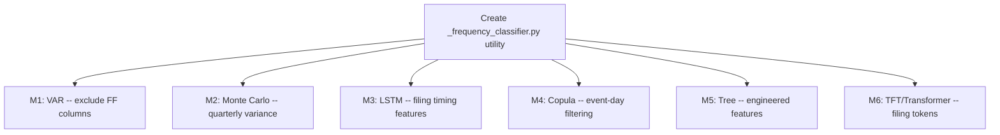

# Plan: Mixed-Frequency Model Modifications for Financial Data

## The Core Problem

The pipeline's daily cache mixes three data frequencies:

| Frequency | Source | Unique values per year | Examples |
|-----------|--------|----------------------|----------|
| **Daily** | OHLCV prices | ~252 | close, return_1d, volatility_21d, volume |
| **Quarterly** | Financial statements | 4 | revenue, total_assets, net_income, current_ratio |
| **Annual** | Macro data | 1-2 | gdp_growth, inflation_rate, unemployment |

All data is forward-filled to daily frequency for the cache. Standard time-series models treat every row as an independent observation, causing:
- **Singular covariance** (VAR can't fit)
- **Zero variance** (MC never breaches thresholds)
- **Wasted capacity** (LSTM learns "nothing changes")
- **False zero-correlation** (Copula misses joint tail risk)

## Shared Infrastructure: Filing-Aware Data Classifier

Before modifying each model individually, add a shared utility that classifies each cache column by its true frequency. All models can use this to adapt their behavior.

### New utility: `operator1/models/_frequency_classifier.py`

```python
def classify_column_frequency(series: pd.Series) -> str:
    """Classify a cache column's true data frequency.
    
    Returns: 'daily', 'quarterly', 'annual', or 'constant'
    """
    unique_ratio = series.nunique() / max(len(series), 1)
    if unique_ratio > 0.10:
        return 'daily'
    elif unique_ratio > 0.01:
        return 'quarterly'
    elif unique_ratio > 0.002:
        return 'annual'
    return 'constant'

def detect_filing_change_days(series: pd.Series) -> pd.Series:
    """Return a boolean mask where True = new filing value appeared."""
    return series.diff().abs() > 0

def get_quarterly_change_variance(series: pd.Series) -> float:
    """Compute variance from quarter-to-quarter changes only."""
    changes = series.diff()[series.diff().abs() > 0]
    return float(changes.var()) if len(changes) >= 2 else 0.0
```

---

## Model-Specific Modifications

### M1: VAR -- Exclude Forward-Filled Columns

**File**: [`operator1/models/forecasting.py`](operator1/models/forecasting.py) -- `VARWrapper.__init__` (line 1920) and `_extract_multivariate` (line 1487)

**Problem**: VAR receives up to 10 mixed variables. Forward-filled quarterly columns create near-singular covariance matrices, causing `LinAlgError` and AR(1) fallback.

**Fix**:
1. In `_extract_multivariate()`, classify each candidate column by frequency
2. Only include daily-frequency columns in the VAR variable set
3. For quarterly variables, include their `pct_change_at_filing` derivative instead (the quarterly change, forward-filled as 0 between filings)
4. This gives VAR dense, informative time-series for all variables

**Implementation**:
```python
def _extract_multivariate(target, max_cols=10):
    candidates = []
    for c in available_vars:
        if c not in cache.columns or not cache[c].notna().any():
            continue
        freq = classify_column_frequency(cache[c])
        if freq == 'daily':
            candidates.append(c)
        elif freq in ('quarterly', 'annual'):
            # Use the filing-change derivative instead of the raw value
            change_col = f"{c}_filing_change"
            if change_col not in cache.columns:
                cache[change_col] = cache[c].diff().fillna(0)
            candidates.append(change_col)
    return cache[[target] + candidates[:max_cols]].copy()
```

### M2: Monte Carlo -- Quarter-to-Quarter Variance

**File**: [`operator1/models/monte_carlo.py`](operator1/models/monte_carlo.py) -- `_estimate_regime_distributions` (around line 174)

**Problem**: Per-regime variance estimated from daily data gives near-zero for financial variables. MC simulation produces flat paths that never breach survival thresholds.

**Fix**:
1. For each simulation variable, check if it's quarterly-frequency
2. If quarterly: use the quarter-to-quarter change variance (computed from ~4-8 quarterly changes) instead of day-to-day variance (computed from ~250 near-zero changes)
3. Scale the quarterly variance to daily equivalent: `daily_var = quarterly_var / 63` (63 trading days per quarter)

**Implementation**:
```python
# In _estimate_regime_distributions
for var in variables:
    freq = classify_column_frequency(cache[var])
    if freq in ('quarterly', 'annual'):
        # Use filing-change variance, scaled to daily
        qtly_var = get_quarterly_change_variance(cache[var])
        daily_var = qtly_var / 63  # 63 trading days per quarter
        distributions[var] = {'mean': daily_mean, 'std': np.sqrt(daily_var)}
    else:
        # Standard daily variance estimation
        distributions[var] = {'mean': daily_mean, 'std': daily_std}
```

### M3: LSTM -- Filing Awareness Features

**File**: [`operator1/models/forecasting.py`](operator1/models/forecasting.py) -- `LSTMWrapper.__init__` (line 1997)

**Problem**: LSTM sliding window sees 60+ identical values for quarterly variables, learning "nothing changes." It cannot predict regime changes from fundamental shifts because it never sees them in the training windows.

**Fix**:
1. Add two engineered features to the LSTM input for each quarterly variable:
   - `days_since_last_filing`: integer counter that resets to 0 when the value changes (gives the LSTM temporal context about when information arrived)
   - `filing_just_arrived`: binary flag (1 on the day the value changes, 0 otherwise)
2. These features break the monotony of constant windows and teach the LSTM that change events matter

**Implementation**:
```python
# In _build_lstm_features or _extract_series
for var in variables:
    freq = classify_column_frequency(cache[var])
    if freq in ('quarterly', 'annual'):
        # Add filing timing features
        change_mask = cache[var].diff().abs() > 0
        days_since = change_mask.cumsum()
        days_since_filing = days_since.groupby(days_since).cumcount()
        cache[f'{var}_days_since_filing'] = days_since_filing
        cache[f'{var}_filing_arrived'] = change_mask.astype(float)
        # Add these to the LSTM feature set
```

### M4: Copula -- Event-Day Filtering

**File**: [`operator1/models/copula.py`](operator1/models/copula.py) -- `run_copula_analysis` (line 192)

**Problem**: Copula computes daily correlation/tail dependence. Financial variables are constant for 60+ days, creating false zero-correlation with daily price variables. The estimated joint tail dependence is wrong.

**Fix**:
1. Before fitting the copula, identify which columns are quarterly
2. For the copula estimation, use only "event days" -- days when at least one quarterly variable changes value
3. This gives ~4-8 observations per quarter x 8 quarters = 32-64 data points, which is enough for copula estimation and reflects the true joint distribution at information arrival events

**Implementation**:
```python
# In run_copula_analysis
# Detect event days (any financial variable changes)
event_mask = pd.Series(False, index=cache.index)
for var in variables:
    if classify_column_frequency(cache[var]) in ('quarterly', 'annual'):
        event_mask |= (cache[var].diff().abs() > 0)

# Use event-day data for copula if enough events
event_data = cache[variables][event_mask].dropna()
if len(event_data) >= 20:
    # Fit copula on event days
    df = event_data
else:
    # Fallback to weekly resampled data
    df = cache[variables].resample('W').last().dropna()
```

### M5: Tree Ensemble -- Engineered Features

**File**: [`operator1/models/forecasting.py`](operator1/models/forecasting.py) -- `TreeWrapper.__init__` (line 2235) and `_extract_tree_features` 

**Problem**: Quarterly columns have only 3-4 possible split points in 252 rows. Trees overfit to specific filing values rather than learning relationships.

**Fix**:
1. For quarterly variables, add engineered features that capture dynamics:
   - `pct_change_at_filing`: percentage change from previous quarter (0 between filings)
   - `quarters_since_change`: integer counter of quarters elapsed
   - `annualized_growth_rate`: 4-quarter rolling growth rate
2. These features give the tree meaningful split points that capture trends

**Implementation**:
```python
# In _extract_tree_features or fit_tree_ensemble
for var in feature_columns:
    freq = classify_column_frequency(features[var])
    if freq in ('quarterly', 'annual'):
        changes = features[var].diff()
        pct_changes = changes / features[var].shift(1).replace(0, np.nan)
        features[f'{var}_pct_change'] = pct_changes.fillna(0)
        # Days since last change
        is_change = changes.abs() > 0
        features[f'{var}_days_since'] = is_change.cumsum().groupby(is_change.cumsum()).cumcount()
```

### M6: TFT/Transformer -- Filing Timing Tokens

**File**: [`operator1/models/forecasting.py`](operator1/models/forecasting.py) -- `TFTWrapper` (line 2353) and [`operator1/models/transformer_forecaster.py`](operator1/models/transformer_forecaster.py)

**Problem**: Same as LSTM -- multi-head attention on constant sequences produces uninformative attention weights. TFT's GRN (Gated Residual Network) blocks learn to ignore constant financial features entirely.

**Fix**: Same approach as LSTM (M3):
1. Add `days_since_filing` and `filing_arrived` features
2. For TFT specifically: classify quarterly variables as "static" features (they change so rarely they're effectively static within any attention window) rather than "temporal" features

---

## Shared Implementation: Frequency Classifier Utility

All modifications above use `classify_column_frequency()` and `detect_filing_change_days()`. Create a shared utility module.

**New file**: `operator1/models/_frequency_classifier.py` (~50 lines)

Contains:
- `classify_column_frequency(series) -> str`
- `detect_filing_change_days(series) -> pd.Series`
- `get_quarterly_change_variance(series) -> float`
- `add_filing_timing_features(cache, var) -> None` (adds `_days_since_filing` and `_filing_arrived` columns)

---

## Execution Order



1. **Utility** -- Create `_frequency_classifier.py` (shared by all models)
2. **M1: VAR** -- High priority (currently broken, falls to AR(1))
3. **M2: Monte Carlo** -- High priority (survival probability meaningless for financial vars)
4. **M3: LSTM** -- Medium priority (wasted learning capacity)
5. **M4: Copula** -- Medium priority (false zero-correlation)
6. **M5: Tree Ensemble** -- Medium priority (limited split points)
7. **M6: TFT/Transformer** -- Medium priority (same fix as LSTM)

## Todo List

```
[ ] Create operator1/models/_frequency_classifier.py utility
[ ] M1: Modify VAR to exclude forward-filled columns, use filing-change derivatives
[ ] M2: Modify Monte Carlo to use quarter-to-quarter variance
[ ] M3: Add filing timing features to LSTM wrapper
[ ] M4: Modify Copula to use event-day filtering
[ ] M5: Add engineered features to Tree ensemble
[ ] M6: Add filing timing to TFT/Transformer
[ ] Run tests
[ ] Push to PR
```
