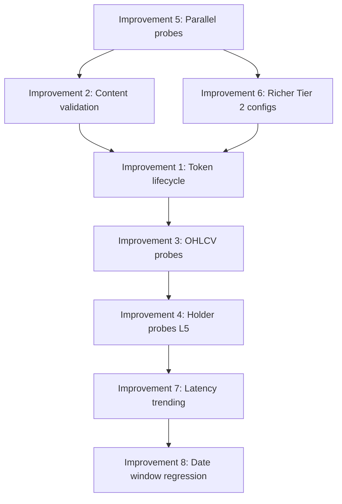

# Monitoring System Improvements

## Current State Analysis

The monitoring system has two files:

- [`health_check.py`](operator1/monitoring/health_check.py) (791 lines) -- 4-level probe system (L0-L3: DNS/TLS, Search, Profile, Financials) + alerting + auto-healing path routing
- [`wrapper_probes.py`](operator1/monitoring/wrapper_probes.py) (767 lines) -- L4 deep probes with 6 probe types (DNS, TLS, WAF, Session, Schema, Referer) configured per-market

### What Works Well
- Clean 4-level probe hierarchy (L0-L3) with escalation
- Per-market canary companies for realistic testing
- Schema drift detection against JSON baselines
- Status change alerting with webhook support
- Auto-healing path routing (`get_active_path()`)
- Pattern-specific deep probes (WAF, session, referer)

### Gaps Identified (Cross-Referenced with Cheatsheet)

**Gap 1: No token lifecycle probing (Pattern 3)**
BMV Mexico uses WSO2 token acquisition. The current `mx_bmv` probe config only does DNS + HTTP. It doesn't test the actual token flow (`GET /rest/tokenservice/token` then authenticated `POST`). If the token endpoint changes or rate-limits, the current probes can't detect it.

**Gap 2: No date-windowed probe (Pattern 1)**
HKEX session probe tests a single date window but doesn't validate the date-windowing behavior. If HKEX narrows their allowed window from 14 days to 7, the probe still passes but the wrapper breaks in production with empty results.

**Gap 3: No response content validation for most markets**
Most Tier 2 probes only check HTTP status codes, not response content. A market could return `200 OK` with an error message in the body (common with WAF challenge pages, CAPTCHA pages, or API deprecation notices). The cheatsheet warns about this explicitly -- "double JSON parse" and "deeply nested ElasticSearch responses."

**Gap 4: No OHLCV provider probing**
The health check only probes PIT wrappers. OHLCV comes from yfinance/baostock/pykrx/twstock/nselib -- none of these are monitored. If yfinance breaks (which happens regularly), 20+ markets lose price data silently.

**Gap 5: No holder data probing**
All 25 markets now have `get_holders()` implementations but none are probed. The wrappers-status-review shows 8 markets needed holder fixes just last week. These break frequently because they use scraping (MarketScreener, HKEX disclosure, BSE SAST, etc.).

**Gap 6: No parallel probing**
All 25 markets are probed sequentially. At ~15s timeout per market with 4-6 probe steps each, a full health check can take 10+ minutes. The cheatsheet's "start broad, hit many endpoints quickly" philosophy isn't applied.

**Gap 7: Shallow Tier 2 probe configs**
Many Tier 2 markets only have DNS + HTTP probes (ZA, MX, AE, CH, CA). They're missing the pattern-specific probes that would detect their actual failure modes:
- `za_jse` uses WCF SOAP endpoints -- no WCF probe
- `mx_bmv` uses WSO2 tokens -- no token probe  
- `ch_six` uses FQS ref.json + historic CSV -- no schema probe for these
- `ca_sedar` uses Catalyst form POST -- no POST probe

**Gap 8: No latency trending**
History file only stores per-market status (healthy/degraded/critical). No latency data is persisted, so gradual performance degradation (API getting slower before dying) can't be detected.

---

## Proposed Improvements

### Improvement 1: Token Lifecycle Probe (Pattern 3)

Add `_probe_token()` that tests the full token acquisition flow:

```
Session init -> GET token endpoint -> validate Bearer token -> authenticated API call
```

Apply to: `mx_bmv`, and any future WSO2/gateway markets.

**Wiring:** Add to `mx_bmv` probe config in `WRAPPER_PROBES`.

### Improvement 2: Content Validation Probe

Add `_probe_content_validation()` that checks response bodies for:
- WAF challenge pages (Akamai, Cloudflare, Imperva signatures)
- CAPTCHA pages (reCAPTCHA, hCaptcha)
- API deprecation notices
- Empty JSON arrays/objects when data is expected
- Error messages in successful HTTP responses

Apply to: All markets (lightweight, just regex checks on existing HTTP responses).

**Wiring:** Piggyback on existing `_probe_http()` -- add optional `reject_patterns` parameter.

### Improvement 3: OHLCV Provider Health Probes

Add a new probe category for the 5 OHLCV sources:
- yfinance (test with AAPL)
- baostock (test with sh.600519)
- pykrx (test with 005930)
- twstock (test with 2330)
- nselib (test with RELIANCE)

**Wiring:** New function `run_ohlcv_probes()` called from `run_health_check()`, results stored in `HealthReport.ohlcv_sources`.

### Improvement 4: Holder Data Probes (L5)

Add L5 probe level that tests `get_holders()` for canary companies. Critical because holder data sources are the most fragile (scraping, frequently-changing APIs).

Apply to: All 25 markets.

**Wiring:** New `_probe_l5_holders()` in `health_check.py`, optional level that runs when `max_level="L5"`.

### Improvement 5: Parallel Probe Execution

Use `concurrent.futures.ThreadPoolExecutor` for:
- Running all market probes in parallel (L0-L3)
- Running all deep probes in parallel (L4)
- Running OHLCV probes in parallel

Cap at 8 workers to avoid flooding APIs.

**Wiring:** Replace the `for market_id in markets` loop in `run_health_check()` with a thread pool.

### Improvement 6: Richer Tier 2 Probe Configs

Upgrade the shallow probe configs:

| Market | Current | Add |
|--------|---------|-----|
| `za_jse` | DNS + HTTP | WCF SOAP endpoint probe (`GetAllIssuers`) |
| `mx_bmv` | DNS + HTTP | Token probe + schema probe on XBRL index |
| `ae_dfm` | DNS + HTTP | Nuxt SSR probe + eFsah API probe |
| `ch_six` | DNS + HTTP | FQS ref.json schema probe + historic CSV probe |
| `ca_sedar` | DNS + HTTP | Catalyst POST probe (form submission) |
| `cn_sse` | DNS + HTTP | akshare import check + baostock socket probe |

### Improvement 7: Latency Trending in History

Extend `_append_history()` to include per-market latency:

```python
entry = {
    "timestamp": report.last_check,
    "healthy": report.healthy,
    "degraded": report.degraded,
    "critical": report.critical,
    "markets": {
        mid: {"status": mh.status, "latency_ms": mh.latency_ms}
        for mid, mh in report.markets.items()
    },
}
```

Add `detect_latency_degradation()` that reads the JSONL history and alerts when a market's p95 latency exceeds 2x its historical median.

### Improvement 8: Date Window Regression Probe

Add `_probe_date_window()` for HKEX-pattern markets that tests multiple window sizes to detect if the API has narrowed its accepted date range:

```
Test 14-day window (expected) -> Test 30-day window -> Test 7-day window
Compare result counts to detect window restrictions
```

Apply to: `hk_hkex` (and potentially any future date-windowed markets).

---

## Implementation Order



1. **Parallel probes** -- foundation, makes everything faster
2. **Content validation** -- highest value per line of code, catches silent failures
3. **Richer Tier 2 configs** -- fills the biggest coverage gap
4. **Token lifecycle** -- catches BMV-specific failures
5. **OHLCV probes** -- monitors the most fragile dependency
6. **Holder probes** -- monitors the newest, most fragile feature
7. **Latency trending** -- enables predictive alerting
8. **Date window regression** -- niche but prevents HKEX-class failures

---

## Files Modified

| File | Changes |
|------|---------|
| [`operator1/monitoring/wrapper_probes.py`](operator1/monitoring/wrapper_probes.py) | Add `_probe_token()`, `_probe_content_validation()`, `_probe_date_window()`, upgrade 6 Tier 2 configs |
| [`operator1/monitoring/health_check.py`](operator1/monitoring/health_check.py) | Add `_probe_l5_holders()`, `run_ohlcv_probes()`, parallel execution, latency history |
| [`config/probe_baselines/`](config/probe_baselines/) | New baselines for ch_six, za_jse, mx_bmv, ae_dfm, ca_sedar |
