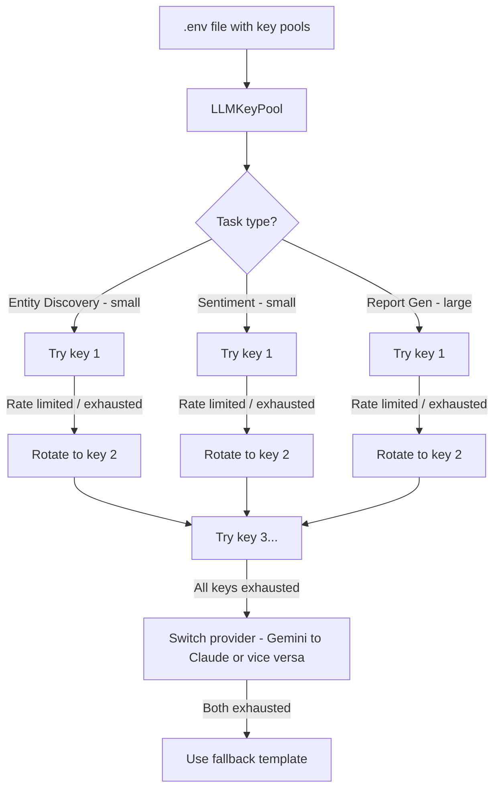

# Multi-Key LLM Rotation System

## Current LLM Usage in the Pipeline

The pipeline uses LLM in **3 distinct tasks**, each with different token profiles:

| Task | Where | Input tokens | Output tokens | Total per call |
|------|-------|-------------|--------------|----------------|
| **Entity Discovery** | Step 5e | ~500 (profile summary + sector hints) | ~2,000 (linked entity proposals JSON) | ~2,500 |
| **Sentiment Scoring** | Step 5i | ~200-2,000 (batch of 10-50 headlines) | ~100 (JSON array of scores) | ~300-2,100 |
| **Report Generation** | Step 8 | ~15,000-30,000 (full company profile JSON) | ~12,000-16,000 (22-section Markdown report) | ~27,000-46,000 |

### Estimated Token Usage Per Full Run

| Task | Calls | Tokens per call | Total tokens |
|------|-------|----------------|-------------|
| Entity Discovery | 1 | ~2,500 | **2,500** |
| Sentiment Scoring | 1-3 batches | ~500 per batch | **500-1,500** |
| Report Generation | 3 tiers (basic/pro/premium) | ~35,000 for premium, ~5,000 for basic/pro | **~45,000** |
| **Total per run** | | | **~48,000-49,000 tokens** |

### Free Tier Limits

| Provider | Free tokens/month | Free credits | Effective runs/month |
|----------|------------------|-------------|---------------------|
| **Gemini** (free tier) | 1,500 RPD, 1M TPD | Free API key, no credit limit | **~20 runs/day** |
| **Claude** (free tier) | $5 initial credit | ~$5 / $0.003 per 1K input + $0.015 per 1K output | **~5-10 runs total** |

**Conclusion: Gemini free tier is generous enough for the entire pipeline. Claude free tier exhausts in 5-10 runs. A single Gemini key should cover a full run easily. The problem is Claude's credit-based billing, not RPM limits.**

---

## Proposed Solution: Multi-Key Pool with Auto-Rotation

### Design



### Key Pool Configuration

Update `.env` to support multiple keys per provider:

```env
# Single key (backward compatible):
GEMINI_API_KEY=key1

# Multi-key pool (comma-separated):
GEMINI_API_KEY=key1,key2,key3
ANTHROPIC_API_KEY=claude_key1,claude_key2

# Or numbered keys:
GEMINI_API_KEY_1=key1
GEMINI_API_KEY_2=key2
GEMINI_API_KEY_3=key3
```

### Implementation Plan

- [ ] Add `LLMKeyPool` class to `llm_base.py` -- manages a list of API keys per provider with rotation on exhaustion/rate-limit errors
- [ ] Modify `create_llm_client()` in `llm_factory.py` to accept key pools and create clients with rotation capability
- [ ] Update `.env.example` to document multi-key format
- [ ] Update `secrets_loader.py` to parse comma-separated keys and numbered key variants
- [ ] Add provider fallback: if all keys for one provider are exhausted, automatically try the other provider
- [ ] Add token usage tracking in `llm_base.py` to log cumulative tokens per key
- [ ] Update `main.py` to pass task hints (entity_discovery, sentiment, report) so the pool can prioritize keys intelligently
- [ ] Calculate and log estimated token budget at pipeline start

### Key Rotation Logic

```
1. For each LLM call:
   a. Pick the current key from the pool
   b. Make the request
   c. If 429 (rate limit) or 400 (credits exhausted):
      - Mark current key as exhausted/rate-limited
      - Rotate to next key in pool
      - Retry
   d. If all keys for this provider exhausted:
      - Switch to alternate provider (Gemini <-> Claude)
      - Retry with new provider
   e. If both providers exhausted:
      - Return graceful fallback (template report, keyword sentiment, no entity discovery)
```

### How Many Free Keys Are Needed

Based on the token estimates above:

| Scenario | Gemini keys | Claude keys | Notes |
|----------|------------|------------|-------|
| **Recommended (Gemini only)** | **1** | 0 | Gemini free tier handles 20+ runs/day easily |
| **With Claude backup** | 1 | 1 | Claude provides $5 initial credit (~5-10 runs) |
| **Heavy usage (10+ runs/day)** | 1-2 | 1-2 | Rotate across keys if hitting RPM limits |
| **Claude-only (no Gemini)** | 0 | 3-5 | Each $5 credit key = ~5-10 runs; need 3-5 keys for a month |

**Bottom line: 1 Gemini free key is sufficient for the entire pipeline. Claude keys exhaust quickly and are best used as fallback only.**
