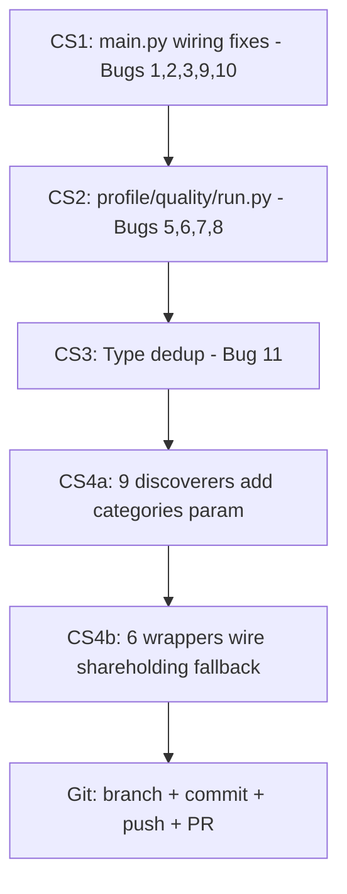

# Pipeline Bug Fixes + Filing Discoverer Shareholding Enhancement

All 11 bugs from the debug scan PLUS the dual-category filing discoverer enhancement (9 remaining markets). Organized into 5 changesets.

---

## Changeset 1: main.py Critical Wiring Fixes (Bugs #1, #2, #3, #10)

All in [`main.py`](main.py).

### Bug #1 (CRITICAL): `relationships` NameError in fuzzy protection

**Line 1276** uses `relationships.get()` but `relationships = {}` is at line 1350.

**Fix:** Move these 7 variable initializations from ~line 1350 to ~line 1260 (before Step 5b):
```python
relationships = {}
graph_risk_result = None
game_theory_result = None
linked_caches: dict[str, pd.DataFrame] = {}
linked_agg_df: pd.DataFrame | None = None
contagion_result = None
_ownership_edge_weights: dict[str, float] = {}
```
Remove the duplicate block at the old location.

### Bug #2 (MODERATE): Conformal uses `pred_result` before it's computed

**Line 2254** reads `pred_result.predictions` but `pred_result` is set at line 2296.

**Fix:** Replace `pred_result.predictions` with `forecast_result.forecasts`:
```python
if forecast_result is not None and hasattr(forecast_result, "forecasts"):
    for var, var_forecasts in forecast_result.forecasts.items():
        if isinstance(var_forecasts, dict):
            _nested_forecasts[var] = {}
            for h, val in var_forecasts.items():
                try:
                    _nested_forecasts[var][h] = float(val)
                except (TypeError, ValueError):
                    pass
            if not _nested_forecasts[var]:
                del _nested_forecasts[var]
```

### Bug #3 (MODERATE): Fixed Share/MCS never passed downstream

**Lines 2131-2170** compute `_fixed_share` and `_mode_confidence_sets` but never pass them.

**Fix:** After line 2170, derive mode_weights:
```python
_mode_weights = None
if _fixed_share is not None:
    _mode_weights = {"global": _fixed_share.get_weights()}
```
Then at line 2296, pass `mode_weights=_mode_weights` to `run_prediction_aggregation()`.

### Bug #10 (LOW): Graph risk log compares same object

**Line 1651** overwrites `graph_risk_result` before the "was" comparison at line 1656.

**Fix:** Save old value first:
```python
_old_contagion = graph_risk_result.contagion_target_infection_prob
graph_risk_result = _enhanced_gr
logger.info("... contagion=%.3f (was %.3f)", _enhanced_gr.contagion_target_infection_prob, _old_contagion)
```

### Bug #9 (SMELL): Fragile `dir()` scope checks

**Lines 1645, 2367** use `"_rel_dicts" in dir()` and `'_gc_vars' in dir()`.

**Fix:** Pre-initialize before the try blocks:
- Add `_rel_dicts = {}` before line 1441
- Add `_gc_vars = []` before line 1975
- Replace `"_rel_dicts" in dir()` with `_rel_dicts`
- Replace `'_gc_vars' in dir()` with `_gc_vars`

---

## Changeset 2: main.py Profile/Quality + run.py Fixes (Bugs #5, #6, #7, #8)

### Bug #5 (LOW): Data quality section always empty

**Fix:** Add quality audit call before `build_company_profile()` in main.py:
```python
_quality_path = None
try:
    from operator1.quality.data_quality import run_quality_audit
    _qr = run_quality_audit(cache, entity_id=ticker or "target")
    _quality_path = str(Path(args.output_dir) / "data_quality_report.json")
except Exception as exc:
    logger.debug("Quality audit skipped: %s", exc)
```
Pass `quality_report_path=_quality_path` to `build_company_profile()`.

### Bug #6 (LOW): Profile written twice

**Fix:** In [`profile_builder.py`](operator1/report/profile_builder.py:1270), remove the file write (lines 1270-1276). Keep only the dict return. Remove the `output_path` parameter. Let main.py handle persistence at line 2860.

### Bug #7 (LOW): run.py wrong report filenames

**Fix:** In [`run.py`](run.py:939), update key files list:
```python
for key_file in [
    "cache/company_profile.json",
    "cache/report/premium_report.md",
    "cache/report/pro_report.md",
    "cache/report/basic_report.md",
]:
```

### Bug #8 (LOW): run.py Python version too permissive

**Fix:** In [`run.py`](run.py:134), change to require 3.12+:
```python
def check_python_version() -> bool:
    v = sys.version_info
    if v.major >= 3 and v.minor >= 12:
        _ok(f"Python {v.major}.{v.minor}.{v.micro}")
        return True
    else:
        _err(f"Python {v.major}.{v.minor}.{v.micro} -- need 3.12+")
        _info("Download from: https://www.python.org/downloads/")
        return False
```

---

## Changeset 3: Duplicate Type Cleanup (Bug #11)

### Bug #11 (SMELL): Duplicate type definitions

**Files and fixes:**

1. **[`data_extraction.py`](operator1/steps/data_extraction.py:34)**: Remove duplicate `EntityData` and `ExtractionResult` classes. Import from `types.py`:
   ```python
   from operator1.types import EntityData, ExtractionResult
   ```

2. **[`cache_builder.py`](operator1/steps/cache_builder.py:38)**: Remove duplicate `LookAheadError`. Import:
   ```python
   from operator1.types import LookAheadError
   ```

3. **[`verify_identifiers.py`](operator1/steps/verify_identifiers.py:20)**: Remove duplicate `VerifiedTarget`. Ensure it imports from types.py.

4. **[`llm_filing_extractor.py`](operator1/clients/llm_filing_extractor.py:472)**: Rename `ExtractionResult` to `FilingExtractionResult` since it has different fields (text, tables, metadata vs target, linked, errors).

---

## Changeset 4: Filing Discoverer Dual-Category Enhancement (Bug #4 expanded)

Add shareholding pattern discovery to the 9 remaining discoverers (BSE India already done). Each discoverer gets a `categories` parameter matching BSE's pattern.

### 4a. Protocol: Already Done

The infrastructure is already in place:
- [`FilingDiscovery.shareholding_filings()`](operator1/clients/filing_discoverer.py:77) method exists
- [`try_shareholding_extraction()`](operator1/clients/filing_discoverer.py:2567) function exists
- [`extract_shareholders_from_pdf()`](operator1/clients/fuzzy_pdf_parser.py:984) has 15-market keyword sets
- [`BSEFilingDiscoverer`](operator1/clients/filing_discoverer.py:194) has the reference implementation with `categories` parameter

### 4b. Per-Discoverer Changes (9 markets)

Each discoverer needs:
1. Add `categories: list[str] | None = None` parameter to `discover_filings()`
2. Default to `["financial"]` for backward compatibility
3. When `"shareholding"` in categories, add market-specific shareholding query
4. Tag discovered shareholding filings with `filing_type="shareholding"`

| # | Discoverer | File Line | Shareholding Query | Filing Indicators |
|---|-----------|-----------|-------------------|-------------------|
| 1 | `ASXFilingDiscoverer` | ~360 | Headline contains "substantial holder" or "appendix 3y" | ASX substantial holder notices |
| 2 | `HKEXFilingDiscoverer` | ~550 | Title filter: "Disclosure of Interests", "Next Day Disclosure" | SFO Part XV disclosure |
| 3 | `SGXFilingDiscoverer` | ~665 | Category filter: substantial shareholders, directors dealings | SGX DOI Section 137 |
| 4 | `TadawulFilingDiscoverer` | ~885 | `statementsTabData` type=5 (board reports with ownership) | Board reports with ownership tables |
| 5 | `SEDARFilingDiscoverer` | ~987 | Filing type: "Early warning report", "Alternative monthly report" | SEDAR+ early warning system |
| 6 | `JSEFilingDiscoverer` | ~1256 | SENS type: "Directors Dealings", "Shareholder Spread" | JSE SENS announcement types |
| 7 | `BMVFilingDiscoverer` | ~1439 | Search: "Estructura Accionaria", "Tenencia Accionaria" | BMV panel search for ownership docs |
| 8 | `DFMFilingDiscoverer` | ~1712 | eFsah filter: "Disclosure" category with ownership keywords | DFM eFsah ownership disclosures |
| 9 | `SIXFilingDiscoverer` | ~1910 | Notice type: "Management Transaction", significant shareholding | SIX Disclosure Office notifications |

### 4c. Wire into Wrapper `get_holders()` (6 wrappers)

Add `try_shareholding_extraction()` as a fallback in each wrapper's `get_holders()` when native API returns empty. Target the 6 wrappers that rely on PDF filing extraction:

```python
# Pattern for each wrapper's get_holders():
if not holders:
    try:
        from operator1.clients.filing_discoverer import try_shareholding_extraction
        holders = try_shareholding_extraction(
            ticker_for_discoverer, market_id=self.market_id,
        )
        if holders:
            logger.info("Holders from filing PDF extraction: %d", len(holders))
    except Exception as exc:
        logger.debug("Shareholding PDF extraction fallback failed: %s", exc)
```

Wrappers to update:
1. [`au_asx.py`](operator1/clients/au_asx.py) -- after ASX substantial holder notice check
2. [`ca_sedar.py`](operator1/clients/ca_sedar.py) -- after TMX GraphQL insider data
3. [`sg_sgx.py`](operator1/clients/sg_sgx.py) -- after SGX DOI native check
4. [`za_jse.py`](operator1/clients/za_jse.py) -- after JSE SENS native check
5. [`ae_dfm.py`](operator1/clients/ae_dfm.py) -- after DFM eFsah native check
6. [`mx_bmv.py`](operator1/clients/mx_bmv.py) -- after BMV native check

---

## Execution Order



---

## Files Modified Summary

| # | File | Changeset | What Changes |
|---|------|-----------|--------------|
| 1 | `main.py` | CS1, CS2 | Move var inits, fix conformal, wire mode_weights, fix log, add quality audit, pre-init vars |
| 2 | `operator1/report/profile_builder.py` | CS2 | Remove file write from build_company_profile |
| 3 | `run.py` | CS2 | Fix report filenames, fix Python version check |
| 4 | `operator1/steps/data_extraction.py` | CS3 | Import types from types.py |
| 5 | `operator1/steps/cache_builder.py` | CS3 | Import LookAheadError from types.py |
| 6 | `operator1/steps/verify_identifiers.py` | CS3 | Import VerifiedTarget from types.py |
| 7 | `operator1/clients/llm_filing_extractor.py` | CS3 | Rename ExtractionResult to FilingExtractionResult |
| 8 | `operator1/clients/filing_discoverer.py` | CS4a | Add categories param to 9 discoverers |
| 9 | `operator1/clients/au_asx.py` | CS4b | Wire shareholding fallback |
| 10 | `operator1/clients/ca_sedar.py` | CS4b | Wire shareholding fallback |
| 11 | `operator1/clients/sg_sgx.py` | CS4b | Wire shareholding fallback |
| 12 | `operator1/clients/za_jse.py` | CS4b | Wire shareholding fallback |
| 13 | `operator1/clients/ae_dfm.py` | CS4b | Wire shareholding fallback |
| 14 | `operator1/clients/mx_bmv.py` | CS4b | Wire shareholding fallback |

**Total: 14 files, 5 changesets, 11 bugs + 9 discoverer enhancements**
