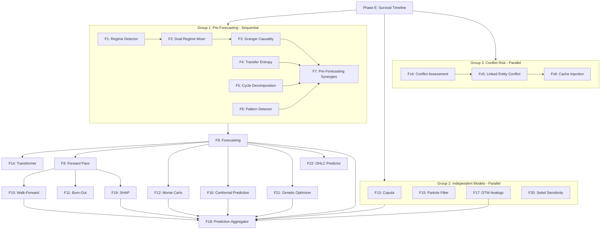

# Pipeline Flow Quality Upgrade Plan

Based on the design effectiveness analysis of the complete data flow map (593 lines, 8 phases, 40+ modules). Addresses the 5 structural concerns identified while preserving the pipeline's existing strengths.

---

## Upgrade 1: Phase F Parallelization

**Problem:** Phase F has 22 temporal models running sequentially. Many are independent of each other. This is the biggest time bottleneck (Phase F takes 15-30 minutes of a 30-60 minute pipeline run).

**Current flow:**
```
F1 -> F2 -> F3 -> F4 -> F5 -> F6 -> F7 -> F8 -> F9 -> F10 -> F11 -> F12 -> F13 -> F14 -> F15 -> F16 -> F17 -> F18 -> F19 -> F20 -> F21 -> F22
```

**Proposed flow with parallelization groups:**



**Implementation:**

New file: `operator1/steps/parallel_executor.py`

```python
from concurrent.futures import ThreadPoolExecutor, as_completed

def run_parallel_models(cache, tasks, max_workers=4):
    """Run independent model tasks in parallel.
    
    Parameters
    ----------
    cache: pd.DataFrame (read-only during parallel execution)
    tasks: list of (name, callable, kwargs) tuples
    max_workers: thread pool size
    
    Returns dict of name -> result
    """
    results = {}
    with ThreadPoolExecutor(max_workers=max_workers) as executor:
        futures = {
            executor.submit(fn, cache=cache, **kw): name
            for name, fn, kw in tasks
        }
        for future in as_completed(futures):
            name = futures[future]
            try:
                results[name] = future.result()
            except Exception as exc:
                logger.warning("Parallel model %s failed: %s", name, exc)
                results[name] = None
    return results
```

**Parallel groups:**
- Group 2 models (Copula, Particle Filter, DTW, Sobol) only read from cache, never write. Safe for threading.
- Group 3 (Conflict Risk) only needs country_iso2 from VerifiedTarget. Can run in parallel with Phase C.

**Expected speedup:** 30-40% reduction in Phase F time (Group 2 models take 2-5 minutes each sequentially).

### Steps
- [ ] Create `operator1/steps/parallel_executor.py` with `run_parallel_models()`
- [ ] Identify read-only models in Phase F (Group 2: F13, F15, F17, F20)
- [ ] Refactor main.py to run Group 2 in parallel
- [ ] Run conflict risk assessment (Fx4-Fx6) in parallel with Phase C
- [ ] Add thread safety guard: models in parallel group must not write to cache
- [ ] Test: verify parallel results match sequential results

---

## Upgrade 2: Profile Schema Validation

**Problem:** Profile is a raw `dict[str, Any]` with 25+ keys. No compile-time or import-time validation between the profile builder (G1) and report generator (H1). Bug 6 (missing conflict_risk key) was caused by this gap.

**Solution:** Create a `ProfileSchema` dataclass that defines all expected sections.

New file: `operator1/report/profile_schema.py`

```python
@dataclass
class ProfileSchema:
    """Schema for the company profile dict.
    
    Every field in this schema must be populated by
    build_company_profile() and consumed by generate_report().
    Adding a field here without wiring it causes a test failure.
    """
    identity: dict
    current_state: dict
    historical: dict
    survival: dict
    survival_episodes: dict
    vanity: dict
    linked_entities: dict
    regimes: dict
    predictions: dict
    monte_carlo: dict
    model_metrics: dict
    filters: dict
    graph_risk: dict
    game_theory: dict
    fuzzy_protection: dict
    pid_controller: dict
    financial_health: dict
    sentiment: dict
    peer_ranking: dict
    macro_quadrant: dict
    conflict_risk: dict         # NEW
    data_quality: dict
    estimation: dict
    failed_modules: dict
    meta: dict
    
    # Extended models (optional, populated when modules run)
    extended_models: dict = field(default_factory=dict)
    ohlc_predictions: dict = field(default_factory=dict)
    
    @classmethod
    def validate(cls, profile: dict) -> list[str]:
        """Return list of missing required keys."""
        required = {f.name for f in fields(cls) if f.default is MISSING}
        return [k for k in required if k not in profile]
```

### Steps
- [ ] Create `operator1/report/profile_schema.py` with `ProfileSchema` dataclass
- [ ] Add `ProfileSchema.validate(profile)` call in `build_company_profile()` return path
- [ ] Add `ProfileSchema.validate(profile)` call in `generate_report()` entry point
- [ ] Add test: `test_profile_schema_completeness` verifies all schema keys are present in a test profile
- [ ] Add test: `test_report_reads_all_schema_keys` verifies report generator reads every schema key

---

## Upgrade 3: Cache Column Namespacing

**Problem:** By Phase F, the cache DataFrame has 200+ columns from different modules with no formal namespace. Risk of collisions and confusion about which module produced which column.

**Solution:** Formalize the existing partial convention into a strict namespace registry.

Update `operator1/steps/cache_builder.py`:

```python
# Column namespace registry -- every module must register its output columns.
COLUMN_NAMESPACES = {
    "core": ["close", "open", "high", "low", "volume", "adjusted_close"],
    "stmt": ["revenue", "net_income", "total_assets", ...],  # financial statements
    "derived": ["return_1d", "volatility_21d", "current_ratio", ...],
    "fh_": ["fh_liquidity_score", "fh_composite_score", ...],
    "regime_": ["regime_hmm", "regime_gmm", "regime_label", ...],
    "survival_": ["company_survival_mode_flag", "survival_intensity", ...],
    "macro_": ["gdp_growth", "inflation_rate_yoy", ...],
    "peer_": ["peer_return_rank", "peer_volatility_rank", ...],
    "sentiment_": ["sentiment_score", "sentiment_momentum_21d", ...],
    "conflict_": ["country_conflict_flag", "conflict_intensity_score", ...],
    "vanity_": ["vanity_score", "vanity_label", ...],
    "hierarchy_": ["hierarchy_tier1_weight", ...],
    "is_missing_": ["is_missing_revenue", ...],  # companion flags
    "invalid_math_": ["invalid_math_current_ratio", ...],
}

def validate_cache_columns(cache: pd.DataFrame) -> list[str]:
    """Return list of columns not in any registered namespace."""
    all_known = set()
    for cols in COLUMN_NAMESPACES.values():
        all_known.update(cols)
    # Also allow any column that starts with a known prefix
    known_prefixes = [k for k in COLUMN_NAMESPACES if k.endswith("_")]
    unknown = []
    for col in cache.columns:
        if col in all_known:
            continue
        if any(col.startswith(p) for p in known_prefixes):
            continue
        unknown.append(col)
    return unknown
```

### Steps
- [ ] Define `COLUMN_NAMESPACES` in `cache_builder.py`
- [ ] Add `validate_cache_columns()` function
- [ ] Call it at the end of Phase C (feature engineering) as a diagnostic
- [ ] Log any unregistered columns as warnings
- [ ] Add conflict risk columns to the namespace registry

---

## Upgrade 4: Historical Conflict Risk Time-Varying

**Problem:** Conflict risk currently sets constant daily columns (same value for all 730 days). A company in Ukraine that was peaceful in 2023 but at war in 2024 shows the same conflict_intensity_score for both years.

**Solution:** For countries in the `ACTIVE_WAR_COUNTRIES` list, use the war start date to create time-varying conflict flags.

```python
# Add to conflict_risk.py
CONFLICT_START_DATES = {
    "UA": "2022-02-24",   # Russia-Ukraine war
    "PS": "2023-10-07",   # Israel-Palestine escalation
    "SD": "2023-04-15",   # Sudan civil war
    "MM": "2021-02-01",   # Myanmar coup + civil war
    "ET": "2020-11-04",   # Tigray war (ended 2022-11-03, Amhara ongoing)
}

def inject_time_varying_conflict(cache, country_iso2, conflict_result):
    """Set conflict flags to 0 before the conflict start date."""
    start = CONFLICT_START_DATES.get(country_iso2)
    if start and conflict_result.country_conflict_flag:
        start_ts = pd.Timestamp(start)
        pre_conflict = cache.index < start_ts
        cache.loc[pre_conflict, "country_conflict_flag"] = 0
        cache.loc[pre_conflict, "company_conflict_flag"] = 0
        cache.loc[pre_conflict, "conflict_intensity_score"] = 0.0
    return cache
```

### Steps
- [ ] Add `CONFLICT_START_DATES` dict to `conflict_risk.py`
- [ ] Create `inject_time_varying_conflict()` helper
- [ ] Call after `inject_conflict_risk_into_cache()` when country is in active wars
- [ ] Add test: Ukraine cache shows flag=0 before 2022-02-24 and flag=1 after
- [ ] Update docstring to document time-varying behavior

---

## Upgrade 5: Estimation-Conflict Integration

**Problem:** The estimation engine (D1) classifies missing data as MAR or MNAR. But data from conflict-zone companies may be missing because the company stopped filing (MNAR caused by conflict), not because of random data gaps. The estimator doesn't know this.

**Solution:** Pass conflict risk context to the estimator so it can classify conflict-driven missingness as MNAR.

```python
# In estimator.py, add conflict-aware missingness classification
def _classify_conflict_missingness(cache, conflict_result):
    """If country is in conflict, classify filing gaps as MNAR.
    
    Filing gaps during conflict periods are not random -- they're
    caused by infrastructure disruption, regulatory collapse, or
    company operational failure. These should be estimated with
    MNAR methods (Heckman Selection, Pattern-Mixture) rather than
    MAR methods (MICE, GP, Matrix Completion).
    """
    if not conflict_result.country_conflict_flag:
        return  # no conflict, use default classification
    
    # Find financial statement columns with sudden missingness
    # during the conflict period
    for col in STATEMENT_FIELDS:
        if col not in cache.columns:
            continue
        # If data was available before conflict but missing after,
        # classify as MNAR
        ...
```

### Steps
- [ ] Add `conflict_context` parameter to `run_estimation()`
- [ ] In missingness classifier, check if conflict flag is active
- [ ] Reclassify sudden-onset missingness during conflict as MNAR
- [ ] Add test: conflict-zone company's missing data routes to MNAR estimator
- [ ] Document the conflict-aware estimation in the estimator docstring

---

## Priority Order

| # | Upgrade | Impact | Complexity | Priority |
|---|---------|--------|-----------|----------|
| 1 | Phase F Parallelization | High (30-40% speedup) | Medium | 1st |
| 2 | Profile Schema Validation | High (prevents wiring bugs) | Low | 2nd |
| 4 | Historical Conflict Time-Varying | Medium (data accuracy) | Low | 3rd |
| 3 | Cache Column Namespacing | Medium (maintainability) | Low | 4th |
| 5 | Estimation-Conflict Integration | Medium (model accuracy) | Medium | 5th |

---

## Non-Goals (Preserved Strengths)

These aspects of the current design should NOT be changed:
- **Layered PIT guarantees** (A2/A3/D1/T4.4) -- keep the sequential validation chain
- **Graceful degradation** (try/except + fallback chains) -- keep everywhere
- **Survival-first hierarchy** (5-tier weighted system) -- keep dynamic weighting
- **Multi-model ensemble** (inverse-RMSE + conformal + copula) -- keep the prediction aggregator architecture
- **Single daily cache DataFrame** -- despite the column growth, replacing it with a columnar store would be a massive refactor for marginal benefit
