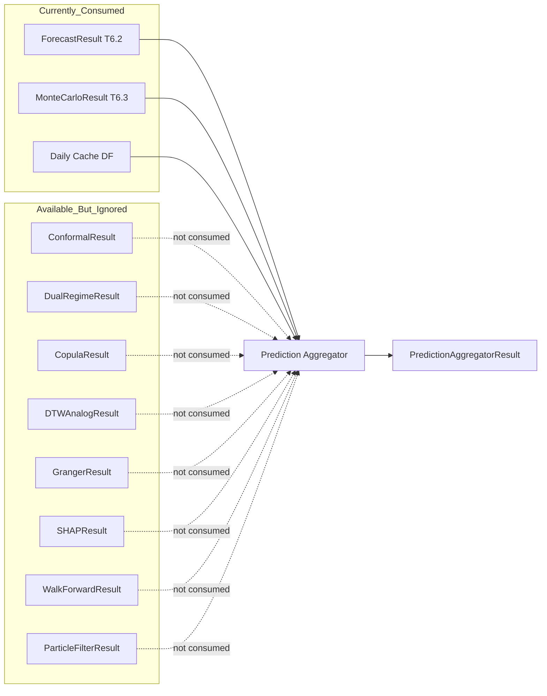
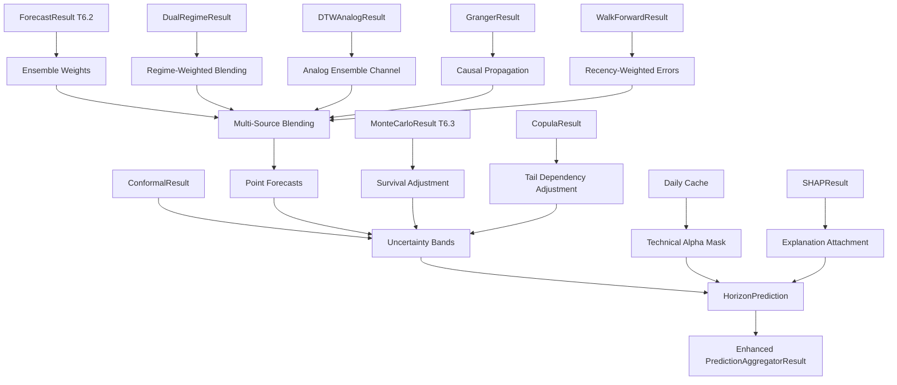

# Prediction Aggregator Full-Potential Upgrade Plan

## Current State Analysis

[`prediction_aggregator.py`](operator1/models/prediction_aggregator.py) (1288 lines) is T6.4 -- the final module in Phase 6. It consumes outputs from T6.1 (regime detection), T6.2 (forecasting), and T6.3 (Monte Carlo) to produce unified multi-horizon predictions.

### What it does today:
- Inverse-RMSE ensemble weighting + GA-optimized weights via `differential_evolution`
- RMSE-based uncertainty bands scaled by `sqrt(horizon)` (Gaussian assumption)
- Survival-adjusted band widening from Monte Carlo survival probabilities
- Confidence scoring via geometric mean of model quality and survival probability
- Technical Alpha masking (OHLC masked except Low)
- Survival-aware mode weighting with exponential transition blending
- Iterative multi-step prediction with stochastic MC paths
- Persistence to parquet + JSON

### What it DOES NOT consume but EXISTS in the codebase:

The aggregator ignores results from **8 sibling modules** that are already implemented and producing outputs. This is the core gap.

---

## Gap Analysis: Unused Results



### Gap 1: Conformal Prediction Intervals -- [`conformal.py`](operator1/models/conformal.py)

**Impact: HIGH** -- This is the single biggest upgrade.

Currently, uncertainty bands use `z_score * RMSE * sqrt(horizon)` which assumes Gaussian errors. The [`ConformalResult`](operator1/models/conformal.py:70) provides distribution-free intervals with **guaranteed finite-sample coverage** regardless of fat tails, regime switches, or non-stationarity.

**Upgrade**: When a `ConformalResult` is available, use its calibrated quantiles instead of the RMSE-based Gaussian spread. Fall back to the current method when conformal scores are insufficient.

### Gap 2: Dual Regime Probabilities -- [`regime_mixer.py`](operator1/models/regime_mixer.py)

**Impact: HIGH** -- Soft blending instead of hard regime labels.

Currently, [`run_prediction_aggregation()`](operator1/models/prediction_aggregator.py:1051) only reads `regime_label` (a single string) from the cache. The [`DualRegimeResult`](operator1/models/regime_mixer.py:44) provides:
- Market regime probabilities (bull/bear/high_vol/low_vol) as continuous floats
- Fundamental regime probabilities (healthy/stressed/distress)
- Pre-computed blended weights for prediction combination

**Upgrade**: Use regime probability vectors to do soft-weighted ensemble blending instead of hard regime switching. Weight models by their affinity to the current regime mixture.

### Gap 3: Copula Tail Dependencies -- [`copula.py`](operator1/models/copula.py)

**Impact: MEDIUM** -- Correlated tail risk adjustment.

The [`CopulaResult`](operator1/models/copula.py:27) provides tail dependence coefficients and joint crisis probabilities between variables. Currently, each variable's uncertainty band is computed independently.

**Upgrade**: When copula tail dependence is high, widen bands for correlated variables simultaneously. Use `joint_crisis_probability` as an additional survival risk multiplier.

### Gap 4: DTW Historical Analogs -- [`dtw_analogs.py`](operator1/models/dtw_analogs.py)

**Impact: MEDIUM** -- Independent empirical forecast channel.

The [`DTWAnalogResult`](operator1/models/dtw_analogs.py:79) provides empirical return distributions from historical pattern matches, including `empirical_return_mean`, `empirical_return_p5`, `empirical_return_p95`.

**Upgrade**: Add DTW analogs as an independent forecast channel in the ensemble. Use the empirical distribution as a Bayesian prior that gets blended with the model-based forecasts.

### Gap 5: Granger Causal Structure -- [`granger_causality.py`](operator1/models/granger_causality.py)

**Impact: MEDIUM** -- Causal-informed variable ordering.

The [`GrangerResult`](operator1/models/granger_causality.py:26) identifies which variables causally drive others. Currently, each variable is predicted independently.

**Upgrade**: When Granger links exist, propagate forecast adjustments from causal drivers to dependent variables (e.g., if interest rates Granger-cause debt_to_equity, adjust debt_to_equity forecast when rates forecast shifts).

### Gap 6: SHAP Explanations -- [`explainability.py`](operator1/models/explainability.py)

**Impact: LOW** -- Interpretability pass-through.

The [`SHAPResult`](operator1/models/explainability.py:90) provides per-variable feature importance and narratives. Currently not surfaced in the aggregator result.

**Upgrade**: Attach SHAP explanations to each `HorizonPrediction` so downstream consumers (profile builder, reports) can explain why each prediction was made.

### Gap 7: Walk-Forward Rich Diagnostics -- [`walk_forward.py`](operator1/models/walk_forward.py)

**Impact: LOW** -- Already partially consumed via `mode_weights`.

The [`WalkForwardResult`](operator1/models/walk_forward.py:93) has per-day error records and retrain dates. The aggregator already accepts `mode_weights` but doesn't use `day_errors` for recent-window adaptive weighting.

**Upgrade**: Use the last N days of walk-forward errors to compute a recency-weighted RMSE for ensemble weighting, so models that have been accurate recently get more weight.

### Gap 8: Particle Filter Estimates -- [`particle_filter.py`](operator1/models/particle_filter.py)

**Impact: LOW** -- Model synergy integration.

The [`model_synergies.py`](operator1/models/model_synergies.py) module already has [`fuse_kalman_particle_estimates()`](operator1/models/model_synergies.py:35) that blends Kalman and Particle Filter outputs by regime. This isn't called from the aggregator.

**Upgrade**: When both Kalman and Particle filter results are available, use the regime-conditional fusion from model_synergies before ensemble weighting.

---

## Proposed Upgrade Architecture



---

## Implementation Plan

### Phase 1: Conformal Interval Integration (Gap 1)

1. Add optional `conformal_result: ConformalResult | None` parameter to [`run_prediction_aggregation()`](operator1/models/prediction_aggregator.py:1051)
2. In [`compute_uncertainty_bands()`](operator1/models/prediction_aggregator.py:371), check for a matching conformal interval first; if available and calibrated with enough scores, use its quantiles; otherwise fall back to current RMSE-based bands
3. Add `interval_source: str` field to [`HorizonPrediction`](operator1/models/prediction_aggregator.py:106) to track whether conformal or RMSE-based bands were used
4. Update tests to cover conformal path

### Phase 2: Regime Probability Blending (Gap 2)

1. Add optional `dual_regime: DualRegimeResult | None` parameter to [`run_prediction_aggregation()`](operator1/models/prediction_aggregator.py:1051)
2. Create `compute_regime_blended_weights()` that takes ensemble weights and regime probabilities, producing a soft-blended weight vector
3. Use `market_regime_probs` and `fund_regime_probs` to modulate ensemble weights -- models known to perform better in bear markets get upweighted when bear probability is high
4. Add `regime_blend_applied: bool` to the result

### Phase 3: Copula Tail Risk Adjustment (Gap 3)

1. Add optional `copula_result: CopulaResult | None` parameter
2. When copula `joint_crisis_probability > threshold`, multiply uncertainty band width by a tail-risk factor proportional to the joint crisis probability
3. Use `tail_dependence` coefficients to correlate band widening across variables with high co-movement

### Phase 4: DTW Analog Ensemble Channel (Gap 4)

1. Add optional `dtw_result: DTWAnalogResult | None` parameter
2. When analogs are available, add a synthetic "analog" forecast channel using `empirical_return_mean/median` applied to the last close price
3. Give it a weight in the ensemble proportional to the number and quality (DTW distance) of matches
4. Use `empirical_return_p5` / `empirical_return_p95` to cross-check model-based confidence intervals

### Phase 5: Causal Propagation + Explanations (Gaps 5, 6)

1. Add optional `granger_result: GrangerResult | None` and `shap_result: SHAPResult | None` parameters
2. When Granger causal links exist, after computing initial forecasts for all variables, do a second pass: for each variable that is a Granger-effect of another, adjust its forecast proportionally to the driver's forecast deviation from its baseline
3. Attach SHAP narratives and top feature importances to each `HorizonPrediction`
4. Add `explanation: str` and `top_drivers: list` fields to the prediction dataclass

### Phase 6: Recency-Weighted Errors + Model Synergy Fusion (Gaps 7, 8)

1. When `WalkForwardResult` is available, compute exponentially-decayed RMSE from the last 30 days of `day_errors` to replace the static RMSE from training-time metrics
2. When both Kalman and Particle filter results are in the forecast result, call `fuse_kalman_particle_estimates()` from model_synergies with the current regime probabilities before ensemble weighting

---

## Updated Data Structures

```python
@dataclass
class HorizonPrediction:
    # ... existing fields ...
    interval_source: str = "rmse"   # "conformal" or "rmse"
    explanation: str = ""            # SHAP narrative
    top_drivers: list[str] = field(default_factory=list)  # top 3 features
    analog_forecast: float | None = None  # DTW empirical forecast if available
    causal_adjustment: float = 0.0   # adjustment from Granger propagation
    regime_blend_applied: bool = False

@dataclass
class PredictionAggregatorResult:
    # ... existing fields ...
    conformal_coverage: float | None = None  # coverage level if conformal used
    copula_tail_risk: float = 0.0            # joint crisis probability
    dtw_analogs_used: int = 0                # number of analogs contributing
    granger_adjustments_applied: int = 0     # number of causal propagations
    regime_blend_method: str = ""             # "hard_label" or "soft_probability"
```

---

## Test Plan

Each phase adds tests:

| Phase | New Test Class | Validates |
|-------|---------------|-----------|
| 1 | `TestConformalIntegration` | Conformal intervals used when available; fallback to RMSE when not; `interval_source` field correct |
| 2 | `TestRegimeProbabilityBlending` | Soft weights differ from hard label weights; bear regime upweights defensive models |
| 3 | `TestCopulaTailRisk` | Bands widen when joint crisis probability is high; correlated variables widen together |
| 4 | `TestDTWAnalogChannel` | Analog forecast appears in result; ensemble weight reflects match quality |
| 5 | `TestCausalPropagation` / `TestSHAPAttachment` | Granger adjustments change forecasts; SHAP narratives attached |
| 6 | `TestRecencyWeighting` | Recent errors override static RMSE; Kalman-Particle fusion fires when both available |

All new parameters are optional with `None` defaults, so all existing tests pass without modification.

---

## Prioritized Implementation Order

The phases are ordered by impact and independence. Each phase is self-contained -- it adds an optional input, uses it when present, and falls back to existing behavior when absent. This means we can ship any subset.

**Recommended first PR**: Phases 1 + 2 (conformal intervals + regime blending) -- these are the two highest-impact upgrades and touch orthogonal parts of the code.

**Second PR**: Phases 3 + 4 (copula tail risk + DTW analogs) -- both modify uncertainty band computation and ensemble weighting.

**Third PR**: Phases 5 + 6 (causal propagation + recency weighting) -- these are the most complex and have the most cross-module dependencies.
