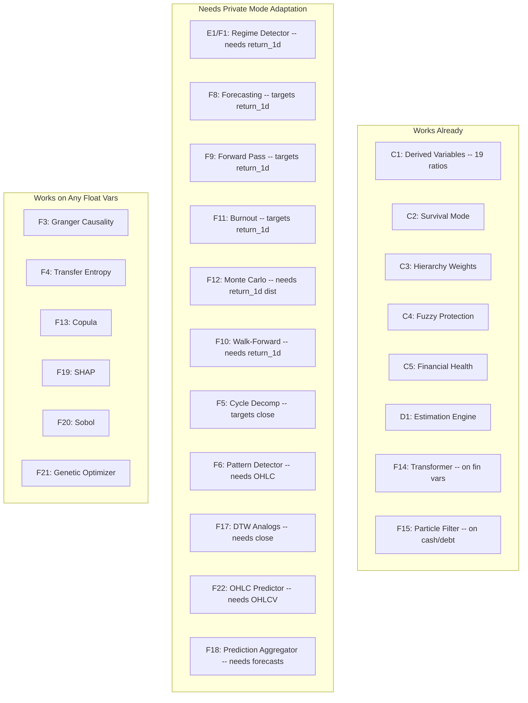
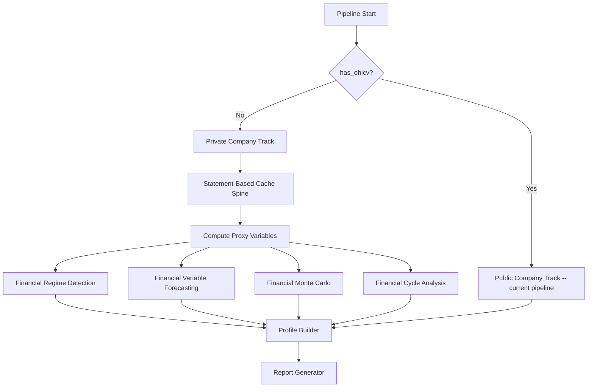
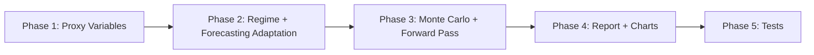

# Private Company Mode -- Models Without OHLCV Data

## Problem Statement

Many companies do not have publicly traded shares -- private companies, government entities, cooperatives, mutual companies, and pre-IPO startups. These entities still file financial statements with regulators (SEC, Companies House, CVM, etc.) but have no OHLCV price data.

Currently, when OHLCV is missing:
- 19 financial ratios are computed (from statements alone)
- Financial health scoring works (composite=75.0 in testing)
- Survival mode detection works (from financial ratios)
- Transformer forecaster works on financial variables
- But 10+ temporal models produce **empty results** because they hardcode `return_1d`, `close`, or `volatility_21d` as primary targets

The goal: create a **private company mode** where every model either (a) adapts to use financial statement variables as the primary target, or (b) has a dedicated alternative that provides equivalent analytical value using only filing data.

---

## Current Model Status Without OHLCV

---

## Architecture: Two-Track Pipeline

---

## Implementation Plan: Per-Model Adaptations

### Track 1: Proxy Variable System

**New file: `operator1/features/private_company_proxies.py`**

When OHLCV is absent, compute proxy variables that serve the same analytical role as price-derived metrics:

| OHLCV Variable | Private Company Proxy | Source | Rationale |
|---|---|---|---|
| `close` | `book_value_per_share` or `total_equity` | Balance sheet | Closest proxy for company value |
| `return_1d` | `equity_change_rate` | Quarter-over-quarter total_equity change, interpolated daily | Tracks value creation/destruction |
| `volatility_21d` | `financial_volatility` | Rolling std of equity_change_rate | Captures instability in fundamentals |
| `drawdown_252d` | `equity_drawdown` | Max decline in total_equity from peak | Tracks value erosion |
| `volume` | `revenue_velocity` | Rolling revenue change | Activity proxy |
| `market_cap` | `total_equity` | Balance sheet | Book value as market cap proxy |

**Function:** `compute_private_company_proxies(cache) -> cache`
- Detects absence of `close` column
- Computes all proxy columns
- Adds `is_private_company = True` flag to cache
- Maps proxy names to standard names via an alias dict so downstream models can consume them transparently

---

### Track 2: Model-by-Model Adaptations

#### E1/F1: Regime Detector -- `detect_financial_regimes()`

**Current:** Uses `return_1d` and `volatility_21d` for HMM/GMM
**Private mode:** Use `equity_change_rate` and `financial_volatility` as inputs

| Regime | Public Definition | Private Definition |
|---|---|---|
| Bull | Positive returns, low vol | Rising equity, improving ratios |
| Bear | Negative returns, high vol | Declining equity, deteriorating ratios |
| High Vol | High return variance | High ratio variance across quarters |
| Low Vol | Low return variance | Stable ratios across quarters |

**Change:** Add `target_variable` parameter to `run_early_regime_detection()`. Default: `return_1d`. Private mode: `equity_change_rate`. The HMM/GMM logic stays the same -- only the input variable changes.

---

#### F5: Cycle Decomposition -- `run_cycle_decomposition()`

**Current:** FFT on `close` price series
**Private mode:** FFT on `revenue_ttm` or `total_equity`

**Change:** Already accepts `variable` parameter. Just pass `variable="revenue_ttm_asof"` or `variable="total_equity"` from main.py when in private mode.

---

#### F6: Pattern Detector -- `detect_patterns()`

**Current:** Candlestick patterns from OHLC
**Private mode:** Financial statement pattern detection

**New function:** `detect_financial_patterns(cache) -> PatternResult`
- **Earnings momentum pattern:** 3+ consecutive quarters of rising/falling net_income
- **Margin compression/expansion:** Trend in gross_margin or operating_margin
- **Cash burn pattern:** Declining cash_and_equivalents with negative FCF
- **Debt spiral pattern:** Rising total_debt with declining interest_coverage
- **Recovery pattern:** Improving ratios after distress period

Returns same `PatternResult` structure so downstream consumers work unchanged.

---

#### F8: Forecasting -- `run_forecasting()`

**Current:** Targets `close`, `return_1d`, `volatility_21d` plus financial vars
**Private mode:** Targets financial variables only

**Change:** The forecasting module already forecasts any float column in the cache. The issue is the `_get_forecast_targets()` function which prioritizes price columns. Add a private company mode that:
1. Skips price targets (`close`, `return_1d`, `volatility_21d`)
2. Prioritizes: `total_equity`, `revenue`, `net_income`, `operating_cash_flow`, `free_cash_flow`, `total_debt`, `current_ratio`, `debt_to_equity_abs`
3. Uses same model chain (Kalman -> GARCH -> VAR -> LSTM -> Tree -> Baseline)

---

#### F9: Forward Pass -- `run_forward_pass()`

**Current:** Day-by-day prediction of price-based tier variables
**Private mode:** Quarter-by-quarter prediction of financial tier variables

**Change:** When `is_private_company` is True, redefine tier variables:
- Tier 1 (Liquidity): `cash_ratio`, `current_ratio`, `quick_ratio`
- Tier 2 (Solvency): `debt_to_equity_abs`, `net_debt_to_ebitda`
- Tier 3 (Stability): `financial_volatility`, `equity_drawdown`
- Tier 4 (Profitability): `net_margin`, `roe`, `roa`
- Tier 5 (Growth): `revenue_growth_yoy`, `earnings_growth_yoy`

The forward pass logic (PID controller, per-tier error tracking) stays the same.

---

#### F10: Walk-Forward -- `run_walk_forward()`

**Current:** Evaluates price prediction accuracy day-by-day
**Private mode:** Evaluates financial variable prediction accuracy quarter-by-quarter

**Change:** Set evaluation frequency to quarterly (stride=63 business days) instead of daily. Use `equity_change_rate` as the target variable.

---

#### F11: Burnout -- `run_burnout()`

**Current:** Intensive re-training on price data
**Private mode:** Same logic but on financial variables

**Change:** Same as Forward Pass -- redefine tier variables to financial metrics.

---

#### F12: Monte Carlo -- `run_monte_carlo()`

**Current:** Simulates 10,000 price paths using `return_1d` distribution per regime
**Private mode:** Simulates 10,000 financial health paths using `equity_change_rate` distribution

**New function:** `run_financial_monte_carlo(cache) -> MonteCarloResult`
- Uses `equity_change_rate` distribution (per financial regime) instead of `return_1d`
- Survival triggers remain the same: `current_ratio < 1.0`, `debt_to_equity > 3.0`, `fcf_yield < 0`
- Removes `drawdown_252d < -0.40` trigger (price-based) and replaces with `equity_drawdown < -0.40`
- Same importance sampling and regime-switching logic

---

#### F17: DTW Analogs -- `find_historical_analogs()`

**Current:** Pattern matching on `close` price windows
**Private mode:** Pattern matching on `total_equity` or `revenue_ttm` windows

**Change:** Add `variable` parameter (default `close`). Private mode passes `total_equity`.

---

#### F22: OHLC Predictor -- `predict_ohlc_series()`

**Current:** Predicts next-day/week/month/year OHLC candles
**Private mode:** Predicts next-quarter financial statement values

**New function:** `predict_financial_statements(cache, forecast_result) -> FinancialPredictionResult`
- Predicts next quarter's: revenue, net_income, total_assets, total_equity, operating_cash_flow, free_cash_flow
- Uses forecast_result point estimates with confidence intervals
- Returns in a format the report generator can display as a table

---

### Track 3: Report Generator Adaptations

**File: `operator1/report/report_generator.py`**

When `profile["meta"]["has_ohlcv"]` is False:

| Section | Public Mode | Private Mode |
|---|---|---|
| 3: Historical Performance | Price returns, Sharpe, drawdown | Revenue growth, margin trends, equity trajectory |
| 8: Temporal Analysis | Market regimes from HMM on returns | Financial regimes from HMM on equity changes |
| 9: Predictions | Price forecasts with bands | Financial variable forecasts with bands |
| 10: Technical Patterns | Candlestick patterns | Financial statement patterns |
| Charts 1,3,7,8,9.5 | Price/volatility/OHLC | Equity trajectory, revenue trend, financial health timeline |

**New chart functions for private mode:**
- `_chart_equity_trajectory()` -- Total equity over time with regime shading
- `_chart_revenue_trend()` -- Revenue TTM with growth annotations
- `_chart_financial_forecast()` -- Predicted financial metrics (table + confidence bands)

---

## Implementation Order

### Phase 1: Foundation
- [ ] Create `operator1/features/private_company_proxies.py`
- [ ] Add `is_private_company` detection in `main.py` Step 4
- [ ] Wire proxy computation after derived variables in Step 5

### Phase 2: Core Models
- [ ] Add `target_variable` param to `run_early_regime_detection()`
- [ ] Update `_get_forecast_targets()` in forecasting.py for private mode
- [ ] Pass `variable="revenue_ttm_asof"` to cycle decomposition in private mode
- [ ] Create `detect_financial_patterns()` in pattern_detector.py

### Phase 3: Simulation Models
- [ ] Create `run_financial_monte_carlo()` in monte_carlo.py
- [ ] Update forward pass tier variables for private mode
- [ ] Update walk-forward evaluation stride for quarterly data
- [ ] Update burnout tier variables for private mode
- [ ] Add `variable` param to DTW analogs

### Phase 4: Report Adaptations
- [ ] Create private mode chart functions (equity trajectory, revenue trend, financial forecast)
- [ ] Update report template sections for private mode
- [ ] Create `predict_financial_statements()` function
- [ ] Update profile builder to include private company metadata

### Phase 5: Testing
- [ ] Add `tests/test_private_company_mode.py` -- end-to-end with financial-only data
- [ ] Add private mode cases to existing model tests
- [ ] Verify report generation in private mode produces complete output

---

## Files Changed Summary

| File | Change Type | Description |
|------|------------|-------------|
| `operator1/features/private_company_proxies.py` | NEW | Proxy variable computation |
| `operator1/models/regime_detector.py` | MODIFY | Add target_variable param |
| `operator1/models/forecasting.py` | MODIFY | Private mode forecast targets |
| `operator1/models/monte_carlo.py` | MODIFY | Add financial Monte Carlo |
| `operator1/models/pattern_detector.py` | MODIFY | Add financial pattern detection |
| `operator1/models/dtw_analogs.py` | MODIFY | Add variable param |
| `operator1/models/walk_forward.py` | MODIFY | Quarterly stride option |
| `operator1/report/report_generator.py` | MODIFY | Private mode charts and sections |
| `operator1/report/profile_builder.py` | MODIFY | Private company metadata |
| `main.py` | MODIFY | Private mode detection and routing |
| `tests/test_private_company_mode.py` | NEW | End-to-end private mode tests |

---

## Design Principles

1. **No breaking changes** -- public company mode works exactly as before
2. **Automatic detection** -- pipeline detects private company from absence of OHLCV; no CLI flag needed
3. **Same result types** -- private mode functions return the same dataclasses so profile builder and report generator work with minimal changes
4. **Proxy transparency** -- downstream models do not need to know if they are running on real price data or proxy variables; the alias system handles this
5. **Graceful degradation** -- if a proxy variable cannot be computed (missing financial data), the model falls back to empty result just like today
