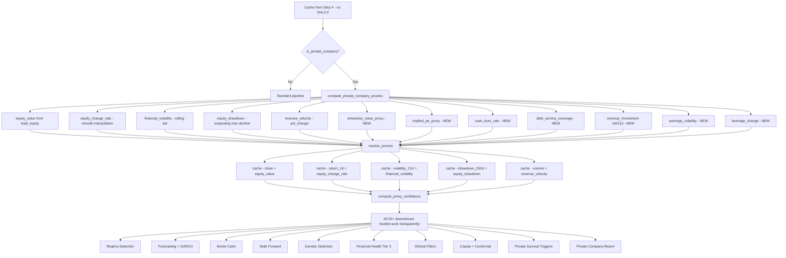

# Private Company Proxies -- Maximum Potential Design

## Current State Assessment

The current [`private_company_proxies.py`](operator1/features/private_company_proxies.py:1) computes 5 proxy variables from financial statements when OHLCV data is unavailable. These proxies are consumed by 6 of the 25+ downstream models in main.py. The remaining ~19 models either silently fail, produce empty results, or fall back to defaults when running in private company mode.

### What Works Today

| Proxy | Standard Column | Proxy Column | Method |
|-------|----------------|--------------|--------|
| Value | `close` | `equity_value` | `total_equity` or `assets - liabilities` |
| Return | `return_1d` | `equity_change_rate` | Smoothly interpolated QoQ equity change |
| Volatility | `volatility_21d` | `financial_volatility` | Rolling 63-day std, annualized |
| Drawdown | `drawdown_252d` | `equity_drawdown` | Expanding max decline |
| Volume | `volume` | `revenue_velocity` | Revenue pct_change |

### Modules That ARE Private-Aware (6/25+)

| Module | How It Adapts |
|--------|---------------|
| [`regime_detector.py`](operator1/models/regime_detector.py:660) | Accepts `equity_change_rate` as target_variable |
| [`monte_carlo.py`](operator1/models/monte_carlo.py:835) | Accepts `equity_change_rate` via `returns_col` param |
| [`cycle_decomposition.py`](operator1/models/cycle_decomposition.py:188) | main.py passes `equity_value` instead of `close` |
| [`sensitivity.py`](operator1/models/sensitivity.py:177) | main.py passes `equity_change_rate` as target |
| [`dtw_analogs.py`](operator1/models/dtw_analogs.py:216) | main.py passes financial variables list |
| [`report_generator.py`](operator1/report/report_generator.py:3034) | Generates equity trajectory chart instead of price chart |

### Modules That ARE NOT Private-Aware (19 gaps)

| Module | Hardcoded Dependency | Impact |
|--------|---------------------|--------|
| **[`genetic_optimizer.py`](operator1/models/genetic_optimizer.py:172)** | `return_1d` hardcoded at line 172; exits with error if missing | GA optimization completely fails |
| **[`walk_forward.py`](operator1/models/walk_forward.py:70)** | `close` hardcoded in `_DEFAULT_PREDICT_VARIABLES` | Walk-forward evaluation skips primary variable |
| **[`ohlc_predictor.py`](operator1/models/ohlc_predictor.py:126)** | Requires `close`, `open`, `high`, `low` | Entire OHLC prediction fails |
| **[`pattern_detector.py`](operator1/models/pattern_detector.py:168)** | Requires `open`, `high`, `low`, `close` | Candlestick detection completely fails |
| **[`forecasting.py`](operator1/models/forecasting.py:1468)** | GARCH section hardcodes `return_1d` check | GARCH model never runs |
| **[`prediction_aggregator.py`](operator1/models/prediction_aggregator.py:606)** | Hardcodes `close` for base price, `volatility_21d` for uncertainty | Prediction intervals and OHLC series fail |
| **[`copula.py`](operator1/models/copula.py:180)** | Candidate list includes `return_1d`, `volatility_21d`, `drawdown_252d` | Copula may run with fewer variables but no proxies substituted |
| **[`regime_mixer.py`](operator1/models/regime_mixer.py:112)** | Hardcodes `drawdown_252d` for fundamental regime classification | Fund regime labels miss drawdown signal |
| **[`financial_health.py`](operator1/models/financial_health.py:307)** | Stability tier uses `volatility_21d` and `drawdown_252d` | Tier 3 score always empty for private companies |
| **[`model_synergies.py`](operator1/models/model_synergies.py:777)** | Hardcodes `close`, `return_1d`, `volatility_21d` in always_keep list | Causal pruning may remove proxy variables |
| **[`ethical_filters.py`](operator1/analysis/ethical_filters.py:41)** | Purchasing power filter needs `close`; gharar filter needs `volatility_21d` | 2 of 4 ethical filters return UNAVAILABLE |
| **[`derived_variables.py`](operator1/features/derived_variables.py:155)** | Returns/risk section gated on `close` column | All return-based derived vars are NaN |
| **[`linked_aggregates.py`](operator1/features/linked_aggregates.py:30)** | `AGGREGATE_VARIABLES` includes `return_1d`, `volatility_21d`, `drawdown_252d` | Linked aggregates miss key comparison metrics |
| **[`peer_ranking.py`](operator1/features/peer_ranking.py:42)** | Ranking variables include `return_1d`, `volatility_21d`, `drawdown_252d` | Peer ranking misses market-based comparisons |
| **[`macro_alignment.py`](operator1/features/macro_alignment.py:186)** | `real_return_1d` computed from `return_1d` | Real return unavailable |
| **[`survival_mode.py`](operator1/analysis/survival_mode.py:92)** | `drawdown_252d` trigger hardcoded | One of 4 survival triggers never fires |
| **[`monte_carlo.py`](operator1/models/monte_carlo.py:69)** survival thresholds | `drawdown_252d` in `SURVIVAL_THRESHOLDS` | MC survival probability ignores drawdown channel |
| **[`forecasting.py`](operator1/models/forecasting.py:2825)** forward pass patterns | `open`, `high`, `low`, `close` used for candlestick detection in forward pass | Forward pass pattern features empty |
| **[`granger_causality.py`](operator1/models/granger_causality.py:267)** | `always_keep` defaults include `close`, `return_1d` | Granger may prune proxy variables |

---

## Design: Maximum Potential Architecture

### Principle 1: Transparent Proxy Resolution

Instead of scattering `if _is_private` checks across 25+ modules, introduce a **proxy resolver** that transparently maps standard variable names to their proxy equivalents. Modules never need to know whether they are operating on OHLCV data or proxies.

```
cache = resolve_proxies(cache)  # called once in main.py
# After this, cache["close"] contains equity_value for private companies
# cache["return_1d"] contains equity_change_rate
# All downstream modules work unchanged
```

### Principle 2: Richer Proxy Variables

The current 5 proxies cover the basics. Add 8 more proxy variables that unlock additional model functionality:

| New Proxy | Replaces | Source | Purpose |
|-----------|----------|--------|---------|
| `enterprise_value_proxy` | `market_cap` | `total_equity + total_debt - cash` | Valuation proxy for EV-based ratios |
| `implied_pe_proxy` | `pe_ratio_calc` | `equity_value / net_income` | Valuation for peer comparison |
| `cash_burn_rate` | `volume` (alternative) | `-operating_cash_flow / cash_and_equivalents` (when negative OCF) | Activity/urgency proxy |
| `debt_service_coverage` | (new) | `operating_cash_flow / interest_expense` | Solvency proxy for GARCH-style volatility |
| `revenue_momentum_5d` | `return_5d` | 5-period rolling revenue change | Short-term momentum |
| `revenue_momentum_21d` | `return_21d` | 21-period rolling revenue change | Medium-term momentum |
| `earnings_volatility` | `volatility_63d` | Rolling std of net_income change | Longer-term financial volatility |
| `balance_sheet_leverage_change` | (new) | `pct_change(total_debt / total_equity)` | Structural change signal for regime detection |

### Principle 3: Private Company Survival Triggers

Replace the OHLCV-dependent `drawdown_252d < -0.40` trigger with financial-statement-based equivalents:

| Standard Trigger | Private Proxy Trigger | Rationale |
|-----------------|----------------------|-----------|
| `drawdown_252d < -0.40` | `equity_drawdown < -0.30` | Equity erosion of 30% is equivalent distress signal |
| (enhance) `fcf_yield < 0` | `cash_burn_rate > 0.5` (burning >50% of cash per quarter) | More specific distress signal for private companies |
| (new) | `revenue_decline_4q > 0.25` (revenue dropped 25%+ over 4 quarters) | Revenue collapse signal not available from OHLCV |
| (new) | `retained_earnings < 0` (accumulated deficit) | Balance sheet insolvency signal |

### Principle 4: Private Company Ethical Filters

Replace OHLCV-dependent ethical filters with financial statement alternatives:

| Filter | Standard Input | Private Proxy | Method |
|--------|---------------|---------------|--------|
| Purchasing Power | `close` return vs inflation | `equity_value` change vs inflation | Same formula, different input |
| Gharar/Speculation | `volatility_21d` | `financial_volatility` | Same thresholds |
| (new) Transparency | N/A | Filing frequency and data completeness | Private companies with sparse filings get lower scores |

### Principle 5: Proxy Confidence Scoring

Each proxy variable should carry a confidence score that downstream models can use for weighting:

```python
# For each proxy, compute confidence based on:
# 1. Data density: how many quarterly observations back the proxy
# 2. Interpolation quality: ratio of real observations to interpolated days  
# 3. Staleness: days since last real filing
# 4. Consistency: whether the proxy moves in expected directions

proxy_confidence = {
    "equity_value": 0.85,         # high: directly from balance sheet
    "equity_change_rate": 0.60,   # medium: interpolated between quarters
    "financial_volatility": 0.45, # lower: derived from interpolated data
    "equity_drawdown": 0.75,      # good: straightforward computation
    "revenue_velocity": 0.70,     # good: direct from income statement
}
```

---

## Implementation Plan

### Phase 1: Transparent Proxy Resolution Layer

**File: [`private_company_proxies.py`](operator1/features/private_company_proxies.py)**

Add a `resolve_proxies()` function that writes proxy values INTO the standard column names, so downstream modules work without any changes:

```python
def resolve_proxies(cache: pd.DataFrame) -> pd.DataFrame:
    """Write proxy values into standard OHLCV column names.
    
    After calling this, cache["close"] contains equity_value,
    cache["return_1d"] contains equity_change_rate, etc.
    Downstream models work unchanged.
    """
    if not is_private_company(cache):
        return cache
    
    for standard, proxy in PROXY_MAP.items():
        if proxy in cache.columns and standard not in cache.columns:
            cache[standard] = cache[proxy]
        elif proxy in cache.columns and cache[standard].isna().all():
            cache[standard] = cache[proxy]
    
    return cache
```

**Also add**: `EXTENDED_PROXY_MAP` with the 8 new proxy variables, and compute them in `compute_private_company_proxies()`.

### Phase 2: Richer Proxy Variables (8 new)

Add to `compute_private_company_proxies()`:

- [ ] `enterprise_value_proxy` = equity + debt - cash
- [ ] `implied_pe_proxy` = equity_value / net_income (with safe_ratio)
- [ ] `cash_burn_rate` = -OCF / cash (when OCF negative)
- [ ] `debt_service_coverage` = OCF / interest_expense
- [ ] `revenue_momentum_5d` and `revenue_momentum_21d` (rolling pct_change)
- [ ] `earnings_volatility` (rolling std of net_income change)
- [ ] `balance_sheet_leverage_change` (pct_change of debt/equity)

### Phase 3: Private Survival Triggers

**File: [`survival_mode.py`](operator1/analysis/survival_mode.py:54)**

- [ ] Add `equity_drawdown < -0.30` as private-mode equivalent of `drawdown_252d`
- [ ] Add `cash_burn_rate > 0.5` as additional private trigger
- [ ] Add `revenue_decline_4q > 0.25` trigger
- [ ] Add `retained_earnings < 0` trigger
- [ ] Make the function detect private mode and apply the right trigger set

### Phase 4: Fix Non-Aware Downstream Modules

These modules need targeted fixes to use `get_proxy_variable()` or benefit from the transparent resolution:

- [ ] **[`genetic_optimizer.py`](operator1/models/genetic_optimizer.py:172)**: Use `get_proxy_variable("return_1d", cache)` instead of hardcoding
- [ ] **[`walk_forward.py`](operator1/models/walk_forward.py:70)**: Make `_DEFAULT_PREDICT_VARIABLES` dynamic based on what is in cache
- [ ] **[`financial_health.py`](operator1/models/financial_health.py:307)**: Use `financial_volatility` and `equity_drawdown` for Tier 3 when private
- [ ] **[`regime_mixer.py`](operator1/models/regime_mixer.py:112)**: Use `equity_drawdown` instead of `drawdown_252d` when private
- [ ] **[`model_synergies.py`](operator1/models/model_synergies.py:777)**: Make always_keep list dynamic
- [ ] **[`ethical_filters.py`](operator1/analysis/ethical_filters.py:41)**: Use `equity_value` and `financial_volatility` for purchasing power and gharar
- [ ] **[`linked_aggregates.py`](operator1/features/linked_aggregates.py:30)**: Add proxy columns to `AGGREGATE_VARIABLES`
- [ ] **[`peer_ranking.py`](operator1/features/peer_ranking.py:42)**: Add proxy columns to ranking variables
- [ ] **[`macro_alignment.py`](operator1/features/macro_alignment.py:186)**: Compute `real_equity_change_rate` using proxy
- [ ] **[`prediction_aggregator.py`](operator1/models/prediction_aggregator.py:606)**: Use `equity_value` as base price, `financial_volatility` for uncertainty
- [ ] **[`copula.py`](operator1/models/copula.py:180)**: Include proxy variable names in candidate list
- [ ] **[`forecasting.py`](operator1/models/forecasting.py:1468)**: Run GARCH on `equity_change_rate` when `return_1d` unavailable

### Phase 5: Proxy Confidence Scoring

- [ ] Add `compute_proxy_confidence()` function
- [ ] Store `proxy_confidence_*` columns in cache
- [ ] Wire confidence into profile builder for the LIMITATIONS section
- [ ] Wire confidence into prediction aggregator for uncertainty band widening

### Phase 6: Private Company Report Sections

**File: [`report_generator.py`](operator1/report/report_generator.py)**

- [ ] Add private-company-specific narrative guidance in the LLM prompt
- [ ] Replace price-chart references with equity/revenue trajectory charts
- [ ] Add a "Data Limitations -- Private Company" subsection in the report
- [ ] Generate 3 additional private-mode charts: equity trajectory with regime shading, revenue trend with survival episodes, balance sheet composition over time

### Phase 7: Tests

- [ ] Add `test_private_company_proxies.py` with:
  - Detection tests (is_private_company with various cache states)
  - Each proxy variable computation (known inputs -> expected outputs)
  - Proxy resolution (standard names populated correctly)
  - Confidence scoring
  - Private survival triggers
  - End-to-end: cache with only financial statements -> all proxies computed -> regime detection works -> forecasting works -> profile built -> report generated

---

## Flow Diagram



---

## Summary

The current module handles the basics but leaves 19 of 25+ downstream models broken or degraded in private mode. This design achieves maximum potential through:

1. **Transparent proxy resolution** -- write proxies into standard column names so modules work without modification
2. **8 new proxy variables** -- unlock EV-based valuation, cash burn rate, revenue momentum, earnings volatility, and leverage change signals
3. **Private survival triggers** -- 4 financial-statement-based distress signals that replace the OHLCV drawdown trigger
4. **Targeted fixes to 12 downstream modules** -- ensure every model produces meaningful output
5. **Confidence scoring** -- quantify how trustworthy each proxy is, feeding into uncertainty bands
6. **Private-mode report sections** -- dedicated charts and narrative for companies without market data
7. **Comprehensive tests** -- end-to-end coverage of the private company pipeline path
