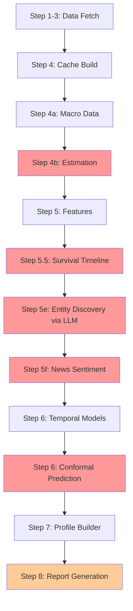
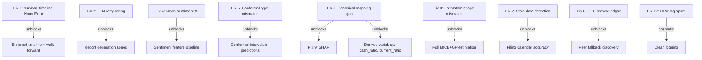

# SEC EDGAR Pipeline Bug Fixes -- Comprehensive Fix Plan

12 bugs identified from the SEC EDGAR pipeline run for Apple Inc. AAPL.
Organized by execution order in the pipeline, with dependency chains noted.

---

## Pipeline Flow Diagram



---

## Fix 1: Survival Timeline NameError -- SYNTAX ERROR

**File:** `operator1/analysis/survival_timeline.py` line 381
**Problem:** Variable `timeline` is undefined in `compute_survival_timeline`. The local variable is `daily_cache`, and the result is stored at `result.timeline`.
**Root cause:** Copy-paste from `compute_enriched_survival_timeline` where `timeline` is a local variable at line 584.
**Category:** Syntax error

**Fix:**
```python
# Line 381: Change
len(timeline),
# To
len(result.timeline),
```

**Dependency chain:** Survival timeline feeds into enriched survival timeline Phase E2, walk-forward F10, prediction aggregator F18.

---

## Fix 2: LLM Retry on Non-Retryable 400 Errors -- WIRING BUG

**File:** `operator1/clients/llm_base.py` lines 288-327
**Problem:** Line 295 raises `requests.HTTPError` for non-retryable status codes like 400. But line 320 catches `requests.RequestException` -- the parent class of `HTTPError` -- and retries. The code correctly identifies the error as non-retryable, logs it, then immediately catches its own exception and retries 5 times with exponential backoff, wasting ~65 seconds per LLM call site.
**Category:** Wiring bug -- exception hierarchy causes self-catch

**Fix:** Create a custom exception class for non-retryable errors that does NOT inherit from `requests.RequestException`:

```python
class LLMNonRetryableError(Exception):
    """Raised for non-retryable LLM API errors. Not a RequestException, so the retry catch block will not catch it."""
    def __init__(self, provider, status_code, detail):
        self.provider = provider
        self.status_code = status_code
        self.detail = detail
        super().__init__(f'{provider} API error {status_code}: {detail}')
```

Then at line 295, raise `LLMNonRetryableError` instead of `requests.HTTPError`. The `except requests.RequestException` at line 320 will NOT catch it, so it propagates up to the outer `except Exception` in the calling code.

**Dependency chain:** Fixes wasted time in entity discovery Step 5e, sentiment scoring Step 5f, and report generation Step 8.

---

## Fix 3: Estimation Shape Mismatch -- MODEL OUTPUT MISMATCH

**File:** `operator1/estimation/estimator.py` line 820
**Problem:** `_run_split_estimation` at line 944 merges MAR and MNAR results back into the DataFrame. The merge creates `(1255, 16)` but the index expects `(1255, 17)`. One column is either duplicated or omitted during the merge loop at lines 1013-1060.
**Category:** Model output problem -- column count mismatch during merge

**Fix:** The merge at lines 1013-1060 iterates over `variables` and calls `_build_estimation_columns` which adds multiple suffixed columns per variable. Need to:

1. Add logging before the DataFrame construction to dump the column list vs expected list
2. Check if `_build_estimation_columns` is adding a column that already exists, causing a duplicate
3. Add a guard: `if f'{var}_final' not in result.columns` before calling `_build_estimation_columns`
4. After the merge loop, add `result = result.loc[:, ~result.columns.duplicated()]` to deduplicate

The root cause is likely that one variable appears in both `vars_with_mar` and `vars_with_mnar` -- a variable can have both MAR and MNAR NaN values. The merge processes it twice, creating a duplicate column.

---

## Fix 4: News Sentiment Timezone Error -- MODEL INLET PROBLEM

**File:** `operator1/features/news_sentiment.py` line 180 and line 464
**Problem:** GNews returns articles with tz-aware UTC timestamps. `pd.to_datetime` preserves timezone info. When these get normalized at line 464 or reindexed against the tz-naive cache index at line 476, pandas raises `Tz-aware datetime.datetime cannot be converted to datetime64 unless utc=True`.
**Category:** Model inlet problem -- timezone mismatch between external data and cache

**Fix:** Normalize timezone at the point of ingestion. Two changes:

```python
# Line 180: Add .tz_localize(None) to strip timezone
"date": pd.to_datetime(art.get("published date", ""), errors="coerce", utc=True).tz_localize(None) if pd.notna(pd.to_datetime(art.get("published date", ""), errors="coerce")) else pd.NaT,

# Simpler approach -- line 464: Convert with utc=True then strip
articles["date"] = pd.to_datetime(articles["publishedDate"], utc=True, errors="coerce").dt.tz_localize(None).dt.normalize()
```

The simplest fix is at line 464 only -- add `utc=True` to `pd.to_datetime()` and `.dt.tz_localize(None)` to strip the timezone after conversion.

---

## Fix 5: Conformal Prediction Type Mismatch -- MODEL INLET PROBLEM

**File:** `main.py` line 1770-1772
**Problem:** `build_conformal_result` expects `forecasts` as `dict[str, dict[str, float]]` -- nested: variable -> horizon_label -> value. But `main.py` passes `_point_forecasts` as `dict[str, float]` -- flat: "var_horizon" -> value. At `conformal.py:404`, `horizon_forecasts.items()` fails because `horizon_forecasts` is a `float`.
**Category:** Model inlet problem -- wrong data structure

**Fix:** Restructure `_point_forecasts` in main.py to the nested format:

```python
# Replace lines 1760-1772 with:
_nested_forecasts: dict[str, dict[str, float]] = {}
if hasattr(forecast_result, 'forecasts'):
    for var, horizons_dict in forecast_result.forecasts.items():
        if isinstance(horizons_dict, dict):
            _nested_forecasts[var] = {}
            for h, val in horizons_dict.items():
                if val is not None:
                    try:
                        _nested_forecasts[var][h] = float(val)
                    except TypeError, ValueError:
                        pass
conformal_result = build_conformal_result(
    calibrator,
    forecasts=_nested_forecasts,
    horizons={'1d': 1, '5d': 5, '21d': 21, '252d': 252},
)
```

---

## Fix 6: All-NaN for Liquidity Variables -- DATA FLOW / CANONICAL MAPPING GAP

**File:** Multiple files in the pipeline
**Problem:** `current_assets`, `current_liabilities`, `cash_and_equivalents` are all-NaN despite canonical translator having US-GAAP mappings. The pivot produces only 10 balance sheet columns but needs ~15. The edgartools library returns XBRL data with concept names that may differ from the canonical_translator mappings.
**Category:** Data flow problem -- canonical mapping gap between edgartools output and pipeline expectations

**Investigation needed:** The edgartools library parses XBRL directly. It may use shortened names like `Assets`, `Liabilities`, `AssetsCurrent` while the canonical translator expects `us-gaap:AssetsCurrent`. Need to check:

1. What column names `us_edgar.py` `get_balance_sheet()` actually returns
2. Whether the canonical translator's `translate_financials()` is even called for EDGAR data or if edgartools already returns structured columns
3. Whether the as-of merge in main.py maps the edgartools column names to canonical names

**Fix approach:**
1. Add debug logging in `us_edgar.py` `get_balance_sheet()` to print the actual column names returned
2. Verify the translate path: edgartools -> canonical_translator -> pivot -> cache
3. If edgartools returns columns like `AssetsCurrent` without the `us-gaap:` prefix, add bare-name mappings to the US-GAAP section of canonical_translator or ensure the wrapper strips the prefix before lookup
4. The canonical_translator already has bare-name entries at lines 513-517 -- check if the code path reaches them

---

## Fix 7: Stale Data Detection 709 Days -- MODEL DESIGN PROBLEM

**File:** `operator1/features/filing_calendar.py` lines 143-154
**Problem:** Filing calendar reads `cache["filing_date"]` to determine latest filing age. After the as-of merge, `filing_date` is forward-filled from old filings. The "latest" filing_date in the cache is the most recent forward-filled value, not necessarily the actual latest filing. With only 9 periods making it through the wide-format pivot, and Apple having 10+ years of EDGAR filings with the edgartools library fetching all of them, the 2-year window filter may be dropping recent filings.
**Category:** Model design problem -- filing_date semantics lost after forward-fill

**Fix:**
1. In `filing_calendar.py` line 148, use the RAW financial statement DataFrames to determine latest filing_date, not the forward-filled cache. The raw statements are available before the as-of merge.
2. Alternatively, store `_raw_filing_dates` as a separate column in the cache that is NOT forward-filled -- just the actual filing dates with NaN on non-filing days.
3. Check that the 2-year date window filter in the EDGAR wrapper or main.py isn't overly aggressive and dropping recent Q filings.

---

## Fix 8: SEC Browse-EDGAR 503 -- WIRING PROBLEM

**File:** `operator1/clients/us_edgar.py` -- SIC-based peer lookup
**Problem:** The legacy CGI endpoint `https://www.sec.gov/cgi-bin/browse-edgar` returns 503. This deprecated endpoint is used as a fallback when Gemini entity discovery fails.
**Category:** Wiring problem -- deprecated endpoint

**Fix:** Replace the CGI-based SIC lookup with the modern EDGAR full-text search API at `https://efts.sec.gov/LATEST/search-index`. Or use the `edgartools` library's built-in company search to find peers by SIC code. The `edgartools` library likely has `get_companies(sic=35)` or similar.

---

## Fix 9: SHAP 0 Observations -- DOWNSTREAM CASCADE of Bug 6

**File:** `operator1/models/explainability.py`
**Category:** Downstream cascade -- fixing Bug 6 will fix this
**No separate fix needed.**

---

## Fix 10: Premium Report Missing Sections -- DOWNSTREAM CASCADE of Bug 2

**File:** `operator1/report/report_generator.py`
**Category:** Downstream cascade -- fixing Bug 2 will reduce wasted retry time. The actual fix is using a valid LLM key or ensuring the fallback template produces complete sections.
**Additional fix:** The fallback template logic at line 9617 detects 18 missing sections but the append mechanism should be more robust. Check that the fallback template section lookup actually matches section headings.

---

## Fix 11: HMM Non-Convergence -- MODEL LIMITATION

**File:** `operator1/models/regime_detector.py`
**Category:** Not a code bug. HMM convergence is data-dependent.
**Optional improvement:** Increase `n_init` parameter for multiple random restarts, or add a convergence warning with regime label confidence degradation.

---

## Fix 12: DTW Analog Warning Spam -- DESIGN PROBLEM

**File:** `operator1/models/dtw_analogs.py`
**Problem:** "Insufficient data for DTW analogs" warning logged on every single warmup step, hundreds of times.
**Category:** Design problem -- missing log deduplication

**Fix:** Check data length once before the warmup loop. If insufficient, log a single warning and skip the loop entirely:

```python
if len(data) < min_required:
    logger.warning('Insufficient data for DTW analogs for first %d warmup steps, skipping until data >= %d', min_required, min_required)
    # Skip until enough data
```

---

## Execution Order

The fixes should be implemented in this order based on dependency chains:



**Priority order:**
1. Fix 1 -- one-line syntax fix, unblocks survival analysis
2. Fix 2 -- exception class fix, saves ~195 seconds per run
3. Fix 4 -- one-line tz fix, unblocks sentiment feature
4. Fix 5 -- restructure dict, unblocks conformal intervals
5. Fix 6 -- canonical mapping investigation + fix, unblocks 4 variables + SHAP
6. Fix 3 -- estimation column dedup, improves estimation quality
7. Fix 7 -- filing calendar raw date access, fixes stale detection
8. Fix 8 -- replace deprecated endpoint, fixes peer fallback
9. Fix 12 -- log deduplication, cosmetic
