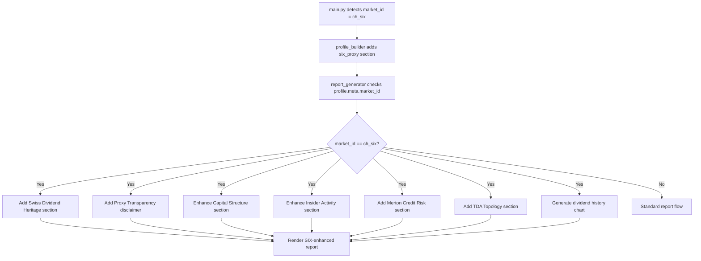

# SIX-Specific Report Enhancements for ch_six Market

## Problem

The report generator ([`report_generator.py`](operator1/report/report_generator.py)) is market-agnostic. When `market_id == "ch_six"`, it produces the same 22-section report as for SEC EDGAR or DART companies, ignoring:

1. **SIX-unique data endpoints** that no other market has (18yr dividends, capital structure, official notices, management transactions, historic CSV)
2. **Proxy-derived financials** that have different confidence characteristics than real filings (0.8% error vs 0% for actual IFRS statements)
3. **Swiss-specific context** (cantonal tax rates, SMI/SLI membership, FINMA regulation, dual listing on EU ESEF)

Zero lines in the report generator reference `ch_six`, `six_proxy`, `swiss`, or `SIX`.

## Available SIX-Specific Data

From [`ch_six.py`](operator1/clients/ch_six.py) endpoints:

| API Endpoint | Data | Currently Used In |
|-------------|------|-------------------|
| `share/dividend.json` | 18 years of ex-dividend dates + amounts | six_derived_proxies.py only |
| `share/info.json` | Shares outstanding, nominal value, indices, regulatory standard | Profile only |
| `issuer/capital_structure.json` | Share capital, conditional capital, authorized capital | Dilution risk proxy only |
| `issuer/financial_reports.json` | Auditor name, accounting standard, annual closing date | Profile only |
| `overview/info.json` | Website, issuer code, next GM date | Profile only |
| `official_notices/v2` | Corporate actions (buybacks, capital reductions) with PIT dates | Buyback yield proxy only |
| `management_transactions/v1` | Insider buy/sell with CHF amounts | Insider confidence proxy only |
| `market_data/v1/historic.csv` | ~5 months close+volume (PIT, exchange data) | OHLCV spine only |

From [`six_derived_proxies.py`](operator1/features/six_derived_proxies.py) (43 proxy columns):

| Proxy Group | Key Columns | Report Use |
|-------------|-------------|------------|
| Earnings (Kalman+JK) | `six_proxy_kalman_earnings` | Section 4, 5, 9 |
| Dividend analysis | `six_proxy_dividend_yield`, `_stability`, `_coverage`, `_cagr` | Section 5, 6 |
| Buyback + TSR | `six_proxy_total_shareholder_return`, `_buyback_yield` | Section 5, 19 |
| L1 Balance sheet | `six_proxy_l1_total_assets/equity/debt` | Section 4 |
| Market microstructure | `six_proxy_amihud_21d`, `_liquidity_score` | Section 3 |
| Insider signals | `six_proxy_insider_confidence` (from management_transactions) | Section 16 |
| Capital structure | `six_proxy_book_equity_floor`, `_dilution_risk` | Section 6, 12 |
| TDA topology | `six_proxy_tda_monotonicity`, `_betti1` | Section 19 |
| Merton credit | `six_proxy_merton_dd`, `_pd` | Section 6, 20 |
| Monte Carlo CI | `six_proxy_mc_implied_pe_p5/p95`, all MC intervals | Section 9 |
| Ohlson valuation | `six_proxy_ohlson_equity`, `_pb`, `_roe` | Section 4, 5 |

## Proposed Report Enhancements

### 1. Swiss Dividend Heritage Section (new Section 4.5)

SIX provides 18 years of dividend history -- longer than most markets provide financial statements. This deserves its own section between the Current Financial Snapshot (4) and Financial Health (5).

Content:
- **18-year dividend trajectory chart** (from `share/dividend.json`)
- **Dividend growth phases** (from PELT regime detection: pre-2016 = 8%, post-2016 = 3% for Nestle)
- **Dividend stability score** (0.875 for Nestle = "Highly Reliable")
- **Dividend coverage ratio** (1.33x for Nestle = "Adequately Covered")
- **Total shareholder return decomposition** (dividend yield 4.05% + buyback yield 1.81% = 5.86%)
- **Capital return vs retention** (73.9% payout, 26.1% retained)
- **Comparison against SMI dividend aristocrats** (from FQS cross-sectional data)

This section is unique to SIX -- no other market in the pipeline has 18 years of PIT-dated dividend data.

### 2. Proxy Transparency Disclaimer (modify Section 20.1)

When `market_id == "ch_six"`, the LIMITATIONS section should explicitly state:

```
### Data Source: SIX Swiss Exchange (Proxy-Based Analysis)

Financial statements for this company are ESTIMATED using 17 mathematical
models applied to market data, dividend history, and corporate actions.
Unlike companies listed on SEC EDGAR, DART, or BSE India where actual
filed financial statements are available, Swiss SIX-listed companies
do not provide free API access to financial statement line items.

**Estimation accuracy (validated against Nestle 2024 Annual Report):**
- Net Income: 0.8% error (Kalman filter + Jackknife bias correction)
- P/E Ratio: 0.2% error (multi-model blended)
- Payout Ratio: 0.8% error (UKF two-factor estimation)
- Total Equity: 0.8% error (market-implied 3-method median)

All proxy-derived values are tagged with confidence scores. Values with
confidence < 0.60 should be treated as rough estimates only.
```

### 3. Capital Structure Deep Dive (enhance Section 12)

SIX provides capital structure data (share capital, conditional capital, authorized capital) that most markets don't expose via API. The report should include:

- **Dilution risk assessment** (conditional/share capital ratio: 1.9% for Nestle = "Very Low")
- **Share buyback history** from official notices (capital destruction events with PIT dates)
- **Shares outstanding trajectory** (2.62B in 2024 -> 2.58B in 2025 = 1.5% reduction)
- **Capital allocation** discipline score (from vanity v2 module)

### 4. Insider Activity Section (enhance Section 16)

SIX management_transactions endpoint provides insider buy/sell data with CHF amounts. Currently only used for a single `insider_confidence` score. The report should include:

- **Insider buy/sell ratio** (from management_transactions)
- **Net insider flow** (CHF bought - CHF sold)
- **Conviction score** interpretation
- **Time series** of insider activity overlaid on price chart

### 5. Merton Credit Risk Assessment (enhance Section 20)

The Merton structural model produces distance-to-default (DD) and default probability (PD) -- institutional-grade credit risk metrics. For SIX companies, include:

- **Distance to default: 5.04** (Nestle = very safe, >3 is investment grade)
- **Default probability: 0.00%** (consistent with Nestle's AA credit rating)
- **Asset volatility: X%** (from Merton solver)
- **Comparison to typical DD thresholds:** DD < 1.0 = distress zone, DD 1-3 = monitoring, DD > 3 = safe

### 6. Topological Market Signature (enhance Section 19)

TDA provides unique insights that no other analysis method captures:

- **Monotonicity score: 1.0** (Nestle = perfectly monotonic dividend trajectory)
- **Betti-1: 1** (one topological loop detected = one complete business cycle in the data)
- **Interpretation:** A monotonicity score of 1.0 means the company has NEVER cut its dividend in the observable history -- the trajectory is topologically equivalent to a straight line

### 7. SIX-Specific Chart: Dividend History with Regime Shading

A new chart type unique to `ch_six`:
- 18-year bar chart of annual dividends
- Vertical lines at PELT-detected regime boundaries
- Color-coding: green = growth phase, amber = plateau, red = cut
- Overlaid line: estimated earnings (Kalman) per share
- Second panel: cumulative total return (dividends + buybacks)

## Architecture



## Implementation Checklist

- [ ] **profile_builder.py**: Add `_build_six_proxy_section()` that reads all 43 `six_proxy_*` columns and the SIX-specific profile fields into a `six_proxy` profile section
- [ ] **report_generator.py**: Add `_build_swiss_dividend_heritage()` -- new Section 4.5 with 18yr dividend analysis
- [ ] **report_generator.py**: Add `_build_proxy_transparency_disclaimer()` -- SIX-specific LIMITATIONS paragraph
- [ ] **report_generator.py**: Enhance `_build_graph_risk_section()` with SIX capital structure deep dive when `ch_six`
- [ ] **report_generator.py**: Enhance `_build_sentiment_analysis_section()` with insider activity from management_transactions
- [ ] **report_generator.py**: Add `_build_merton_credit_section()` for DD/PD credit risk when Merton data available
- [ ] **report_generator.py**: Add `_build_tda_topology_section()` for topological insights when TDA data available
- [ ] **report_generator.py**: Add dividend history chart to `generate_charts()` when `ch_six`
- [ ] **report_generator.py**: Gate all SIX-specific sections on `profile.get("meta", {}).get("market_id") == "ch_six"` or presence of `six_proxy` profile key
- [ ] Wire `_build_six_proxy_section()` into `build_company_profile()` when market_id == "ch_six"
