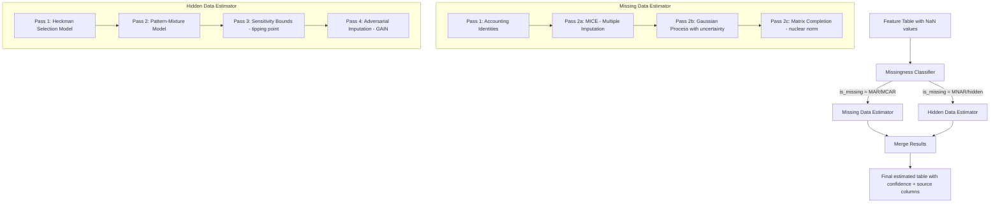

# Split Estimator Architecture: Missing Data vs Hidden Data

## Problem Statement

The current [`estimator.py`](operator1/estimation/estimator.py) treats all NaN values the same -- it does not distinguish between:

1. **Missing data (MAR/MCAR)**: Values absent because the API did not return them, the filing period hasn't arrived yet, or the data source lacks coverage. The missingness is unrelated to the value itself.

2. **Hidden data (MNAR)**: Values deliberately concealed, aggregated, or omitted by the reporting entity. Companies may lump line items, report in non-standard formats, or minimize disclosure. The fact that data is hidden *carries information* -- companies hide things for a reason.

These two types of missingness require fundamentally different mathematical treatments.

---

## Current Architecture

```
estimator.py
  Pass 1: Deterministic identity fill (accounting identities)
  Pass 2: BayesianRidge rolling imputer OR VAE imputer
    - Treats all NaN identically
    - No missingness mechanism modeling
    - No selection bias correction
```

## Proposed Architecture



---

## Part 1: Missingness Classifier

Before routing to either estimator, we need to classify *why* each value is null. This is a new module: `missingness_classifier.py`.

### Classification Rules

| Signal | Classification | Rationale |
|--------|---------------|-----------|
| API returned the field but value is null | MAR | Data source gap |
| Filing exists but field not present | MNAR | Company chose not to report |
| Field present in peers but absent for target | MNAR | Selective disclosure |
| Field was present in prior periods but vanished | MNAR | Reporting change, likely hiding deterioration |
| Field never existed for this market/region | MAR | Structural data gap |
| Filing period has not arrived yet | MAR | Temporal gap |
| Value is suspiciously aggregated (e.g. single "other" line item is unusually large) | MNAR | Deliberate obscuring |
| `is_missing_X` flag = 1 AND peer coverage > 80% | MNAR | Company-specific omission |
| `is_missing_X` flag = 1 AND peer coverage < 30% | MAR | Market-wide data gap |

### Output

For each variable `X`, adds:
- `X_missingness_type`: `"mar"`, `"mcar"`, `"mnar"`, or `"structural"`
- `X_missingness_confidence`: float in [0, 1] indicating how certain the classification is

---

## Part 2: Missing Data Estimator (MAR/MCAR)

**File**: `operator1/estimation/missing_data_estimator.py`

This estimator handles genuinely absent data where the missingness mechanism is independent of (or only weakly related to) the missing value itself.

### Pass 1: Accounting Identities (unchanged)

Keep the existing deterministic identity fill from [`estimator.py`](operator1/estimation/estimator.py:67). This is mathematically exact and should always run first.

### Pass 2a: MICE (Multiple Imputation by Chained Equations)

**Why**: MICE is the gold standard for MAR data. Unlike BayesianRidge (which imputes one variable at a time independently), MICE iteratively imputes each variable conditional on all others, converging to a joint distribution.

**Math**:
```
For each variable X_j with missing values:
  1. Initialize missing values with column mean
  2. For iteration i = 1..I:
     For each variable j = 1..p with missing values:
       - Fit regression: X_j ~ f(X_{-j})  using observed X_j rows
       - Draw from posterior predictive: X_j^{miss} ~ P(X_j | X_{-j}, theta_j)
  3. Pool M=5 imputed datasets using Rubin's rules for variance estimation
```

**Upgrade over current**: The current BayesianRidge imputes each variable independently. MICE captures cross-variable dependencies iteratively.

**Implementation**: Use `sklearn.experimental.enable_iterative_imputer` + `IterativeImputer` with `BayesianRidge` estimator, `max_iter=25`, `n_nearest_features=10`, `sample_posterior=True`.

### Pass 2b: Gaussian Process Regression (uncertainty quantification)

**Why**: GP provides calibrated uncertainty estimates naturally. For financial data where we need to know *how confident* we are in an imputation, GP posterior variance is mathematically principled.

**Math**:
```
f(x) ~ GP(m(x), k(x, x'))

where:
  m(x) = prior mean function (zero or linear trend)
  k(x, x') = Matern-5/2 kernel (smooth but not infinitely differentiable - 
              matches financial data properties)

Posterior at missing point x*:
  mu* = k(x*, X) [K + sigma^2 I]^{-1} y
  sigma*^2 = k(x*, x*) - k(x*, X) [K + sigma^2 I]^{-1} k(X, x*)

Confidence = 1 - sigma*/max_sigma  (normalized posterior std)
```

**Upgrade over current**: Replaces the ad-hoc confidence scoring (`r2 * train_frac`) with mathematically grounded posterior uncertainty from the GP.

**Implementation**: `sklearn.gaussian_process.GaussianProcessRegressor` with `Matern(nu=2.5)` kernel. Use sparse GP approximation (`n_inducing=100`) for datasets >500 rows.

### Pass 2c: Matrix Completion (nuclear norm minimization)

**Why**: Treats the entire feature table as a low-rank matrix. Financial data IS low-rank -- most variation is explained by a few latent factors (market beta, size, value, momentum). Matrix completion exploits this structure globally.

**Math**:
```
minimize  ||M||_*  (nuclear norm = sum of singular values)
subject to  M_{ij} = X_{ij}  for all observed (i,j)

Solved via Soft-Impute algorithm:
  1. Initialize M = 0 for missing entries
  2. Compute SVD: M = U * diag(sigma) * V^T
  3. Soft-threshold: sigma_i = max(sigma_i - lambda, 0)
  4. Reconstruct: M = U * diag(sigma_shrunk) * V^T
  5. Replace observed entries back
  6. Repeat until convergence
```

**Upgrade over current**: The VAE tries to learn this low-rank structure but is overkill for the linear case and underperforms when data is scarce. Nuclear norm minimization has theoretical guarantees for exact recovery when the matrix is truly low-rank.

**Implementation**: Custom implementation using `numpy.linalg.svd` with soft-thresholding. Lightweight, no extra dependencies.

### Ensemble Strategy

The three methods vote:
```
final_estimate = weighted_median(MICE_estimate, GP_estimate, MatrixCompletion_estimate)
weights proportional to: 1/variance_of_each_estimator
confidence = 1 - normalized_disagreement_across_methods
```

---

## Part 3: Hidden Data Estimator (MNAR)

**File**: `operator1/estimation/hidden_data_estimator.py`

This estimator handles data that is *deliberately* concealed. The key insight: **the probability of observing the value depends on the value itself**. Companies hide bad numbers.

### Pass 1: Heckman Selection Model (two-stage)

**Why**: The Heckman model explicitly models the selection mechanism -- *why* a company chose not to report a value. This corrects the selection bias that makes naive imputation systematically wrong for hidden data.

**Math**:
```
Stage 1 - Selection equation (probit):
  P(observed | Z) = Phi(Z * gamma)
  
  where Z = [peer_disclosure_rate, market_cap_decile, audit_quality, 
             filing_complexity, regulatory_stringency, prior_period_value]

Stage 2 - Outcome equation (OLS with correction):
  X = W * beta + rho * sigma * lambda(Z * gamma) + epsilon
  
  where lambda(.) = phi(.)/Phi(.) is the inverse Mills ratio
  (correction term for selection bias)
```

**Why this matters**: If a company hides its debt-to-equity ratio, naive imputation from peers gives the *average* peer value. But the Heckman model recognizes that companies that hide debt ratios tend to have *worse* ratios, and corrects upward (more debt).

**Implementation**: Two-step estimator using `statsmodels.discrete.discrete_model.Probit` for Stage 1 and OLS with the inverse Mills ratio added as a regressor for Stage 2. Already in requirements.

### Pass 2: Pattern-Mixture Model

**Why**: Instead of modeling *why* data is missing (selection model), pattern-mixture models fit *separate distributions* for each missingness pattern. Companies that hide certain combinations of variables form distinct "patterns" with different underlying distributions.

**Math**:
```
For each missingness pattern r (binary vector of which vars are observed):
  P(X | r) = separate distribution
  
  X_hidden ~ P(X | r=hidden_pattern)  != P(X | r=observed_pattern)

Mixture:
  P(X) = sum_r P(X | r) * P(r)

Identification constraint:
  P(X_hidden | r=0) = delta * P(X | r=1)  
  where delta is a sensitivity parameter capturing 
  "how different are hidden values from observed ones"
```

**Implementation**: Cluster missingness patterns using the binary `is_missing_*` columns, then fit separate multivariate normal (or mixture-of-Gaussians) distributions per cluster. Use the Heckman correction as prior for delta.

### Pass 3: Sensitivity Bounds (Tipping Point Analysis)

**Why**: For truly hidden data, we can never be certain of the value. Instead of producing a single point estimate, we compute *bounds* -- the range of plausible values and the "tipping point" where conclusions would change.

**Math**:
```
For each hidden variable X:
  
  Lower bound: X_L = percentile_5 of peer distribution * pessimism_factor
  Upper bound: X_U = percentile_95 of peer distribution * optimism_factor
  
  Tipping point: X_T = value at which financial_health_score crosses
                        from "healthy" to "distressed"

  If Heckman_estimate < X_T:
    confidence = LOW (hidden value likely changes the conclusion)
  Else:
    confidence = MODERATE (conclusion robust to hidden value)
```

**This is unique**: No existing financial system does tipping-point analysis for hidden data. It tells the user: "Even if the hidden value is at the 95th percentile of peers, this company is still distressed" -- or -- "The hidden value would need to be X to change the conclusion."

### Pass 4: Adversarial Imputation (GAIN)

**Why**: Generative Adversarial Imputation Networks (GAIN) are specifically designed for MNAR data. The generator learns to impute missing values while a discriminator tries to distinguish real from imputed values. This adversarial training is robust to MNAR because the discriminator forces realistic imputation even when the missingness is informative.

**Math**:
```
Generator G: takes (X_observed, mask, noise) -> X_imputed
Discriminator D: takes X_complete -> mask_predicted (which values were imputed?)

Loss:
  L_D = -E[mask * log(D(X_hat)) + (1-mask) * log(1-D(X_hat))]
  L_G = -E[(1-mask) * log(D(X_hat))] + alpha * E[mask * ||X_hat - X||^2]

where:
  mask = binary indicator of observed values
  X_hat = mask * X + (1-mask) * G(X, mask, z)
  alpha = reconstruction weight (forces G to match observed values)
```

**Implementation**: Lightweight PyTorch implementation (already have torch in requirements). Two small MLPs (generator + discriminator), ~50 epochs. Falls back to Heckman if torch unavailable.

---

## Part 4: Output Schema

Each estimator produces the same output columns per variable, plus new metadata:

| Column | Description |
|--------|-------------|
| `X_observed` | Original value (NaN if was missing) |
| `X_estimated` | Model estimate |
| `X_final` | Best available |
| `X_source` | `"observed"`, `"estimated_mar"`, or `"estimated_mnar"` |
| `X_confidence` | [0, 1] confidence score |
| `X_missingness_type` | `"mar"`, `"mcar"`, `"mnar"`, `"structural"` |
| `X_estimation_method` | Which model produced the estimate |
| `X_sensitivity_lower` | Lower bound (MNAR only) |
| `X_sensitivity_upper` | Upper bound (MNAR only) |
| `X_tipping_point` | Value that would change conclusion (MNAR only) |

---

## Part 5: File Structure

```
operator1/estimation/
  __init__.py                    # Updated exports
  estimator.py                   # Orchestrator: classify -> route -> merge
  missingness_classifier.py      # NEW: classifies NaN as MAR vs MNAR
  missing_data_estimator.py      # NEW: MICE + GP + Matrix Completion
  hidden_data_estimator.py       # NEW: Heckman + Pattern-Mixture + Bounds + GAIN
  vae_imputer.py                 # Keep as optional backend for missing_data_estimator
  gain_imputer.py                # NEW: GAIN network for adversarial imputation
```

---

## Part 6: Implementation Todo List

1. Create `missingness_classifier.py` with rule-based + statistical classification
2. Create `missing_data_estimator.py` with MICE + GP + Matrix Completion ensemble
3. Create `hidden_data_estimator.py` with Heckman + Pattern-Mixture + Sensitivity Bounds
4. Create `gain_imputer.py` with the GAIN adversarial network
5. Refactor `estimator.py` to orchestrate: classify -> route -> merge
6. Update `__init__.py` exports
7. Add config keys to `global_config.yml` for new estimator parameters
8. Add tests for each new module
9. Update `requirements.txt` if any new deps needed (likely none -- all math is in numpy/scipy/sklearn/statsmodels/torch which are already installed)

---

## Dependency Impact

No new dependencies required. All models use:
- **MICE**: `sklearn.impute.IterativeImputer` (already installed)
- **GP**: `sklearn.gaussian_process.GaussianProcessRegressor` (already installed)
- **Matrix Completion**: `numpy.linalg.svd` (already installed)
- **Heckman**: `statsmodels.discrete.discrete_model.Probit` + OLS (already installed)
- **Pattern-Mixture**: `sklearn.mixture.GaussianMixture` (already installed)
- **GAIN**: `torch.nn` (already installed, graceful fallback)
