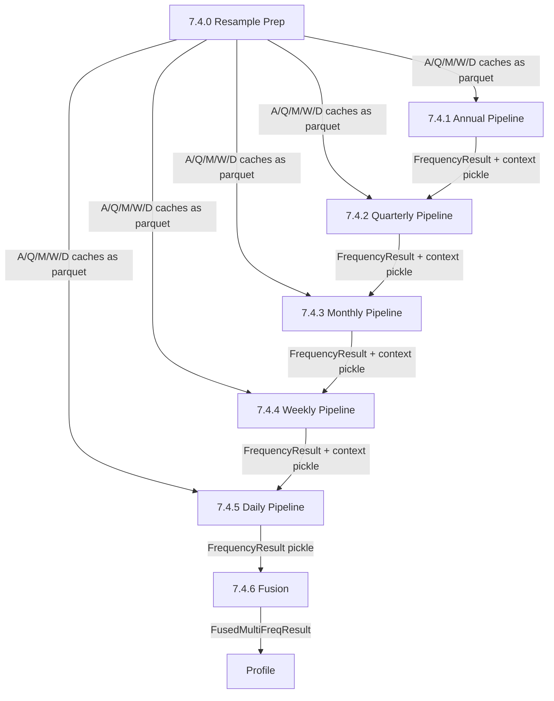

# Split Multi-Frequency Pipeline into Per-Frequency Sub-Stages

## Problem

Stage 7.4 (`run_7_4_multi_frequency`) runs all 5 frequency pipelines sequentially in a single process invocation. Each frequency runs derived variables + survival mode + regime detection + forecasting + walk-forward + Monte Carlo. The Daily frequency alone takes ~90s (forecasting + 252-step MC), and with 5 frequencies the total exceeds 280s, causing timeouts in constrained environments.

The current architecture:

```
7.4 multi_frequency (single call, ~5-8min)
  -> Annual pipeline   (~15s, 8 periods)
  -> Quarterly pipeline (~30s, 24 periods)
  -> Monthly pipeline   (~45s, 60 periods)
  -> Weekly pipeline    (~60s, 156 periods)
  -> Daily pipeline     (~90s, 504 periods)
  -> fuse_multi_frequency_results()
```

## Solution

Split 7.4 into 7 sub-stages: one per frequency + resampling prep + final fusion. Each sub-stage saves its `FrequencyResult` to disk so the next sub-stage can resume without re-running prior frequencies.

### New Sub-Stage Architecture

```
7.4.0  Resample prep (build all 5 ResampledCache objects, save to disk)
7.4.1  Annual pipeline   (load A cache, run pipeline, save FrequencyResult)
7.4.2  Quarterly pipeline (load Q cache + A context, run pipeline, save)
7.4.3  Monthly pipeline   (load M cache + Q context, run pipeline, save)
7.4.4  Weekly pipeline    (load W cache + M context, run pipeline, save)
7.4.5  Daily pipeline     (load D cache + W context, run pipeline, save)
7.4.6  Fusion (load all 5 FrequencyResults, fuse, save FusedMultiFreqResult)
```

### Cascading Context Handling

The key constraint is that each frequency receives `FrequencyContext` from the previous slower frequency. This is a single-value summary (trend_direction, secular_regime, survival_probability, forecast_bounds) -- not a time series.

**Current flow:**
```python
prior_context = None
for freq in [A, Q, M, W, D]:
    result = run_single_frequency_pipeline(resampled, prior_context=prior_context)
    prior_context = result.context_for_next
```

**New flow (disk-persisted):**
- Sub-stage 7.4.1 runs A, saves `FrequencyResult` + `context_for_next` as pickle
- Sub-stage 7.4.2 loads A's `context_for_next`, runs Q with it, saves Q result
- Sub-stage 7.4.3 loads Q's context, runs M, saves M result
- etc.
- Sub-stage 7.4.6 loads all 5 `FrequencyResult` objects, calls `fuse_multi_frequency_results()`

### Data Flow Diagram



### Files to Modify

**1. `operator1/stages/stage7_integration.py`** -- Split `run_7_4_multi_frequency` into 7 functions:
- `run_7_4_0_resample_prep(state)` -- Build all ResampledCache objects, save as parquet to `{run_dir}/mf/`
- `run_7_4_1_annual(state)` -- Load A cache, run pipeline, save FrequencyResult
- `run_7_4_2_quarterly(state)` -- Load Q cache + A context, run pipeline, save
- `run_7_4_3_monthly(state)` -- Load M cache + Q context, run pipeline, save
- `run_7_4_4_weekly(state)` -- Load W cache + M context, run pipeline, save
- `run_7_4_5_daily(state)` -- Load D cache + W context, run pipeline, save
- `run_7_4_6_fusion(state)` -- Load all results, fuse, write to state.multi_frequency_result

**2. `operator1/stages/stage7_integration.py`** -- Update `STAGE_7_SUBSTAGES` to register the new sub-stages.

**3. `operator1/pipeline_state.py`** -- Add helper methods:
- `save_mf_cache(freq, resampled)` -- Save ResampledCache to `{run_dir}/mf/{freq}_cache.parquet` + metadata
- `load_mf_cache(freq)` -- Load ResampledCache from disk
- `save_mf_result(freq, result)` -- Save FrequencyResult pickle to `{run_dir}/mf/{freq}_result.pkl`
- `load_mf_result(freq)` -- Load FrequencyResult from disk
- `save_mf_context(freq, context)` -- Save FrequencyContext pickle
- `load_mf_context(freq)` -- Load FrequencyContext from disk

**4. `backtest_runner.py`** -- Update `run_stage2d` to use the new sub-stage functions instead of calling `run_multi_frequency_pipeline()` directly. Map sub-stage names `"2d.mf.A"`, `"2d.mf.Q"`, etc. to the new functions.

**5. `operator1/steps/multi_frequency_runner.py`** -- No changes needed. The existing `run_single_frequency_pipeline()` is already a standalone function that takes a `ResampledCache` and `FrequencyContext` -- the new sub-stages will call it directly.

### Disk Layout

```
{run_dir}/mf/
  A_cache.parquet        # ResampledCache.cache DataFrame
  A_meta.json            # {frequency, label, n_periods, lookback_years}
  A_result.pkl           # FrequencyResult pickle
  A_context.pkl          # FrequencyContext pickle (context_for_next)
  Q_cache.parquet
  Q_meta.json
  Q_result.pkl
  Q_context.pkl
  M_cache.parquet
  ...
  D_result.pkl
  fused_result.pkl       # FusedMultiFreqResult
```

### CLI Usage

```bash
# Run all frequencies sequentially (backward compat)
python backtest_runner.py --stage 2d --run-dir cache/backtest_AAPL_2024-12-31

# Run one frequency at a time
python backtest_runner.py --stage 2d.mf.prep --run-dir cache/backtest_AAPL_2024-12-31
python backtest_runner.py --stage 2d.mf.A --run-dir cache/backtest_AAPL_2024-12-31
python backtest_runner.py --stage 2d.mf.Q --run-dir cache/backtest_AAPL_2024-12-31
python backtest_runner.py --stage 2d.mf.M --run-dir cache/backtest_AAPL_2024-12-31
python backtest_runner.py --stage 2d.mf.W --run-dir cache/backtest_AAPL_2024-12-31
python backtest_runner.py --stage 2d.mf.D --run-dir cache/backtest_AAPL_2024-12-31
python backtest_runner.py --stage 2d.mf.fuse --run-dir cache/backtest_AAPL_2024-12-31
```

### Semi-Annual Handling

Some markets (UK, some JSE) have semi-annual filings. The current code detects this and inserts "S" before "Q" in the frequency list. The new architecture handles this by:
- 7.4.0 detects filing frequencies and creates the appropriate set of ResampledCache objects
- If S is detected, creates `S_cache.parquet` alongside Q
- 7.4.2 becomes "Quarterly or Semi-Annual" depending on what 7.4.0 prepared
- Fusion (7.4.6) loads whatever frequency results exist in the `mf/` directory

### SIX Switzerland Special Case

For `ch_six` at Q frequency, the current code uses Kalman-smoothed quarterly synthetics from the SIX proxy module. This is handled in 7.4.0 (resample prep) which writes the SIX Q cache if market_id == "ch_six".

### Backward Compatibility

- `run_multi_frequency_pipeline()` remains unchanged -- still works as a single-call function
- The staged pipeline (`stages/runner.py`) gets the new sub-stages registered in `STAGE_7_SUBSTAGES`
- `backtest_runner.py` gets new sub-stage dispatch entries
- `main.py` is unaffected -- it calls `run_multi_frequency_pipeline()` directly

## Implementation Steps

- [ ] Add MF disk helpers to `pipeline_state.py` (save/load cache, result, context per frequency)
- [ ] Split `run_7_4_multi_frequency` in `stage7_integration.py` into 7 sub-stage functions
- [ ] Register new sub-stages in `STAGE_7_SUBSTAGES`
- [ ] Add sub-stage dispatch entries to `backtest_runner.py` (`2d.mf.prep`, `2d.mf.A`, etc.)
- [ ] Add semi-annual and SIX special case handling to 7.4.0 resample prep
- [ ] Test: run each sub-stage independently and verify fusion produces same result
- [ ] Verify backward compat: `--stage 2d` still runs all frequencies sequentially
