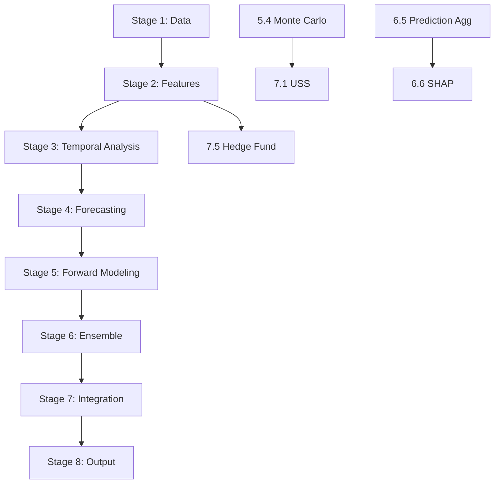

# Staged Pipeline Architecture: Per-Model Sub-Stages

## Problem

`main.py` runs all ~60 analytical models in a single monolithic `main()` function call (~4200 lines). There is no checkpointing between models -- if any step fails or the process is killed (300s timeout), all prior work is lost. The `backtest_runner.py` has some staging (2a1/2a2/2b/2c/2d) but it bundles many models per stage, making the heavy stages still time out.

## Design Principles

1. **Each model = one sub-stage** that saves state to disk after completing
2. **Sub-stages are grouped into stages** by analysis type (data, features, temporal, ensemble, integration, output)
3. **Resume from any checkpoint** -- `python main.py --stage 2.5` resumes from after sub-stage 2.4
4. **Backward compatible** -- `python main.py` with no `--stage` flag runs everything sequentially (current behavior)
5. **Shared state object** -- a `PipelineState` class holds all intermediate results, serialized to pickle+parquet between sub-stages

## Architecture

```
PipelineState object (pickle + parquet on disk)
  |
  v
Stage 1: Data Acquisition (Steps 1-4)
  1.1  Profile fetch + supplement
  1.2  PIT data fetch (income, balance, cashflow, quotes)
  1.3  Data reconciliation + canonical translation
  1.4  Cache build (OHLCV spine + statement merge + interpolation)
  1.5  Macro data + quadrant + conflict risk + buying power
  1.6  Estimation (3-phase imputation)
  1.7  Filing calendar
  |
Stage 2: Feature Engineering (Step 5)
  2.1  Derived variables + survival mode + hierarchy weights
  2.2  USS controller + private company proxies
  2.3  Fuzzy protection + financial health + vanity
  2.4  Entity discovery + graph risk + game theory
  2.5  Linked entity fetch + ownership contagion + linked aggregates
  2.6  Peer ranking + news sentiment + product catalysts
  2.7  Signal IC + adaptive thresholds (recalibrate survival)
  2.8  Early regime detection + enriched survival timeline
  2.9  Adaptive model params + adaptive windows
  |
Stage 3: Temporal Analysis (Step 6 -- regime + causality + patterns)
  3.1  Regime detection (HMM + GMM + PELT + BCP + ChangeFinder)
  3.2  Dual regime mixer
  3.3  Granger causality (PCMCI) + feature pruning
  3.4  Transfer entropy
  3.5  Cycle decomposition (EMD/FFT)
  3.6  Pattern detection (candlestick + Matrix Profile motifs)
  3.7  Economic planes + pre-forecasting synergies
  |
Stage 4: Forecasting (Step 6 -- the heavy part)
  4.1  Forecasting (Kalman + GARCH + VAR + LSTM + Tree + Baseline)
  |
Stage 5: Forward Modeling (Step 6 -- forward pass + MC)
  5.1  Forward pass (day-by-day temporal walk)
  5.2  Burn-out (weight calibration)
  5.3  Walk-forward evaluation + MCS + FixedShare
  5.4  Monte Carlo simulation + regime shift prediction
  5.5  Copula analysis
  |
Stage 6: Ensemble and Aggregation (Step 6 -- ML models + ensemble)
  6.1  Transformer forecaster
  6.2  Particle filter
  6.3  Conformal prediction (PID + Mondrian + QR)
  6.4  DTW historical analogs
  6.5  Prediction aggregation
  6.6  SHAP explainability
  6.7  Sobol sensitivity + hierarchy feedback
  6.8  Time-varying Granger + multivariate MC
  6.9  Genetic optimizer
  6.10 OHLC predictor + predicted patterns
  |
Stage 7: Integration (Steps 6-USS, 6.5, 6.6, 6.7, 6-HF)
  7.1  USS forecast bounding + scenario engine
  7.2  Retroactive calibration
  7.3  Model diagnostics
  7.4  Multi-frequency pipeline + fusion
  7.5  Hedge fund analysis
  |
Stage 8: Output (Steps 7-8)
  8.1  Profile builder
  8.2  Report generator + charts + PDF
```

## Dependency Graph (simplified)



## PipelineState Class

The state object replaces the hundreds of local variables in `main()`. Every sub-stage reads from and writes to this object. Between sub-stages, it serializes to disk.

```python
class PipelineState:
    # Config
    market_id: str
    company: str
    end_date: str
    years: float
    output_dir: str
    
    # Stage 1 outputs
    cache: pd.DataFrame
    target_profile: dict
    income_df, balance_df, cashflow_df, quotes_df: pd.DataFrame
    macro_data, macro_dataset, macro_quadrant_result
    conflict_result, buying_power_result
    estimation_coverage, filing_calendar_result
    
    # Stage 2 outputs  
    weights: dict
    fh_result, fuzzy_result, vanity_result
    relationships: dict
    linked_caches: dict
    graph_risk_result, game_theory_result
    contagion_result, peer_ranking_result
    sentiment_result, catalyst_result
    signal_ic_result, adaptive_thresholds
    enriched_timeline_result, regime_detector
    adaptive_model_params, adaptive_tier3
    survival_controller
    
    # Stage 3 outputs
    dual_regime_result, granger_result
    transfer_entropy_result, cycle_result
    pattern_result, synergy_meta, extra_vars
    
    # Stage 4 outputs
    forecast_result
    
    # Stage 5 outputs
    forward_pass_result, burnout_result
    walk_forward_result, mc_result
    copula_result, regime_shift_result
    mode_weights
    
    # Stage 6 outputs
    transformer_result, particle_filter_result
    conformal_result, dtw_result
    pred_result, shap_result, sobol_result
    ga_result, ohlc_result
    
    # Stage 7 outputs
    scenario_result, retro_params
    model_diagnostics_result
    multi_frequency_result, hf_result
    
    # Stage 8 outputs
    profile: dict
    
    def save(self, sub_stage: str): ...
    def load(self, sub_stage: str): ...
```

## CLI Design

```bash
# Run everything (current behavior, backward compatible)
python main.py --market us_sec_edgar --company AAPL

# Run specific stage
python main.py --market us_sec_edgar --company AAPL --stage 1

# Resume from a specific sub-stage
python main.py --stage 4.1 --run-dir cache/AAPL_2024-12-31

# Run a range of stages
python main.py --stage 3-6 --run-dir cache/AAPL_2024-12-31

# Skip models but run everything else
python main.py --market us_sec_edgar --company AAPL --skip-models
# (equivalent to --stage 1-2,8)
```

## Implementation Approach

### Phase 1: Extract PipelineState from main.py

1. Create `operator1/pipeline_state.py` with the `PipelineState` class
2. Add `save()` and `load()` methods (pickle + parquet, same pattern as `BacktestState`)
3. Add `--stage` and `--run-dir` arguments to `main.py`

### Phase 2: Refactor main.py into sub-stage functions

Extract each block of code from the monolithic `main()` into standalone functions:

```python
# operator1/stages/stage1_data.py
def run_1_1_profile(state): ...
def run_1_2_pit_fetch(state): ...
...

# operator1/stages/stage3_temporal.py  
def run_3_1_regime(state): ...
def run_3_2_dual_regime(state): ...
...

# operator1/stages/stage4_forecasting.py
def run_4_1_forecasting(state): ...
```

### Phase 3: Wire the stage runner

Add a stage dispatcher in main.py that:
1. Parses `--stage` argument
2. Loads state from the previous sub-stage checkpoint
3. Runs the requested sub-stage(s)
4. Saves state after each sub-stage

### Phase 4: Update backtest_runner.py

Make `backtest_runner.py` use the same `PipelineState` and sub-stage functions instead of duplicating logic. This eliminates the parity bugs (PR#1 fixes 13 of them) by having a single source of truth.

### Phase 5: Update run.py and dashboard.py

- `run.py`: Sequential subprocess calls per stage (can display progress per sub-stage)
- `dashboard.py`: Show per-sub-stage progress in the live log

## Key Constraints

- **No look-ahead**: Sub-stages must not leak future information (same constraint as current pipeline)
- **Observed values never overwritten**: Same invariant
- **Backward compatible**: `python main.py --market X --company Y` with no `--stage` flag runs everything end-to-end
- **Each sub-stage self-contained**: Imports only what it needs, catches its own exceptions
- **State size**: cache.parquet (~2-5MB) + state.pkl (~10-50MB) per checkpoint. Acceptable for disk.

## Migration Strategy

1. Start with Phase 1+2 for Stages 3-6 (temporal models -- the timeout-prone section)
2. Test with AAPL backtest: run stages 1-2 as monolith, then stage 3.1, 3.2, ... individually
3. Once validated, extract Stages 1-2 and 7-8 into sub-stages
4. Finally, make backtest_runner.py a thin wrapper around the same sub-stage functions
