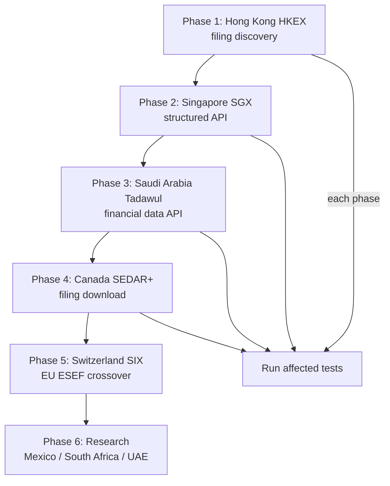

# Tier 2 PIT Wrapper Upgrades -- Replace yfinance with Native Government Sources

## Problem

8 of 25 markets use pure yfinance wrappers (69-75 lines each). yfinance is NOT a PIT source:
- Sets `filing_date = report_date` -- no PIT discipline
- Data comes from Yahoo Finance (commercial aggregator), not government APIs
- Coverage gaps for smaller exchanges (Tadawul, DFM, SGX)

This plan upgrades 5 high-value markets with native government filing sources and researches alternatives for the remaining 3.

Reference: [`plans/complete-data-flow-and-model-contract-map.md`](plans/complete-data-flow-and-model-contract-map.md) for pipeline architecture.

---

## Phase 1: Hong Kong -- HKEX Filing Discovery

**Market cap:** ~$4.5T | **Current:** yfinance only (75 lines) | **File:** [`hk_hkex.py`](operator1/clients/hk_hkex.py)

### Data Source

HKEX News (hkexnews.hk) publishes all company announcements including financial results. The API is undocumented but well-known:

- **Search endpoint:** `https://www1.hkexnews.hk/search/titlesearch.xhtml`
  - Parameters: `query=annual+results`, `daterange=2yr`, `stockcode=0700` (Tencent)
  - Returns: HTML list of filing announcements with dates and PDF links
- **Filing PDFs:** Direct links to PDF annual/interim reports
- **Filing date:** The announcement date on HKEX News IS the regulatory filing date

### Implementation

1. Create `HKEXFilingDiscoverer` in [`filing_discoverer.py`](operator1/clients/filing_discoverer.py) following the BSE India pattern
2. Search HKEX News for annual/interim results announcements
3. Parse announcement list for: title, filing_date, document URL
4. Download PDF and extract financials via `LLMFilingExtractor`
5. Update [`hk_hkex.py`](operator1/clients/hk_hkex.py) to try filing discovery first, yfinance fallback

### Canonical map addition
- Add Hong Kong GAAP / HKFRS terms to `_IFRS_MAP` in [`canonical_translator.py`](operator1/clients/canonical_translator.py) (HKFRS is nearly identical to IFRS)

### OHLCV
- yfinance with `.HK` suffix works well for Hong Kong stocks -- keep as-is

### Tests
- `tests/test_pit_hk_hkex.py` -- add filing discovery tests

---

## Phase 2: Singapore -- SGX Filing API

**Market cap:** ~$0.6T | **Current:** yfinance only (69 lines) | **File:** [`sg_sgx.py`](operator1/clients/sg_sgx.py)

### Data Source

SGX has a public announcements API:

- **Company search:** `https://api.sgx.com/company/v2.0?pagesize=20&keyword={query}`
- **Announcements:** `https://api.sgx.com/announcements/v1.0?company={stockcode}&category=FINANCIAL_RESULTS&pagesize=20`
  - Returns JSON with: title, date, attachments with PDF URLs
- **Financial data:** `https://api2.sgx.com/financials/v1.0?stockcode={code}`
  - Returns structured JSON with income statement, balance sheet, cash flow

### Implementation

1. Update [`sg_sgx.py`](operator1/clients/sg_sgx.py):
   - Add SGX API-based company search (replace yfinance search)
   - Add SGX financial data endpoint for structured financials
   - Add SGX announcements endpoint for filing discovery
   - Preserve filing_date from announcement date
2. Add SGX-specific canonical map entries if needed (SGX uses SFRS which maps to IFRS)

### OHLCV
- yfinance with `.SI` suffix -- keep as-is

### Tests
- Update `tests/test_pit_phase2.py` SGX section

---

## Phase 3: Saudi Arabia -- Tadawul Financial Statements

**Market cap:** ~$2.7T | **Current:** yfinance only (69 lines) | **File:** [`sa_tadawul.py`](operator1/clients/sa_tadawul.py)

### Data Source

Tadawul publishes company financials through their portal:

- **Company search:** `https://www.saudiexchange.sa/wps/portal/saudiexchange/trading/participants-directory/issuer-directory`
- **Financial statements:** Available as structured data via the Tadawul API:
  - `https://www.saudiexchange.sa/tadawul-api/listed-companies/financials/{company_id}`
  - Returns: income statement, balance sheet, cash flow in JSON
  - Includes filing dates (announcement dates on the exchange)
- **Alternative:** CMA (Capital Market Authority) publishes regulatory filings

### Implementation

1. Update [`sa_tadawul.py`](operator1/clients/sa_tadawul.py):
   - Add Tadawul company directory search
   - Add Tadawul financial data API endpoint
   - Map Arabic financial field names to canonical names
   - Add `_TADAWUL_MAP` to [`canonical_translator.py`](operator1/clients/canonical_translator.py) with Arabic terms:
     - ايرادات -> revenue, صافي الربح -> net_income, اجمالي الموجودات -> total_assets, etc.
2. yfinance fallback if Tadawul API fails

### OHLCV
- yfinance with `.SR` suffix -- keep as-is

### Tests
- Update `tests/test_pit_phase2.py` Tadawul section

---

## Phase 4: Canada -- SEDAR+ Filing Download

**Market cap:** ~$3T | **Current:** SEDAR+ search + yfinance financials (93 lines) | **File:** [`ca_sedar.py`](operator1/clients/ca_sedar.py)

### Data Source

SEDAR+ (sedarplus.ca) is the official Canadian securities filing system:

- **Company search:** Already implemented -- `https://www.sedarplus.ca/csa-party/searchCompany`
- **Filing search:** `https://www.sedarplus.ca/csa-party/records/companyDocuments`
  - Parameters: `entityId={sedarId}`, `category=Annual+Financial+Statements` or `Interim+Financial+Statements`
  - Returns: JSON list of filings with document URLs and filing dates
- **Filing PDFs:** Available for download from SEDAR+

### Implementation

1. Add `SEDARFilingDiscoverer` to [`filing_discoverer.py`](operator1/clients/filing_discoverer.py)
2. Update [`ca_sedar.py`](operator1/clients/ca_sedar.py):
   - Add filing search via SEDAR+ companyDocuments endpoint
   - Download financial statement PDFs
   - Extract via `LLMFilingExtractor`
   - Preserve filing_date from SEDAR+ filing date
3. yfinance fallback for companies where PDF extraction fails

### OHLCV
- yfinance with `.TO` (TSX) or `.V` (TSXV) suffix -- keep as-is

### Tests
- Update `tests/test_pit_phase2.py` SEDAR section

---

## Phase 5: Switzerland -- SIX Structured Data

**Market cap:** ~$1.8T | **Current:** yfinance only (69 lines) | **File:** [`ch_six.py`](operator1/clients/ch_six.py)

### Data Source

SIX has limited free access. Best options:

- **SIX iD:** Structured reference data platform -- requires commercial agreement, NOT free
- **FINMA filings:** Swiss Financial Market Supervisory Authority publishes some regulatory data but not individual company financials
- **EU ESEF overlap:** Many SIX-listed companies are dual-listed on EU exchanges and file ESEF. The EU ESEF wrapper could cover these.
- **Alternative:** Use the existing EU ESEF wrapper for companies that cross-file in the EU

### Implementation

1. Update [`ch_six.py`](operator1/clients/ch_six.py):
   - For dual-listed companies: try EU ESEF first (many Swiss blue chips file ESEF)
   - Add FINMA lookup for regulatory status
   - Keep yfinance as primary financial data source (SIX has no free structured filing API)
   - This is the weakest upgrade -- SIX genuinely lacks free government filing access
2. Mark Swiss market as "partial PIT" in the registry

### OHLCV
- yfinance with `.SW` suffix -- keep as-is

### Tests
- Update `tests/test_pit_phase2.py` SIX section

---

## Phase 6: Research -- Alternative PIT Sources for Remaining Markets

For the 3 markets where yfinance is likely the only free option, research whether any Python wrappers or APIs exist:

### Mexico (BMV)

- **BMV API:** `https://www.bmv.com.mx` -- has a public portal with financial data but no documented API
- **CNBV (regulator):** `https://www.cnbv.gob.mx` -- publishes regulatory filings
- **Python wrappers:** Search PyPI for `bmv`, `cnbv`, `mexico stock`, `bolsa mexicana`
- **Alternative:** Banxico (central bank) is already covered for macro; for financials, yfinance + LLM filing extraction from CNBV PDFs

### South Africa (JSE)

- **JSE SENS:** `https://www.jse.co.za/services/market-data` -- SENS announcements include financial results
- **FSCA (regulator):** Financial Sector Conduct Authority
- **Python wrappers:** Search PyPI for `jse`, `south africa stock`, `johannesburg stock`
- **Alternative:** LLM filing extraction from JSE SENS announcement PDFs

### UAE (DFM / ADX)

- **DFM:** `https://www.dfm.ae` -- Dubai Financial Market has a disclosures section
- **ADX:** `https://www.adx.ae` -- Abu Dhabi Securities Exchange publishes company financials
- **SCA (regulator):** Securities and Commodities Authority
- **Python wrappers:** Search PyPI for `dfm`, `adx`, `uae stock`, `dubai financial`
- **Alternative:** Both DFM and ADX have web portals with financial statements -- could be scraped with filing discovery pattern

### Research deliverables
For each market, produce:
1. Does a free, structured filing API exist? (Y/N)
2. Does a Python wrapper exist on PyPI? (name, last update, downloads)
3. Is web scraping viable for filing discovery? (endpoint URL, rate limits)
4. Recommendation: native wrapper / filing discovery / keep yfinance

---

## Execution Order

**Priority rationale:**
1. Hong Kong ($4.5T) -- highest market cap, HKEX News has good filing coverage
2. Singapore ($0.6T) -- SGX has a structured JSON API (easiest to implement)
3. Saudi Arabia ($2.7T) -- second-highest market cap, Tadawul has a financial data API
4. Canada ($3T) -- SEDAR+ is already partially implemented, just needs filing download
5. Switzerland ($1.8T) -- weakest upgrade potential (SIX lacks free APIs)
6. Research -- evaluate Mexico, South Africa, UAE alternatives

---

## Shared Infrastructure

All Tier 2 upgrades reuse existing patterns:

- **Filing discovery:** [`filing_discoverer.py`](operator1/clients/filing_discoverer.py) -- `FilingDiscovery`, `FilingMetadata`, `try_filing_extraction()`
- **LLM extraction:** [`llm_filing_extractor.py`](operator1/clients/llm_filing_extractor.py) -- `extract_from_pdf()`
- **Canonical translation:** [`canonical_translator.py`](operator1/clients/canonical_translator.py) -- `translate_financials()`, `_IFRS_MAP`
- **yfinance fallback:** [`yfinance_backed.py`](operator1/clients/yfinance_backed.py) -- `yf_get_financials()`, `yf_get_profile()`

Each upgrade follows the same pattern:
1. Add native search/discovery
2. Try native financials first
3. Fall back to LLM filing extraction from PDFs
4. Fall back to yfinance as last resort
5. Always preserve `filing_date` separate from `report_date`
