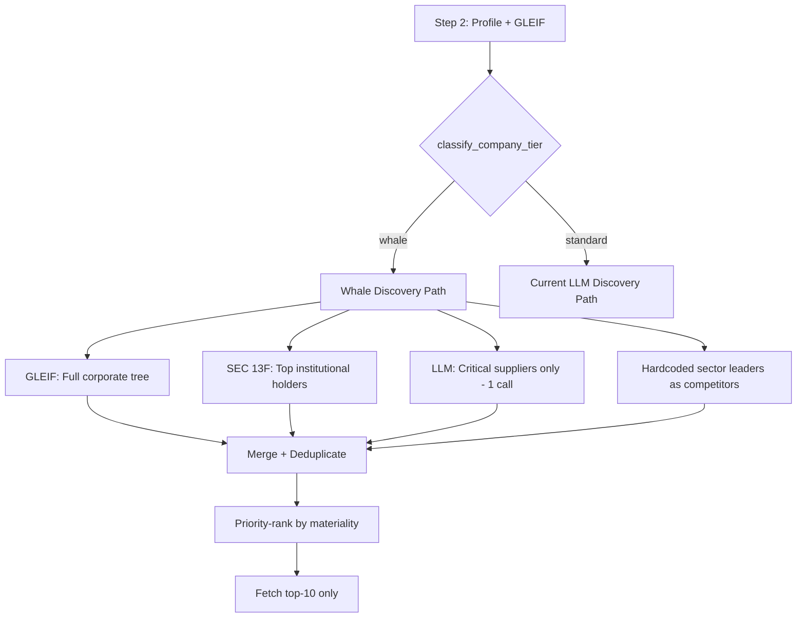

# Whale Company Detection and Adaptive Entity Discovery

## Problem Statement

When running the pipeline on Apple (AAPL), we hit three cascading failures:

1. **Entity discovery burned through LLM rate limits** -- the 3-call strategy made 6+ LLM requests, exhausting free-tier OpenRouter quotas before getting any usable data
2. **Cross-region search was catastrophically slow** -- searching 25+ PIT clients (XBRL, Tadawul, DFM, etc.) for each entity crashed the process after 5+ minutes per entity
3. **GLEIF found 8 subsidiaries but the pipeline treated them like peers** -- Apple's subsidiaries (Apple Operations Europe, Apple Sales Ireland, etc.) were fed into graph_risk as generic nodes, missing the parent-subsidiary ownership hierarchy that actually matters for whale companies

The root cause: the pipeline treats a $3.5T mega-cap the same as a $500M mid-cap. For whale companies, the entity graph should be dominated by the corporate structure tree (GLEIF), major institutional holders (13F data), and critical supply chain nodes -- not a broad LLM-driven peer search across 25 exchanges.

---

## Part 1: Whale Classification

### What makes a company a whale?

A whale is a company whose failure or distress would be a systemic event. We define it using three signals available at Step 2 (profile fetch):

```
whale_score = 0

# Signal 1: Market cap rank within exchange (from profile)
if market_cap > $500B:    whale_score += 3   # mega-cap
elif market_cap > $100B:  whale_score += 2   # large-cap whale
elif market_cap > $50B:   whale_score += 1   # borderline whale

# Signal 2: Index membership (S&P 500 top 20, FTSE 100 top 10, etc.)
if ticker in SP500_TOP_20:  whale_score += 2
if ticker in SECTOR_LEADERS: whale_score += 1

# Signal 3: GLEIF subsidiary count (proxy for corporate complexity)
if n_subsidiaries > 50:  whale_score += 2
elif n_subsidiaries > 10: whale_score += 1

# Classification
is_whale = whale_score >= 4
```

**Data sources**: All free, already available:
- Market cap: from yfinance profile or SEC EDGAR filing
- Index membership: hardcoded top-20 lists per exchange (static, updated quarterly)
- GLEIF subsidiary count: from the GLEIF API call that already runs at Step 5e.1

### New module: `operator1/analysis/whale_classifier.py`

```
classify_company_tier(profile, gleif_result) -> CompanyTier

CompanyTier:
  tier: str           # whale, large, mid, small
  whale_score: int    # 0-8
  market_cap_usd: float
  n_subsidiaries: int
  index_member: bool
  discovery_strategy: str  # whale_focused, standard, lightweight
```

**Wiring**: Called at Step 2 right after profile fetch + GLEIF lookup. The `discovery_strategy` field controls all downstream entity behavior.

---

## Part 2: Whale-Focused Entity Discovery Strategy

For whale companies, entity discovery changes fundamentally:

### Current flow (all companies treated the same)

```
LLM proposes 20 entities -> search 25 exchanges -> resolve -> fetch financials
```

### Proposed flow for whales



### Three data channels for whales

**Channel 1: GLEIF Corporate Structure Tree (already implemented, needs deepening)**

Currently GLEIF returns direct parent + up to 15 subsidiaries. For whales, expand to:
- Full parent chain (ultimate parent -> intermediate -> target)
- All subsidiaries (not capped at 15)
- Related entities via Level 2 GLEIF relationships (fund management, branch, etc.)

This gives us the legal ownership graph that drives contagion modeling.

**Channel 2: SEC 13F Major Holders (new data source, free)**

For US whales, SEC EDGAR provides 13F filings -- quarterly reports from institutional investors managing $100M+. This tells us which institutions own significant stakes.

Data source: `https://efts.sec.gov/LATEST/search-index?q={ticker}&dateRange=all&forms=13F`

What we get:
- Top 20 institutional holders (Vanguard, BlackRock, Berkshire, etc.)
- Share counts and ownership percentages
- Quarter-over-quarter changes (accumulation vs distribution)

This feeds directly into `ownership_contagion.py` which currently gets holder data from yfinance (unreliable, often empty). SEC 13F data is authoritative and free.

**Channel 3: LLM Critical Suppliers (1 call, focused prompt)**

Instead of asking the LLM for 6 relationship groups with 5 entities each (30 names to resolve), ask for exactly:
- Top 3 suppliers by revenue dependency (e.g., TSMC for Apple)
- Top 3 customers by revenue concentration
- Skip competitors (use hardcoded sector leaders), logistics, regulators, financial institutions

This is 1 LLM call that returns 6 names max, all resolvable in the primary market.

**Channel 4: Hardcoded Sector Leaders as Competitors**

For whale companies, their competitors are well-known and don't change quarter to quarter. Maintain a static registry:

```yaml
# config/whale_competitors.yml
technology:
  hardware:
    - {ticker: MSFT, name: Microsoft}
    - {ticker: GOOGL, name: Alphabet}
    - {ticker: SAMSUNG, name: Samsung Electronics, market: kr_dart}
  semiconductors:
    - {ticker: NVDA, name: NVIDIA}
    - {ticker: TSM, name: TSMC, market: tw_mops}
energy:
  oil_gas:
    - {ticker: XOM, name: Exxon Mobil}
    - {ticker: CVX, name: Chevron}
    - {ticker: SHEL, name: Shell, market: uk_companies_house}
```

No LLM call, no cross-region search, no rate limits. Just load from YAML and resolve in SEC EDGAR (for US tickers) or skip resolution entirely (use yfinance for OHLCV).

---

## Part 3: Materiality Ranking and Entity Budget

After merging all 4 channels, whale discovery produces 30-50 candidate entities. Not all matter equally. Rank by materiality:

```
materiality_score = (
    0.4 * ownership_weight    +  # parent=1.0, subsidiary=0.7, holder=0.5, supplier=0.3
    0.3 * revenue_dependency   +  # from LLM or filing data: % of revenue from this entity
    0.2 * market_cap_ratio     +  # entity_mcap / target_mcap (bigger entity = more influence)
    0.1 * data_availability        # 1.0 if in same PIT market, 0.5 if cross-region, 0 if no data
)
```

Only fetch full financials for the top 10 by materiality score. The rest get OHLCV-only (fast, from yfinance) for correlation analysis.

---

## Part 4: How This Changes Downstream Models

### Graph Risk (operator1/models/graph_risk.py)

Currently: flat graph, all edges weighted 0.3 contagion probability.

With whale data:
- Parent-subsidiary edges: 0.85 contagion (GLEIF corporate ownership)
- Institutional overlap edges: weighted by MHHI delta (13F data)
- Supplier edges: weighted by revenue dependency
- Competitor edges: 0.1 (low direct contagion, high correlation)

### Ownership Contagion (operator1/models/ownership_contagion.py)

Currently: gets holder data from yfinance (often empty for non-US).

With whale data:
- SEC 13F provides authoritative holder data for US whales
- MHHI delta computed against actual competitor holders (not empty)
- Crowding score reflects real institutional concentration
- Liquidation pressure uses actual AUM data

### Survival Mode

Currently: ignores corporate structure entirely.

With whale data:
- Subsidiary of a strong parent inherits survival protection (already in fuzzy_protection, but GLEIF data was too shallow)
- Corporate parent in distress = elevated survival risk for subsidiaries
- Cross-subsidiary contagion: if Apple Operations Europe fails, Apple Sales Ireland is exposed

### Monte Carlo

Currently: single-entity simulation.

With whale data:
- Multivariate MC already exists but only simulates (return, debt_ratio) pairs
- With GLEIF + 13F data, simulate correlated distress across the corporate tree
- Institutional crowding creates correlated sell pressure paths

---

## Part 5: Implementation Plan

### Files to create

| File | Description |
|------|-------------|
| `operator1/analysis/whale_classifier.py` | Whale detection: market_cap + index membership + GLEIF subsidiaries |
| `config/whale_competitors.yml` | Static competitor registry per sector/industry |
| `operator1/clients/sec_13f.py` | SEC 13F institutional holder fetcher (free, no key) |

### Files to modify

| File | Change |
|------|--------|
| `main.py` | Wire whale classifier at Step 2, use discovery_strategy to branch |
| `operator1/steps/entity_discovery.py` | Add whale-focused discovery path, single-call LLM for suppliers only |
| `operator1/clients/gleif.py` | Expand subsidiary fetch cap from 15 to 100 for whales |
| `operator1/models/graph_risk.py` | Edge weights from GLEIF ownership type + 13F overlap |
| `operator1/models/ownership_contagion.py` | Accept 13F data alongside yfinance holders |
| `config/global_config.yml` | Add whale_threshold, whale_entity_budget settings |

### Execution order

```
[ ] Create whale_classifier.py with classify_company_tier
[ ] Create whale_competitors.yml for top 5 sectors
[ ] Create sec_13f.py to fetch institutional holders from EDGAR
[ ] Modify entity_discovery.py with whale-focused path
[ ] Modify gleif.py to uncap subsidiary fetch for whales
[ ] Modify graph_risk.py for ownership-typed edge weights
[ ] Wire whale classifier in main.py at Step 2
[ ] Test on AAPL with --end-date 2024-12-31
```

---

## Why This Solves the Original Problems

| Problem | Current | With whale detection |
|---------|---------|---------------------|
| LLM rate limits | 3+ calls for entity proposals, all fail | 1 call for suppliers only, competitors from YAML |
| Cross-region search | 25 PIT clients searched per entity, crashes | Primary market only, OHLCV fallback for cross-region |
| Empty entity graph | 0 entities discovered, graph_risk meaningless | 20-50 entities from GLEIF + 13F + YAML + 1 LLM call |
| Pipeline runtime | 5+ minutes in entity search alone | 30 seconds: GLEIF + 13F + YAML load + 1 LLM call |
| Ownership data | yfinance holders often empty | SEC 13F is authoritative for US whales |
| Contagion modeling | Flat 0.3 probability on all edges | 0.85 for parent-subsidiary, weighted by MHHI for holders |
