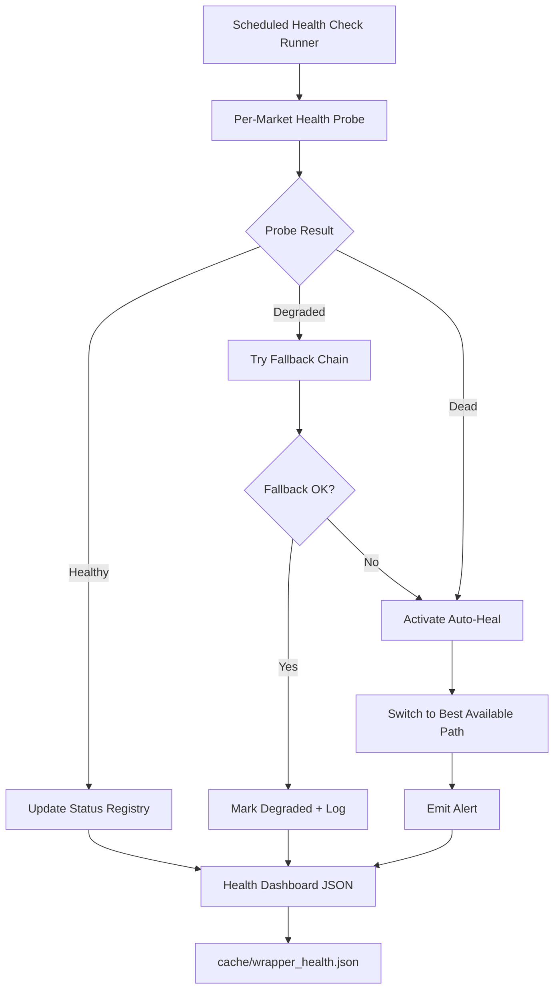
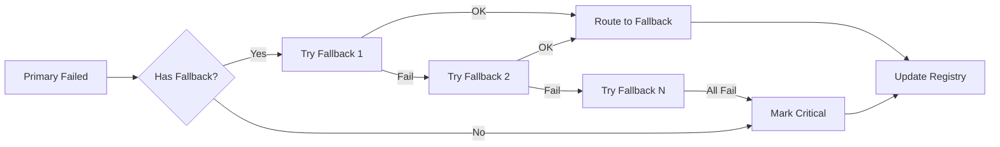

# Wrapper Monitoring and Auto-Healing System

## Problem

25 wrappers across 25 markets hitting government APIs that can break without warning (as we just saw with CMF Chile and Germany ESEF). Currently there is no way to know a wrapper is broken until a user runs a pipeline and it fails.

## Architecture



## Design

### 1. Health Probe System -- `operator1/monitoring/health_check.py`

A lightweight probe for each market that tests the minimum viable path without consuming API quota:

| Probe Level | What it tests | Cost |
|---|---|---|
| **L0: DNS/TLS** | Can we establish HTTPS connection? | 0 API calls |
| **L1: Search** | Does company search return results? | 1 API call |
| **L2: Profile** | Can we fetch a known company profile? | 1 API call |
| **L3: Financials** | Do we get at least 1 financial field? | 1 API call |

Each market gets a **canary company** -- a well-known, stable company used for health checks:

| Market | Canary Company | Identifier |
|---|---|---|
| us_sec_edgar | Apple | AAPL |
| uk_companies_house | BP | 00102498 |
| eu_esef | Unilever | via entity search |
| fr_esef | BNP Paribas | via entity search |
| de_esef | Siemens Pensionsfonds | via Bundesanzeiger |
| jp_jquants | Toyota | 7203 |
| kr_dart | Samsung | 005930 |
| tw_mops | TSMC | 2330 |
| br_cvm | Petrobras | PETR4 |
| cl_cmf | SQM | SQM-B |
| in_bse | Reliance | 500325 |
| cn_sse | Moutai | 600519 |
| hk_hkex | Tencent | 00700 |
| sa_tadawul | Saudi Aramco | 2222 |
| ... | ... | ... |

### 2. Health Status Registry -- `cache/wrapper_health.json`

```json
{
  "last_check": "2026-03-23T19:00:00Z",
  "markets": {
    "us_sec_edgar": {
      "status": "healthy",
      "level_passed": "L3",
      "active_path": "edgartools",
      "fallback_available": true,
      "last_success": "2026-03-23T19:00:00Z",
      "last_failure": null,
      "latency_ms": 1200,
      "consecutive_failures": 0
    },
    "de_esef": {
      "status": "degraded",
      "level_passed": "L1",
      "active_path": "bundesanzeiger_onnx",
      "fallback_available": true,
      "last_success": "2026-03-23T18:45:00Z",
      "degraded_reason": "filings.xbrl.org returns 0 DE filings",
      "latency_ms": 3500
    },
    "cl_cmf": {
      "status": "degraded",
      "level_passed": "L3",
      "active_path": "us_adr_yfinance",
      "fallback_available": true,
      "degraded_reason": "CMF API down since 2025, using US ADR fallback"
    }
  }
}
```

Status values:
- **healthy**: Primary path works at L3
- **degraded**: Primary broken, fallback works
- **critical**: All paths failing
- **unknown**: Not yet checked

### 3. Auto-Healing Patterns -- `operator1/monitoring/auto_heal.py`

When a probe detects failure, the system tries recovery strategies in order:



Per-market fallback chains already exist in the wrappers. The auto-healer just needs to:

1. **Detect** -- Run health probes on schedule
2. **Route** -- Tell the wrapper which path to use via the health registry
3. **Recover** -- Periodically re-test the primary path to see if it came back
4. **Alert** -- Write to a log/webhook when status changes

### 4. Integration with Existing Wrappers

The wrappers already have fallback chains built in. The monitoring system adds:

1. **Pre-flight check**: Before running a full pipeline, check `wrapper_health.json` and warn the user if any market is degraded/critical
2. **Path routing**: Each wrapper reads the health registry to know which path to try first (skip known-dead paths to save time)
3. **Post-run reporting**: After a pipeline run, update health status based on what actually worked

### 5. Scheduled Execution

Three modes:

| Mode | When | What |
|---|---|---|
| **Pre-pipeline** | Before each pipeline run | Quick L0+L1 probe on the target market only |
| **Daily cron** | Once per day (if deployed) | Full L0-L3 probe on all 25 markets |
| **On-demand** | `python -m operator1.monitoring.health_check` | Full probe, outputs JSON report |

### 6. Alert System

Lightweight -- no external dependencies:

1. **Console warnings** during pipeline run (already have `_warn()` in `run.py`)
2. **JSON health report** at `cache/wrapper_health.json`
3. **Optional webhook** (env var `HEALTH_WEBHOOK_URL`) for Slack/Discord/email notifications on status changes

## Implementation Plan

### Phase 1: Core health check framework
- [ ] Create `operator1/monitoring/__init__.py`
- [ ] Create `operator1/monitoring/health_check.py` with `HealthProbe` class
- [ ] Define canary companies per market in registry
- [ ] Implement L0-L3 probe levels
- [ ] Create `wrapper_health.json` output format
- [ ] Add CLI entry point: `python -m operator1.monitoring.health_check`

### Phase 2: Auto-healing integration
- [ ] Create `operator1/monitoring/auto_heal.py` with path routing
- [ ] Add `get_active_path(market_id)` function that wrappers call
- [ ] Integrate health check into `run.py` pre-flight step
- [ ] Add recovery probing (re-test dead primaries periodically)

### Phase 3: Alerting and reporting
- [ ] Add status change detection (healthy -> degraded -> critical)
- [ ] Add optional webhook notifications
- [ ] Create `cache/wrapper_health_history.jsonl` for trend tracking
- [ ] Add health summary to pipeline report output

### Phase 4: Test coverage
- [ ] Create `tests/test_health_check.py` with mocked probes
- [ ] Add health check to CI (runs L0 only -- no API keys needed)
- [ ] Create `tests/test_auto_heal.py` with simulated failures

## Dependencies

No new dependencies. Uses existing:
- `requests` (HTTP probes)
- `json` (health registry)
- `logging` (alerts)
- `operator1/clients/pit_registry.py` (market definitions)
- `operator1/clients/equity_provider.py` (client factory)
